# 如何像专业人士一样阅读加密图表

> 原文:[https://www . trality . com/blog/how-to-read-crypto-charts-like-a-professional/](https://www.trality.com/blog/how-to-read-crypto-charts-like-a-professional/)

我知道你在想什么:所有这些情节线，流动的波浪，红色和绿色的模式，没有金融学位或在华尔街有十年交易经验的人怎么能理解加密图表呢？

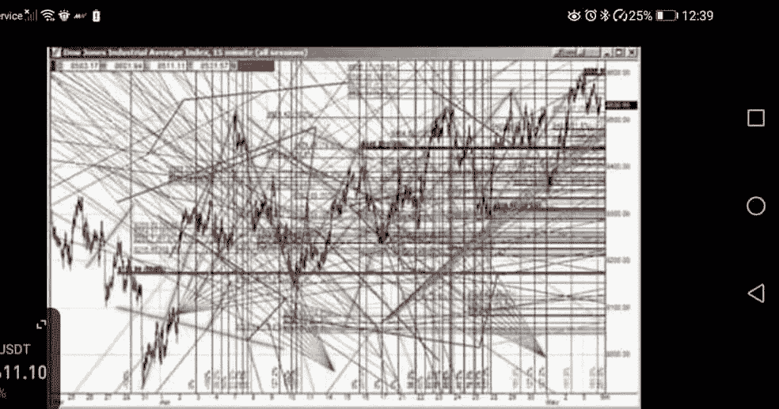

Simple, right?

除了表面现象(上面的图表取笑了交易图表)，它既没有看起来那么复杂，也没有看起来那么不可能。如果你是一名密码交易员，这也是一项不可或缺的技能。想想吧。你会在看不懂仪表的情况下驾驶飞机吗，或者在看不懂航海图的情况下驾驶船只吗？简单的事实是，没有一小时又一小时的培训和一张真正的执照，你是做不到的。

然而，许多人认为他们是天生的密码交易员。当你的直觉告诉你硬币 X 要飞向月球时，谁还需要密码？或者，既然一个拥有数百万粉丝的社交媒体影响者(我们无法提起她的名字)说以太网最大数字令牌 EMAX 是*该买的*令牌，那么*有*是一笔不错的投资，对吗？正如他们在密码领域所说的，用这种交易“策略”，你几乎可以保证得到 rekt。

那么，把下面这篇文章当作一则轶事吧——你关于如何阅读加密图以降低风险和增加利润的翔实(但绝不是详尽)的入门读物，尤其是如果你是一个加密交易新手的话。在接下来的部分，我们将检查加密交易图的组成部分，将每个方面分解成容易理解的部分。

## **加密交易界面的剖析**

无论你是决定用一个加密交易所，一个独立的服务如 TradingView，还是 Trality 来规划你的交易策略(是的，你可以用我们的 Python 代码编辑器来完成所有必要的规划！)，您会很高兴地了解到一个典型的加密接口有许多共同的特性。这些包括(但不限于):

*   贸易对
*   价格
*   卷
*   时间框架
*   定货簿
*   市场深度图

 [币安](/blog/create-binance-trading-bot)，世界上最大的中央加密交易所，有一个强大的，尽管相当标准和简单的交易界面(下图来自他们的现货交易功能)，包括以下功能:

*   烛台图表
*   深度图表
*   时间间隔
*   绘图工具
*   技术指标
*   定货簿

### **密码图表**

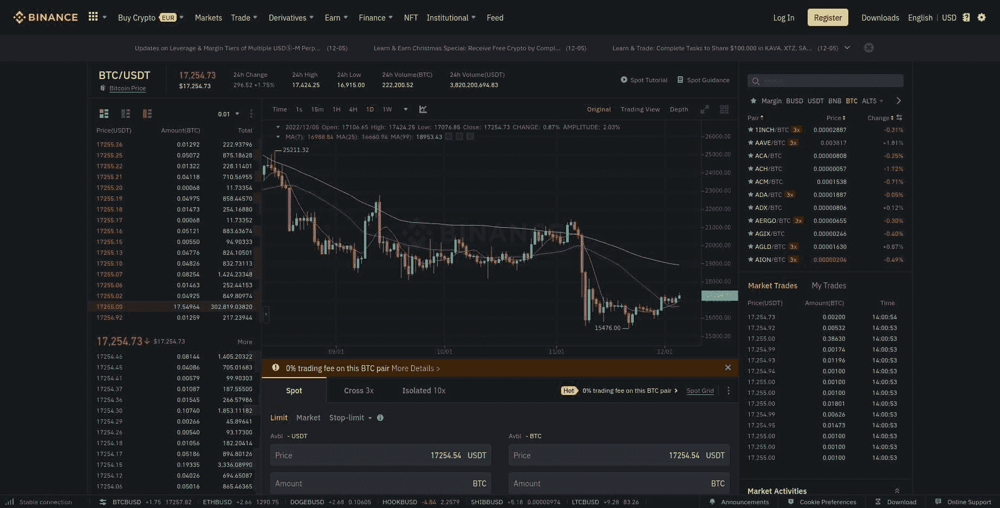

Binance's trading interface with a crypto chart in the middle

### **加密命令簿**

如您所见，本例中的交易对是 BTC/USDT，左侧是[订单簿](https://academy.binance.com/en/glossary/order-book)(基于价格组织的资产的当前未结买卖订单)。

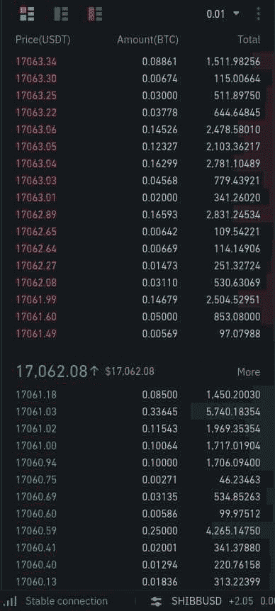

Detail showing Binance's BTC/USDT order book

### **移动平均线和时间范围**

注意一天(1D)的时间框架(在图中央上方)，使用三个移动平均线技术指标:MA(7)，MA(25)，MA(99)。

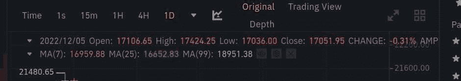

Detail showing Binance's moving averages and timeframes

在币安的图表上，三个技术指标由三条彩色线区分(分别是橙色、紫色和浅蓝色)。例如，MA(7)代表指定时间间隔(在我们的例子中，1D 或一天)的七根蜡烛线的移动平均线。

但是蜡烛是什么——那些红色和绿色交替显示的竖条？让我们在下一节中更深入地了解一下。

## 为什么加密交易者使用图表？

在最基本的层面上，加密交易图表(有时称为加密图)是市场预测或预期运动的可视化表示，交易者在其中识别趋势，并绘制出理想的交易进场点和出场点(这一过程被称为技术分析，下文将详细介绍)。直截了当地说:没有图表，你只是在猜测。

虽然乍一看这似乎是一个令人生畏的前景，但阅读密码图的能力是一项绝对必要的技能。在一个波动性很大的市场上，你把辛苦赚来的现金或硬币都押上了。继续我们上面的类比，谁不想能够预见地平线上的湍流或平稳航行呢？

加密图表提供了这些类型的重要见解。没有识别和理解模式的能力，交易者简直是盲目的。最坏的情况？从财务角度来说，他们会迫降或上岸，没人希望这种情况发生。

让我们把注意力转向加密图表的一个关键元素——烛台。

## **加密图表和烛台**

要说明的第一点是，我们处理的是蜡烛图，而不是折线图或条形图。

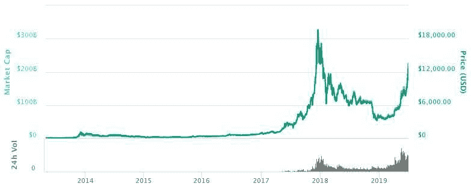

Bitcoin price from 2009 to 2019\. The historical line chart shows the changes of price of Bitcoin (BTC). (Source: BitcoinWiki)

还有市场深度图也要考虑。

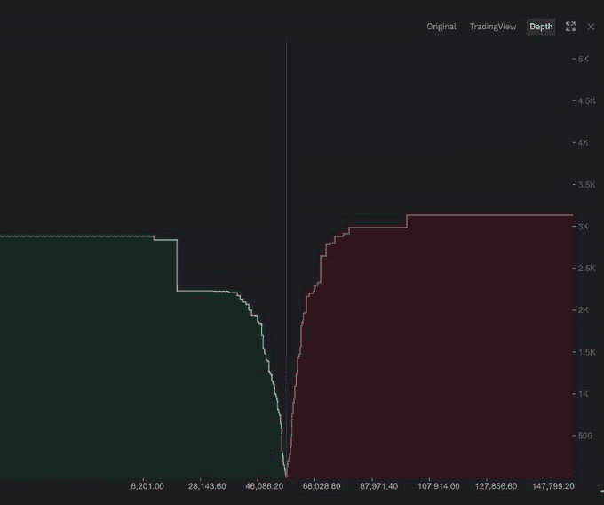

A market depth chart provides a visual representation of unfilled buy/sell orders on the order book. (Source: [Binance](https://www.binance.com/en/support/faq/how-to-use-tradingview-on-binance-website-8419126024404348a1c6e4039fbed3fe))

正如我们所见，密码图分析涉及研究从技术分析中得出的蜡烛图和图表模式，通常是在不同的时间框架内。底部右侧的 x 轴显示以天为单位的时间段，而右侧的 y 轴显示价格。

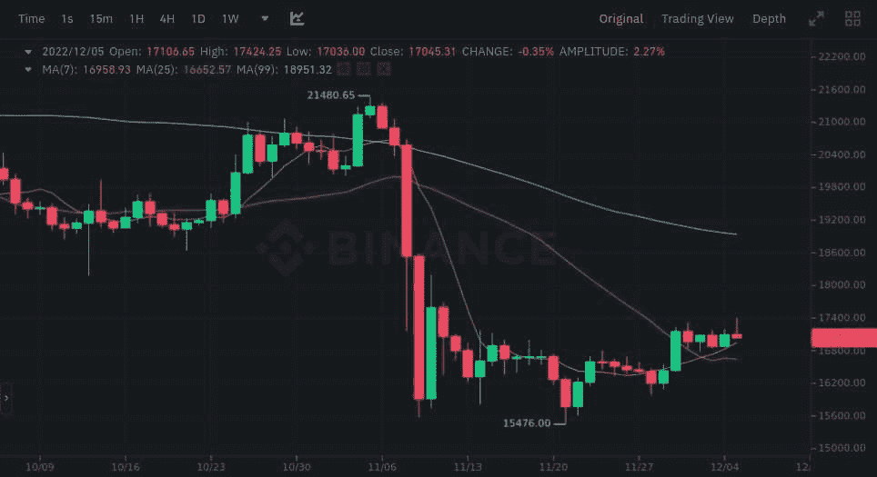

Binance's crypto trading chart within its trading interface

## **烛台的解剖**

现在，每根蜡烛线——或者红色和绿色的竖线——都是通过组合特定时间段内与价格相关的一组特定数据而创建的。每个烛台由四个部件组成:

1.  开放大米
2.  高价
3.  低价
4.  收盘价格

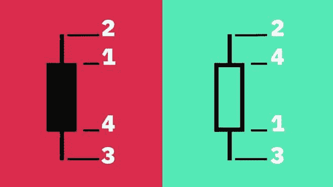

An illustration of crypto cadnlesticks (Source: [Binance](https://academy.binance.com/en/articles/a-beginners-guide-to-candlestick-charts))

那么为什么颜色会有差异呢？

*   绿色烛台:硬币或代币的收盘价格高于开盘价格。
*   红色烛台:收盘时低于开盘时的硬币或代币的价格。

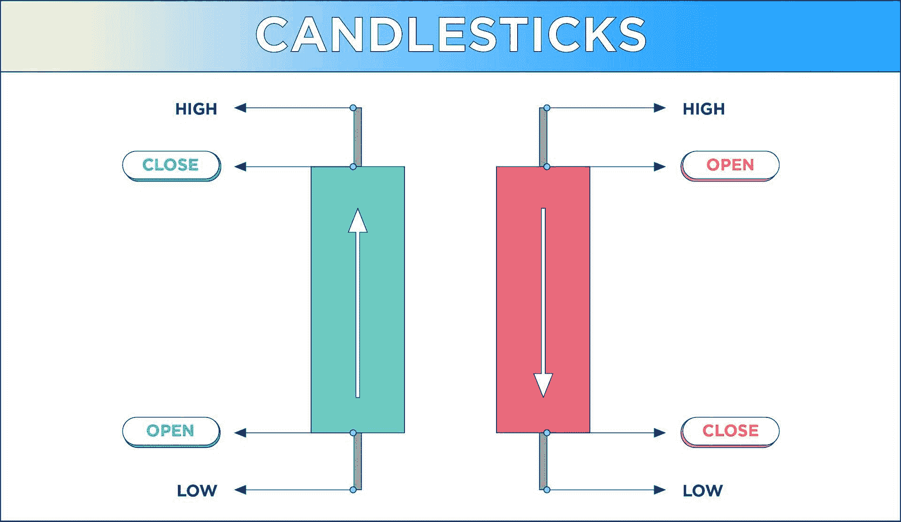

An alternative illustration showing the anatomy of a candlestick (Source: [crypto.com](https://crypto.com/university/how-to-read-crypto-charts))

有一点额外的术语要知道，当处理烛台。

*   阀体:开启和关闭之间的距离
*   灯芯:身体与高处或低处之间的距离
*   范围:高点和低点之间的距离

然而，并非所有的烛台都生而平等。正如你在我们的例子中看到的，有不同长度的烛台；烛台有的长，有的短，有的中等长度。这些长度对交易者有重要的意义。事实上，烛台模式可以向交易者表明很多事情，包括什么时候可能有趋势反转以及熊市或牛市模式。

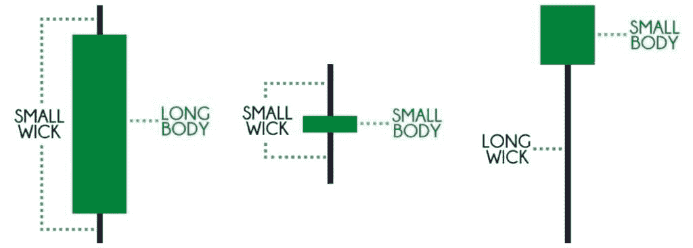

Size matters when it comes to candlesticks.

看一看单个烛台的实际视觉表现就会发现变化，例如顶部的长灯芯，这可以向交易者发出信号，表明利润正在被取走，可能会有即将到来的抛售。相反，相反一端的长灯芯表明投资者买入价格下跌。

如果大的(烛台状)物体是绿色的并且有短灯芯，那么它们可能是美丽的，这表示看涨情绪，而类似的红色物体表示相反的情绪，即看跌情绪。当灯芯很长而身体很短时，我们就处于一种买方和卖方都缺乏控制的情况。

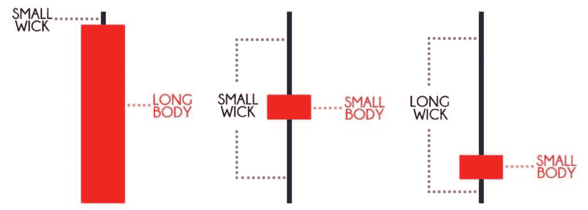

从整体上看，交易者经常将烛台各部分之间的关系描述为开盘-盘高-盘低-收盘值，这种烛台的组合通常称为 OHLC 图。

根据您使用的图表工具，您可能看不到红色或绿色，而是黑色和白色(甚至是不同的颜色组合)。在这种情况下，黑色对应红色(价格下跌)，白色对应绿色(价格上涨)。

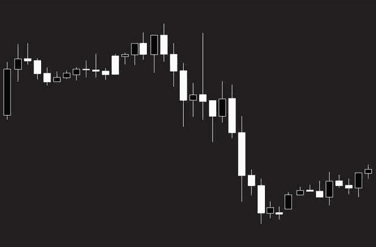

Japanese candlestick black-and-white chart showing downtrend market on black background.

从根本上来说，加密图上的蜡烛图描述了价格运动在特定的时间范围内是正的还是负的，以及程度。有了这个基本的认识，再加上烛台的实际组成部分以及它们的大小、形状和颜色的变化代表了什么，我们现在可以继续考虑稍微更深入地看看烛台图表中使用的技术分析指标。

## **技术分析和加密图表**

识别市场趋势，预测未来价格走势，建立理想的买卖机会，等等，都是技术分析的一部分。这里的要点是分析历史数据，以预测未来的价格变动，交易者通过使用技术指标来实现这一点。

由于实际上有数以千计的技术指标，不可能以任何有意义的方式对它们进行总结。相反，我们可以把它们放在一些更广泛的类别中，即**趋势**指标、**动量**指标、**成交量**指标、**波动**指标以及**支撑和阻力**指标。

鉴于它们的描述性名称，很容易辨别每个类别中指标各自的用途。

*   **趋势指标**可以为交易者提供是否有上升趋势、下降趋势或非趋势市场的洞察力，即市场是看涨、看跌还是处于横盘阶段。
*   **动量指标**可以揭示资产是超买还是超卖。
*   **交易量指标**用于精确定位市场内的交易量(或活动水平),它可以根据市场类型提示价格是会上涨还是下跌。
*   **波动性指标**衡量一个令牌偏离其平均价格的程度，低波动性表明价格平静且波动可预测，而高波动性表明相反。
*   ******支撑位和阻力位指标****** 可以用来判断某个令牌的价格何时会出现停顿或趋势反转。

密码交易者会用图表直观地显示他们的分析，时间框架和指标类型是两个主要变量。

## **识别加密图表模式**

至此，您可以识别、区分和理解加密图的各种元素了。下一步是认识到烛台的收藏是在告诉你，商人，一个故事。理解这个由各种烛台讲述的关于市场或资产价格变动的故事仅仅是密码图表分析的工作。

有一些常见的图表和烛台模式，你会经常在网上或书中遇到，有时知道它们的意思会很好。其中包括“锤子”(看涨)、“吊人”(看跌)、所谓“流星”烛台(看跌)之类的东西。然而，它们能否提供有价值的交易见解完全是另一个问题。

与其简单地复制这些普遍引用的千篇一律的模式，不如让我们来看看两个关键的交易概念，并考虑它们对你的交易策略的实际意义。

### **支撑位和阻力位**

支撑位和阻力位是任何类型的交易中最广泛使用的概念，无论是加密、股票还是其他。正如你可能猜到的，“支持”只是指加密货币维持其价格从而防止其价格下跌的水平。一些交易者将支撑位描述为“底部”

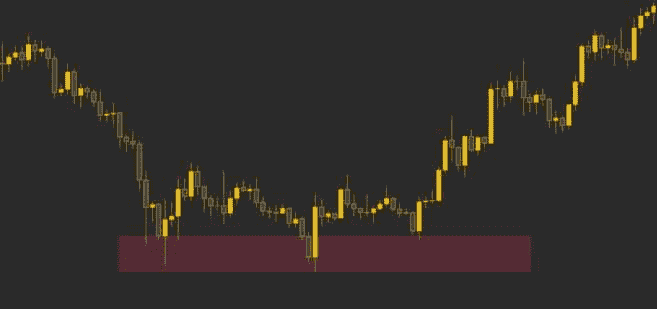

The rectangular area in maroon shows the price bouncing around in the support region before breaking out. (Source: Binance)

相反，阻力位是指加密货币的价格无法超越的水平。一些交易者将阻力位描述为“天花板”

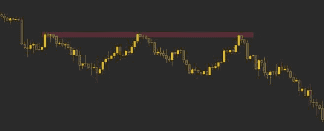

In this case, the price cannot break through the resistance level, as represented by the rectangular area in maroon at the top. (Source: Binance)

交易员通常会使用趋势线来确定支撑位和阻力位，趋势线是加密图上连接资产价格的实线。上升趋势或上升线表明需求高于供应，而下降趋势或下降线表明相反。交易者通常会利用多条趋势线来寻找支撑位和阻力位。

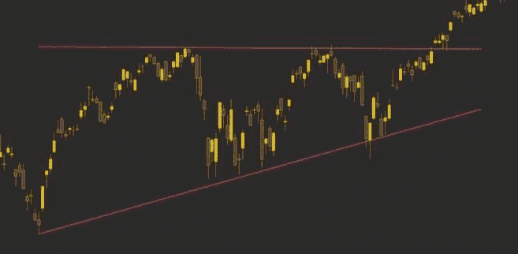

The use of multiple trendlines to spot support and resistance levels. (Source: Binance)

问题是:你如何确定支撑位和阻力位。两个字:均线。移动平均线(MA)是最常见的技术指标之一，它提供了特定密码在给定时间内的平均价格。

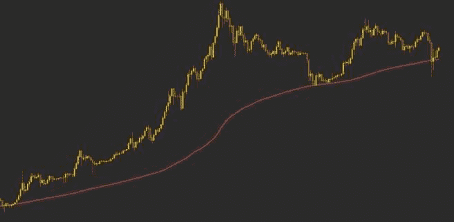

An illustration of a 200-week moving average acting as support for the price of Bitcoin (Source: Binance).

常见的时间周期从 10 日和 20 日移动平均线到 100 日和 200 日移动平均线。(在我们上面的币安交易界面中，我们可以回忆起使用的三条均线:7、25 和 99。)也有简单移动平均线(SMA)和指数移动平均线(EMA)。

## 加密图表有缺点吗？

对于所有交易级别的交易者来说，加密图都是有用和必要的，但是它们也有一定的局限性。

例如，可能有一种倾向，认为图表将预测未来的价格运动或趋势，而我们只是在处理*可能性*。这并不是说*会发生*，而是说*可能会发生*。换句话说，阅读蜡烛图和图表是交易者试图预测未来的一种方式，但绝不是一门精确的科学。

一些交易者也有过度沉迷于烛台和图表的趋势。指标用的越多越好，对吧？不一定——事实上，它可能导致完全相反的结果。太多的指标和太多的蜡烛图会把水搅浑，给你很多信息，这些信息有时是矛盾的，坦率地说，是不专业的。

你可能已经看到了一个流行的关于图表模式重载无效的迷因(提示:这正是本文开头使用的迷因)。

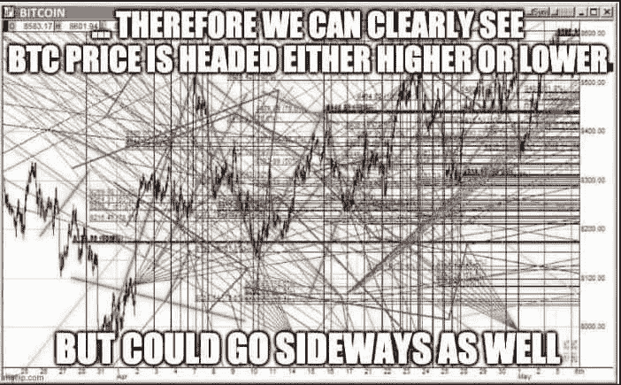

Bitcoin price prediction? It's anyone's guess.

学习图表。阅读图表。使用图表。但是要认识到它们的目的、价值和局限性，然后把它们结合到你的总体交易策略中，记住这些优点和缺点。

## **关于加密图表分析的最终想法**

关于密码图表分析的最终想法？没有最终的想法。根据交易者的知识、经验和专业水平，加密图可以复杂，也可以简单。

然而，我们可以相当肯定地说一件事。虽然您可能在开始这篇文章时不确定如何阅读加密图表，但现在您应该对如何分析加密图表有了更好的理解，更重要的是，如何理解加密图表。

当与自动加密交易机器人结合时，阅读加密图表的能力将使你从市场上的大多数交易者中脱颖而出，使你能够持续地、有条不紊地交易，同时预测价格运动、趋势、反转、支撑位和阻力位等。

换句话说，你会成为一个更有策略的交易者，在交易中没有比微调策略更好的朋友了。