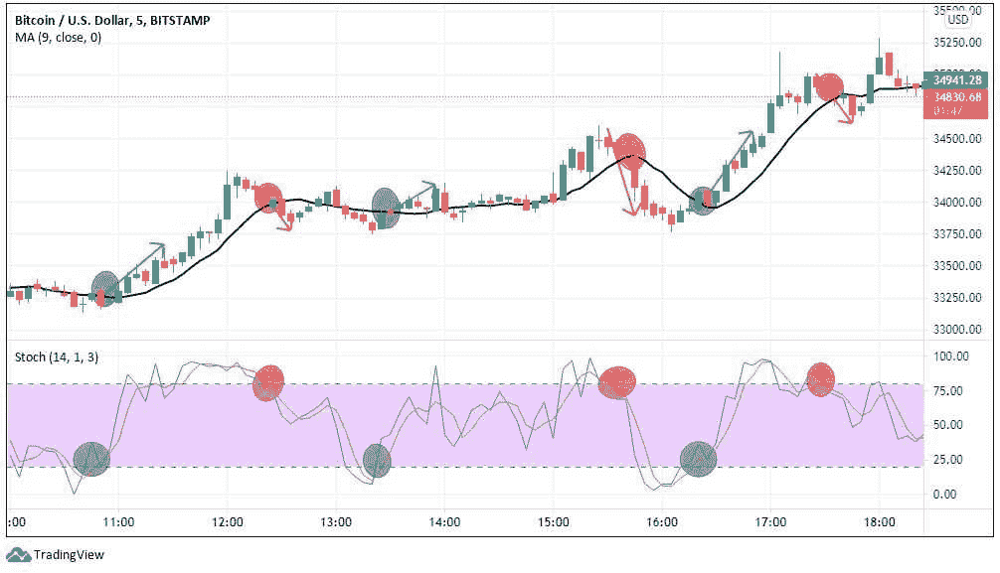

# 摇摆交易和刷单:它们有什么不同？

> 原文:[https://www.trality.com/blog/swing-trading-vs-scalping/](https://www.trality.com/blog/swing-trading-vs-scalping/)

在他的书*外汇价格交易刷单*的介绍的第一页，鲍勃·沃尔曼生动地概括了一种*特设*方法的陷阱。他写道，

> “自古以来，市场就不缺少愿意在日益激烈的供需战场上牺牲自己的志愿者。追求财富的人、暴发户、赌徒、不合群的人，以及一群混杂的乐观主义者和冒险家，都曾漫游过，并将继续漫游市场，寻找快速而轻松的收益。然而，没有任何其他风险比不计后果的投机行为导致更多的资本损失、更多的梦想破灭。”

对于那些乐于接受它的教训的人来说，过去的一年教会了我们尽职调查的价值，做自己的研究，以及在所有市场条件下拥有一个完善的交易方法。

涉足各类交易的手工交易员，从 [日内交易](/blog/day-trading-crypto)，[套利](/blog/crypto-arbitrage-strategy)，[保证金交易](/blog/margin-trading-bots)，刷单，建仓，迅速玉石俱焚。打了就跑的交易方法是不一致的，不可靠的，更重要的是，成本很高。请注意，我们特别使用了“涉猎”这个词所有上述的交易策略在严谨、尊重和现实的情况下都是有利可图的。

在下面的文章中，我们将比较两种具体的交易策略，摇摆交易和刷单交易，努力梳理出每种策略的一些优点。

## **什么是摇摆交易？**

正如我们在摆动交易加密的介绍性指南中所写的，加密市场是循环运动的，也就是说在任何给定的时间内都会有价格波动。波动交易的目的是从波动中获利，特别是在较短的时间内，如几天到几周。任何更长的时间都会让你进入持仓交易区域，而任何更短的时间都意味着你将从事所谓的“日内”交易。

## 寻找开始摆动交易加密？

查看 Trality Rule Builder，这是一个最先进的工具，允许您创建自己的自动化摇摆交易机器人，以最小化风险，限制损失和增加利润！

[https://www.youtube.com/embed/ugtCnc-wW7s](https://www.youtube.com/embed/ugtCnc-wW7s)

<button type="button" class="chakra-button css-1hnfsz">Try It for Free</button>

显然，摇摆交易是一种短期交易策略，因此，交易者很好地利用基本面和技术分析，以便最好地预测任何给定加密货币的价格波动点。确定最佳的贸易进入和退出点；交易策略经过回溯测试和优化；在投入任何实际资金之前，票据交易将评估其潜在功效。

交易者非常依赖[一系列技术指标进行摇摆交易](/blog/best-indicators-for-swing-trading)，包括移动平均线(例如，指数移动平均线或 EMA)、相对强度指数(RSI)、斐波那契回撤工具和布林线。交易员依赖的典型交易时间框架是四小时图(4H)和日线图(D1)，而[币安被许多](/blog/the-ultimate-binance-review)人视为可信、可靠和灵活的中央加密交易交易所的显而易见的选择。

## **摇摆交易的利与弊**

和任何交易策略一样，在考虑是否把它加入你的交易工具箱时，要权衡利弊。

首先，熟悉给定交易策略的机制，测试指标和参数，回溯测试，纸上交易，看看它是否适合你个人的交易风格和目标，这永远不会有坏处。而且，由于使用 Trality 专有交易工具制作的免费加密交易机器人，可以用一个免费的币安账户进行摇摆交易，因此没有理由不试一试。

### **摇摆交易的优势**

日内交易者花大量时间在他们的办公桌前监控价格变动，这是摇摆交易者不一定要做的事情。当与自动加密交易机器人和止损单等风险管理工具相结合时，摆动交易可以提供健康的利润。

摆动交易的另一个优势是，它不需要花时间筛选大量与基本面分析相关的信息。相反，当评估价格和交易量时，摇摆交易者依靠一系列技术指标来确定最佳的交易进场和出场。

因为你对价格波动感兴趣，摇摆交易者不会长时间被套牢。我们都了解加密市场的波动性，都知道根据市场的变化来改变交易策略的价值。

### **摇摆交易的缺点**

隔夜和周末价差意味着敞口。加密市场没有停机时间，所以摇摆交易者必须确保他们有能力降低盘后风险。

从这种波动性的概念出发，我们需要密切关注市场，因为它可能随时发生变化。最近的事态发展让多少人措手不及？趋势是你的朋友，直到他们不再是。换句话说，市场逆转可能发生在一眨眼的功夫。警惕拉锯是关键。

短期收益都是好的，但是长期呢？想象一下，如果你几年前买了 BTC 的股票。虽然短期内有机会，但交易者不应忽视长期趋势。

## **什么是倒票？**

在短线交易中，所谓的“刷单”策略也是一种有利可图的方法。那么什么是倒票呢？

普通的日交易者通常每天做五笔交易，而秘密黄牛党可以在几分钟内完成交易，这意味着他们平均每天可以做几百笔交易。从某种意义上说，秘密黄牛党是摇摆交易，因为他们希望利用价格波动，但与摇摆交易者相比，吸引他们眼球的波动往往很小，这是黄牛党日交易量较高的一个原因。

A scalping strategy with BTC/USD using a 5-minute chart with the moving average (MA) indicator (trend indicator) and the stochastic oscillator for momentum. (Source: Bybit)

在像 crypto 这样波动的市场中，熟练的黄牛党瞄准较小的波动，这可能导致不可观的收益。然而，关键词是速度和一致性。如果他们有任何成功的机会，黄牛党需要快速，他们需要始终如一。延迟、犹豫和滞后的网速会导致无效的交易和亏损，有时也会涉足刷单。不言而喻，黄牛党需要成为图表大师，必要时能够在[杠杆](/blog/leverage-trading-crypto)、  区间交易和买卖价差之间转换。

## **倒票的利与弊**

坏事传千里(或好事传千里)，倒票也不例外。

虽然高频交易有很多好处，但对新手来说却很有挑战性。然而，一些对新手来说具有挑战性的事情也可以被视为获得经验的完美训练条件。换句话说，如果你能学会有效地头皮，那么你就已经接受了严格的训练，掌握了一些基本的交易技术，以及在压力下控制情绪的能力。

下面我们来回顾一下倒票的一些利弊。

### **倒票的优势**

对于对短期利润感兴趣的交易者来说，刷单可能是一个不错的选择(前提是你真的做了有利可图的交易)。不像仓位交易，甚至是波动交易，你不会长时间被套牢。

小额交易意味着低风险。你不太可能在刷单时倾家荡产，因为你的头寸规模会比你使用不同的交易策略时相对较小。

考虑到每天的交易量，刷单和自动加密交易机器人是完美的搭配。手动交易是傻瓜的游戏，尤其是从事加密倒卖的时候。

也许最重要的是，如上所述，刷单通常是学习错综复杂的交易的极好的训练场所。刷单加密往往比日内交易或波动交易更复杂。一旦你很好的理解了所涉及的内容，其他类型的交易策略将会更容易掌握和执行。

### **倒票的弊端**

不利的一面是利润通常很少，这就是为什么黄牛党需要增加交易次数来使他们的交易物有所值。虽然小利润可以随着时间的推移而增加，但对于更多以结果为导向的交易者来说，这可能是一个乏味的过程。

另一个问题是噪音，或者是歪曲或歪曲趋势的误导性信息。因为黄牛党的时间框架很短，所以很难把噪音和实际趋势分开，在较短的图表中，趋势是混乱的。

刷单需要一定的理想条件才能运作，最明显的是下单和执行订单时几乎零延迟。你所有的星星都需要在这方面保持一致。缓慢的网络连接或其他薄弱环节会导致无利可图的交易。交易费用也会迅速增加。

## 摇摆交易和黄牛交易哪个更好？

是也不是。如果你是新手，那么刷单不是最好的开始方式。如上所述，它可以提供各种各样的交易训练营，但高频交易的现实是，它对新手的要求太高。然而，对于更有经验的交易者来说，摇摆交易是一个有利可图的策略——这是不可避免的。

关键是要了解自己。你有技巧、注意力和耐心来监控几分钟或几秒钟内的价格变动吗？如果是这样，那么倒票是一个很好的选择。你是否对几天或几周的短线交易感兴趣，而不必在更长的时间里被套牢？在这种情况下，摆动交易当然值得探讨。

尽管刷单关注的是发生在极短时间内的日内价格波动，但摇摆交易倾向于锁定短期趋势来获利。压力更小，花费的时间更少，对新手来说更方便。

## **关于波段交易和刷单的最终想法**

还记得我们在本文开头提到的鲍勃·沃尔曼吗？他以一个哲学的注解结束了他的书，我们想在这里复制它。

> “方法和策略多如牛毛，就像周围有交易者一样，谁能说什么有效，什么无效。只要看一眼任何图表，就会发现观点和看法的巨大差异。不管一个特定的方法有多好，不管它有多好的统计记录，在更大的范围内，它只不过是个人观察的快照。无论过去看似显而易见的是什么，未来都可能并且很可能会挑战它。”

伟大的交易者不是天生的，也不是创造出来的。

他们创造自己。