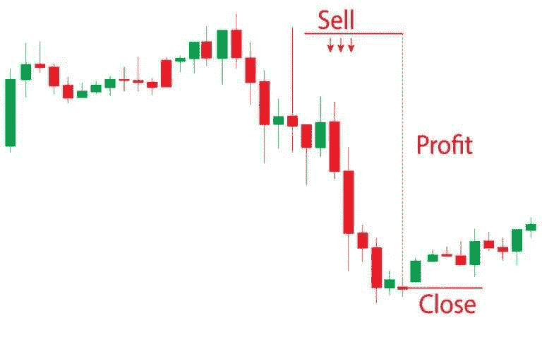

# 加密做空:崩盘和回撤期间的利润

> 原文:[https://www.trality.com/blog/crypto-shorting/](https://www.trality.com/blog/crypto-shorting/)

坏消息是，市场 crashes⁠—whether 加密或 otherwise⁠—are 不可避免。而且，正如许多交易员可以证明的那样，它们甚至可以对最有弹性的投资组合造成严重破坏。例如，一个隐秘的冬天可以持续到春季和夏季。如果你决定冬眠，等待霍德林的到来，那么你的投资组合肯定会受到一些重大打击，至少在短期内，直到市场复苏并进入新的周期。

在 [一次加密崩盘](/blog/crypto-crash)，大多数投资者通常选择“逢低买入”，也就是所谓的“接住落下的刀”策略。显而易见的问题是，你永远不知道探底会有多低，这使得确定探底的绝对底部相当具有挑战性。这也是一种被动的交易策略。你只是在等待市场好转，而不是积极利用机会获利。

崩溃和所有的厄运和黑暗，然后呢？即使在最具挑战性的市场条件下，精明的交易者能发现获利的机会吗？战胜熊市的一个方法是通过加密卖空，这不同于杠杆融资交易。

## 利用 Trality 强大的自动化交易工具探索保证金交易

凭借 Trality 独特的保证金交易功能和我们完全灵活的 Python 编辑器，创建者可以制定有利可图的市场中立策略。

[https://www.youtube.com/embed/mSx3GB5VRlg](https://www.youtube.com/embed/mSx3GB5VRlg)

<button type="button" class="chakra-button css-1hnfsz">Try It for Free</button>

在接下来的文章中，我们将研究加密做空——它的许多优点和一些缺点，以及做空加密的最佳交易。我们开始吧！

## **什么导致了加密市场崩溃？**

首先，到底是什么导致了加密市场的崩溃？实际上，加密市场崩溃有两个主要原因:1)加密生态系统中主要参与者的崩溃，以及 2)集中金融中利率的上升。

### **加密崩溃和加密蔓延**

主要加密交易所或项目的崩溃通常会在整个行业产生多米诺骨牌效应，导致许多交易者 FUD。

大多数市场崩溃是由主要加密交易所或项目崩溃后市场流动性紧缩引发的。最近的例子是 5 月 Terra Luna 的崩溃和 2022 年 11 月 FTX 中央加密交易所的内爆。在 Terra Luna 的案例中，熊市在不到两周的时间内抹去了约 60 亿美元，而在 Samuel Bankman-Fried 的 FTX 丑闻中，仅在六天内就有约 2300 亿美元从加密市场抹去。

正如我们在 FTX 看到的那样，后续余震可能会导致市场进一步不稳定。总部位于香港的加密货币交易所 Genesis Block 不得不停止交易，这是 FTX 事件的直接后果。

### **加息**

从一开始，crypto 就被吹捧为集中式金融的替代方案。但加息加上降低通胀的措施，使得中央金融相对有吸引力，尤其是对机构投资者和高净值投资者而言，他们将中央金融视为避风港。在这种情况下，资本往往会从加密市场流向菲亚特投资公司，或者一开始就留在菲亚特市场。

资本外逃，尤其是鲸鱼的资本外逃，通常可以被视为向散户投资者发出的一种信号，散户投资者反过来会出售他们持有的密码(经典的多米诺骨牌效应)。重要的是要记住，当涉及到加密市场的价格波动时，市场情绪起着重要的作用。因此，当市场情绪恶化时，加密投资者往往会逃离他们认为是高风险的资产。

雪上加霜的是，加密市场不像股票市场那样有熔断机制。如果一只股票的价格在一天内下跌 10%,它的交易就会停止，从而避免了最糟糕的情况。相反，持续的同步抛售可能导致加密市场闪电崩盘。

## 什么是加密卖空？

现在我们知道了加密市场崩溃和回撤的一些主要原因，让我们来探索加密做空。加密卖空背后的基本思想是资产价格的预期下跌。你基本上是在赌它不会赢。如果你看过[网飞的纪录片《吞噬富人:GameStop 传奇](https://www.netflix.com/at-en/title/81424332)，那么你应该已经对做空有所了解。

同样的原理也适用于加密。如果你认为某个密码的价值(以及价格)将会下降，那么你可能会考虑借入并随后出售它——高买低卖。这可以通过多种方式实现，比如保证金交易、购买期货或期权，或者使用一种叫做[差价合约(CFD)](https://www.investopedia.com/terms/c/contractfordifferences.asp) 的东西。

在加密市场崩溃期间，加密卖空的主要目标是在价格较高时卖出，并在价格下跌后回购。换句话说，这与做多相反，你预期价格会上涨，因此买入 crypto，希望以更高的价格卖出。但在加密市场崩溃期间，加密价格急剧下降，这意味着获利的最佳方式是沿着市场趋势的方向交易。

A basic illustration of crypto shorting (source: Shutterstock)

关于加密做空要注意的一个关键问题是，你实际上并不拥有你做空的加密。你必须从你的密码交易所借用它们，自然会产生利息费用。

## **加密卖空是如何工作的？**

假设我们正处于加密市场崩盘时期，而你想在此期间做空 ETH。你从你的交易中介那里借入 ETH，比如说 1 ETH，然后以当前市场价格卖出。为简单起见，我们假设 1 ETH 的市场价格为 1500 美元。现在，因为是市场崩盘，价格跌到，比如说，1000 美元。所以，你以 1000 美元回购 ETH，并将其返还给你的经纪人或交易所。在这种情况下，你获得了 500 美元的利润，减去你可能产生的任何额外费用，包括利息。

所有这些听起来似乎很简单，交易者应该注意这是一个高级策略，需要对市场和交易基本面有深入的了解。收益可以很快积累，但亏损也是如此，这给我们带来了这种流行的交易策略的风险和回报。

## 加密卖空的风险和回报是什么？

我们现在知道加密卖空允许你在市场崩溃时获利。它还允许你利用短期市场波动，对冲潜在的市场低迷对你的投资组合。但这并非没有风险。以下是加密做空的优点和缺点。

### **加密做空的优势**

*   做空可以让你从市场波动中获利。[加密市场本质上是不稳定的](/blog/staying-disciplined)，做空使你能够利用短期和长期的看涨和看跌趋势。
*   **让您在熊市期间对冲**并保护您的加密投资组合。假设你已经 HODL 了价值 10，000 美元的 BTC，你相信熊市即将来临。在这种情况下，你做空比特币，如果价格下跌，做空的利润应该可以弥补你投资组合的任何贬值，或者显著减少损失。

### **加密短路的缺点**

*   **潜在的无限损失**。让加密卖空变得有吸引力的波动性，也让它变得有风险。当你买了 crypto，你可以想持有多久就持有多久。即使价格下降，也永远不会为零。然而，当做空时，一个看涨的峰值接着一个持续的上涨趋势可能会使损失超出你最初的投资，特别是如果你没有[止损单](/blog/why-is-stop-loss-important)的话。
*   卖空时，**你会产生保证金利息**。卖空通常包括从你的交易所借用密码，这是有代价的。只要你持有这些借来的密码，你就会对它们产生利息。如果市场对你不利，这会侵蚀你的利润或增加你的损失。

## **如何获利做空 Crypto**

我们上面给出的例子是加密短路的基本原理。然而，不同的交易平台有不同的做空 crypto 的方式，这些方式通常涉及 crypto 衍生品。加密衍生品包括加密差价合约、加密期货和期权。当交易衍生品时，你可以使用[保证金和杠杆](/blog/margin-trading-vs-leverage-trading)，这允许你建立比你拥有的资本大得多的头寸。但是，您必须首先将您的初始资金存入您的交易账户，以便从您的密码交易所[访问](/blog/best-crypto-margin-trading-exchanges)[保证金交易](/blog/margin-trading-bots)和[杠杆](/blog/leverage-trading-crypto)设施。以下是一些实用的方法，你可以短密码。

### **做空加密差价合约**

差价(CFD) 的加密[合约允许您在不拥有基础加密的情况下对加密价格进行投机。这是一种衍生品，作为交易者和经纪人或加密交易所之间的合约。](https://www.investopedia.com/terms/c/contractfordifferences.asp)

做空加密 CFD 意味着你指望基础加密价格下跌，在这种情况下，你的头寸平仓获利。请注意，您的头寸将保持未平仓状态，直到您手动平仓或达到您的止损或利润目标。如果密码的价格上涨，造成的损失超过了你交易账户中的资金，你就会被平仓。

### **做空加密期货市场**

期货合同是双方在预定的未来日期和价格购买或出售资产的协议。加密期货合约跟踪潜在加密的价格，这使得它非常适合投机给定加密货币的未来价格。

当你购买加密期货合约时，你预期价格会上涨。另一方面，卖出期货合约意味着你预期基础密码的价格会下跌。在这种情况下，您可以通过签订一份押注期货价格下跌的期货合约来做空加密市场。当合同到期时，交易结算，合同关闭。

对于加密期货，你可以使用标准期货合同，永久合同，或期货。永久加密期货没有到期日，它们的交易价格接近现货市场上的加密价格。其主要定价机制是通过融资利率实现的。

### **加密卖出期权**

加密期权是一种衍生工具，赋予你在未来以特定价格购买或出售特定数量的特定加密的权利。因此，如果你想做空一个特定的加密，你可以使用[看跌期权](https://www.investopedia.com/terms/p/putoption.asp)。看跌期权合约允许你以特定的价格出售你的投资组合，即使未来的市场价格明显低于当前价格。

例如，假设 BTC 的当前价格为 21，000 美元，而您已经完成了分析，并认为它将在未来几周内下跌。你可以买一个看跌期权，让你在比如说三周内，以 21000 美元的现价卖出 BTC。如果 BTC 的价值下跌到，比方说，16000 美元，在期权到期的三个星期内，你赚 4000 美元的利润减去合同费用。请注意，如果基础加密的价格上涨，你只会损失期权费——持有期权合约所支付的费用。

### **预测市场**

秘密预测市场允许你对特定事件的结果打赌。要在预测市场做空 crypto，你必须预测一个特定的硬币会下跌一定的百分比。此外，另一个人，或交易对手，必须接受你的赌注。为了让您获得支付，密码必须至少下降指定的金额或百分比。否则，你就输了。

## **加密做空策略**

现在你知道了加密卖空是如何工作的，让我们看看你可以使用哪些方法来有效地卖空加密市场。

### **情感分析**

你可以确定的一件事是，加密市场受投资者和交易者情绪的影响。与基本面和技术分析不同，情绪分析不依赖可量化的指标。它包括心理方面，如害怕错过(FOMO)，恐惧，不确定性和怀疑(FUD)。通常情况下，尽管并非总是如此，新闻报道在造成加密市场传染方面可以发挥巨大的作用。两个词:卢娜和 FTX(嗯，好吧，技术上是三个)。

### **技术分析**

[技术分析和基本面分析](/blog/fundamental-analysis-and-technical-analysis)是一枚硬币的两面。更准确地说，技术分析包括检查密码的历史价格和趋势，以试图确定其未来可能的趋势。

Technical analysis is a core aspect of crypto trading strategies such as shorting.

它基于关键原则，即价格行为不是随机的，市场以可识别和可预测的方式波动。这意味着我们总是可以预期历史趋势会重演，特别是因为[加密市场是周期性的](/blog/crypto-market-cycles)。好奇者:有数百种技术分析指标可以用来判断熊市的开始。

### **基本面分析**

基本面分析有助于确定加密货币的内在价值。它涵盖了加密货币及其区块链的所有其他定性方面。一般来说，基本面分析需要一些专业知识和彻底的尽职调查，因为它涉及到各种内在和外在因素的分析。理想情况下，加密基本面分析围绕着三个主要指标的分析:财政指标、链上指标和项目指标。

## **做空加密的最佳交易所**

几乎所有顶级加密交易所都支持加密卖空，以下是一些最佳选择。

### **币安**

币安是世界上最大的加密交易所，也是最值得信赖的交易所之一。您可以通过保证金交易、期货交易、做空币安杠杆代币(BLVTs)或期权合约做空 crypto。你可以用单独或交叉保证金交易，在它们之间切换，也可以做空 USDS-M 期货合约和 USDS-M 期货合约。

要深入了解币安以及如何在交易所交易获利，请查看我们对币安的深入评论以及我们对创建币安加密交易机器人的全面指导。

### **逐位**

[Bybit](https://www.bybit.com/en-US/) 是最好的衍生品交易所之一。你可以用 USDC/USDT 期权和永久合约以及反向合约做空加密市场。你也可以用杠杆代币做空加密现货市场。

### **OKX**

就衍生品交易而言，OKX 是第三大密码交易所，你可以通过合约和保证金交易做空密码。它提供永久掉期、期货和期权。

## **关于加密做空的最终想法**

关于一次加密崩溃如何从市场上抹去数十亿美元的新闻故事似乎从来都不缺乏。一个经久不衰的热门话题是比特币的死亡。对于那些在家做记录的人来说， [BTC 已经死了大约 466 次](https://99bitcoins.com/bitcoin-obituaries/)(还在统计)。然而 crypto 还在继续。

必要的问题随之而来:你能做空 crypto 吗？你能从中获利吗，尤其是在市场崩盘期间？正如我们在上面的文章中看到的，答案是肯定的“是！”你确实可以在市场崩盘时通过加密做空获利，但这需要相当多的技能、研究和专业知识(任何有价值的事情总是如此)。

在本指南中，我们讨论了交易者在市场崩溃时利用加密做空获利的一些方法，以及他们使用的一些策略。我们也强调了一些做空的交易所，边策是大多数人最好和最安全的选择(依我们的拙见)。

然而，尽管做空 crypto 是在市场崩溃时获利的一个好方法，但它也不是没有风险，这就是为什么总是做自己的研究和不冒超出你承受能力的风险是如此重要。