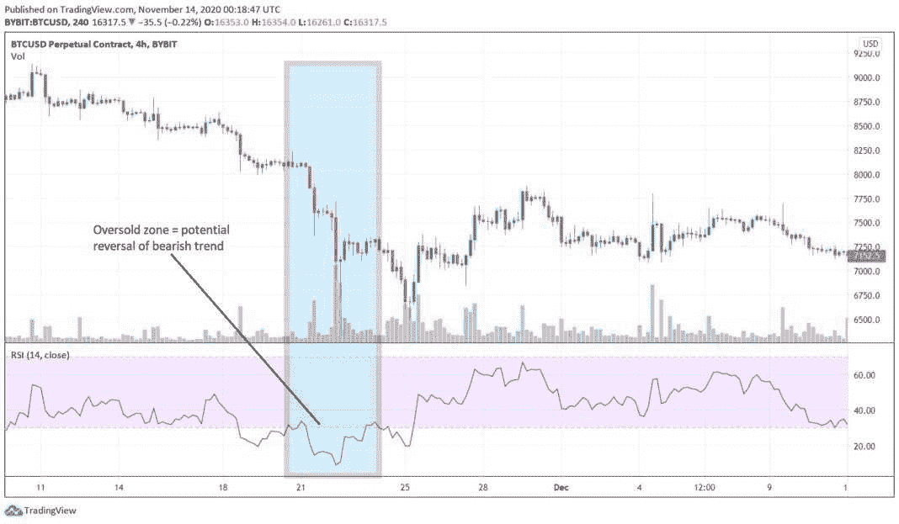

# 摆动交易密码:入门指南

> 原文:[https://www.trality.com/blog/swing-trading-crypto/](https://www.trality.com/blog/swing-trading-crypto/)

鉴于买卖加密货币的多种方式，你可能想知道 swing trading crypto 是否有利可图。或者，您可能对用于摇摆交易的最佳加密货币感兴趣。或者也许你只是对摆动交易本身好奇——它是什么，怎么做。

好消息是，摆动交易受到所有技能水平的投资者的欢迎，这意味着初学者在尝试它甚至将其添加到他们的交易策略工具包时，往往会获得巨大的成功，而经验丰富的老手可能会从用新的眼光处理摆动交易中受益。

## 寻找开始摆动交易加密？

查看 Trality Rule Builder，这是一个最先进的工具，允许您创建自己的自动化摇摆交易机器人，以最小化风险，限制损失和增加利润！

[https://www.youtube.com/embed/ugtCnc-wW7s](https://www.youtube.com/embed/ugtCnc-wW7s)

<button type="button" class="chakra-button css-1hnfsz">Try It for Free</button>

事实上，将摇摆交易与自动算法交易机器人结合起来，可以成为利用人工智能和机器学习的力量来获得短期和长期交易收益的绝佳方式。正如我们博客的普通读者已经知道的那样，手动交易肯定会导致亏损，对于时间框架较短的交易策略来说尤其如此，这使得加密交易机器人成为绝对必要的工具。

在下面的文章中，我们将探讨摆动交易加密的基础知识，然后再深入一些细节，如优点和缺点，如何开始，常见的摆动交易策略，摆动交易风险，它与日交易的比较，以及它是否是一种有利可图的交易方法。

## 什么是摆动交易密码？

一个基本的真理是。CSS-18up 66p { color:# 00b8e 6；字体粗细:正常；光标:指针；左:0px 位置:相对；-webkit-transition:全部 500ms 转场:全部 500ms-webkit-text-decoration:无；文字-装饰:无；} [市场周期性波动](/blog/crypto-market-cycles)，根据多种因素上下波动。现在让我们说，作为一个交易者，你想从资产价格的中短期波动或“波动”中获益。在这种情况下，我们谈论的是发生在几天到几周内的波动。

任何更短的时间都被称为日内交易，我们将在本文后面详细讨论。任何更长的时间都是买入并持有的策略，也称为霍德林或头寸交易，根据定义，这实际上不是交易。因此，摇摆交易占据了日内交易和买入并持有策略之间的中间地带。

因为摇摆交易是一种短期策略，交易者经常结合技术分析和基本面分析来衡量最佳的交易进场和出场。关键是要知道如何将技术分析和它的许多指标与基本面分析结合起来，以便识别和预测价格变动，从而实现最佳的交易进场和出场。

## **摇摆交易加密:好处和缺点**

如果我们不首先描述一些交易者可以从摇摆交易中获益的方法，以及一些策略可能的陷阱，那我们就失职了。毕竟，简单的利弊对比可以为你的决策过程注入健康的客观性，从而更容易做出更明智的决定。

### **摇摆交易的优势**

**时间**:日内交易需要时间，时间就是金钱。另一方面，摆动交易不需要你花几个小时粘在屏幕上，因为持仓时间超过一天。

**压力**:你已经知道压力会杀人，日内交易是有压力的工作。通过建仓和建立止损单，摆动交易让你专注于生活中其他重要的事情。*现在宁静了*。

简单:技术分析指标让你专注于价格和交易量，而不是花时间在基本面分析和建立内在价值上。

敏捷:与仓位交易不同，在仓位交易中，你要做更长的时间，摇摆交易允许快速交易者为了小收益或小损失而买卖，以便在任何给定的时间优化他们的策略。

## **摇摆交易的缺点**

**盘后风险**:交易员需要应对隔夜和周末市场风险。

**拉锯**:更普遍的情况是，鉴于其固有的不稳定性，需要持续关注加密，以顺应趋势或避免市场突然逆转，这可能会导致意外损失。

错过的机会:行动是好的，但是短期的市场行动有时意味着摇摆交易者错过了长期的机会。

现在你知道了摆动交易的优点和缺点，让我们来看看下一步如何开始。

## **加密摇摆交易入门**

为了开始加密摆动交易，最重要的步骤之一是选择一个你想交易的交易所。在这方面，大多数交易者的最佳总体选择是明确的:[币安](https://accounts.binance.com/en/register?ref=K55AL9ZB)。

因为它是世界上最大的，也可以说是最受欢迎的中央加密交易所，币安为新手和中间交易者提供了大量的选择和相当大的灵活性。用户可以利用大量的市场对(在本例中是数百个)、期货、[保证金交易](/blog/margin-trading)和[杠杆](/blog/leverage-trading-crypto)，以及许多其他功能，这些功能通常是摇摆交易的理想选择。

由于币安和 Trality 完全免费使用，交易者可以快速轻松地开设账户，以创建自动化的[币安加密交易机器人](/blog/create-binance-trading-bot)，即使在最具挑战性的市场条件下，也能确保一致、可靠和有利可图的交易。

## **加密摇摆交易策略**

波段交易者的工具箱里有很多工具。其中最主要的是技术指标，可以领先也可以滞后(动力指标、趋势指标、波动指标等等)。加密交易者的共识是，指数移动平均线(EMA)、布林线、相对强度指数(RSI)和斐波纳契回撤工具等指标是摆动交易加密时最受欢迎和最有用的。

An illustration of a Relative Strength Index (RSI) indicator (source: TradingView)

波段交易者对支撑位和阻力位特别感兴趣，这使得阅读和解释蜡烛图和加密图的能力特别重要。一般来说，秘密摆动交易者可以采用很多不同的方法，从试图抓住并驾驭上涨趋势到买入回调(或回撤或盘整)。

好奇的初学者以及对摆动交易加密的最佳指标和交易策略感兴趣的更高级的交易者应该参考我们关于这个主题的专门文章。

## **最好的摇摆交易密码**

和加密领域的所有东西一样，没有放之四海而皆准的解决方案，所以几乎不可能说任何一个特定的加密技术是最好的。最终，有许多不同的原因，交易者可能会选择摇摆交易，还有一些额外的变量。简单的事实是，鉴于这些原因，一些硬币可能比其他硬币更适合，这显然会有所不同。

然而，作为一般规则，比特币(BTC)通常被视为进入摇摆交易的理想入口，以太坊紧随其后。当然，交易者也可以尝试交替交易替代硬币，但他们应该记住，风险要大得多，尤其是当涉及更小的硬币时。

## **摆动交易加密的最佳时间框架**

就像生活中的许多事情一样，时机就是一切，同样的道理也适用于波段交易(或者任何类型的交易)。

一般来说，摇摆交易者用四小时图(4H)和日线图(D1)，但是显然也可以用周线图。使用日线图的一个好处是，它避免了曲线拟合你的策略的可能性，也就是说根据历史数据而不是实际的市场条件来定制你的策略。更短的时间框架将导致数据的随机性增加，这可能导致做出可靠的价格预测更加困难。

简单的事实是，没有“最佳”的时间框架，或者密码空间中的任何东西，因为这很大程度上取决于交易者的个人需求、能力、目标、经验水平等。

## **Crypto Swing 交易盈利吗？**

随着数以百万计的人每天都在交易密码，答案是显而易见的(否则他们为什么会继续这样做)。但这并不是说很容易或很快就能盈利。

考虑到它的许多活动部分，摇摆交易需要对基本面分析、技术分析、市场动态和记号经济学有很好的理解，以及更高级的摇摆交易指标和策略的知识。

但是这不应该阻止新交易者探索波动交易。潜在的原则很容易掌握，但是有利可图的摇摆交易机制需要(而且经常需要)相当多的知识、经验，而且，说实话，还需要反复试验。

虽然练习不一定会让你成为完美的摇摆交易者，但它会让你成为更赚钱的交易者，这就是为什么回溯测试和纸上交易在开始时如此重要。

## 加密摇摆交易有风险吗？

由于持仓时间较短，风险水平在一定程度上得以降低。尽管如此，当交易者进行摇摆交易时，还是有风险的。最大的担忧是适时的交易进场和出场。太快或太晚可能意味着盈利交易和重大损失之间的差异，这就是为什么在确定最佳交易买卖点时，必须使用技术指标。

在摇摆交易中，止损单是管理风险的一个特别重要的工具。顾名思义，当一枚硬币的价格达到一定水平时，它会停止交易者的损失。就当是紧急刹车吧。作为一个交易者，你确切地知道你的资金有多少，以及每个头寸的精确限额。顺便提一下，阿拉米达研究公司的前首席执行官卡罗琳·埃里森吹嘘自己不喜欢止损单。努夫说。

## **摇摆交易 Crypto vs 日内交易:有什么区别？**

一句话？压力。日内交易——不管是加密交易还是其他交易——压力都非常大。如果你喜欢看起来比实际年龄老，那么日内交易可能适合你。然而，严肃地说，日内交易需要大量的技巧和经验，而且肯定是有利可图的，这也是为什么许多交易者实际上是日内交易者的原因之一。

正如本文前面提到的，日内交易者试图利用日内波动，通常基于动量和市场消息。全天的市场监控是必须的，尤其是在像 crypto 这样不稳定的市场，但这也很耗时。临时交易者或交易新手没有时间、工具或专业知识来高效交易。

比方说，当一个新的日内交易者遇到短期动量，然后在更大的整体趋势下触发头寸，会发生什么？对于外行来说，损失会很快增加，这就是为什么在这种情况下，日内交易最好留给专业人士。换句话说，日内交易和波动交易的主要区别之一是风险，日内交易是两者中风险更大的策略。

另一方面，波动交易本质上风险更小，因为持仓时间更长(但不会太长)。随着风险的降低，交易者的资金风险也降低了，可以用于更大的波动。例如，相比两周内平均 8%的涨幅，日内交易 8%的涨幅要难得多。更少的风险敞口和更少的资金投入意味着摇摆交易者可以专注于长期利润，而没有日内交易固有的风险和担忧。

然而，同样重要的是要注意日内交易和波动交易并不相互排斥。日内交易者可以持有日内头寸，但他可能需要再持有一天或更长时间才能获利。或者，日内交易者可以在一个位置停留太长时间，试图扭转损失，实际上成为摆动交易者，甚至是仓位交易者。

## **最终想法**

摇摆交易有很多好处，是所有级别的交易者都喜欢的交易策略。

例如，与日内交易不同，你不必整天盯着电脑看头寸和价格变动。一个连锁反应是，作为交易者，你的压力会更小。此外，当使用技术分析指标时，你可以把精力集中在价格和交易量上，而不是基本面分析中一些更具挑战性的方面。由于摇摆交易占据了中间位置，你不必做多头，比霍德林提供了更多的灵活性。

尽管如此，波段交易者有一些共同的特征。他们对市场了如指掌；他们擅长技术分析和基本面分析；他们关注止损；他们不会把事情复杂化。

如果你决定在你的交易策略中加入摇摆交易，永远记住黄金法则:*永远不要冒险超过你能承受的损失，*永远不要做你自己的研究。**