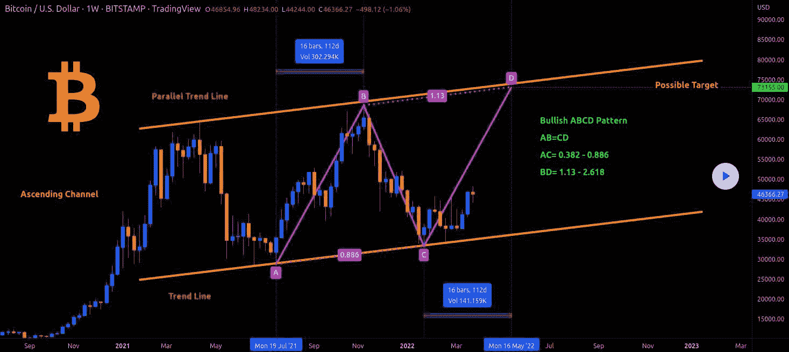

# 摆动交易的最佳指标:综合指南

> 原文:[https://www . trality . com/blog/best-indicators-for-swing-trading/](https://www.trality.com/blog/best-indicators-for-swing-trading/)

换妻者有更多的乐趣。

不，不是那种摇摆(你在想什么？).我们正在谈论摇摆交易，这是一种常见的投资策略，与日内交易或头寸交易等其他策略截然不同。

在我们的 swing 交易加密初学者指南中，我们在强调一些主要的优点和缺点之前，检查了该过程的“螺母和螺栓”以及风险和回报。对于那些对摇摆交易感兴趣的人，我们甚至提供了一些实用的入门技巧，包括选择 [正确的密码交易所](/blog/best-crypto-exchanges)(提示:币安)[正确的自动交易机器人](/blog/crypto-trading-bots)(提示:Trality)。

但是现在你已经很好的掌握了基础知识，是时候提高一些波动交易的细节了。在下面的文章中，我们将探讨在摇摆交易中，你可以(也应该)使用技术分析和基本面分析的方法。提到了最重要的动量、趋势和波动指标，以及几个被证明受交易者欢迎的具体策略。由于摆动交易带有一定程度的风险，以匹配其潜在的回报，我们通过思考止损单的重要性得出结论。

我们出发吧！

## **什么是摇摆交易？**

舒适地坐在日内交易和仓位交易之间是[摇摆交易](https://www.investopedia.com/terms/s/swingtrading.asp)。但是到底是什么呢？作为一种投机策略，波动交易需要持有一项资产一段时间，通常是几天到几周甚至几个月，以获取中短期收益，从而从价格变化或“波动”中获利。

这里的关键是能够识别或预测资产的运动，乘风破浪，然后在合适的时机退出，以便在下一波浪潮中为自己做好有利的准备。这些常规的价格波动定义了市场，市场像波浪一样起伏。如果你能发现市场趋势是上涨还是下跌，那么你就能很快获利并止损。然而，你不需要完美的时机。随着时间的推移，小的收益可以复合回报。

在接下来的章节中，我们将看一看[技术分析和](/blog/fundamental-analysis-and-technical-analysis)基本面分析，以及这两种交易方法的结合是如何增加回报的。

## **摇摆交易和技术分析**

加密货币市场活动可能极其不稳定，这意味着在这种情况下的摇摆交易可能天生有利可图或有风险，因此与市场条件本身相称。幸运的是，交易者有很多工具可以使用，既能最小化风险，又能确保盈利的最佳机会。

简单来说，技术分析侧重于价格和成交量。通过研究统计趋势，交易者试图更好地理解供求关系影响价格、交易量和波动性的方式。然后，基于历史表现的价格模式和趋势被用来根据市场情绪和心理等因素识别信号。

任何给定资产或证券的内在价值在很大程度上是不相关的，而模式和趋势是关键，由于有一个包括各种技术和指标的工具包，交易者能够进行复杂的分析(我们将在下一节重点介绍五个最好的)。事实上，许多加密交易者使用传统金融市场中的相同技术指标，包括相对强度指数(RSI)指标，移动平均收敛发散(MACD)指标和布林线(BB)。

尽管对确切的数字有不同意见，但重要的是要记住，在试图确定未来价格变动时，使用一个指标是不够的。另一方面，使用太多的指标会把水搅浑，证明是无效的，甚至适得其反。

## **摇摆交易和基本面分析**

另一方面，基本面分析是一种关注资产内在价值的策略。通过对各种内部和外部因素的分析，交易者旨在确定一项资产是否被高估或低估，由此产生的信息可用于进场或出场。然而，加密基本面分析提出了某些挑战，特别是因为加密货币不能以与传统业务相同的方式评估。

鉴于交易的短期性质，波段交易者主要使用技术分析，这也是为什么我们不会在这篇文章中纠缠于基本面分析的细节(尽管后者可以补充技术分析)。对于那些有兴趣探索一系列特定主题的人来说，有大量的可靠信息，从[定量和定性基本面分析的差异](https://www.investopedia.com/terms/f/fundamentalanalysis.asp)到全面的[加密货币基本面分析指南](https://academy.binance.com/en/articles/a-guide-to-cryptocurrency-fundamental-analysis#what-is-fundamental-analysis-fa)。

## **摇摆交易指标:领先和滞后**

技术指标可以分为两个基本类别，领先和滞后。领先指标旨在预测市场的未来方向，在趋势即将开始时给出交易信号。相反，滞后指标提供延迟的反馈，一旦价格运动已经过去或正在进行，就给出信号。

理解领先和滞后指标的一个经典类比是想象一辆汽车:领先指标通过挡风玻璃(或挡风玻璃)看前面的路，滞后指标通过后窗看已经走过的路。

随机指标、威廉姆斯%R、平衡态成交量(OBV)和相对强弱指数(RSI)是最常用的领先指标，移动平均线(MA)、移动平均线收敛发散(MACD)和布林线(BB)是最常用的滞后指标。提醒一句:完全依赖领先或滞后指标可能会产生负面后果。这里的目的是在两者之间取得适当的平衡。

让我们仔细看看前三个领先指标和两个滞后指标。

## **摆动交易的最佳动量指标**

下面是盈利的波段交易者常用的三个最好的动量指标。

### **相对强度指数**

为了识别市场是超买还是超卖，交易者可以使用相对强度指数(RSI)，这是一种属于振荡器类别的动量指标。当 RSI 给出信号时，人们认为市场将反转，从而提供了交易者应该进入或退出头寸的领先信号。换句话说，RSI 主要用于帮助交易者识别动量、超买和超卖的市场条件，以及市场中的背离和隐藏的背离信号。

### **随机振荡器**

比较最近收盘价和以前交易区间的一种方法是使用随机振荡器，它帮助交易者确定一个趋势的结束和另一个趋势的开始。基于市场动量改变方向比数量或价格更快的概念，随机振荡器可以用来预测市场运动的方向，使其成为动量指标。随机振荡器是一个绑定振荡器，这意味着它在 0 到 100 的范围内运行。高于 80 的指数通常表明市场超买，而低于 20 的指数表明超卖。

### **平衡交易量(OBV)**

顾名思义，平衡交易量(OBV)指标利用交易量的变化来预测价格。交易者关注的是交易量的增加和减少，而不是价格的相应变化。OBV 指标的基本逻辑是，交易量是市场背后的关键力量。当交易量急剧增加或减少而资产价格没有随之变化时，人们认为价格最终会相应增加或减少。然而，OBV 指标会产生错误的信号，这可以通过滞后指标来平衡。

## **摇摆交易的最佳趋势指标**

就像他们说的，趋势是你的朋友。虽然有许多趋势指标可供选择，但移动平均收敛背离(MACD)是最好的指标之一。

### **移动平均收敛发散(MACD)**

移动平均收敛发散(MACD)是一个振荡型指标。它是一种趋势跟踪工具，使用移动平均线来确定加密货币等资产的动量。因为它跟踪已经发生的定价事件，MACD 是一个滞后指标。移动平均线(MA)本质上是一条线，代表在预定义的时间段内以前数据的平均值。在金融市场的背景下，它们可以分为两种不同的类型:简单移动平均线(SMAs)和指数移动平均线(EMAs)。均线之间的相关性可以描述为收敛或发散，收敛的线相互吸引，发散的线相互分离。

## **摇摆交易的最佳波动指标**

对摇摆交易者来说，完善我们的清单是辨别波动的理想工具。

### **布林线(BB)**

布林线工具是一个滞后指标，用于衡量价格相对于以前交易的“高”或“低”。因此，在确定市场波动性是高还是低，以及超买或超卖的情况时，它们会很有帮助。BB 指标背后的逻辑是显示价格如何分布在平均值上，它由上下带和中间带(即中间移动平均线)组成。对市场价格行为作出反应，当波动性高时(远离中线)，两边的波段扩大，当波动性低时(向中线移动)，两边的波段收缩。根据标准的布林线公式，中线被设置为 20 天简单移动平均线(SMA)，根据与 SMA 相关的市场波动计算上下波段，这被称为标准差。

## **ABCD 模式和摆动交易**

也许最流行、最可靠、最符合逻辑的摆动交易策略是 ABCD 模式。一个由三个价格波动组成的视觉模式，ABCD 模式由三条“腿”组成其中的两个分支 AB 和 CD 相互匹配，而第三个分支 BC 表示回调。

An example of a bullish ABCD pattern for Bitcoin (source: TradingView)

如果我们进一步细分，我们会看到 A 点代表新的主流趋势出现的点，而 b 点出现市场回撤。下一个点 C 代表初始趋势恢复的点，而 D 点涉及下一次修正的交易。总的来说，目标是识别市场的节奏，不管市场的类型(加密、外汇等。)、时间框架或市场条件(上升趋势、下降趋势、区间限制)。注意，根据市场情况，D 点可以表示买入点或卖出点。

当看 ABCD 模式时，价格的高点和低点由每个字母表示，这是一种直观快速找到所需信息的简单方法。通常，每个字母之间有 3-13 根棒线/蜡烛线，交易者可以使用斐波纳契回撤工具来确定支撑位和阻力位(即不同字母之间的支柱)。这里的想法是，如果你知道 AB 的长度，那么你也将知道 CD 的长度，因为两者应该是相同的长度。

Phemex 是最好的保证金交易加密交易所之一，T2 对 ABCD 模式和如何成功交易进行了很好的分析。

## **之字形指标和摇摆交易**

识别价格趋势和价格趋势变化的常用方法之一是使用[之字形指标](https://www.investopedia.com/terms/z/zig_zag_indicator.asp)，这在 crypto 这样的波动市场中是一个特别有用的指标。

Zig Zag indicator trend on the daily BTC/USDT chart (source: Phemex)

该指标根据价格变动的百分比增长发挥作用。换句话说，假设你对 15%的价格变动感兴趣。你可以将之字形指标的值设置为 15%，以发现图表上 15%的价格变动，然后你可以用它来判断你是想买入还是卖出(如果你想关注更大或更小的百分比，你也可以调整这个百分比)。

通常，之字形指标与相对强弱指标(RSI)和  [艾略特波浪](https://www.tradingview.com/scripts/elliottwaves/) 等指标一起使用，以发现长期之字形指标线中没有出现的与大趋势相反的模式。这里的关键词是支撑位和阻力位，而不是未来趋势，交易者利用历史数据来预测未来的价格走势。当与其他指标结合使用时，比如上面提到的指标，某些模式会出现，交易者可以利用这些模式。

## **摇摆交易和止损订单**

随着对基本面分析和技术分析，或者如何以及何时进入一个位置的关注，交易者可以并且经常忘记如何以及何时退出一个位置，这可能是同样重要的，如果不是更重要的话。

优秀的交易者可以找到交易入口，但优秀的交易者知道何时退出，止损单是管理交易退出的关键工具。马修·麦考尔和马克·惠斯勒在他们的书《T2:波段交易者的圣经》中指出了止损要遵循的四条规则:

1.  在你扣动扳机买卖之前，一定要选择你的初始止损点。
2.  建仓后立即下止损单。选择止损点但不下单，就像骑摩托车时头盔绑在座位上。
3.  在开仓后，提前确定你是要移动止损还是(对于短期交易)只有一个止损。
4.  总是把止损点放在支撑/阻力和/或整数的对面。

如果你对摇摆交易的长期盈利感兴趣，你需要关注目的地或终点。从一开始就建立和实施止损可以确保在任何损失或收益增加之前，情绪已经从交易等式中消除。

换句话说:结束就是开始。

## **带 Trality 的 Swing 交易机器人**

最好的交易方式是实际操作，最简单的开始自动摆动交易的方式是使用 Trality 和币安。如前所述，交易者可以在两个平台上快速轻松地建立账户。在币安完成了一个基本的 KYC 过程后，你就可以创建你的第一个(或下一个)摇摆交易机器人了。

虽然我们在本文中强调了一些最好的摆动交易指标，但 Trality 用户可以访问一系列全面的附加指标，在为您的摆动交易机器人建立策略时，这些指标允许无与伦比的灵活性和完全定制。

对于没有时间或技术专长从头开始编写 swing 交易机器人的交易者来说，Trality 的规则生成器提供了一种理想的方式，可以使用专业级工具快速轻松地将交易想法转化为盈利策略。凭借其直观的图形用户界面，规则构建器是一个简单而强大的基于规则的机器人创建编辑器，允许交易者通过拖放基于布尔逻辑的技术指标来构建和自动化摇摆交易机器人。从 100 多个技术指标以及各种预定义的策略中进行选择。

[https://www.youtube.com/embed/ugtCnc-wW7s?feature=oembed](https://www.youtube.com/embed/ugtCnc-wW7s?feature=oembed)

<button type="button" class="chakra-button css-1hnfsz">Try It for Free</button>

Python 大师们会更喜欢 Trality 的代码编辑器，它拥有全套强大的工具和创新的特性来创建和回溯测试他们的算法。具有智能自动完成功能的浏览器内编辑以及浏览器内调试为摇摆交易理念的发展及其最终实现为盈利的摇摆交易机器人提供了一个无缝的过程。

[https://www.youtube.com/embed/tOBKjEaufmk?feature=oembed](https://www.youtube.com/embed/tOBKjEaufmk?feature=oembed)

<button type="button" class="chakra-button css-1hnfsz">Try It for Free</button>

我们极快的浏览器内回溯测试以及我们专有的优化器将确保您的 swing 交易机器人策略已经过微调。

[https://www.youtube.com/embed/qVvSQ5obtEk?feature=oembed](https://www.youtube.com/embed/qVvSQ5obtEk?feature=oembed)

## **关于摇摆交易指标的最终想法**

一般来说，技术分析可以用来寻找交易机会，而基本面分析在分析价格趋势和形态时很有用。

摆动交易的基本思想是，当价格达到前一个摆动时，计算出价格将会怎样，然后持有它直到下一个摆动。例如，如果上涨了 5%,然后回落了 3%,那么交易者就会做多，并持有大约 5%。波动有利于计算止损价格和获利价格。

正如任何加密交易策略一样，无论是涉及[动量交易](/blog/momentum-trading)、[套利](/blog/crypto-arbitrage-strategy)、[日内交易](/blog/day-trading-crypto)还是[保证金交易](/blog/margin-trading)，你都应该做好自己的研究，永远不要冒超出你承受能力的风险。