# 免费创建您自己的金融交易机器人

> 原文:[https://www.trality.com/blog/create-binance-trading-bot/](https://www.trality.com/blog/create-binance-trading-bot/)

币安有自己的交易机器人吗？嗯，是也不是。币安是世界上最大的加密货币交易所之一，这使它成为满足您交易需求的中央交易所的绝佳选择。但币安没有自己的加密交易机器人(或一套机器人)，投资者可以用它来自动化他们在交易所的一般交易。

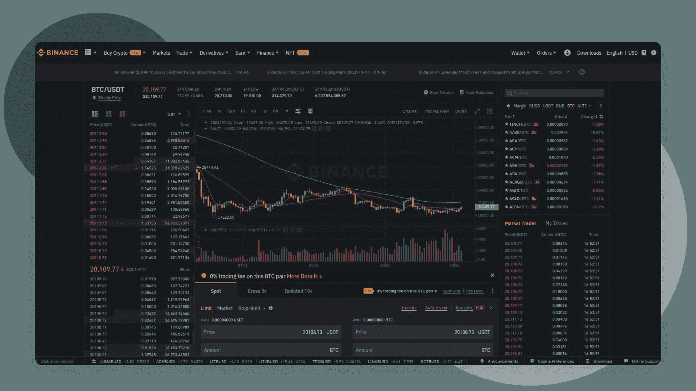

然而，有一个(或两个)警告。币安*是否提供使用算法来自动化特定类型交易的交易工具。例如，如果您决定进行期货交易或者想涉足现货交易，这两种交易都会带来额外的风险，那么您可以设置一个网格交易策略，该策略可以根据您建立的预定义参数自动执行这些过程，从而自动进行买卖。*

***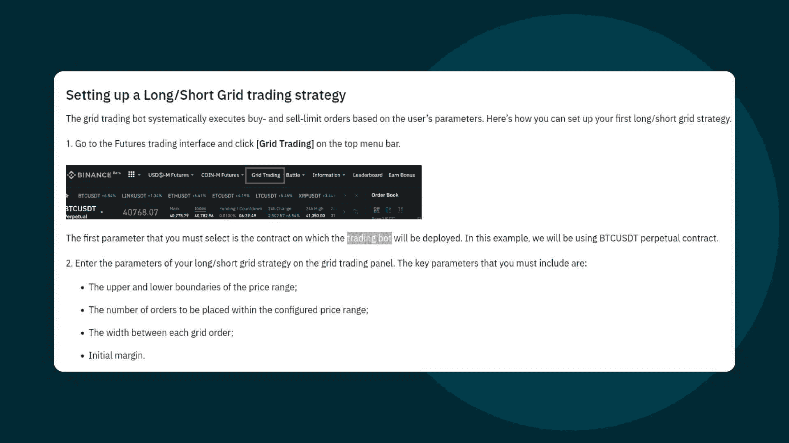

* 

*但是在币安的网站上，除了现货和期货的网格交易之外，你找不到任何关于机器人的信息。*

## *面向初学者的币安加密交易机器人*

*现在让我们假设你是密码新手，并且一直在尝试用手动交易来为市场计时。如果你只是想让你的加密交易自动化，而没有期货和现货交易带来的麻烦，那么你需要把目光投向币安以外的交易机器人。不过，幸运的是，有一系列选项可以创建定制的交易机器人，然后连接到你的币安账户。币安通过提供 API 密匙使交易机器人与其交易所的连接过程变得天衣无缝。*

*不过，有一个问题。市场上的大多数机器人都是通用的黑盒选项。你不知道是谁创造了它们。你不知道他们是密码专家还是仅仅是兼职的程序员。而且你不能确定你正在使用的机器人没有被成千上万的其他人使用——就潜在回报而言，不是很透明或有前途。最糟糕的是，这些通用机器人极不可能满足你在投资目标和 [风险承受能力](/blog/diversify-your-crypto-portfolio)。但是有经过验证的、透明的、可定制的替代方案。*

*在接下来的文章中，我们将介绍加密交易机器人的诸多优势，如何使用 Trality 最先进的工具创建它们或在 Trality 的市场上租赁它们，最后，如何快速轻松地将它们连接到您的币安账户，以利用自动化交易的诸多优势。*

## *什么是币安加密交易机器人？*

*简单的答案是，**币安交易机器人**是你在币安连接并使用的交易机器人。你可以使用通用的匿名机器人，并将其连接到你的币安账户，或者你可以使用 Trality 的创建工具来创建(或租赁)定制的机器人，以满足你的个人需求——使用 Trality 的创建工具[初学者规则生成器](/blog/rule-builder-trading-bot)、[Python 编码员代码编辑器](/blog/build-python-trading-bot)或面向所有人的市场——然后在币安上部署你的机器人。*

*最精彩的部分？注册币安是免费的，在 Trality 上创建一个机器人也是免费的。*

*一旦你创建了免费的币安交易机器人，你将成为 10%的聪明交易者之一，从自动化交易的诸多优势中获利。通过 24/7/365 与加密货币交易所直接通信，并根据您在机器人创建过程中建立的条件代表您下订单，只要经过正确优化，您的币安交易机器人每次都会优于人工交易。Trality 甚至有一个强大的专有优化器来帮助您获得最佳结果(更多信息见下文)。*

## *币安密码交易机器人是如何工作的？*

*作为第一步，你会想了解加密交易机器人的机制，这将确保你可以充分利用它的许多优势。*

*那么什么是活动部件，它们实际上是如何工作的呢？自动交易机器人与[加密交易所](/blog/best-crypto-exchanges)通信，并根据预定义的设置下单。他们的众多优势包括非凡的速度和效率，更少的错误，以及不带感情色彩的交易。*

*要让机器人在币安这样的交易所交易，它们必须被授权通过 API 密匙(应用程序接口)访问你的账户。但是，您可以完全控制—可以随时授予或撤销访问权限。*

*概括地说，交易机器人在四个基本阶段工作:*

***数据分析>信号产生>风险分配>执行***

*   *数据为王，这就是为什么**数据分析**对加密交易机器人的成功至关重要。与人类不同，[机器学习](/blog/machine-learning-in-trading)支持的软件可以更快、更智能、更好地识别、收集和分析海量数据。*
*   *一旦数据分析完成，由机器人产生的信号基本上完成了交易者的工作，根据市场数据和技术分析指标进行预测和识别可能的交易。*
*   ***风险分配**是机器人根据交易者设定的一组特定参数和规则来分配风险，通常包括交易时如何以及在何种程度上分配资本。*
*   ***执行**是基于预先配置的交易系统产生的信号，对加密货币进行实际买卖的阶段。在这一阶段，信号将生成买入或卖出指令，通过它们的 API 发送到交易所。*

*既然我们对这个过程本身有了更清晰的认识，那么是时候用 Trality 创建一个加密交易机器人了。*

## ***如何为币安创建一个交易机器人***

*重要的事情先来。为了使用 Trality crypto 交易机器人在币安上交易，你需要在这两个平台上都有账户。只有这样，您才能使用 API 密钥连接这两个帐户。*

*   *第一步:创建一个币安账户*
*   *步骤 2:创建一个旅游帐户*
*   *步骤 3:创建或租用一个带有 Trality 的加密交易机器人*
*   *步骤 4:使用 API 密钥连接您的 Trality 和币安帐户*

## ***创建一个免费的币安账户***

*你需要做的第一件事是创建一个币安账户(如果你还没有的话)。对绝大多数人来说，注册币安是一个快速而轻松的过程，所以你应该在几分钟内就可以完成。(我们甚至对币安进行了全面的评估，涵盖了交易的所有方面，包括创建账户。)*

***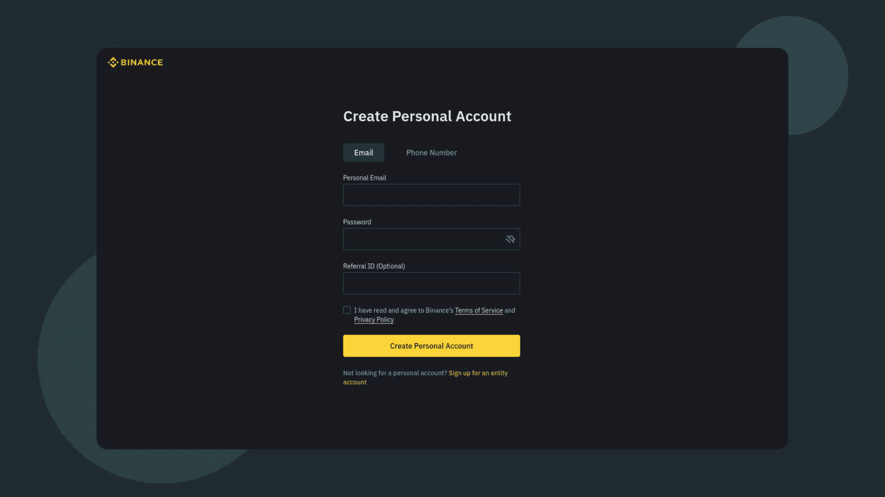

* 

*您可以在[币安 App](https://www.binance.com/en/support/faq/360042718372) 、[币安网站](https://www.binance.com/en/support/faq/115003764911)或[币安桌面 App](https://www.binance.com/en/download) 用您的邮箱或电话号码注册一个币安账户。*

*一旦你输入了一些基本信息，你就会被要求通过[一个简单的 KYC 过程](/blog/kyc-crypto-meaning)来确认你的身份，这通常包括一张政府颁发的带照片的身份证以及一张自拍照和电话号码(这个过程可能会因你的位置和国籍而略有不同)。批准本身通常在几分钟内发生。*

*概括来说，以下是在币安上创建账户的步骤:*

*   *第一步:注册账户*
*   *步骤 2:完成验证*
*   *第三步:存款加密*
*   *第四步:购买密码*
*   *第五步:探索币安产品*

*现在，你可能已经有了一个旅游帐户。但是，如果您没有，我们将快速运行这些步骤来免费创建一个。然后你就可以开始创建你的第一个币安交易机器人的有趣工作了！*

## ***创建免费旅游账户***

*用 Trality 创建一个免费账户甚至更容易，因为它不涉及任何 KYC。首先输入您的电子邮件并创建密码。*

***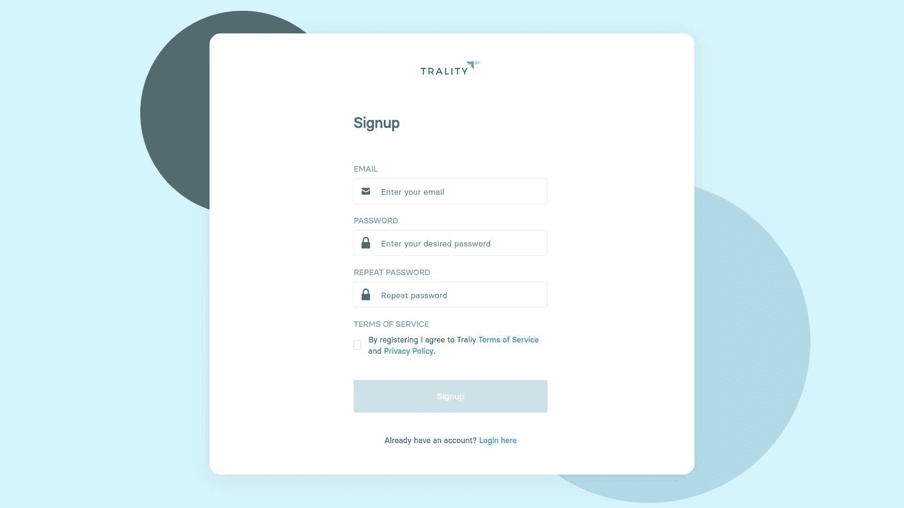

* 

*您将被要求验证您的电子邮件地址。*

***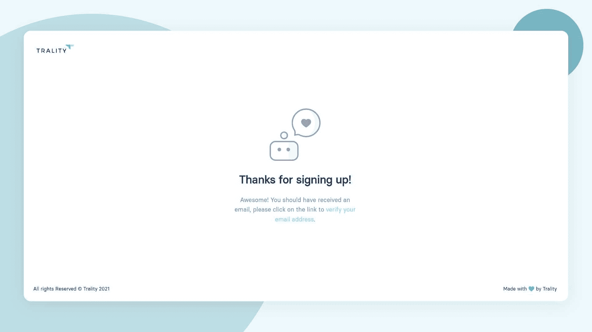

* 

*还有一个简短的调查(3 个问题)。*

***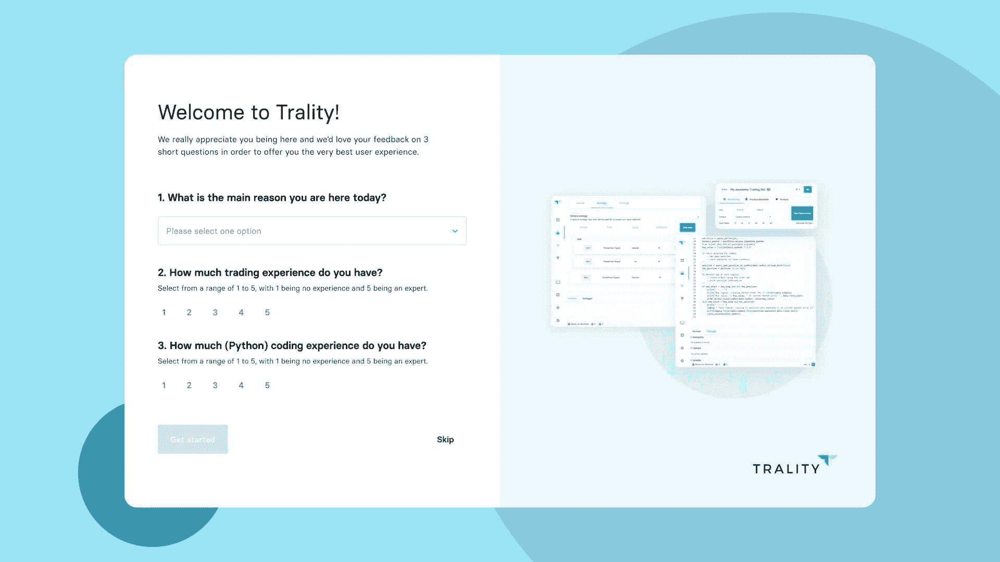

* 

*你已经准备好了！你可以立即开始创建你的币安机器人。*

***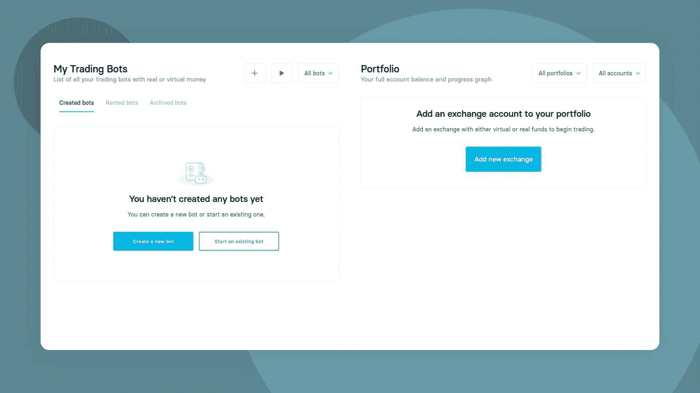

* 

*或者从我们的市场租赁一个定制的机器人，并将其直接连接到您的币安帐户，从而节省时间。*

***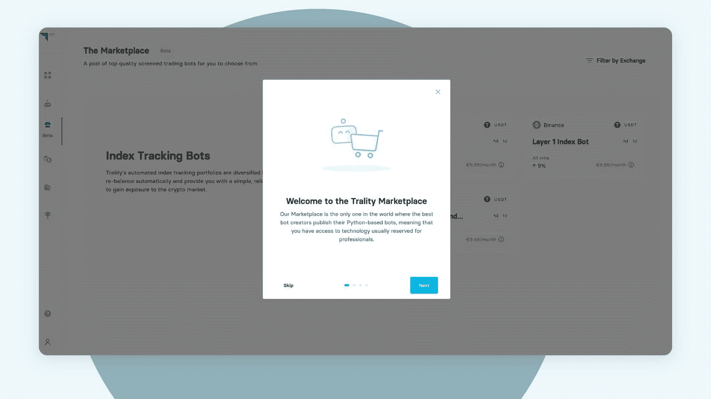

* 

## ***创建一个 Trality 加密交易机器人或租赁一个***

*Trality 提供创新的、最先进的工具来创建完全可定制和完全灵活的[加密交易机器人](/blog/different-types-of-crypto-trading-bots)，无论您是对编码不感兴趣的新手，还是正在搜索最先进的 [Python 机器人创建工具](/blog/algorithmic-trading)的 Python 专家。*

### ***Trality 的规则生成器***

*Trality 的规则构建器是为几乎没有编码经验的密码交易员设计的。其简洁、优雅的设计意味着用户可以使用专业级工具快速、轻松地将其交易想法转化为盈利策略。*

 *查看 Trality Rule Builder，这是一个最先进的工具，允许你创建自己的加密交易机器人，而无需编写任何代码。

[https://www.youtube.com/embed/ugtCnc-wW7s](https://www.youtube.com/embed/ugtCnc-wW7s)

<button type="button" class="chakra-button css-1hnfsz">Try it for FREE</button>*

*凭借其直观的图形用户界面，规则构建器是一个简单而强大的基于规则的机器人创建编辑器，允许交易员通过拖放基于布尔逻辑的技术指标来构建和自动化算法交易机器人。有 100 多个技术指标可供选择，以及各种预定义的策略，交易者可以根据自己的个人需求轻松定制他们的机器人。*

*一旦达到了预期的设置，交易者就可以用 Trality 的快速回溯测试工具分析他们的策略，该工具使用各种常用的统计数据来衡量 1)表现(例如，利润和损失；总回报；每次成功交易的平均利润)，2)风险/回报(例如，波动性；夏普比率)，以及 3)运行(例如，最大压降；水下时间)。*

### ***Trality 的代码编辑器***

*[Trality 最先进的代码生成器](https://www.trality.com/creator/code-editor)是世界上第一个基于浏览器的 Python 代码机器人编辑器。它是为有经验的交易者设计的，他们想用最新的技术开发复杂的交易算法。*

*[https://www.youtube.com/embed/tOBKjEaufmk?feature=oembed](https://www.youtube.com/embed/tOBKjEaufmk?feature=oembed)*

*Python 程序员使用代码编辑器的各种强大工具和创新特性来创建和回溯测试他们的算法，会感觉像在家里一样。具有智能自动完成功能的浏览器内编辑以及浏览器内调试为交易想法的发展及其最终实现为盈利的交易机器人提供了一个无缝的过程。*

*凭借全面的技术分析指标和越来越多的库，包括 NumPy，[代码编辑器为基于各种市场条件和各种短期和长期交易目标定制机器人提供了最大的灵活性](/blog/build-python-trading-bot)。*

*极快的浏览器内回溯测试也意味着测试和微调算法可以快速轻松地完成。受益于清晰的版本控制和回溯测试历史，同时还可以通过易于使用的 API 访问财务数据。我们强大的新优化器将帮助您自动优化 Python 机器人的参数。*

*[https://www.youtube.com/embed/qVvSQ5obtEk?feature=oembed](https://www.youtube.com/embed/qVvSQ5obtEk?feature=oembed)*

### ***旅游市场***

*[Traliy 的 Marketplace](https://www.trality.com/marketplace) 是一个独一无二的空间，它将密码交易机器人的创造者和投资者聚集在一起，以实现互利的目的。与其他匿名机器人制造商和未经证实的机器人平台不同，Trality 的市场是一个专业策划的空间，有精心挑选的创造者和最佳机器人。*

***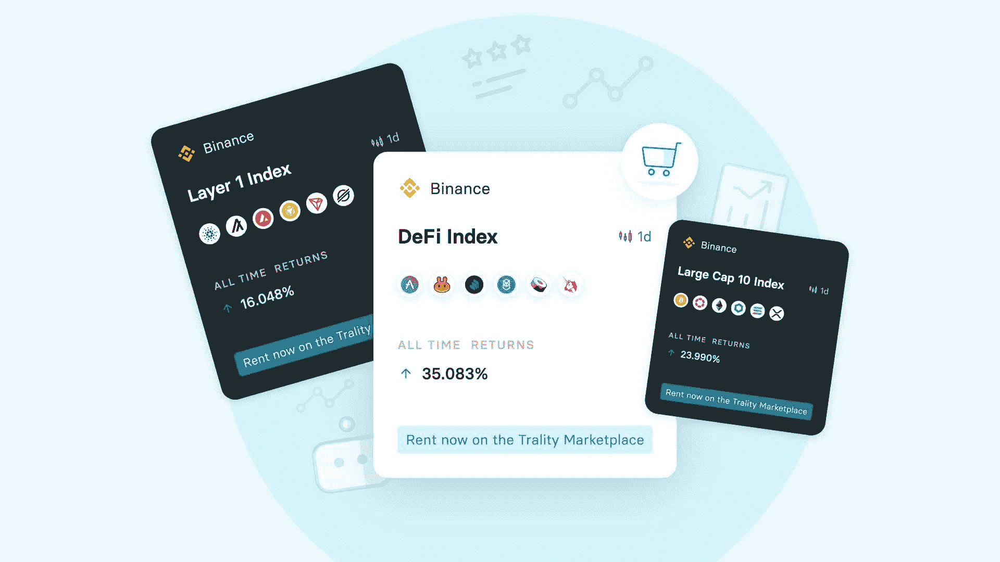

* 

*The Trality Marketplace*

*Trality 市场上的所有机器人都必须通过我们的**机器人选择委员会**的严格筛选过程，该委员会由拥有数十年集体经验的行业专家组成。*

*为市场选择机器人时使用的关键指标包括风险调整后的回报、最小交易活动和水下时间。由于加密市场是一个不稳定的市场，所有的机器人都在不同的市场条件下进行回溯测试，如牛市，熊市和横向市场制度，以确保一致的回报。*

*正是这种对透明 bot 评估过程的坚定承诺，将 Trality 的市场与一般的黑箱替代品区分开来。*

***投资者**可以根据特定的风险容忍度(低、中、高)和个人投资目标租赁盈利机器人。有一整套指标可供使用，允许投资者根据清晰、可量化的数据来决定机器人。*

*每当 bot 发生更改时，实时接收更新。如果一个机器人表现不佳，投资者可以随时取消对它的关注，选择另一个机器人。只需点击几下，投资者就可以通过租赁市场上最值得信赖的机器人来轻松利用专业人士的专业知识。*

## ***将您的 Trality 加密交易机器人连接到币安***

*创建或租赁了一个加密交易机器人后，下一步是将它连接到你的币安账户。在您的 Trality 仪表盘中，只需导航至位于仪表盘左侧的“ **Funds** ”，并将币安添加为交易所。*

***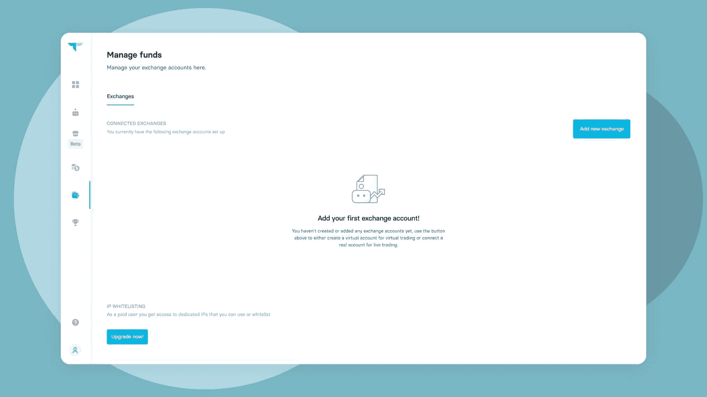

* 

*选择右侧的**添加新交易所**，选择币安，弹出如下菜单。*

***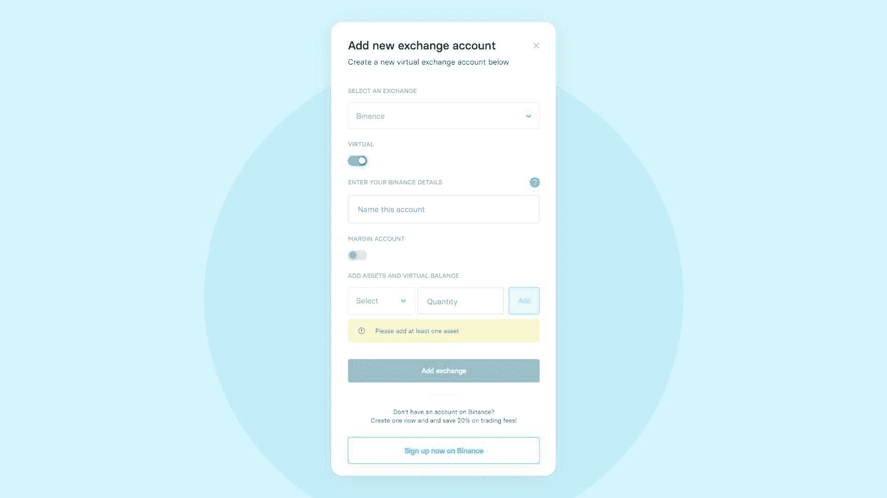

* 

*选择您是否要为您的币安帐户添加虚拟交易帐户(模拟)或真实帐户(真实货币)。*

***注意**:如果你想添加一个实时账户，那么你需要事先在币安上准备好 API 密匙(可能还有密码)。查看我们关于[如何链接你的币安&币安的专门文章。使用 API 键](https://trality.zendesk.com/hc/en-us/articles/4402190975122-How-to-link-your-Binance-Binance-US-account-to-Trality-with-an-API-key)访问 Trality 的用户帐户，获取分步说明。币安有一本关于[如何生成 API 密匙和密码短语](https://www.binance.com/en/support/faq/360002502072)的便利指南。*

*有了新的币安交易所的资金支持和与 Trality 的链接，您的交易机器人的实际部署只需点击几下鼠标。*

*在仪表板左侧的"**机器人"**中，选择您希望部署的机器人。*

*选择你刚才链接的币安账户后，你会收到几个问题。通读它们，然后确认您希望部署 bot。*

*恭喜你，你现在拥有了一个由 Trality 创建的免费币安交易机器人！*

## ***币安交易机器人的好处***

*据保守估计，大约 90%的密码交易商亏损。大多数交易者甚至在交易的第一年就退出了！*

*残酷的事实是，无论是在币安还是其他加密货币交易所，如果你手动交易，那么你就在赔钱。你对手动交易了解得越多，你就会越认识到，当有其他更有效(即有利可图)的解决方案时，手动交易根本不是最好的交易方式。加密交易机器人在投资的几乎所有方面都优于人工交易者。*

*虽然交易结果不佳有很多原因，但交易者犯的最大错误之一是没有利用自动交易机器人的力量。如果这听起来像是新技术，那么你可能会惊讶地发现，华尔街几十年来一直在使用自动化的算法交易系统*。比起在密码市场巨大的、有时不可预测的波动中试图让[成为一个有纪律的交易者](/blog/staying-disciplined)，它们更快、更可靠、更有利可图。**

**以下是用 Trality 构建的币安加密交易机器人的一些主要优点。**

### ****加密交易机器人和缺乏情感****

**如前所述，旧的统计数据显示，超过 90%的私人投资者根本没有赚钱。事实上，由于各种各样的原因，他们正在赔钱。在加密货币市场的疯狂过山车上，很难不情绪化，交易者倾向于获得 FOMO(害怕错过)或 FUD(害怕、不确定和怀疑)，这导致他们做出不是基于艰难数学计算的决定，特别是当[加密市场崩溃](/blog/which-cryptocurrencies-will-survive-market-crash)或[加密冬天](/blog/crypto-winter-a-buyers-market)冻结一切的时候。**

**机器人根本没有情感，因此只使用冰冷、坚硬的数据来做出选择，通常它们是对的。**

**而不是 80-90%的失败者。你可以做出改变，成为少数利用自动交易的力量投资获利的交易者之一，即使是在熊市期间。**

### ****加密交易机器人和速度****

**正如我们之前提到的，在任何给定的时刻，机器人执行的交易都比你多得多。这对任何知道快速进出头寸是盈利和亏损的区别的交易者都是有益的。你开始明白为什么华尔街机构几十年来一直使用这项技术了吗？事实上，[自动化正在以新的令人兴奋的方式推动金融科技向前发展](/blog/automation-transforming-fintech)，自动化交易是等式的重要组成部分。**

### ****加密交易机器人和纸质交易(或虚拟交易)****

**这是机器人交易员相对于人工交易员的最大优势之一。在 Trality 上，你可以自动化你的策略，构建一个机器人*并根据历史数据对其进行回溯测试，直到你满意为止。事实上，你也可以通过我们令人敬畏的虚拟交易功能在当前数据上测试它，该功能允许你在虚拟环境中运行你的机器人，因此不会让你的宝贵加密货币冒任何风险。***

**为什么这如此重要？好吧，你可以测试和改进你的机器人，直到你确信它能执行为止。**

### ****加密交易机器人和风险分散****

**在密码市场没有快速致富的方法。除非，你有爱尔兰人的运气。交易机器人不是赚钱机器，而是将你的风险最小化，而不是寄希望于大赌注。在不同的符号上运行几个交易机器人可以让你分散与你的策略相关的风险，尝试不同的技术，同时保证你的资产安全。**

### ****加密交易机器人和纪律****

**要想在生活中有所成就，你需要自律。但说起来容易做起来难，尤其是在交易方面。自动化你的策略将帮助你在你的投资上获得某种形式的纪律，因为你不会去做它——你预先训练的机器人会处理它。**

## ****最终想法****

**知识就是力量。当然，这可能是陈词滥调，但这是真的。如果你不小心，当交易 crypto 时，你可能很容易失去你的衬衫甚至得到 rekt，但是有安全措施可以将风险交易转化为盈利交易。**

**通过向您的币安交易账户添加定制的自动化交易机器人，加入数百万聪明的交易员的行列，利用欧洲领先的金融科技公司之一的集体知识和经验。Trality 提供创新、强大的技术，将专业级工具带给每一个需要它们的人。**

**由于我们位于奥地利，我们非常注重细节。实际上，我们痴迷于细节，这意味着你可以绝对有信心选择当今市场上性能最好的机器人。**

**但是不要相信我们的话。将它们连接到你的币安交易账户，自己去看看吧！**

**<button type="button" class="chakra-button css-1hnfsz">Start creating</button>**