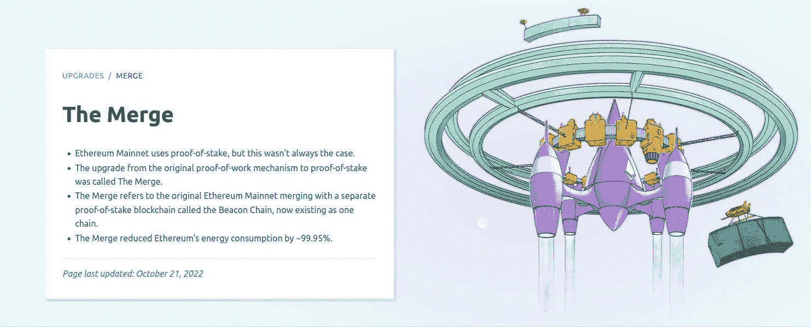
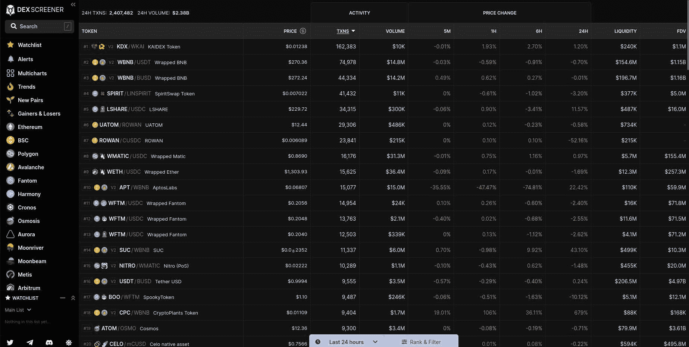
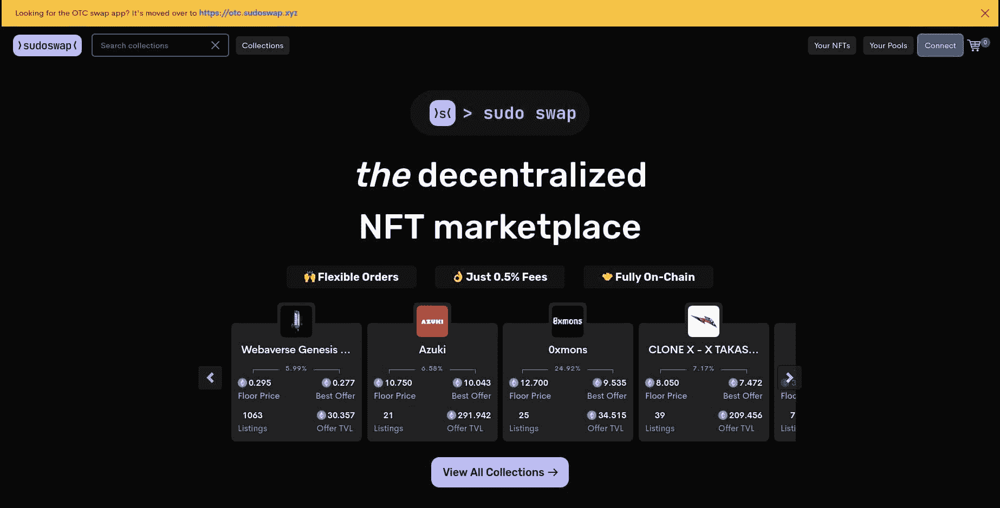
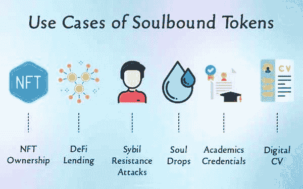
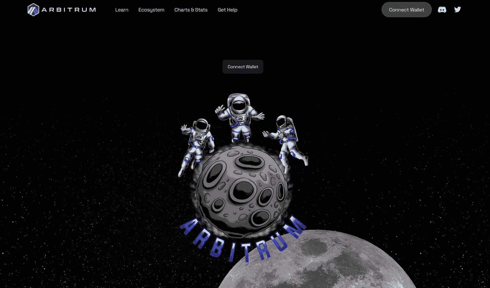
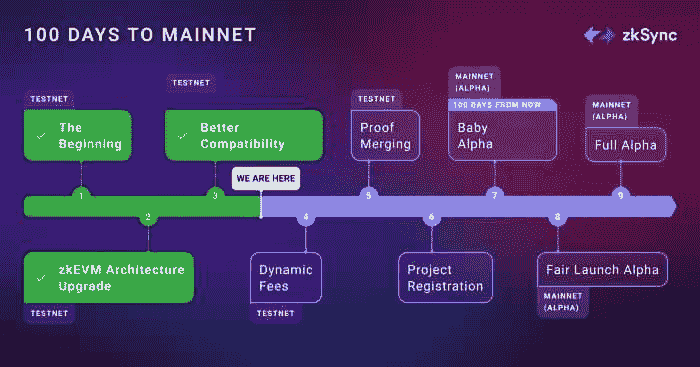
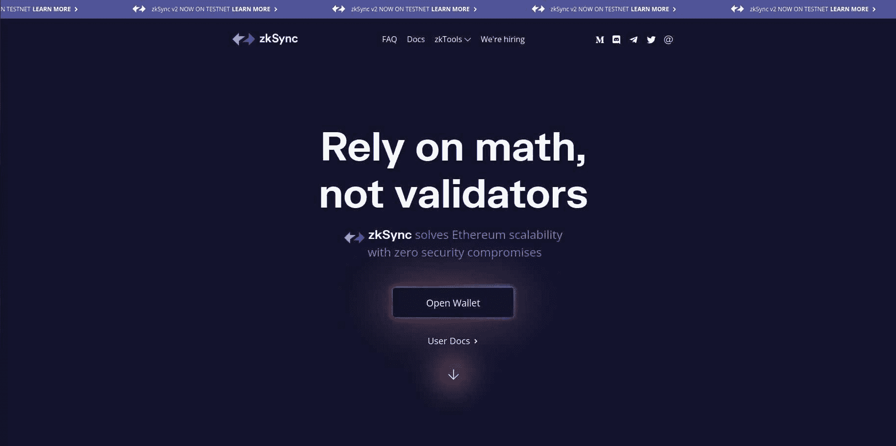
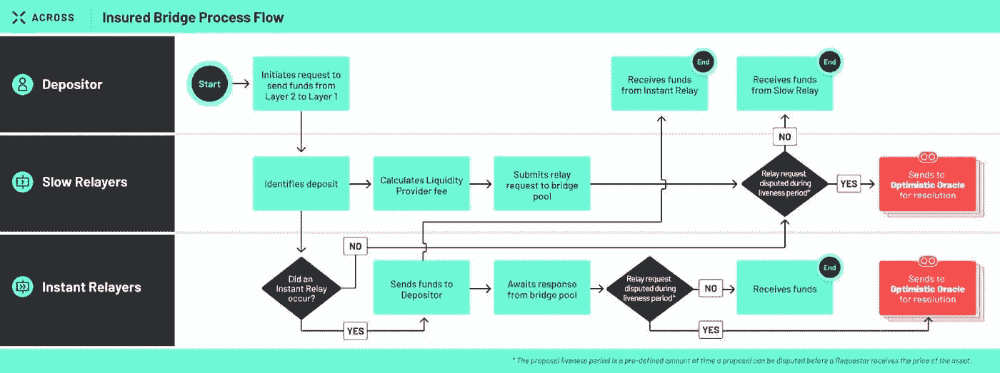

# 2022 年最佳新加密项目

> 原文：<https://www.trality.com/blog/new-crypto-projects/>

啊，后知后觉的力量。当我们反思过去时，我们经常以完美的眼光看待，这就是为什么如此多的文章和博客帖子预测下一个最热门的加密硬币或项目可能会在发布或发表后几个月甚至几周内落空。

这种列表的一个问题是，它们变成了任意的、不经思考的练习(“其他人都在做，所以让我们列出自己的列表”)。然而，加密的世界有它自己的逻辑和节奏，这就是为什么我们所有人都应该在一年中密切关注新项目的原因之一。

当我们接近公认残酷的 2022 年时，这是一个很好的机会来盘点今年一些更有前途的加密项目，其中许多都与以太坊有关。鉴于加密领域瞬息万变的事实，您应该记住，其中一些项目的总体优势或劣势可能会发生变化，而另一些项目则正好相反。

在下面的文章中，我们将看看 2022 年的一些更重要、突出或有新闻价值的加密项目。会有一些熟悉的面孔，尤其是那些读过我们关于 [今年最值得投资的加密货币](/blog/best-cryptocurrencies-to-invest-in/)(提示:以太坊不止一次被提及)，以及一些惊喜，即使是经验丰富的加密老手。

## **合并**

这里没有惊喜。任何远程连接到加密空间的人都知道[合并](https://ethereum.org/en/upgrades/merge/)，以太坊的主要网络升级从工作证明机制到利益证明机制，或者如以太坊基金会所描述的“以太坊历史上最重要的升级”。然而，尽管它很重要，以太坊的[价格在历史性升级后的几天内下跌了 15%](https://www.cnbc.com/2022/09/20/ether-eth-drops-15percent-since-ethereum-merge-as-traders-take-profits.html) 。

那么，为什么要大惊小怪呢？根据[以太坊](https://ethereum.org/en/upgrades/merge/#what-is-the-merge)，

> “合并是以太坊的原始执行层(自[创世纪](https://ethereum.org/en/history/#frontier)以来就存在的 Mainnet)与其新的利益相关共识层(Beacon Chain)的结合。它消除了对能源密集型采矿的需求，取而代之的是使用 staked ETH 确保网络安全。这是实现以太坊愿景的真正激动人心的一步——更高的可扩展性、安全性和可持续性。”

尽管事实上有太多的节能加密项目，但加密技术的名声并不好，因为它被认为对环境有害。在以太坊的案例中，这一转变预计将导致为其区块链供电的能源总量减少 99.9%，这相当于从 112 太瓦小时/年下降到 [0.04 太瓦小时/年](https://www.economist.com/finance-and-economics/2022/09/06/the-future-of-crypto-is-at-stake-in-ethereums-switch)。又变了？再见了，矿工，他们已经被验证者取代，或者那些持有 32 ETH 或更多股份的人，他们不能被买卖。

以太坊的下一次重大升级被称为上海升级，预计将于 2023 年进行。敬请关注。

## **德克斯筛选员**

如果你正在寻找一个强大的屏幕，可以让你扫描最大范围的硬币，区块链和 DEXes，看看没有比 [DEX Screener](https://dexscreener.com/) 更远。它不仅可以完全免费使用，而且不需要注册，不需要 KYC，也不需要登录钱包。

你可能会问，什么是密码筛选程序？顾名思义，加密扫描仪是一种扫描加密货币上公开可用数据的工具。通过在组合中添加一个 DEX screener，您将拥有分散交换中的所有加密相关数据，让您可以在一个方便的位置访问强大的分析。虽然该项目始于 2021 年末，但我们将它拖到了本年度，因为年底新项目的活动和市场认知度充其量也是有限的。

从他们的界面可以看出，DEX Screener 是为绝对热爱数据的人准备的。它包括 1000 多枚硬币和代币的价格，并涵盖了所有扫描仪中最大的索引选择。根据通常的指标分析密码和链，如价格、交易量、[市值](/blog/what-does-market-cap-mean-in-crypto)、流动性、交易量、价格变化(5M、1H、6H、24H)——所有这些指标都具有可定制的排名和过滤功能，并且可以免费访问[技术分析](/blog/fundamental-analysis-and-technical-analysis)指标和图表。用户甚至可以受益于 DeFi 相关的数据，包括令牌对的池数据；创建观察列表；设置警报；现货指数市场趋势；设计多种图表进行价格比较；跟随新的组合。

有了所有这些免费数据，球就在你的球场上！

## **Sudoswap**

延续去中心化的精神，接下来我们有 [Sudoswap](https://sudoswap.xyz/#/) ，一个基于以太坊的去中心化 NFT 市场。如果您使用 OpenSea 满足所有与 NFT 相关的需求，那么您会惊讶地发现 Sudoswap 的工作方式完全不同。在 OpenSea 中，交易是通过离线的订单簿模型完成的，而 Sudoswap 使用流动性池来买卖 NFT。

今年夏天，Sudoswap 宣布他们一直在忙着建立一个全新的 NFT 市场[，由他们的 SudoAMM](https://blog.sudoswap.xyz/deep-dive-1-sudoamm-vs-the-other-amms-they-told-u-not-to-worry-about.html) 驱动，据他们称，这将改变 NFT 交易者的买卖方式。功能包括以下内容:

*   新 NFT 市场收取 0.5%的礼宾费，归礼宾部所有。用户可以在一次批量交易中购买和出售他们的 NFT，有助于节省汽油。
*   该市场是连锁的，这意味着任何人都可以展示 Sudoswap 上列出的商品，这增加了它的分散化(像 DAOs 这样的连锁集团将更容易参与 NFT 市场)。
*   灵活的智能合约允许卖家随时进行调整

Sudoswap 有三种类型的流动性池:只买池、只卖池和买卖池。现在，每个池都可以有两条结合曲线之一，或者是线性曲线，价格以线性方式上下波动，或者是指数曲线，价格在发生时以一定的百分比上下波动。

为了实际买卖 NFT，你需要导航到他们的[市场网站](https://otc.sudoswap.xyz/#/)并连接你的钱包。用户只需为批准和交换支付汽油费用，无需交易即可创建订单。你可以用 ERC20、721 和 1155 的任意组合进行交易，资产会留在你的钱包里，直到双方同意互换。

## **灵魂绑定令牌**

对于一些处于 Web3 开发前沿的人来说，目标是灵魂。首先由以太坊梦想家 Vitalik Buterin 与 Puja Ohlhaver 和 E. Glen Weyl 一起提出，所谓的“灵魂绑定令牌”(SBT)本质上是指不可转让的数字令牌，如果他们的愿景得以实现，将包含个人在去中心化社会中的社会身份。

Source: Cryptotimes.io

事实上，三人在 2022 年 5 月共同撰写了一份题为“[去中心化社会:寻找 Web3 的灵魂](https://papers.ssrn.com/sol3/papers.cfm?abstract_id=4105763)”的白皮书，其中他们描述了一个去中心化社会(DeSoc)，在这个社会中，自治用户可以在生活的各个方面使用灵魂绑定令牌(SBT)作为个人凭证。

正如 Buterin、Ohlhaver 和 Weyl 在他们白皮书的摘要中解释的那样，

> “今天的 Web3 以表达可转移的金融资产为中心，而不是对信任的社会关系进行编码。然而，许多核心经济活动——如无抵押贷款和建立个人品牌——都是建立在持久的、不可转让的关系之上的。在本文中，我们说明了代表“灵魂”的承诺、凭证和从属关系的不可转让的“灵魂绑定”令牌(SBT)如何能够对实体经济的信任网络进行编码，以建立出处和声誉。更重要的是，SBTs 支持其他不断增长的应用，如社区钱包恢复、抗 sybil 治理、去中心化机制和具有可分解共享权利的新市场。我们将这种更丰富、多元化的生态系统称为“去中心化社会”(DeSoc)——一种共同决定的社会性，在这种社会中，灵魂和社区自下而上地走到一起，作为彼此的新兴属性，在一系列规模上共同创造多元的网络商品和智能。”

代币本身并不是为买卖而设计的，对这一想法的研究正在进行中，但可能的使用案例包括医疗记录、数字身份证或会员资格，以及证明个人的工作历史或教育证书等。

从一开始，加密空间就有令人兴奋的理想主义，看看 SBTs 是否能在 2023 年及以后获得牵引力将会很有趣。

## **仲裁员**

以太坊是昂贵的天然气费和低交易速度的代名词，这就是为什么 Offchain Labs 在 2022 年初开发了 [Arbitrum](https://bridge.arbitrum.io/) ，这是一种第二层(L2)汇总技术，提供高速以解决可扩展性问题。

在他们对 Arbitrum 的温和介绍中，项目背后的开发团队以如下方式描述了它，

> “Arbitrum 是一个设计用于扩展以太坊的技术套件。你可以使用 Arbitrum 链做你在以太坊上做的所有事情——使用 Web3 应用程序，部署智能合同等。，但是你的交易会更便宜更快。我们的旗舰产品 Arbitrum Rollup 是一种乐观的 Rollup 协议，继承了以太坊级别的安全性。”

其被吹捧的优势包括低成本、良好的生态系统、强大的开发工具和高 EVM(以太坊虚拟机)兼容性。Arbitrum 被视为“乐观汇总”，这意味着它使以太坊的智能合约能够通过在智能合约和 Arbitrum 第二链层之间发送消息来扩展，交易处理在第二层(L2)完成并存储在主链上，从而提高了流程本身的效率和速度。

Arbitrum 在 2021 年 5 月底推出了测试版，一年多后，在 2022 年 8 月，Arbitrum Nitro 更新上线。

然而，随着以太网的上述合并，Arbitrum 已经失去了一些存在的理由，但它仍然是 2022 年的一个重要的加密项目。

## 第二层:zkEVM 和 zkSynch

有两种类型的汇总，乐观汇总(如上面提到的 Arbitrum)和零知识汇总或 Zk 汇总。据该领域的许多人说，以太坊可扩展性问题最令人兴奋的答案之一是所谓的零知识以太坊虚拟机(zkEVM)。

Source: www.matter-labs.io

[什么是 zkEVM，为什么它很重要](https://docs.zksync.io/zkevm/#what-is-zkevm-and-why-is-this-a-big-deal)？很高兴你问了。让我们从谚语中直接得到答案:

> “zkEVM 是一个虚拟机，它以一种与零知识证明计算兼容的方式执行智能合约。它是构建 EVM 兼容的 ZK 汇总的关键，同时保留了经过战斗考验的代码和多年与 Solidity 合作后获得的知识。我们的 zk-EVM 保持了 EVM 语义，但也是 zk 友好的，并采用传统的 CPU 架构。”

另一个难题是 zkSynch 2.0，这是一个 EVM 兼容的 ZK 汇总，由 Matter Labs 开发，由 zkEVM 提供支持(1.0 版本已经用于支付)。好处包括将传输成本降低了 50 倍。

鉴于 zkEVM 和 ZkSynch 的复杂性，提供深入的解释超出了本摘要的范围，但是对细则感兴趣的好奇读者一定要看看 [zkSynch 自己的概述](https://docs.zksync.io/userdocs/intro/#introduction)以及 [zkEVM 的常见问题解答](https://docs.zksync.io/zkevm/#zkevm-faq)。

## **跨协议**

[跨协议](https://across.to/)是一个跨链桥接解决方案，支持快速、安全和经济高效的传输。更具体地说，它被描述为“一种新的桥接方法，结合了乐观的 oracle、债券中继器和单边流动性池，以提供从 Rollup chains 到 Ethereum Mainnet 的分散式即时交易”。

Source: https://blog.li.fi/

后面的团队描述了它的许多好处，特别是在速度、效率和成本节约方面。例如，在 mainnet 和 L2s 上使用资产几乎是即时的连接和可用性，用户通常可以在两分钟或更短时间内收到资金。

为了应对以太坊高昂的天然气费用，乐观的累计解决方案旨在提供一些缓解，但长时间的延迟(大约 7 天)意味着从 L2 到 L1 的转移效率低下。cross 提供的创新意味着跨越链的转移*现在可以以迄今为止不可能的速度发生。*

与之相关的费用有三种类型:

*   流动性提供商费用(由协议设定):当用户将代币从 L2 转移到 L1 时，他们可以在 L1 上获得即时流动性，而流动性提供商必须等待 bridge slow relayer 将代币从 L2 转移到 L1。
*   慢速转发费(由用户设置)。
*   即时转发费(用户自行设置):即时转发费是希望加快提现速度并产生额外费用的用户的可选选项。

总之，cross 是使用绑定中继器、单边池和 UMA 的乐观 Oracle 的桥接方法的组合，能够以低成本实现从第 2 层到以太坊的近即时、分散的资产转移。

## **最终想法**

如果我们必须选择一个词来概括 2022 年新加密项目的性质，那么它将是以太坊。从合并到扩展解决方案和其他一些介于两者之间的事情，2022 年对于以太坊来说是非常重要的一年，即使它没有反映在以太坊的价格中。

随着今年接近尾声，我们不太可能看到与去年同期类似的牛市狂热。然而，随着加密空间的不断发展和成熟，2023 年的无数新加密项目都有很大的前景。