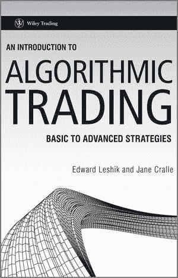
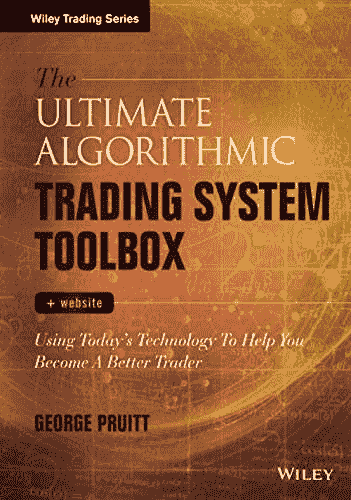
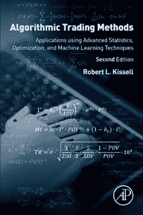
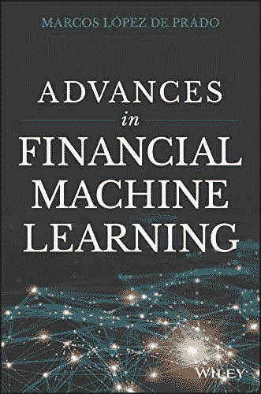
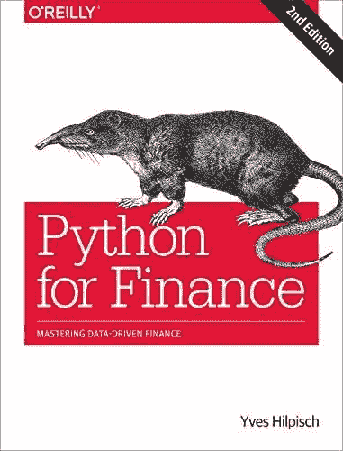
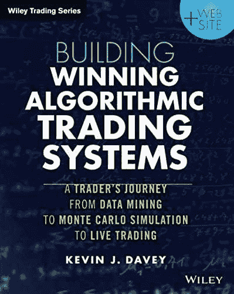
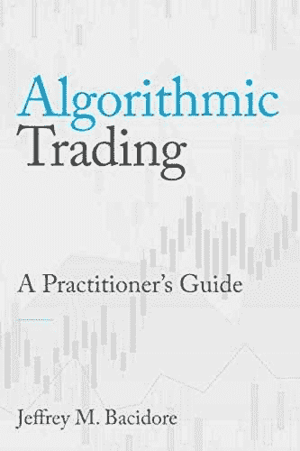
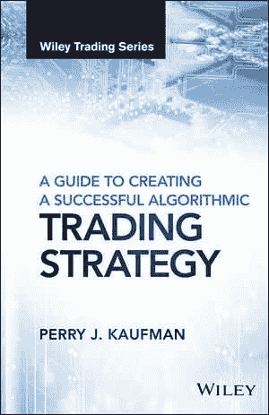

# 2022 年关于算法交易的最佳书籍

> 原文：<https://www.trality.com/blog/best-books-on-algorithmic-trading/>

现在我们都知道算法交易对投资者来说是多么有效和有利可图。在世界各地的股票市场中，*仅算法交易就占了大约 70-80%的交易量*。你没看错。

然而，绝大多数人交易密码是手动进行的，导致错过或时机不当的交易。更糟糕的是，手动交易是基于感觉和直觉，而不是数据和分析，导致代价高昂的错误和错失机会。

然而，尽管有很多好处，算法交易一开始可能看起来有点复杂。谢天谢地，如果你是一个对学习自动交易策略感兴趣的初学者，有很多优秀的书籍可以帮助你入门。对于我们中更高级的算法交易者来说，总是有新的东西要学。

## 想创建自己的交易算法吗？

查看 Trality 代码编辑器。我们举世无双的代码编辑器是世界上第一个基于浏览器的 Python 代码编辑器，它带有最先进的 Python API、众多软件包、调试器和端到端加密。我们提供私人交易中最高水平的灵活性和复杂性。事实上，这是我们在 Trality 的核心工作。

[https://www.youtube.com/embed/IO6lM4AxwEk](https://www.youtube.com/embed/IO6lM4AxwEk)

<button type="button" class="chakra-button css-1hnfsz">Try It for Free</button>

考虑到这一点，我们列出了 2022 年算法交易的最佳书籍，涵盖了所有经验水平的用户，无论你是需要基本介绍的初学者，还是希望为你的交易库添加一些额外的高级工具和技术的经验丰富的老手。

结合最近出版的和以前出版的，以下是 2022 年最好的算法交易书籍。(眼尖的读者会注意到，大多数都是由威利出版的，当谈到算法交易的书籍时，威利继续击败它。)

## 《算法交易简介:从基础到高级策略》作者爱德华·莱希克&简·克莱尔(威利)

每个人的书架(或硬盘)上都应该有涵盖基本和高级算法交易策略的东西。这也是一个罕见的壮举，当作者可以谈论交易光谱的两端时，但爱德华·莱希克和简·克莱尔已经用 [*算法交易简介*](https://www.wiley.com/en-us/An+Introduction+to+Algorithmic+Trading%3A+Basic+to+Advanced+Strategies-p-9781119975090) 。当然，它是十多年前出版的，但内容是坚实的，甚至是常青的。

初学者会喜欢算法交易的分步指南，作者用简单的英语解释了这个复杂的话题，用清晰具体的例子来说明或扩展他们的观点。随着 Leshik 和 Cralle 逐渐发展到更高级的算法交易概念和实践，也提供了上下文信息。

从算法交易的简要历史概述和术语、统计、波动和技术分析指标，到工作算法的实际例子和一些有用的附录，这本书是基础信息的极好起点，或者仅仅是对那些已经知道的人的复习。

## 乔治·普鲁伊特的终极算法交易系统工具箱

算法交易就是在正确的时间为正确的目的使用正确的工具， [*终极算法交易系统工具箱*](https://www.wiley.com/en-us/The+Ultimate+Algorithmic+Trading+System+Toolbox+%2B+Website%3A+Using+Today%27s+Technology+To+Help+You+Become+A+Better+Trader-p-9781119262978) 提供了解释和教程的平衡组合。普鲁伊特逐步引导新手算法交易者进入关键概念和想法，提供对交易关键工具的见解，以及如何利用它们为你带来优势。

虽然一些配套网站和软件对 2022 年的读者来说可能有点过时，但这本书在很多方面做得非常好。例如，你将学习如何利用交易技术，尽管没有计算机科学学位；如何评价不同交易系统的优缺点；如何停止一遍又一遍的重复同样的交易错误；以及如何利用普鲁特提供的源代码和库开发完整的交易解决方案。

是*终极*算法交易系统工具箱吗？大概不会。但是有大量有用的信息，使它成为我们名单上的一个坚实的条目。

## 机器交易:运用计算机算法征服市场

我不知道你怎么想，但我很高兴这些天能和加密市场和平相处。但是如果你有征服的冲动，那么 [*机器交易:部署计算机算法来征服市场*](https://www.wiley.com/en-us/Machine+Trading:+Deploying+Computer+Algorithms+to+Conquer+the+Markets-p-9781119219606) 可能会让你感兴趣。Chan 是一位经验丰富的交易员，拥有丰富的机构专业知识，涵盖一系列主题，从基础知识开始，迅速过渡到因素模型、时间序列分析、人工智能技术、期权策略、日内交易和市场微观结构，最后是比特币。

自 2017 年出版以来，关于比特币的部分将变得不那么相关，但这本书的优势在于它清晰地描述了使用各种工具制定自己的交易策略的过程。你还将学习对各种工具采用新的策略，并获得对交易的人性方面的看法，这在处理自动化交易策略时经常被忽视。

最后一章题为“算法交易有益身心”，这一章你怎么可能会出错呢？

## 算法交易方法:使用高级统计、优化和机器学习技术的应用

顾名思义，Kissell 的书是针对那些已经熟悉高级统计、优化和机器学习技术的高级算法交易者的。这是他出色的*《算法交易和投资组合管理的科学》* (2013)的后续，涵盖了算法交易初学者的大量领域。从这里开始，然后考虑尝试一下 [*算法交易方法*](https://www.elsevier.com/books/algorithmic-trading-methods/kissell/978-0-12-815630-8) 。

第二版包括算法交易、高级交易分析、回归分析、优化和高级统计方法的更新章节，以及交易前和交易后分析、清算成本和风险分析以及合规和监管报告要求。您将受益于 Kissell 对新投资技术、模型验证、质量和保证测试、限价订单建模和智能订单路径分析的报道。

这是一本由学者为高级算法交易者编写的综合性书籍，有 21 章，将近 600 页。它还提供了异常丰富的信息和见解。

## 马科斯·洛佩兹·德·普拉多(Wiley)的《金融机器学习的进展》

[*金融机器学习的进步*](https://www.goodreads.com/book/show/36703132-advances-in-financial-machine-learning?from_search=true&from_srp=true&qid=9Us8fZ8V6P&rank=1) 解决了自动化工具如何在金融市场中使用的一些最实际的方面。人工智能(AI)和机器学习(ML)使用大量数据进行操作，de Prado 讨论了在创建交易工具时如何最好地使用这些数据集。

现有的 ML 工具在金融领域的应用肯定会充满困难。许多这些先进的大数据工具是为了了解特定的生物系统而创建的，或者是出于纯粹的学术目的。因此，许多自动化工具在部署到市场上时无法创造利润，即使它们在经过回溯测试的环境中似乎是成功的。

至关重要的是，de Prado 通过以下措施避免了这些缺陷:

*   展示人工智能/人工智能平台如何最好地利用大数据
*   使用 ML 处理数据以获得最佳结果
*   避免当 AI/ML 不正确地应用于数据集时可能产生的假阳性
*   解决在金融算法中使用超级计算机的最佳方式

任何有兴趣在算法交易中充分利用 ML 的人都可以很容易地从 Prado 的工作中获益。弥合已建立的 ML 方法和金融应用之间的差距仍然是一个新的研究领域，这本书的作者对该领域做出了有意义的贡献。

## *Python for Finance:掌握数据驱动的金融【Yves Hilpisch 博士(O'Reilly)*

编程语言 Python 是金融软件开发领域最热门的东西，Yves Hilpisch 博士在业界被广泛认为是 Python 以及如何在金融市场中使用 Python 和其他编程环境的专家。

在 [*Python for Finance:掌握数据驱动的金融*](https://www.goodreads.com/book/show/43247984-python-for-finance?from_search=true&from_srp=true&qid=SH0S2KNHUX&rank=1) 中，Hilpisch 深入探讨了如何最好地开发 Python 编程技能，以便在算法交易领域立即投入使用。必须指出的是，这本书确实要求读者有一些编程背景，因为它侧重于如何在真实的交易环境中使用这种语言。希尔皮施还撰写了许多其他关于金融市场有效编程的书籍，包括 *Python for Finance、*Python 衍生品分析以及*上市波动率和方差衍生品*，这使他成为了某种公认的权威。

对于那些想了解更多如何在算法交易开发中使用 Python 的人，以及那些需要更多了解他们的技能如何在金融市场中有用的程序员来说，Python 对于金融:掌握数据驱动的金融是一个很好的资源。

## 凯文·j·戴维(Wiley)构建成功的算法交易系统

一句话:算法交易系统上市时必须赚钱。在 [*构建算法交易系统:一个交易者从数据挖掘到蒙特卡洛模拟再到现场训练的旅程*](https://www.goodreads.com/book/show/22675886-building-winning-algorithmic-trading-systems?from_search=true&from_srp=true&qid=UsRst8C0h9&rank=1) 中，凯文·戴维向读者展示了如何使用顶级算法系统，并确保它们符合交易者的现实需求。戴维在投身市场之前，有航空航天工程和质量保证方面的背景。

戴维多年的交易成功从技术角度来看是有价值的，但他也是一个完美的例子，证明了他的多次交易失败可以带来学习和巨大的未来利润。Davey 的书包含了大量算法交易的背景信息，以及作者自己创建的专有蒙特卡罗模拟，读者可以用来测试他们的算法。

对于任何想要一本实用、严肃的书来指导他们创建、测试并最终将交易算法部署到金融市场的人来说，*构建算法交易系统:交易者从数据挖掘到蒙特卡洛模拟再到现场培训的旅程*值得他们关注。

## 算法交易:从业者指南(TBG 出版社)

在 [*算法交易:从业者指南*](https://www.goodreads.com/book/show/54615888-algorithmic-trading?from_search=true&from_srp=true&qid=2OURCxUQKf&rank=1) *，*中，Bacidore 博士向他的读者深入探讨了在市场中使用算法的一些最重要的方面。这本书包括一系列工具的详细分析，包括，交易量加权平均价格(VWAP)，交易量百分比(POV)，单订单算法，多订单算法，配对交易和投资组合交易解决方案，时间加权平均价格(TWAP)，等等。

Bacidore 曾为高盛(Goldman Sachs)等公司开发算法交易程序，他也是纽约证券交易所(NYSE)的研究主管以及瑞士瑞信银行高级执行服务(AES)集团的研究和咨询主管。他的专业知识让他创建了一个算法交易指南，该指南将适用于成熟市场，但也适用于加密等新兴市场。

算法交易的微妙和深刻的世界是 Bacidore 的天赋最强的地方，这本书被专业交易者和大学水平的教学使用。任何想利用 Bacidore 一生的学习和经验的人都可能想更深入地了解市场上最好的算法交易书籍之一。

## 学习塞巴斯蒂安·多纳迪奥和索拉夫·戈什的算法交易

任何想进入交易的人肯定会受益于塞巴斯蒂安·多纳迪奥和索拉夫·戈什的 [*学习算法交易*](https://www.goodreads.com/book/show/48904825-learn-algorithmic-trading?ac=1&from_search=true&qid=MtyJ4OO2Zu&rank=1) 。如果你是交易的新手，或者不了解算法交易的基本原理，这本书是一个很好的起点。多纳迪奥和戈什对算法交易采取了自下而上的方法，并让读者将他们对算法交易的见解应用到市场中。

这本书首先概述了算法交易，以及它如何帮助交易者在金融市场赚钱。虽然许多人工智能/人工智能书籍从更广泛的角度看待这项技术，但*Learn Algorithmic Trading*100%专注于算法如何被用来创建有利可图的交易策略。它继续探索如何在交易中使用技术分析。介绍了基本的 ML 工具，并举例说明了如何使用 ML 来预测价格时刻。多纳迪奥和戈什随后深入研究了如何将交易策略构建到算法中，并用于现实世界的交易。

打开算法交易的大门可能会让人望而生畏，尤其是如果一个人计划创造自己的工具。随着*学习算法交易*许多最具挑战性的主题以一种容易理解的方式处理，作者带读者从理论到实际发展，最后是实际的市场交易。

## 佩里·j·考夫曼(Wiley)的《创建成功的算法交易策略指南》

对于任何想创建自己的算法交易系统的人来说，佩里·j·考夫曼的《创建成功的算法交易策略 指南》是一本必须拥有的书。在这本书里，考夫曼展示了所有的要素，这些要素让开发者找到正确的交易工具，并把它们构建成一个能持续盈利的交易策略。

除了创建可靠的算法交易策略，读者还将深入了解算法交易的起源，以及它是如何演变成今天许多专业交易者使用的工具集的。创建和测试一个成功的交易算法需要很多东西，在这本书里，考夫曼帮助他的读者从头开始建立新的策略。他还向那些想购买现有算法交易工具，但不想把钱浪费在无利可图的期权上的交易者提出建议，这些期权在实际市场中不太可能产生利润。

虽然许多算法交易书籍关注的是创建代码来操作交易策略的技术方面，但是*创建成功的算法交易策略的指南*从基础开始，这对那些不是程序员的人特别有用。但它也有话要对那些拥有创建交易算法的编码技能，但需要更多关于如何使用交易策略来创造利润的信息的人说。

## 算法交易:将理论付诸实践

好了，你知道了。一份最好的算法交易书的清单，里面有很多关于自动策略交易各个方面的无价信息。

如果你想将这些想法付诸实践，那么看看 Trality 创新的、超越市场的算法交易工具，比如我们的 **Python 代码编辑器**。通过具有智能自动完成功能的浏览器内编辑、浏览器内调试、全面的技术分析指标和越来越多的库(包括 NumPy ),代码编辑器为基于各种市场条件和各种短期和长期交易目标定制机器人提供了最大的灵活性。

对于那些几乎没有编码知识的人来说，我们的**规则构建器**是一个简单而强大的基于规则的机器人创建编辑器，它让交易员通过拖放基于布尔逻辑的技术指标来构建和自动化算法交易机器人。有 100 多个技术指标可供选择，以及各种预定义的策略，交易者可以根据自己的个人需求轻松定制他们的机器人。

## 最后的话

当你在创造有利可图的算法交易策略的旅程中前进时，永远记住交易的黄金法则:永远不要冒险超过你能承受的损失，永远要继续做你自己的研究。

如果你有任何关于算法交易的最佳书籍的推荐，但没有在我们的名单上，那么请联系我们！或者，如果你是即将出版一本关于算法交易的书的作者或出版商，请告诉我们！