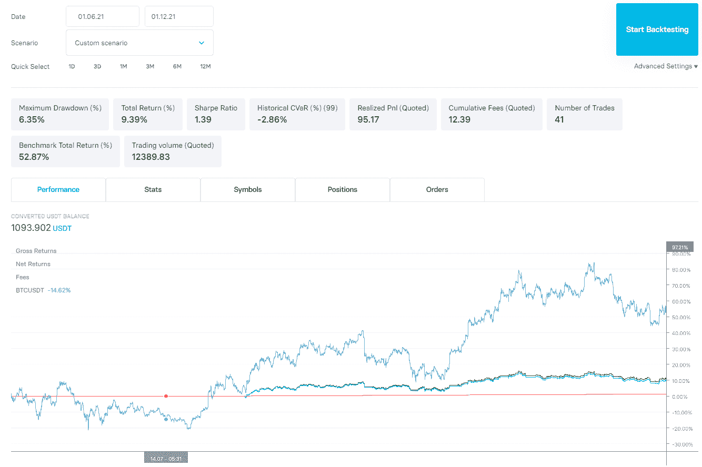
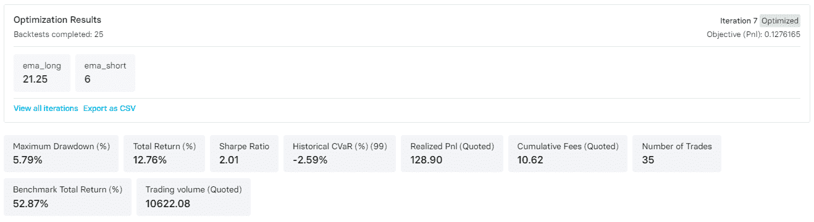
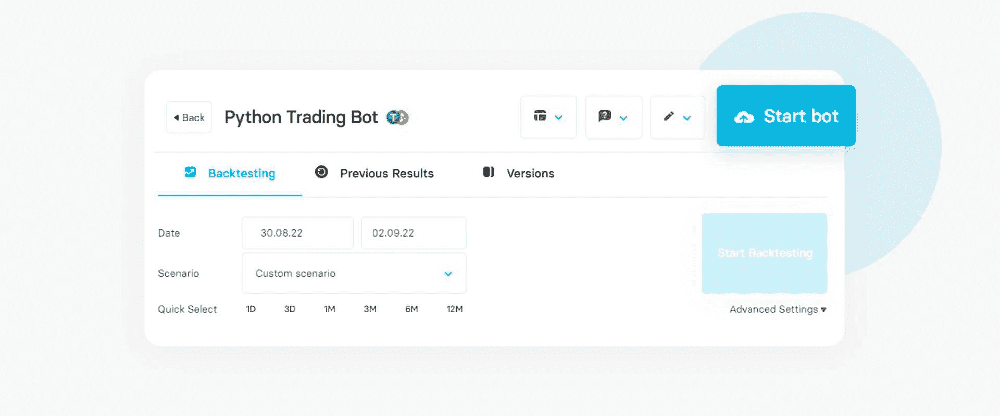
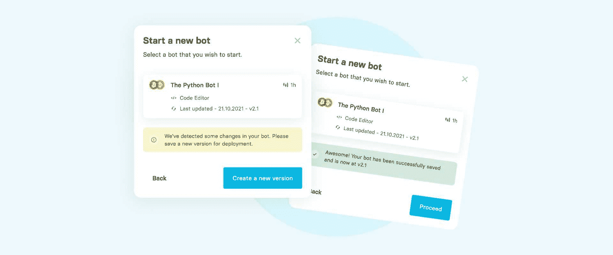
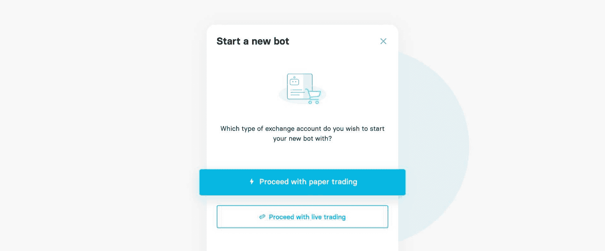
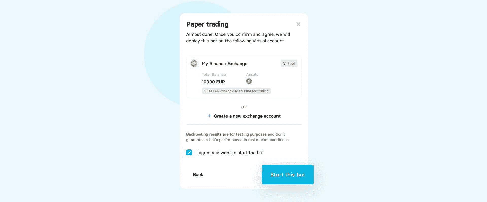

# 用于算法交易的 Python

> 原文:[https://www.trality.com/blog/algorithmic-trading/](https://www.trality.com/blog/algorithmic-trading/)

直到最近，如果你不在大型金融投资机构工作，你就没有机会接触算法交易。

然而，互联网以及随之而来的颠覆性金融科技公司和分散金融(DeFi)的崛起，通过将曾经是华尔街专属领域的专业级投资工具带到主街，彻底改变了个人投资。现在，任何拥有 Python 知识和互联网连接的人都可以设计和实现复杂的交易算法。

在本文中，我们将探索 Python 算法交易的激动人心的世界，并了解 Trality 最先进的 Python 代码机器人编辑器如何帮助您创建、回测、优化和部署实时交易的算法，无论您是希望了解更多 Python 知识的交易员还是对将您的技能应用于加密交易感兴趣的 Python 程序员。

## 想用 Python 创建自己的交易算法吗？

查看 Trality 的 Python Bot 代码编辑器——这是一个强大的基于浏览器的工具，专为希望使用算法交易机器人进行构建、回溯测试、优化和实时交易的交易者而设计。我们提供私人交易中最高水平的灵活性和复杂性。事实上，这是我们在 Trality 的核心工作。

[https://www.youtube.com/embed/IO6lM4AxwEk](https://www.youtube.com/embed/IO6lM4AxwEk)

<button type="button" class="chakra-button css-1hnfsz">Try It for Free</button>

## 为什么要用 Python 作为编程语言？

让我们从一个显而易见的问题开始:为什么要使用 Python？根据 [Tiobe 的编程语言普及指数](https://www.tiobe.com/tiobe-index/)，Python 是世界上最常见的编程语言，其次是 C、Java、C++、C#。如果您对当今广泛使用的编程语言感兴趣，那么 Python 应该是您的首选，如果您正在处理嵌入式系统，C/C++显然是个例外。以下是它变得如此受欢迎的一些原因。

### Python 对初学者来说很友好

无论是计算机语言还是外语，学习任何一门新的语言都是艰苦的工作，但 Python 不同。它相对容易学习和使用，由于其浅的学习曲线，使其对初学者和用户都很友好。它的简化，不复杂的语法意味着它更接近自然语言，使得编写和执行比其他选择快得多。它的易维护性意味着您不会在不必要的文档中浪费时间。

### Python 的支持社区

由吉多·范·罗苏姆于 20 世纪 80 年代构思并于 1991 年首次出现的 Python 得益于经受住了 30 多年的使用和现实世界的应用。自成立以来，它一直在积累知识丰富、乐于助人的程序员社区，以及令人难以置信的支持和文档。

### Python 和企业支持

无论你对企业有什么看法，它们的支持都会带来回报。脸书、亚马逊和谷歌严重依赖 Python，而从 Instagram 和 Spotify 到维基百科甚至 Reddit 的公司都在不同程度上采用了它。事实上，谷歌早在 2006 年就开始使用它了。

### Python 和高级研究

在企业领域之外，CERN 和 T2 的 NASA 都在使用 Python。想想 Python 用于简化航天飞机任务设计的灵活性吧。如果它能被用来快速、高效、准确地将巨大、沉重的金属物体送入太空(并返回)，那么它肯定能够应对创建一个盈利的算法交易系统的挑战。

## 为什么要用 Python 做算法交易？

Python 特别方便的一点是，由于它的函数式编程方法，编写和评估算法交易结构变得更加容易。事实上，对于有兴趣编写第一个或下一个密码交易机器人的交易者来说，相对容易和简单的使用是 Python 的主要卖点。

下面是 Python 是算法交易的完美选择的几个原因。

### Python 是可读和可访问的

对于刚接触算法交易的人来说，Python 代码是可读和可访问的。与其他编码语言不同，它的数量更少，这意味着使用 Python 进行交易需要更少的代码行，因为有大量的库可用。

### Python 很受欢迎

可能你已经注意到的算法平台和交易工具正在使用 Python。算法交易的文化是用 Python 语言完成的，这让你更容易合作、交易代码或寻求帮助。

### Python、并行化和能力

并行化和 Python 巨大的计算能力赋予了您的投资组合可伸缩性。与其他语言相比，在 Python 中添加新模块并使其具有可扩展性更容易。由于现有的模块，交易者可以更容易地在不同的程序之间共享功能。

### Python 和调试

Python 是一种“解释型”语言。解释器“一个接一个”地执行代码语句，不像编译器那样完整地执行代码，一次列出所有可能的错误。Python 中的调试是全面而彻底的，因为它允许对代码和数据进行实时更改，提高了执行速度，因为出现了单个错误(而不是多个错误)并且可以清除。

### Python 需要更少的代码行

Python 广泛而全面的支持库意味着大多数最常用的编程任务都已经写入其中，从而限制了要编写的代码的长度。更重要的是，Python 直接开箱即用，许多程序员将此归因于动态类型、类似伪代码的语法和 Python 解释器的组合。

## 用于算法交易的流行 Python 库

Python 不仅是免费的、开源的、易学易用的，它还有一个优秀的库可供选择，几乎可以完成所有与算法交易(以及一般的交易)相关的任务。下面，我们将根据它们的用途来浏览一些流行的库，从数据收集、数据操作、绘图到技术分析、机器学习和回溯测试。

### 数据的 Python 库

如果你正在寻找一个快速易用的健壮的开源数据分析和操作工具，那么看看 [**熊猫**](https://pandas.pydata.org/) (特别擅长时间序列数据和操作数字表格)。

Python 最初并不是为数值计算而设计的，这正是 [**NumPy**](https://numpy.org/) 或数值 Python 发挥作用的地方。今天，几乎所有使用 Python 的人都在使用 NumPy 强大的工具套件，包括 C/C++和 Fortran 代码集成工具、N 维数组对象和傅立叶变换等。

[**SciPy**](https://scipy.org/) 是一个开源的 Python 库，旨在用于技术和科学计算，加入数学、工程和科学。功能包括线性代数、积分、插值、特殊函数、FFT、信号和图像处理、ODE 求解器等。

### 用于数据可视化的 Python 库

如果你需要用于 Python 的分析、统计和科学图形库的在线工具，那么 [**Plotly**](https://plotly.com/) 就是你的答案。例如，使用 Plotly 可以通过两种方式中的一种来修改烛台图表以包括体积(或者甚至创建一个单独的图表)。

可以用 [**Seaborn**](https://seaborn.pydata.org/) (基于 [matplotlib](https://matplotlib.org) )制作统计图，帮助交易者通过图形直观地探索和更好地理解数据。

### 用于机器学习的 Python 库

说到用于机器学习的 Python 库，作为一个 algo 交易者，有许多好的可供您使用，包括 [**scikit-learn**](https://scikit-learn.org) 、 [**LightGBM**](https://lightgbm.readthedocs.io/en/v3.3.2/) 、 [**PyTorch**](https://pytorch.org/) 和 [**TensorFlow**](https://www.tensorflow.org/resources/learn-ml?gclid=Cj0KCQjw94WZBhDtARIsAKxWG-_nn6aeHC6qqVsoHtzJawQMd-03KMT8IgTyVGOZ32toLTqVZstJ5ikaApjQEALw_wcB) 。请务必阅读我们内部专家关于避免机器学习策略常见陷阱的文章。

### 马尔可夫链蒙特卡罗(MCMC)的 Python 库

通过使用[**【PyMc】**](https://pymcmc.readthedocs.io/en/latest/)实现贝叶斯统计模型和拟合算法，如马尔可夫链蒙特卡罗(MCMC)用于从概率分布中采样，并在可能的情况下将其与 NumPy 配对用于数值。

### 用于技术分析的 Python 库

找金融技术分析指标库？查看 [**tulipy**](https://pypi.org/project/tulipy/) ，需要 NumPy(所有输入输出都是 NumPy 数组)。同时，看看[**pandas-ta**](https://github.com/twopirllc/pandas-ta)**并从 130 多个指标和效用函数以及 60 多个技术分析烛台模式中进行选择。**

### **用于交易分析的 Python 库**

**Algo 交易者可以使用[](https://github.com/ranaroussi/quantstats)**进行投资组合分析，这使得用户能够通过风险指标和分析更好地了解他们的表现。****

## ****Python 用于算法交易的利与弊****

****在上面的章节中，我们已经看到了使用 Python 进行算法交易的许多优点。它易于学习，易于使用，可读，可访问，功能强大，灵活，开箱即用——建立一个有利可图的算法交易策略时的关键因素。****

### ****Python 对于算法交易的优势****

****通过将经济学、金融学和数据科学联系起来，Python 已经成为金融科技公司最受欢迎的编程语言之一，一直位列金融服务领域最受欢迎的三大语言之一。****

****事实上， **Python 提供了银行业内绝对数量最多的工作机会**。根据[在 2020 年做的研究](https://www.efinancialcareers.co.uk/news/finance/the-six-hottest-programming-languages-to-know-in-banking-technology)，有将近 1500 个 Python 职位，每个职位都有 14 个其他 Python 程序员在竞争。花旗集团(Citigroup)等大公司现在向银行业分析师和交易员提供 Python 编码课程，作为他们继续教育计划的一部分。出于本文前面提到的许多原因，Python 为交易者以及分析师和研究人员提供了很多东西。****

****如果你对银行业的工作感兴趣，那么 Python 肯定会让你感兴趣。美国银行的 Quartz 程序使用 Python 作为核心语言。用前 BoA 技术大师 Kirat Singh 的话说，“现在摩根大通的每个人都需要了解 Python，美国银行有大约 5000 名开发人员在使用它，”他补充道，“Quartz 中有近 1000 万行 Python 代码，我们每天有近 3000 次提交。这是一种很好的脚本语言，可以轻松集成到前端和后端，这也是我们当初选择它的原因之一。”****

****由于其分析工具，Python 被广泛应用于[量化交易](/blog/quantitative-trading)。多亏了像 Pandas 这样的库，Python 用户可以从更简单的数据可视化和复杂的统计计算中获益。金融服务提供商还可以利用强大的机器学习算法及其基于 Python 的预测分析解决方案，这些解决方案利用 scikit-learn 或 PyBrain 等库，以及前面提到的许多其他库。****

### ****Python 对于算法交易的缺点****

****Python 的主要优势之一也是它的弱点之一。由于其易用性、特性和丰富的库，Python 用户在学习和使用其他编程语言时可能会遇到困难，因为学习和掌握其他编程语言需要花费更多的时间。****

****虽然 Python 在桌面和服务器应用程序方面表现出色，但在移动计算方面就没那么令人印象深刻了，至少一些用户是这样认为的。****

****还有变量的问题，变量被认为是对象，因此可以转化为内存泄漏和性能瓶颈(例如，存储了数百万个变量),这是由低效的内存管理引起的。****

## ****为算法交易建立工作空间****

****没错。您现在对 Python 有了更多的了解。你了解它的好处，以及它如何帮助你从算法交易中获利。现在您需要设置您的工作区，这可能有不同程度的困难。最起码需要在系统上运行 Python 和集成开发环境(IDE)。****

****一个更好的替代方案是使用 Trality 最先进的[**Python Bot 代码编辑器**](https://www.trality.com/creator/code-editor)**——一个功能强大的基于浏览器的 Python Bot 代码编辑器，专为希望使用算法交易机器人进行构建、回溯测试、优化和实时交易的交易者而设计。******

### ****Trality 代码编辑器演练****


****[https://www.youtube.com/embed/IO6lM4AxwEk?feature=oembed](https://www.youtube.com/embed/IO6lM4AxwEk?feature=oembed)****


****<button type="button" class="chakra-button css-1hnfsz">Try It for Free</button>****

****Trality 的 Bot 代码编辑器完全免费用于虚拟交易。如果您每月的实际交易量超过 5000 欧元，那么[定价计划](https://www.trality.com/pricing)从 9.99 欧元开始，最高为 59.99 欧元，交易量不受限制。****

## ****用 Trality 的 Python Bot 代码编辑器构建交易策略****

****那么，如何开始使用 Trality 的代码编辑器呢？在接下来的几节中，我们将介绍一个简单的算法交易策略，它既能从价格上涨中获益，又能保护你的投资组合。该策略使用两个时间间隔，定量定性估计(QQE)动量指标，并在我们建仓时立即止盈和跟踪止损。(有关该策略任何方面的详细解释，请参见 [Trality 文档](https://docs.trality.com/)。)****

****在这种策略中，我们只想在资产短期和长期都处于上升趋势时进行交易。对于短期趋势，我们将使用 1 小时蜡烛线，如果 5 的指数移动平均线(EMA)在 20 的 EMA 之上，我们将趋势定义为上升趋势。对于长期趋势，我们将使用 1 日蜡烛线，如果 15 的简单移动平均线(SMA)在 80 的 SMA 之上，我们将趋势定义为上升趋势。此外，我们只会在资产的当前价格低于均线 5 的情况下交易。****

****如上所述，我们将使用 QQE 指标，以便在正确的时间进入交易。QQE 是相对强弱指标(RSI)的超级趋势。如果你不确定它是如何工作的，或者需要额外的解释，那么请前往我们的[文档页面](https://docs.trality.com/trality-code-editor/api-documentation/overview-2/indicators_index/qqe?q=qqe)。****

****最后，我们将止盈设为 5%，跟踪止损设为 10%，以保护我们的投资组合。这种 Python 策略基于高胜率。换句话说，触及止盈应该是大概率事件，触及尾随止损应该是小概率事件。****

****定义了战略后，我们现在准备开始构建。让我们一步一步地了解每个主要的构建模块。****

### ****步骤 1:定义处理函数****

****首先，用我们的[调度装饰器](https://docs.trality.com/trality-code-editor/core-concepts/overview)注释的每个函数都在指定的时间间隔运行，并接收符号数据。我们将这些带注释的函数称为**处理程序**，但是您可以随意命名它们。不过，他们必须接受两个论点。我们称第一个为[状态](https://docs.trality.com/trality-code-editor/core-concepts/overview-1)，第二个为数据。第二个参数将总是在您指定的时间间隔内接收[符号数据](https://docs.trality.com/trality-code-editor/core-concepts/overview-2)。在这个特殊的机器人，我们在两个时间间隔交易，因为我们使用 1 日蜡烛和 1 小时蜡烛。因此，我们将使用两个处理程序，并将 BTCUSDT 指定为交易对。当然，也可以在多个符号上交易。****

****在这一步中，我们将只关注定义 handler_long，它将负责识别长期趋势。****

```
**`def initialize(state):
    pass

@schedule(interval="1d", symbol="BTCUSDT")
def handler_long(state, data):`**
```

### ****步骤 2:在 handler_long 中解析长期趋势信号****

****在我们算法的第一步中，我们构建了识别 handler_long 函数上升趋势的功能。我们定义简单移动平均线(SMA)，一个回看周期较短，为 15 根蜡烛线，一个回看周期较长，为 80 根蜡烛线。****

```
 **`sma_short = data.sma(15).last
   sma_long = data.sma(80).last

   if sma_short > sma_long:
   	state.long_trend = "uptrend"
   else:
   	state.long_trend = "downtrend"`**
```

****那很简单！我们现在已经完成了 handler_long 函数。看起来是这样的:****

```
**`@schedule(interval="1d", symbol="BTCUSDT")
def handler_long(state, data):
   sma_short = data.sma(15).last
   sma_long = data.sma(80).last

   if sma_short > sma_long:
   	state.long_trend = "uptrend"
   else:
   	state.long_trend = "downtrend"`**
```

### ****步骤 3:定义 handler_short****

****现在让我们继续定义处理程序的缩写。记住，handler_short 将在 1 小时蜡烛上运行！****

```
**`@schedule(interval="1h", symbol="BTCUSDT")
def handler_short(state, data):`**
```

### ****步骤 4:获取 handler_short 的指标数据和资产价格****

****现在让我们来处理 handler_short 函数，但是，在此之前，我们需要先获取指标数据。但是，在继续之前，让我们快速回顾一下:****

*   ****我们将使用 5 和 20 的均线来确定短期趋势。****
*   ****我们将使用设置为(20，5，4.2)的 QQE 在正确的时间进入交易。****
*   ****只有当资产价格低于均线 5 时，我们才会交易，因此我们需要从数据中获取资产价格。****

```
 **`ema_short = data.ema(5).last
    ema_long = data.ema(20).last

    qqe = data.qqe(20, 5, 4.2)  
    last_trend = qqe["trend"].last

    last_closing_price = data.close_last`** 
```

### ****步骤 5:计算 handler_short 的买入信号****

****在这一步，我们设定交易的规则。为此，我们创建了一个名为 signal_check 的内部函数，该函数负责检查是否满足交易规则。内部函数检查以下内容:长期趋势是上升趋势，短期趋势是上升趋势，QQE 表示买入，资产价格低于均线 5。如果满足所有规则，那么 signal_check 返回“真”(否则将返回“假”)。****

```
 **`def signal_check():
        if state.long_trend == "uptrend" and ema_short > ema_long and last_trend > 0 and last_closing_price < ema_short:
            return True 
        else:
            return False`**
```

### ****步骤 6:获取投资组合信息****

****我们现在通过符号查询任何开放的[位置](https://docs.trality.com/trality-code-editor/api-documentation/position)。通过调用这个函数，我们接收到一个布尔值，该值指示该符号的开放位置是否存在。最后，我们检查任何未结订单。****

```
**`position = query_open_position_by_symbol(data.symbol, include_dust=False)
    has_position = position is not None
    has_open_orders = len(query_open_orders()) > 0`**
```

### ****第 7 步:解决购买订单****

****这就是我们算法的核心和灵魂所在:交易策略。我们使用[订单 API 来创建订单](https://docs.trality.com/trality-code-editor/api-documentation/order)。具体来说，如果内部函数 signal_check 发出买入 300 USDT 的信号，该算法就会发出做多市价单。此外，该算法使用[一取消其他订单范围](https://docs.trality.com/trality-code-editor/api-documentation/order/scope/onecancelsother#details)，因为我们希望为全部头寸设置 5%的止盈和 10%的跟踪止损。****

```
**`if signal_check() == True and not has_position and not has_open_orders:
        state.buy_order = order_value(symbol=data.symbol, value=300)
        with OrderScope.one_cancels_others():
            state.take_profit = order_take_profit(symbol=data.symbol,amount=state.buy_order.quantity, stop_percent=0.05,subtract_fees=True)
            state.stop_loss = order_trailing_iftouched_amount(symbol=data.symbol, amount=-subtract_order_fees(state.buy_order.quantity ), trailing_percent= 0.1, stop_price=data.close[-1]*0.88)`**
```

### ****第八步:将碎片拼在一起****

****如果我们将所有这些步骤放在一起，我们会得到下面的小代码片段，我们可以随后对其进行第一次回溯测试:****

```
**`def initialize(state):
    pass

@schedule(interval="1d", symbol="BTCUSDT")
def handler_long(state, data):
   sma_short = data.sma(15).last
   sma_long = data.sma(80).last

   if sma_short > sma_long:
   	state.long_trend = "uptrend"
   else:
   	state.long_trend = "downtrend"

@schedule(interval="1h", symbol="BTCUSDT")
def handler_short(state, data):

    ema_short = data.ema(5).last
    ema_long = data.ema(20).last

    qqe = data.qqe(20, 5, 4.2)  
    last_trend = qqe["trend"].last

    last_closing_price = data.close_last 

    def signal_check():
        if state.long_trend == "uptrend" and ema_short > ema_long and last_trend > 0 and last_closing_price < ema_short:
            return True 
        else:
            return False

    position = query_open_position_by_symbol(data.symbol, include_dust=False)
    has_position = position is not None
    has_open_orders = len(query_open_orders()) > 0

    if signal_check() == True and not has_position and not has_open_orders:
        state.buy_order = order_value(symbol=data.symbol, value=300)
        with OrderScope.one_cancels_others():
            state.take_profit = order_take_profit(symbol=data.symbol,amount=state.buy_order.quantity, stop_percent=0.05,subtract_fees=True)
            state.stop_loss = order_trailing_iftouched_amount(symbol=data.symbol, amount=-subtract_order_fees(state.buy_order.quantity ), trailing_percent= 0.1, stop_price=data.close[-1]*0.88)`**
```

## ****回溯测试和评估交易策略****

****Trality 为其用户提供了一整套用于测试其策略的指标，其中有三个类别:绩效、风险回报和运行。我们的 [Trality Docs](https://docs.trality.com/trality-backtester/statistics) 包含您在回溯测试您的交易策略时需要了解的各种工具和数据！****

****是时候对交易策略进行回溯测试了，看看最重要的指标:夏普比率、总回报和最大亏损。此场景使用的时间范围是 2011 年 6 月 1 日至 2012 年 12 月 1 日。****

************

**** 

****Backtesting results****


******夏普比率******

****夏普比率是交易中最受欢迎的风险回报指标之一，让投资者更好地了解投资回报与其风险的关系。它是通过计算投资回报和无风险回报之间的差异，除以投资的标准差(即其波动性)获得的。****

****在上图中，你可以看到我们的交易机器人实现了很高的夏普比率。这证明了机器人成功地保持了我们投资组合的安全，同时获得了不错的回报(9.39%)。****

******总回报******

****总回报是一项绩效统计(以百分比衡量)，表示给定时间范围内的累计净利润或亏损。其计算方法如下:****

********

****其中 PVt 和 PVT 代表开始时间 t 和结束时间 t 的投资组合价值****

****我们策略的主要目标是在保证投资组合安全的同时创造利润。因此，由于我们没有承担太多风险，我们没有通过交易机器人产生 9.39%的总回报来战胜市场。****

******最大压降******

****最大亏损(MDD)是在达到新的峰值之前，从投资组合的峰值到谷值的最大观察损失。这是运行高和低 PnL 之间的百分比差异。最大提款权是一个特定时期内下行风险的指标。****

****如上面的回溯测试结果所示，我们的 Python 交易策略的特定时期的 MDD 是 6.35%。换句话说，我们策略的最大峰值损失是 6.35%。这一结果是由于我们的 Python 策略中的跟踪止损限制了最大跌幅而实现的。****

## ****优化交易策略的参数****

****创建一个有利可图的基于 Python 的机器人可能具有挑战性。即使你有一个满意的算法想法，优化它的参数也是令人沮丧和耗时的。这就是为什么我们的研究团队构建了 **Trality Optimizer** 。****

****在这一部分，我们将优化我们的算法交易策略。从下面的代码中可以看出，我们需要在初始化器上添加新的特性注释“@parameter”。为了使用@parameter 注释，我们需要将 params 对象添加到函数和指示器中。****

****现在它已经准备好进行优化了。别忘了在高级设置下激活优化器！****

```
**`@parameter(name="ema_short", type="float", default=5, min=3, max=15, enabled=True)
@parameter(name="ema_long", type="float", default=20, min=15, max=40, enabled=True)
def initialize(state, params):
    pass

@schedule(interval="1d", symbol="BTCUSDT")
def handler_long(state, data, params):
   sma_short = data.sma(15).last
   sma_long = data.sma(80).last

   if sma_short > sma_long:
   	state.long_trend = "uptrend"
   else:
   	state.long_trend = "downtrend"

@schedule(interval="1h", symbol="BTCUSDT")
def handler_short(state, data, params):

    ema_short = data.ema(params.ema_short).last
    ema_long = data.ema(params.ema_long).last

    qqe = data.qqe(20, 5, 4.2)  
    last_trend = qqe["trend"].last

    last_closing_price = data.close_last 

    def signal_check():
        if state.long_trend == "uptrend" and ema_short > ema_long and last_trend > 0 and last_closing_price < ema_short:
            return True 
        else:
            return False

    position = query_open_position_by_symbol(data.symbol, include_dust=False)
    has_position = position is not None
    has_open_orders = len(query_open_orders()) > 0

    if signal_check() == True and not has_position and not has_open_orders:
        state.buy_order = order_value(symbol=data.symbol, value=300)
        with OrderScope.one_cancels_others():
            state.take_profit = order_take_profit(symbol=data.symbol,amount=state.buy_order.quantity, stop_percent=0.05,subtract_fees=True)
            state.stop_loss = order_trailing_iftouched_amount(symbol=data.symbol, amount=-subtract_order_fees(state.buy_order.quantity ), trailing_percent= 0.1, stop_price=data.close[-1]*0.88)`**
```

****通过运行优化器，我们发现 ema_short 的最佳参数是 6，ema_long 的最佳参数是 21.25。你可以在下图中看到回溯测试的结果。****

************

**** 

****Optimizer results****


****通过最佳参数，机器人成功地将其回报率从 9.39%提高到 12.76%，并将夏普比率从 1.39 提高到 2.01 的突出值，这也可以在上面看到。****

## ****部署虚拟交易的交易策略****

****希望你已经发现这个如何创建一个简单的 Python 交易策略的演练教程既有用又有启发性！现在你可以免费使用 Trality 的代码编辑器来调整设置，更好地感受这个平台以及它能为你做什么。或者从头开始创建自己的交易机器人，并对其进行定制以满足您的需求。****

****一旦您对 Python 交易机器人感到满意，下一步就是使用 Trality 为虚拟交易部署它，我们将带您完成下面的简单步骤。您的策略开发之旅的最后一站涉及实时交易，您可以从 Trality 不断扩大的全球最值得信赖的交易所名单中进行选择，包括币安币安。美国、北海巨妖、熊猫、FTX 和比特币基地专业版。****

****然而，我们鼓励你先在虚拟交易中测试你的机器人，以了解该策略在真实世界条件下的表现，但不会给你的财务带来任何风险。记住，虚拟交易就是这样——不使用真正的资金。****

****我们开始吧！****

### ****第一步。单击代码编辑器中的“启动 Bot”按钮****

************

**** 

****Bot deployment - Start bot****


### ****第二步。你将被要求为你的机器人创建一个新版本****

************

**** 

****Bot deployment - Create a new version****


### ****第三步。选择纸上交易(虚拟交易)****

************

**** 

****Bot deployment - Virtual trading****


### ****第四步。同意条款和条件，然后单击“启动此机器人”****

************

**** 

****Bot deployment - Final step****


### ****成功！你的机器人现在运行在一个虚拟账户上！****

****现在，您可以使用您的定制 Python bot, [优化其参数](/blog/an-introduction-to-optimization-algorithms-for-trading-strategies),并在使用实际资金进行实时交易之前，在这个过程中磨砺您的技能。****

## ****怎样才能成为优秀的算法交易者？****

****短跑、游泳、骑自行车——算法交易很像铁人三项。(现在我知道你在想什么了——不是又一个鼓舞人心的体育类比。)****

****不过，就像铁人三项运动员一样，交易者必须掌握三项基本技能才能成功:数学、金融和编码。你可能擅长数学，对编码了如指掌，但如果你不太懂金融，那你就很难坚持到底。你需要对如何交易有创造性的想法；你需要能够将这些想法转化为数学模型；最后，您需要能够用代码实现它们。****

****但不仅仅是掌握技术技能。任何人都能学会游泳。或者变得擅长跑步。或者是骑自行车的能手。这些都是能让你通过排位赛进入比赛的东西。但是，要想真正超越他人或超越你认为自己可能做到的事情，你必须热爱水和脚下土地的感觉。那个金属框架，连同它的齿轮、踏板和轮子，需要成为你身体的延伸。****

****在 Trality，我们可以为您配备世界一流的先进工具，让您在大赛中尽可能处于最佳位置。****

****剩下的就看你的了。****

## ****底线****

****Python 不仅仅是算法交易者的绝佳编程语言。从价值数十亿美元的公司到初创公司，这种语言驱动着一些当今最大的品牌，并可能成为明日之星。谷歌、脸书和微软在网络应用、数据科学、人工智能、机器学习、深度学习和任务自动化等领域使用 Python，而 Instagram、Spotify 和优步则使用 Python 来支持他们的网站。****

****然而，在国内，交易者需要强大的工具来进行全面的市场分析，以辨别趋势和洞察力，然后根据他们的发现进行预测和预报。 **Python 使算法交易员能够制定有利可图的交易策略**,并受益于对特定市场条件的预测性分析见解。****