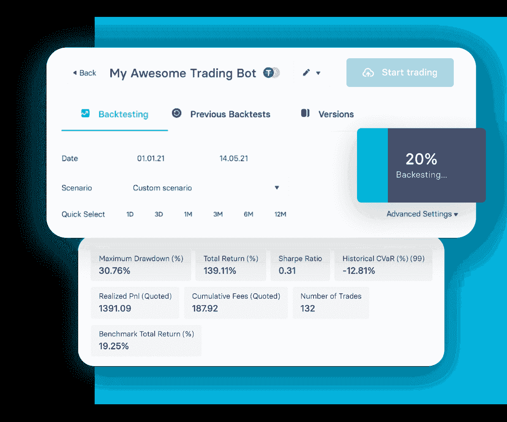

# 不同类型的加密交易机器人

> 原文:[https://www . trality . com/blog/different-types-of-crypto-trading-bots/](https://www.trality.com/blog/different-types-of-crypto-trading-bots/)

俗话说，变化是生活的调味品，在加密交易领域也是如此。正如有许多不同类型的交易者有许多不同的投资目标，有许多不同的方法来交易密码。

这一点在最近的经济低迷时期变得尤为明显。在 2021 年 11 月的飙升市场中奏效的方法不再奏效，因为我们都处于熊市之中。尽管最近 [密码崩盘](/blog/crypto-crash)然而，即使是一个密码寒冬也能[成为买方市场](/blog/crypto-winter-a-buyers-market)。但是我跑题了。

回到手头的主题:加密交易机器人。到现在为止，所有阅读这篇文章的人都应该明白在买卖 crypto 时使用自动交易机器人的重要性(我们将在下面重申一些主要原因)。但是你知道有许多不同类型的加密交易机器人吗？远远不是一个一刀切的解决方案，有专为特定目的设计的机器人。下面我们就来看看比较受欢迎的几款。

## 什么是加密交易机器人？

首先:一个简短的复习。什么是加密交易机器人？

很简单，加密交易机器人是一种计算机程序，旨在根据某些预定义的条件自动代表你进行交易。这些机器人收集并解释市场数据，如市场价格、波动水平和潜在风险，然后执行交易，使交易过程变得更加容易。

鉴于 crypto 臭名昭著的波动性和 crypto 市场 24/7/365 开放的事实，交易者不可能一直监控硬币价格。如果你还在手动交易 crypto(是的，我们正在和你谈)，那么你应该重新评估你的交易策略(而且要快)。这也是华尔街几十年来一直使用自动交易系统*的原因之一——它们更快、更高效、利润更高。*

然而，这并不是说加密交易机器人是致富的捷径。他们仍然需要有经验、专业知识和一点点尝试和错误的人。这就是交易的艺术。

但是加密交易机器人应该是任何个人交易者的起点。没有他们，就像蒙着眼睛交易。你不妨猜一猜。

## 加密交易机器人有什么好处？

与其通过手动操作来采取特别的方法来交易密码，不如采用人工智能和机器学习领域最新研究的见解来采取战略方法，这要明智得多(理解为:有利可图)。

### **更快更高效**

这是无法回避的。密码交易机器人比人类交易者更快更有效率。句号。在你读这句话(或者我写这句话)的时候，一个加密交易机器人可能已经执行了数百笔交易，如果不是数千笔的话。

### **没有感情的交易**

当市场飙升时，人们很容易沉浸在兴奋之中。相反，当市场低迷时，恐惧就会占上风。总的来说，情绪是好的。它让我们成为人类。但是当涉及到加密交易时，情绪往往是一种负担。研究表明，80%的交易者因交易心理不佳而亏损。

### **24 小时交易**

加密就像金融市场的纽约城。这是一个不睡觉的市场。与其他金融市场不同，加密市场全天候运作。加密机器人可以做我们个人交易者做不到的事情:日夜监控市场。不再错过交易或机会。

## **不同类型的加密交易机器人**

现在我们知道了什么是加密机器人，以及它们赋予人工交易的许多优势，让我们看看一些不同的加密交易机器人。

### **仲裁 bot**

[套利](/blog/crypto-arbitrage-strategy)涉及从一个平台买入，在另一个平台卖出，从而获利。套利的主要目的是在进行交易时利用多个平台之间的价格不平衡。

虽然套利可以产生利润，但这些利润通常很少，需要大量交易才能将小利润转化为大利润。利用套利加密交易机器人，交易者应该了解不同类型的套利(例如，三角套利、潜伏套利和空间套利)，以及加密交易的类型如何决定你的盈利程度。

### **硬币借贷机器人**

从加密货币交易中获利的一种方式是将硬币借给保证金交易者，条件是他们将以额外的百分比偿还贷款。某些加密交换平台为用户提供了这一选项，尽管手动设置支付和新贷款请求的参数可能非常繁琐。

硬币借贷机器人可以让你自动化这个过程，减少(甚至消除)手动设定利率所需的时间，从而利用潜在的机会。此外，贷款人认为保证金贷款是一种低风险的投资回报(ROI)，因为它们是在交易所平台上。换句话说，借款人不能将资金转移到不同的钱包，这使得硬币借贷对贷款人来说是安全的。您可以通过定义货币、利率和贷款到期日来配置硬币借贷机器人，以符合您的借贷策略。

### **保证金交易或杠杆机器人**

[保证金交易](https://www.investopedia.com/terms/m/margin.asp)指从交易所借入资金，执行大于交易者账户权益的交易。它涉及利用第三方资本来执行交易。在保证金交易中，如果交易者认为一枚硬币的价格会上涨，他们可以买入，当价格下跌时，他们也可以卖出。

杠杆机器人可以利用这些借来的资金来执行超出你的资本的交易。然而，有一个问题:杠杆可以双向作用。显然，一个好的预测会带来巨大的利润，但如果没有战略性地应用，它会导致巨大的损失。

### **做市机器人**

首先，我们需要理解术语“做市”这是指买卖一项资产，以利用[买价和卖价](https://www.investopedia.com/terms/b/bid-and-ask.asp)之间的差价，这就是所谓的价差。做市商 bot 是一种用于提供流动性的 bot，其结果是在加密生态系统内建立一定程度的信任。

做市交易机器人全天监控市场，寻找价差较大的市场，以便为投资者获利。例如，如果一项资产以中间价 100 美元交易，做市商 bot 可以以 99.90 美元买入，并以 200.10 美元卖出 20，000 股或更多股票。现在，当价格下降时，机器人购买 20，000 股股票将获得 4，000 美元(0.2 x 20，000 美元)的利润。因此，投资者可以获得良好的投资回报。您可以为特定资产定制您的做市机器人，并利用要价和出价。

### 技术交易机器人

技术交易机器人是当今市场上最常用的机器人。这些交易机器人采用预定义的技术指标，利用预定义的指标和信号预测硬币的未来价格走势，然后用于盈利。大多数技术交易机器人整合了信号和社交交易，允许你模仿成功交易者的交易，可靠和值得信赖的交易可以在 T2 最好的市场找到。

## 创造最好的加密交易机器人

现在你知道它们是什么，为什么使用它们，以及许多可用的类型，你如何找到最好的加密交易机器人？毕竟，选择正确的交易机器人几乎和选择正确的加密货币一样困难。

古老的建议仍然适用:**自己做研究**。由于[加密恶意软件和加密相关诈骗](/blog/cryptocurrency-scams)的数量和复杂程度都在上升，这变得尤为重要。你不应该把你的信任和金钱投入到可疑交易平台提供的匿名机器人中。

最好的加密交易机器人平台通常是那些允许你“先试后买”的平台换句话说，一旦你确定了一个感兴趣的平台，探索他们是否提供免费试用，在此期间你可以“试驾”该平台的加密交易机器人，看看它们是否适合你。

在 Trality，我们基于人工智能和机器学习领域的最新先进研究，为交易者提供简单易用的解决方案。无论您是完全的初学者还是编码专家，我们都有自动化工具来帮助您提高交易速度、效率和盈利能力。

## **Trality 规则构建器**

规则生成器是为很少或没有编码经验的密码交易者设计的。其简洁、优雅的设计意味着用户可以使用专业级工具快速、轻松地将其交易想法转化为盈利策略。

↓这是我们最先进的规则生成器的快速浏览↓

[https://www.youtube.com/embed/ugtCnc-wW7s](https://www.youtube.com/embed/ugtCnc-wW7s)

<button type="button" class="chakra-button css-1hnfsz">Try Rule Builder for Free</button>

### **规则生成器功能**

凭借其直观的图形用户界面，规则构建器是一个简单而强大的基于规则的机器人创建编辑器，允许交易员通过拖放基于布尔逻辑的技术指标来构建和自动化算法交易机器人。有 100 多个技术指标可供选择，以及各种预定义的策略，交易者可以根据自己的个人需求轻松定制他们的机器人。

一旦达到了预期的设置，交易者就可以用 Trality 的快速回溯测试工具分析他们的策略，该工具使用各种常用的统计数据来衡量 1)表现(例如，利润和损失；总回报；每次成功交易的平均利润)，2)风险/回报(例如，波动性；夏普比率)，以及 3)运行(例如，最大压降；水下时间)。

由于 Trality 是一个基于云的平台，它的所有工具，包括规则构建器，都是全天候可用的，允许用户在世界任何地方，无论白天还是晚上，随时创建、回测和实时交易。

## **Trality 代码编辑器**

最先进的代码生成器是世界上第一个基于浏览器的 Python 代码机器人编辑器。它是为有经验的交易者设计的，他们想用最新的技术开发复杂的交易算法。

↓这是我们最先进的代码编辑器的快速浏览↓

[https://www.youtube.com/embed/IO6lM4AxwEk](https://www.youtube.com/embed/IO6lM4AxwEk)

<button type="button" class="chakra-button css-1hnfsz">Try Code Editor for Free</button>

### **代码编辑器功能**

Python 程序员使用代码编辑器的各种强大工具和创新特性来创建和回溯测试他们的算法，会感觉像在家里一样。具有智能自动完成功能的浏览器内编辑以及浏览器内调试为交易想法的发展及其最终实现为盈利的交易机器人提供了一个无缝的过程。

凭借全面的技术分析指标和不断增加的库(包括 NumPy ),代码编辑器为基于各种市场条件和各种短期和长期交易目标定制机器人提供了最大的灵活性。

极快的浏览器内回溯测试也意味着测试和微调算法可以快速轻松地完成。受益于清晰的版本控制和回溯测试历史，同时还可以通过易于使用的 API 访问财务数据。

Trality's Backtester

所有用 Trality 的规则构建器和代码编辑器创建的策略和算法都是完全端到端加密的，所有在 Trality 平台上创建的 bot 都符合严格的安全和隐私标准。交易者的资金在他们选择的交易所保持安全，Trality 只使用禁止提取的 API 密钥。

## **最终想法**

信任、可靠性、功能性、灵活性——这些是有利可图的加密交易机器人最重要的特征。正如我们所见，加密交易机器人带来了一系列至关重要的好处，从无感情和有纪律的交易到更高级的策略，如保证金交易。问题不在于是否使用自动化交易，而在于哪种自动化交易策略适合你。

无论你选择哪一个加密交易机器人，都要记住交易的黄金法则:做你自己的研究，不要冒超出你承受能力的风险。