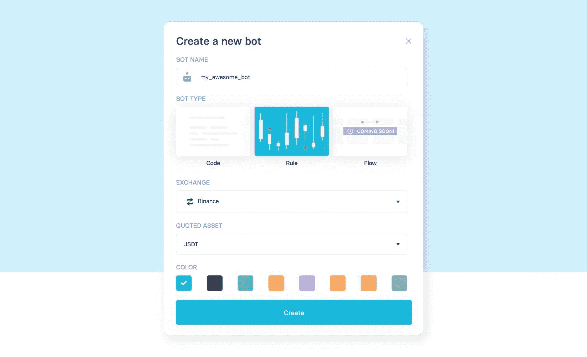
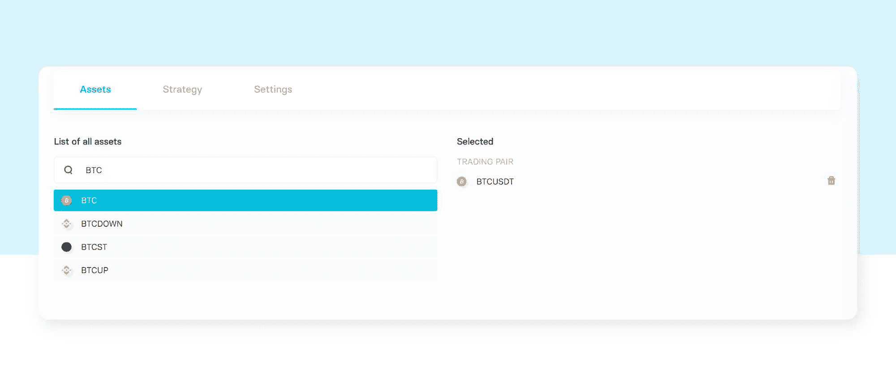
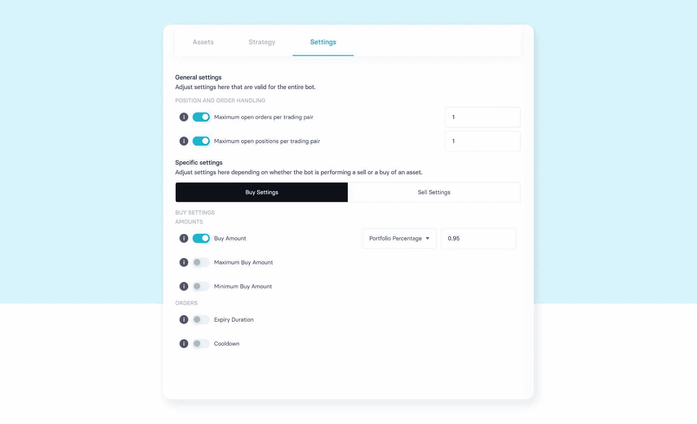
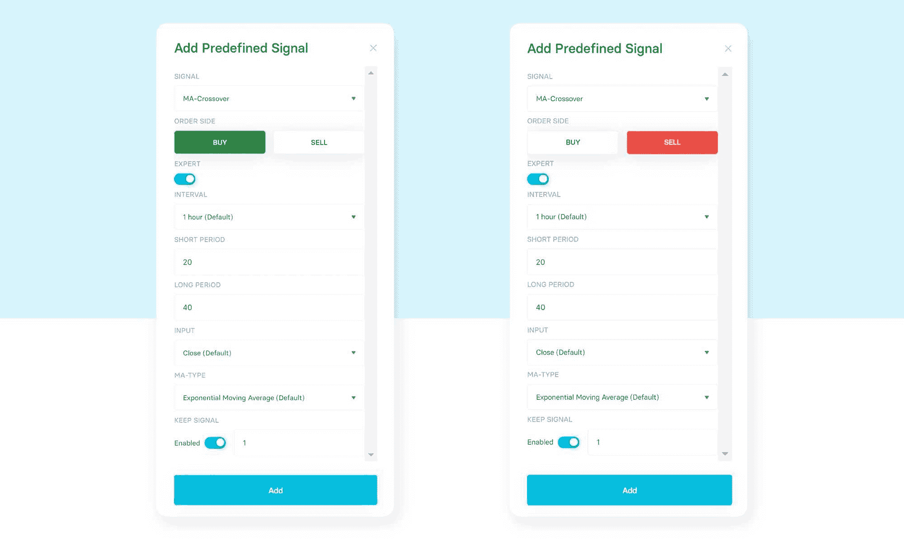
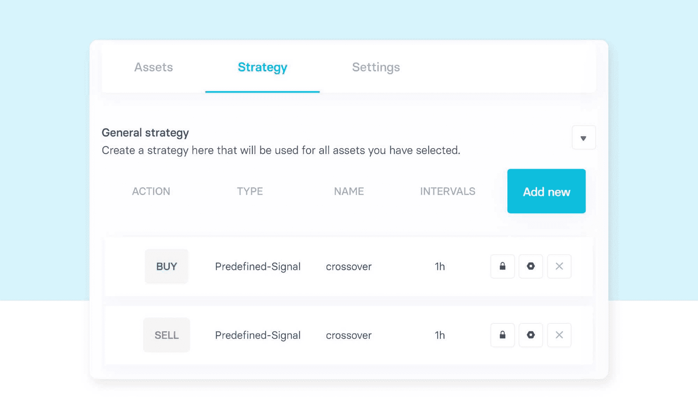
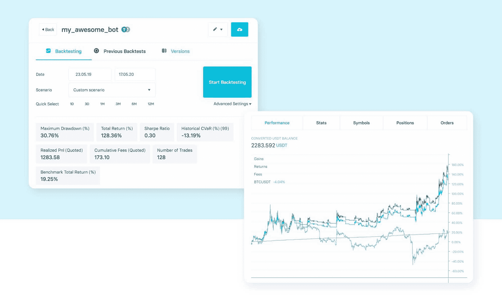
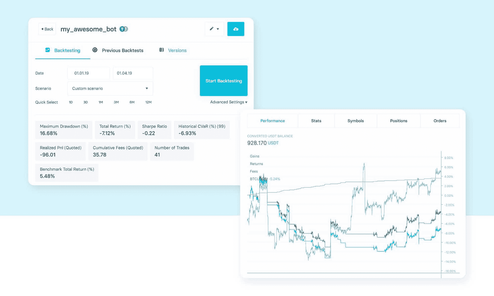
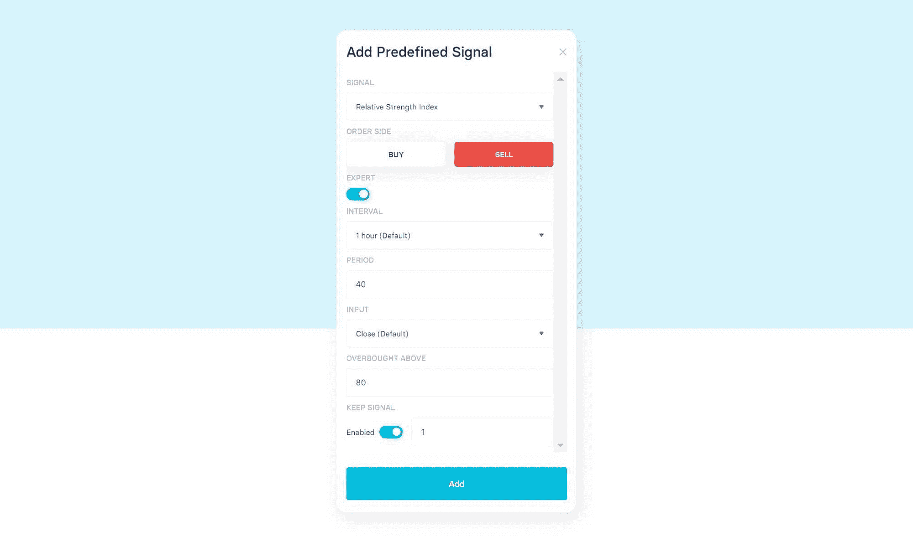
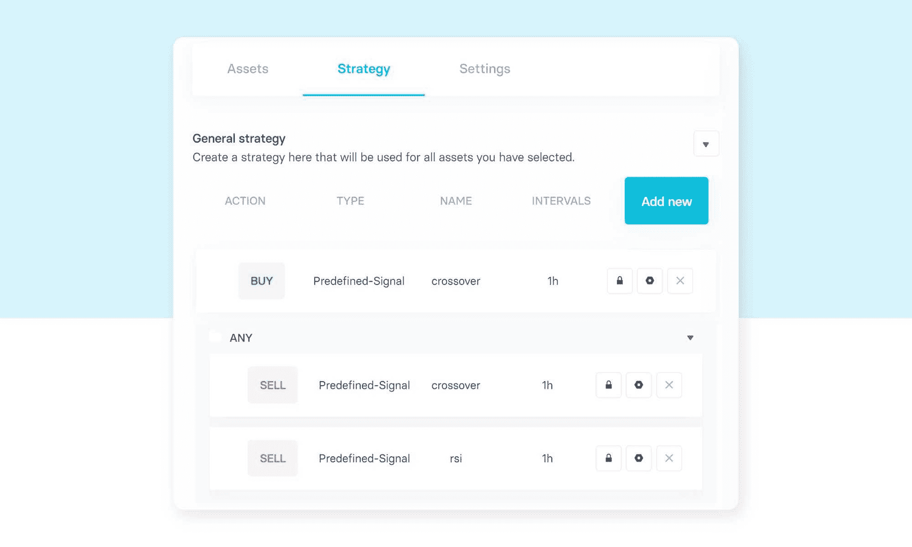

# 用 Trality 的规则生成器构建一个交易机器人(无代码！)

> 原文：<https://www.trality.com/blog/rule-builder-trading-bot/>

在下面的教程中，我们将向您介绍创建机器人的基础知识，并在机器人创建后更深入地进行微调和回溯测试。

在本指南结束时，您将创建自己的加密交易机器人，并学习大量关于创建成功机器人的最佳实践，让您拥有在加密市场获利的知识和信心。

## 用 Trality 创造最好的加密交易机器人

查看 Trality Rule Builder，这是一个最先进的工具，允许您创建自己的自动化加密交易机器人，以最小化风险，限制损失并增加利润！

[https://www.youtube.com/embed/ugtCnc-wW7s](https://www.youtube.com/embed/ugtCnc-wW7s)

<button type="button" class="chakra-button css-1hnfsz">Try it for free</button>

Trality Rule Builder 使您无需编码就能创建自己的加密交易机器人成为可能。使用规则生成器独一无二的图形用户界面，通过简单地拖放指标和策略来构建您的交易机器人的逻辑。下一步是回溯测试，因为它可以帮助你了解不同市场条件下的表现和风险。

出于演示目的，我们对单一货币对(即 BTC/USDT)创建了一个简单的趋势跟踪策略。在我们的分步教程中，**我们的交易机器人产生了 128.36%的回报率**，我们在不同的场景下对其进行了回溯测试，最终将其优化为**，将回报率提高到 139.11%** 。

## 创建新的机器人

我们开始吧！要使用我们的规则构建器创建一个 bot，我们只需命名我们的 bot 并选择“Rule”作为 bot 类型。然后，我们选择一个交易所进行交易，并为我们的算法选择一个报价资产。报价资产代表所有交易执行时使用的货币。

Create a new bot

## 选择你的资产

现在，我们选择希望我们的机器人交易的交易对，即哪些硬币应该用我们的报价资产进行买卖。对于我们的示例性交易机器人，我们将简单地选择 BTC，因此我们的机器人将在符号 BTC/USDT 上交易。

Selecting trading pair(s)

## 添加您的常规设置

在我们真正开始定义我们的机器人的实际策略之前，我们想定义它的一般设置。有关所有设置的详细描述，请查阅 Trality 文档并查看 [规则构建器部分](https://docs.trality.com/quick-start/rule)。

现在，我们只是将“买入金额”设置为 0.95，这意味着投资组合价值的 95%。这意味着我们将在任何给定时间持有 5%的报价资产。

Defining General Settings

## 定义你的策略

策略设计是每个交易机器人的核心，这意味着现在是指定实际交易信号的时候了。更准确地说，你的策略由各种预定义的策略组成，这些策略会产生买入或卖出信号。

我们的目标是定义一个简单的趋势跟踪策略，当趋势上升时买入 BTC，当趋势反转时卖出 BTC。这种信号的流行选择是移动平均线的交叉。

要添加我们的买入信号，我们转到策略选项卡，然后按“添加新”按钮。在弹出菜单中，我们选择“MA-Crossover ”,然后选择“BUY ”,并勾选专家框以调整该预定义策略的详细信息。

要添加我们的卖出信号，再次点击“添加新”按钮，选择“均线交叉”，然后选择“卖出”，勾选专家框，使用与买入信号相同的详细信息。

Creating the buy and sell signals

> 重要的是要注意，指定买入或卖出信号将自动解析信号的方向，或者从技术上讲是指标的组合。这意味着当短均线(20)从下方穿过长均线(40)时，均线交叉买入会产生买入单。同样，当多头均线(40)从上方穿过均线(20)时，均线交叉卖出发出卖出指令。

我们选择均线在**小时间隔**与**均线(20)和均线(40)** 交叉，无论是买入还是卖出。策略概述显示了我们的策略以及它们触发的信号、它们的名称和它们运行的时间间隔。因此，我们获得了以下初步策略:

Strategy overview window

## 回溯测试您的策略

回溯测试是对你的交易策略的历史模拟。它可以帮助你了解不同市场条件下的业绩和风险。

出于我们的目的，我们将在不同的时间框架和不同的场景下测试我们的机器人，以发现我们算法的潜在缺陷。作为开始，我们简单地回溯测试我们的机器人 12 个月(23.05.2019 - 17.05.2020)。我们策略的回溯测试结果如下:

Backtesting

看起来趋势被我们的交易机器人识别的很好。它远远胜过简单的买入并持有策略。

现在我们来看一个更困难的时间段，2019 年第一季度(01.01.2019 - 01.04.19)，其特点是 BTC/USDT 的价格大幅波动和大幅上涨。我们运行回溯测试并检查结果:

Backtesting

我们可以看到，基准总回报为正(5.48%)，而我们的总回报为负(-7.12%)。在这段时间内价格快速波动时，我们的均线交叉卖出信号往往滞后，我们在动能丧失时退出交易。

下一步，我们将完善战略，努力解决上述问题。

## 完善你的策略

### RSI 早期退出

在这一节中，我们试图找到一种方法如何退出市场，以避免上述问题。为了做到这一点，我们可以看看 RSI 策略，它将给定时间范围内的平均上涨和平均下跌联系起来。因此，这个信号可以用来衡量上涨对下跌的力度。我们添加 RSI 卖出信号如下:

Adding an RSI sell signal to our trading bot

现在，我们通过简单的鼠标拖动将两个卖出信号和布尔逻辑结合起来。由此产生的策略如下:

Strategy overview - Refining the EMA Cross strategy with an RSI signal

在同样的 12 个月内重新运行我们的优化策略显示性能有所提高。

Backtesting

结合趋势方向(均线交叉)和一个额外的出场信号，比如 RSI，看起来是合理的。

总之，我们看到在不同的时间框架下进行测试以及选择不同的起点对于理解 bot 性能是至关重要的。

## 研究、改进并投入使用

我们希望我们的插图已经使你相信，你的投资想法可以很容易地转化为 Trality 上的可交易策略，然后可以以直观的方式进行修改、配置和测试。一旦对你的策略创建有了信心，为实时交易部署一个交易机器人就简单多了。

准备好用 Trality 创建自己的交易机器人了吗？免费试用！

<button type="button" class="chakra-button css-1hnfsz">Start creating</button>