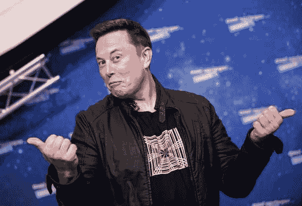
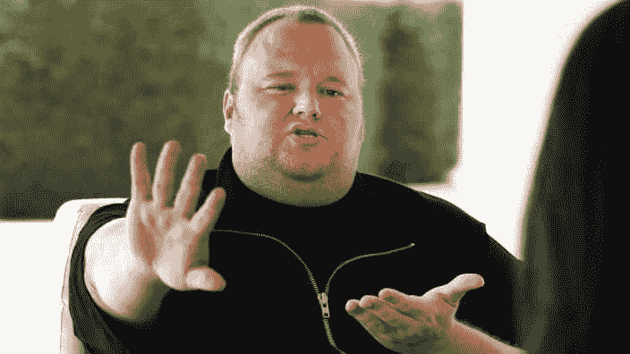
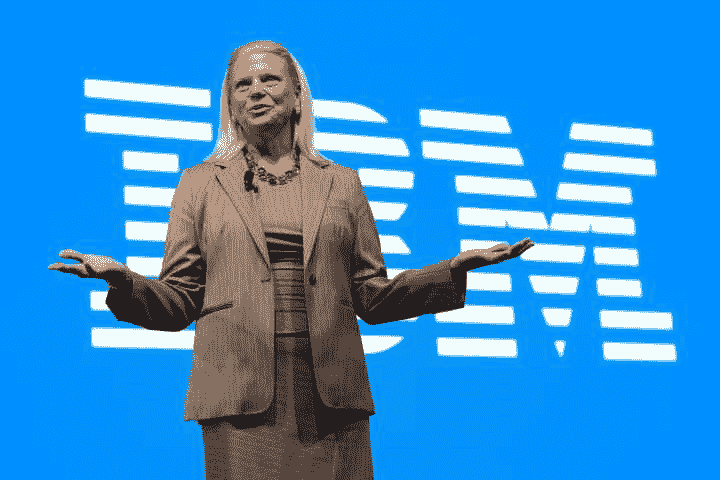
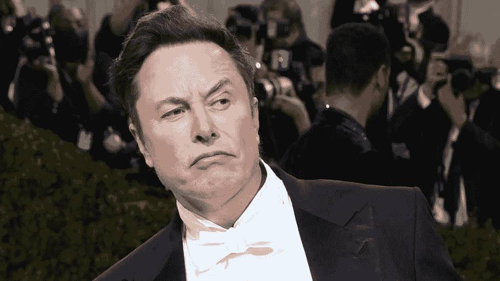

# 最著名的加密引语

> 原文:[https://www.trality.com/blog/the-most-famous-crypto-quotes/](https://www.trality.com/blog/the-most-famous-crypto-quotes/)

多年来，加密一直是一个热门话题，这个领域从来不缺少有趣、有趣、鼓舞人心或有见地的评论。无论是最新的改变游戏规则的。CSS-18up 66p { color:# 00b8e 6；字体粗细:正常；光标:指针；左:0px 位置:相对；-webkit-transition:全部 500ms 转场:全部 500ms-webkit-text-decoration:无；文字-装饰:无；} 在光谱的较轻一端，甚至有像[最有趣的加密迷因](/blog/funniest-crypto-memes)这样的东西，它们似乎每天都能在每个人的新闻订阅中找到自己的方式。

鉴于加密无与伦比的活力和全球受欢迎程度，我们决定突出一些最好的加密报价，无论这些报价与加密，替代硬币，区块链，DeFi，比特币或其他有关。排名不分先后，以下是按类别整理的最著名的密码语录。

## **励志加密货币行情**

“如果你不相信或者不明白，我没有时间去试图说服你，对不起。”— **中本聪**

“如果加密货币市场整体或数字资产正在解决一个问题，它将推动一些价值。”— **布拉德·加林豪斯**

“我认为比特币最终将成为银行的储备货币，扮演与黄金在银行业早期扮演的角色大致相同的角色。银行可以发行匿名性更强、重量更轻、交易效率更高的数字现金。”哈尔·芬尼

“随着价值的上升，人们开始头晕，怀疑者开始软化。发行一种新货币很容易。谁都可以做。诀窍在于让人们接受它，因为正是它们的使用赋予了‘钱’的价值。”亚当·b·莱文

“我对使用加密货币的前景感到非常兴奋，不仅仅是作为一种货币等价物，而是作为一种通过做某种工作来赚钱的方式。”威廉·穆加耶

“比特币已经存在。将会有一场针对任何试图从加密货币专利中获得荣誉的人的黑客骚动。我不想成为黑客狂怒的受害者。”— **亚当·德雷珀**

“我喜欢看到新的服务不断开始接受比特币。比特币真的正在成为“互联网货币”。我最担心的是政府对比特币可能的反应。他们不能摧毁比特币，但他们可以通过增加交易难度来减缓交易速度。迈克尔·马夸特

"计算机可以被用作解放和保护人们的工具，而不是控制他们。"哈尔·芬尼

“加密货币是一个如此强大的概念，它几乎可以推翻政府。”— **李宗南**

“世界上我所钦佩的每一个聪明人，以及我所半害怕的那些人，都专注于加密这个概念，这是有原因的。他们明白这是第四次工业革命的驱动力:蒸汽机、电力，然后是微芯片——区块链和密码是第四次。”——**布洛克·皮尔斯**

American entrepreneur and former child actor Brock Pierce. Image credit: Dean Takahashi

“移动是互联网 2.0。它改变了一切。Crypto 就是互联网 3.0。”— **吉尔·潘奇纳**

“与银行或法定货币相比，我对加密更有信心，因为我实际上可以控制它，而且货币供应是透明的，这一点在前面已经说过。这让网上购物变得更加容易和安全。”埃里克·沃尔赫斯

“活动人士需要让自己了解 2009 年发明的比特币等加密货币的力量，并使用加密来利用他们独立媒体收益的成功，以支持政治候选人永远不会发生的方式，将权力的天平从三驾马车倾斜。”— **马克斯·凯瑟**

“我想...世界上所有最好的公开密码学家都会同意，你不能真的在 crypto 中建立后门。这就像在挡风玻璃上钻了一个洞。亚历克斯·斯塔莫斯

"区块链资本是第一个专门投资加密和区块链的风险基金."——**布洛克·皮尔斯**

“今天的加密是自由主义者的天堂。如果你把钱送错了地方，它就没了。如果发给商家，没有收到货，就没有追索权。这是现金。照此处理。”— **吉尔·潘奇纳**

“(比特币)最激励我的是推动它的社区。这让我想起了早期的互联网。这是根深蒂固的原则，非常怪异，而且总是在不断发展。这让我想起了小时候的互联网。”— **杰克·多西**

"不理解区块链，它会把你打倒在地，让你流血."— **马克·库班**

A reflective Mark Cuban. Source: nypost.com

“你会看到成千上万的人投资 crypto，因为它比投资股票便宜得多，也简单得多。我认为我们还没有完全理解加密带来的影响。”— **马克·库班**

“加密货币是一个如此强大的概念，它几乎可以推翻政府”——李宗南

## **有趣的加密货币报价**

“我的加密钱包就像一个洋葱。一打开就想哭。”— **匿名**

“我对比特币非常感兴趣。它有所有的迹象。范式转变，黑客们喜欢它，然而它却被描述成一个玩具。就像微型计算机一样。”— **保罗·格拉厄姆**

“有一种新的加密货币叫做分贝。这是一项可靠的投资”“**匿名**

“这是书呆子的黄金。”斯蒂芬·科尔伯特

“比特币是反抗的货币……如果 10 年前 Satoshi 发行了比特币。早一点，911 就不会发生。”— **马克斯·凯瑟**

"人们必须承认，使用密码学，再多的暴力也无法解决数学问题."——**雅各布·阿佩尔鲍姆**

“比特币是长着翅膀的现金。”— **查理·施雷姆**

“我认为比特币即将被传统金融人士广泛接受。”— **埃隆·马斯克**

Two words: Elon Musk. Image credit: AFP

“杀不死比特币的东西让它更强大。”— **马克·维特科夫斯基**

“投资加密就像结婚，你必须不断经历好与坏，或好或坏，或富或穷，直到死亡将我们分开。HODL”——**纳贾赫·罗伯兹**

“我参加聚会迟到了，但我是比特币的支持者。”— **埃隆·马斯克**

## **比特币行情**

“比特币是一项技术杰作。”— **比尔·盖茨**

“当我第一次听说比特币时，我认为这是不可能的。怎么可能有纯数字货币？我就不能复制你的硬盘然后拿走你的比特币吗？我不明白这是怎么做到的，后来我研究了一下，发现这很棒。”——**杰夫·加齐克**

“PayPal 的目标是创造一种新的货币。我们在这方面失败了……我认为比特币在一种新货币的层面上取得了成功，但支付系统存在缺陷。”——**[彼得·泰尔](https://graciousquotes.com/peter-thiel/)**

“比特币绝对改变了一切，我认为在我的一生中没有比这更重要的事情了。”— **杰克·多西**

Jesu..um, I mean, Jack Dorsey. Image source: vanityfair.com

“过去 10 年，比特币已经证明了自己。没被黑过。因此，总的来说，它是在可操作的基础上工作的。它已经建立了一个重要的追随者。从某种意义上说，这是一种另类的财富储备。这就像一个数字现金。这些都是优势。”— **雷伊·达里奥**

“嗯，我认为这是可行的。可能有其他类似的货币可能会更好。但与此同时，围绕比特币有一个巨大的产业——人们从比特币中赚了钱，有些人赔了钱。它是不稳定的，但人们也从波动中赚钱。”理查德·布兰森

“我投资了加密技术。只有你能承受的损失，对吗？”— **埃隆·马斯克**

“我确实认为比特币是第一种有潜力改变世界的(加密货币)。”**——**彼得·泰尔****

**“比特币实际上拥有平衡和激励中心，这就是它开始腾飞的原因。”— **朱利安·阿桑奇****

**“比特币是伟大事物的开端:一种没有政府的货币，一种必要且势在必行的事物。”纳西姆·塔勒布**

**“比特币是一个非常令人兴奋的发展，它可能会成为一种世界货币。我认为在未来十年，它将发展成为支付物品和转移资产的最重要方式之一。”— **金·多特康姆****

******

** 

**Kim Dotcom. Source: Reuters**

**“每个知情人都需要了解比特币，因为它可能是世界上最重要的发展之一。”诺贝尔和平奖提名人莱昂·卢奥**

**“我要么看着它发生，要么成为它的一部分。”— **埃隆·马斯克****

**“比特币可能是货币的 TCP/IP。”保罗·布赫海特**

**“比特币是数字黄金——由于技术的不断进步，它变得更难、更聪明、更快、更强大。”迈克尔·塞勒**

**“我会说，‘什么也别做。’我认为，摧毁密码是不可能的，但政府有可能减缓其发展速度。”——**埃隆·马斯克****

**“这是一笔难以置信的资产。这是唯一一个供应有限而需求不断增长的市场。这是一件非同寻常的事情，是未来的看涨期权，也是世界上最原始的储备资产。”— **拉乌尔·帕尔****

**“比特币对银行的影响，就像电子邮件对邮政业的影响一样。”**——**里克·法尔文奇******

## ******区块链行情******

****“大多数技术都倾向于让在外围做粗活的工人自动化，而区块链则让中心自动化。区块链没有让出租车司机失业，而是让优步失业，让出租车司机直接为顾客服务— **维塔利克·布特林******

****“当分散的区块链协议开始取代主导当前互联网的集中式网络服务时，我们将开始看到真正的基于互联网的主权。未来的互联网将是去中心化的。”— **奥拉夫·卡尔森-威******

****“任何可以被视为供应链的东西，区块链都可以极大地提高其效率——不管是人、数字、数据还是资金。”— **吉尼·罗梅蒂******

************

**** 

****Former IBM CEO Ginni Rometty. Source: fortune.com****

****“区块链技术不仅仅是一种更有效的证券结算方式。它将从根本上改变市场结构，甚至可能改变互联网本身的架构。”— **阿比盖尔·约翰逊******

****“区块链不能仅仅被描述为一场革命。这是一种类似海啸的现象，缓慢推进，并以其前进的力量逐渐吞没沿途的一切。”威廉·穆加耶****

****“区块链的概念是在加密货币比特币的背景下首创的，但工程师们已经为分布式账本技术设想了许多其他方式来简化世界。例如，证券交易所和大银行正把区块链式的系统视为交易结算平台。”安东尼·斯卡拉穆奇****

****“经过两年与比特币和区块链公司及企业领导人的合作，我们发现阻碍区块链在全球范围内广泛采用的一个重要问题是，无法快速与正确的合作伙伴组合建立联系，以测试和部署该技术，从而解决现实世界的业务挑战。”— **熔融分离器******

****“让用户能够方便地访问区块链上许多不同种类的数字资产，特别是与现实世界中的资产相关联的代币，这对于区块链的采用达到更高水平至关重要，我很高兴 Digix Global 率先成功推出了这样的项目。”— **维塔利克·布特林******

****“我认为政府将会被区块链打乱。我认为，就像互联网迫使每个人进化一样，区块链将再次改变游戏规则。”— **亚当·德雷珀******

****“区块链技术有如此广泛的转型用例，从重建华尔街的管道系统到在世界上最遥远的地区创建金融主权。”— **佩里安无聊******

## ******山寨币行情******

****“如果 crypto 成功了，那不是因为它赋予了更好的人权力。这是因为它赋予了更好的机构。”— **维塔利克·布特林******

************

**** 

****Vitalik Buterin (a really long time ago). Image source: time.com ****

****“创造在数字世界中不可复制的东西的能力具有巨大的价值……许多人将在此基础上建立企业。”— **埃里克·施密特******

****"菲亚特是狗屎硬币的终极"— **Gun Gun Febrianza******

****“区块链技术不仅仅是一种更有效的证券结算方式。它将从根本上改变市场结构，甚至可能改变互联网本身的架构。”— **阿比盖尔·约翰逊******

****“加密货币增加了什么价值？没人能回答我这个问题。”— **史蒂夫·艾斯曼******

****“我发现最讽刺、最有趣的结果往往是最有可能的。最有趣的结果将是 Dogecoin 成为全球新地球货币。”— **埃隆·马斯克******

************

**** 

****Elon Musk (again). Image source: bbc.com****

****“如果你愿意的话，MaxCoin 正在争夺加密美元。比特币也是，Dogecoin 也是。事实证明，替代硬币是强大的，因为它背后有一个坚实的社区，有它的用途，它有很大的市场资本。我认为这将是一个赢家。”— **马克斯·凯瑟******

****“从支付的角度来看，加密领域正在发生的事情，当然还有 Ripple 正在发生的事情，我们有机会从根本上改变全球商务的管理方式。”— **布拉德·加林豪斯******

****“离它远点。基本上，这是一个幻想。在加密货币方面，一般来说，我几乎可以肯定地说，它们会有一个糟糕的结局。”— **沃伦·巴菲特******

****“互联网将成为削弱政府作用的主要力量之一。一个缺少但很快就会被开发出来的东西是可靠的电子现金。”米尔顿·弗里德曼****

## ******DeFi 报价******

****“金融的去中心化对人类真的有好处，最终对我们每个人都是一个胜利。因为现在我们可以通过在区块链使用智能合约绕过银行、交易所和经纪公司……每个人、每个家庭和每个企业都将体验到更多的自由、更多的机遇、更多的富足、更多的权力和更多的财富。”― **小亨德里思·万隆·史密斯******

****"对传统金融机构来说，DeFi 热潮相当于一场灾难性事件."― **莫希斯·阿加迪******

****“DeFi 革命将会持续下去。它提供了一个无银行世界的承诺，在那里你不需要许可就可以存钱或投资。像任何新生技术一样，有时它会被过度宣传，但 DeFi 是真实的，它已经在野外工作了。这只是一个开始。”泰勒·文克莱沃斯****

************

**** 

****Tyler the creator, aka Tyler Winklevoss (which one is anyone's guess). Source: Getty****

****“DeFi 拥有光明的未来。我们也很高兴看到 ETH2 的推出，我们甚至可能会看到更多的用户从 BTC 转向 ETH，以获得所需的 32 股。”— **乔丹·安德森******

****“过去几个月，DeFi 热潮迅猛发展。高产农业项目已经冷却下来，并一度成为人们关注的焦点，但许多有趣的基础设施元素，如借贷平台，从热潮中脱颖而出，并将永远存在。一如既往，以太坊拥有最大的开发者网络和用户群，因此这些产品主要基于以太网。如果 ETH 2.0 显著降低了交易成本，那么这将是受欢迎的，因为在 DeFi 繁荣时期，天然气费用极高，零售市场的参与成本过高。高昂的天然气成本影响了我们的对冲交易(复制交易)平台，因为智能合同执行成本呈抛物线增长。我们自己也在期待 ETH 2.0，甚至在寻找我们基础设施的某些替代方案，以限制我们对波动的天然气费用的依赖。”大卫·沃斯伦****

****“DeFi(发烧)目前就像以前的 ICO 发烧——但使用了类固醇。尽管如此，这是一项令人惊叹的技术，将提供真正的贷款和信贷渠道，而不需要中介机构批准任何人的参与。其成功的核心将是治理层，治理层一旦稳定，将决定每个项目的成员，将具有相似世界观、风险偏好和激情的人联系起来。”— **吉利安·戈德西尔******

****“我为 ETH2.0 感到激动！我喜欢看到空间的改进和创新，一旦转换完成，我将赌注。至于速度和成本，他们声称“系统”将更快，更实惠，因为当时的成本可能有点可笑。我希望这些改进能够解决当前的问题，如果没有这些改进，生态系统可能会产生严重的影响，许多 erc20 项目将会失败。让我们对 Vitalik 说，我们将在 12 月无缝发布。”— **Crypto Wendy-O******

****“DeFi 摆脱了机构中间人。相反，DeFi 平台直接匹配流动性提供者和接受者。成本低，激励措施一致。”雷纳托·伦纳德·卡佩里****

****“DeFi 通过帮助没有银行账户和服务不足的人有机会通过小额贷款快速获得资本，从而赋予人民权力。”— **理查德·卡顿******

## ******遗言******

****所以下一次你和一些密码专家闲聊的时候，通过在谈话中加入一些密码引语来告诉他们一些知识。更好的是，如果你在和密码怀疑论者聊天，你现在有各种适合任何给定对话的报价供你使用——惊喜、娱乐、启发或只是通知！****

****而且，记住，就像孔子曾经说过的，“比特币最大的荣耀不在于从不下跌，而在于每次下跌都上涨。”****

****好吧，这个可能是我们编的...****