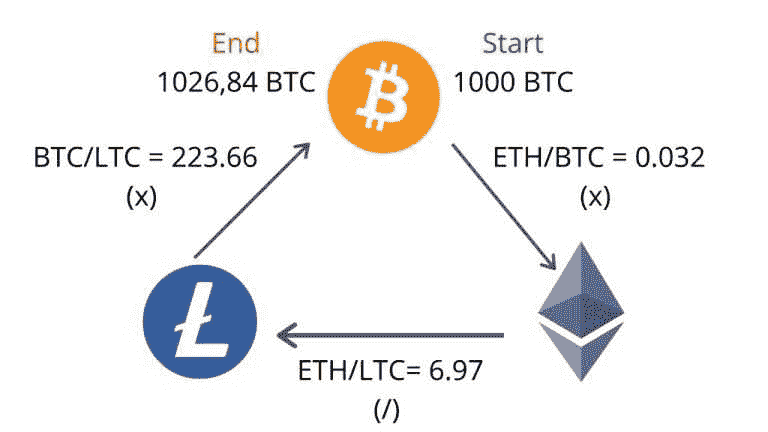

# 为什么加密套利不是一个有利可图的策略

> 原文:[https://www.trality.com/blog/crypto-arbitrage-strategy/](https://www.trality.com/blog/crypto-arbitrage-strategy/)

有许多不同的方式来交易密码。一些投资者更喜欢买入 HODL 的方法，尤其是在熊市或寒冬时期。与此相反的是日内交易者，他们进行大量的日内交易，以便在更短的时间内获利。

对于加密日交易者来说，套利似乎是一个有吸引力的选择，但外表可能是骗人的。在下面的文章中，我们将研究套利，特别是加密套利，并研究是否存在有利可图的加密套利机会，或者交易者是否应该警惕加密套利交易。

## 使用 Trality 创建您自己的加密交易机器人！

看看 Trality Rule Builder 吧，这是一个最先进的工具，让你不用写任何代码就能创建自己的交易机器人。

[https://www.youtube.com/embed/ugtCnc-wW7s](https://www.youtube.com/embed/ugtCnc-wW7s)

<button type="button" class="chakra-button css-1hnfsz">Try the Rule Builder for free!</button>

## **什么是套利？**

许多交易者对从交易所之间的差异中赚几美元的前景感到兴奋，但在你跑去辞职并开始兑现之前，你绝对应该阅读这篇文章，并理解为什么你应该仔细考虑它是否适合你。

## **不同类型的套利**

### **三角套利**

顾名思义，三角套利试图利用三种不同资产的价格差异。交易者既可以执行买-买-卖指令，也可以执行买-卖-卖指令。

An example of triangular arbitrage in crypto. Source: algotrading101.com.

这具体意味着什么？比如说你从系绳(USDT)入手，买以太坊(ETH)。然后你用以太坊买索拉纳(SOL)。最后一步，你可以卖掉索拉纳，从而完成**买-买-卖**三角。对于同样的硬币，一个**买-卖-卖**的方法将包括从系绳开始，然后购买以太坊。然后，你将出售以太坊来换取索拉纳，最后，出售索拉纳来换取系绳。

### **潜伏套利**

大型机构投资者从事所谓的潜伏套利，这种交易方式允许他们以交易速度较慢的投资者为代价获利。利润来自于利用低延迟，即信号被触发和到达目的地之间的时间。在这种情况下，我们谈论的是极快的速度，通常不到一秒。人们普遍对潜伏套利持负面看法，尤其是因为它让散户投资者付出了代价。CSS-18up 66p { color:# 00b8e 6；字体粗细:正常；光标:指针；左:0px 位置:相对；-webkit-transition:全部 500ms 转场:全部 500ms-webkit-text-decoration:无；文字-装饰:无；} [估计每年 50 亿美元](https://www.cnbc.com/2020/01/27/latency-arbitrage-trading-costs-investors-5-billion-a-year-study.html)。在潜伏套利的情况下，个人无法与机构投资者享有的交易速度竞争，使他们处于竞争劣势。

### **空间套利**

这种方法通常被称为“地理套利”，它涉及到在地理上分离的市场中寻找资产之间的价格差异。换句话说，交易者会比较比特币在北美交易所和亚洲交易所的价格。

## **什么是 Crypto 中的套利？**

同样的原则也适用于加密交易。假设你在一个交易所(币安)以一个价格买入比特币(BTC)，然后在另一个交易所(北海巨妖)以更好的价格卖出等量的比特币。这两个交易所之间的价格差异会产生利润，但这种利润通常很小，甚至可以忽略不计，这使得套利成为交易者需要经常做的事情，以便实现任何实质性的收益。

## **套利和不同的加密交易**

除了你套利的具体方法，你选择的交易所也会影响你的盈利能力。对于一些交易者来说，没有 KYC 的加密交易很重要。对其他人来说，他们将在集中交易所(CEX)、分散交易所(DEX)甚至混合交易所之间做出选择。让我们简单看一下它们之间的区别。

### **CEX**

顾名思义，集中式交易所集中了加密货币的购买和销售，本质上起到了市场的作用。币安是世界上最大的集中交易市场，估计有 2900 万用户。CEX 的好处包括易于使用，方便，和一系列的交易选择。然而，用户将为便利和多样化付费，因为一般的经验法则是，集中的交易所比分散的交易所收费高。

### **德克斯**

正如你可能已经猜到的，“DEX”代表一个去中心化的交易所，其中第三方市场被一个点对点市场所取代。DEX 的一些例子包括 IDEX、 [Ox](https://www.0x.org/) 、 [Waves](https://waves.exchange/) 、 [Loopring](https://loopring.org/#/about) 和 [Kyber Network](https://kyber.network/) 。交易员直接控制自己的资金和交易，而不是像币安这样的中间人或中介，这是通过流动性池和智能合约来实现的。然而，分散交易所的明显优势伴随着一定的成本，即交易者要对他们买卖密码的所有方面负责，这可能会使对该过程及其成功管理该过程的能力不太有信心的新交易者感到不快。

如上所述，分散交易所的套利与币安等集中交易所的套利形成了有趣的对比。考虑到管理密码买卖的一套基于交易所的根本不同的规则，结果必然会有所不同。正如区块链分析平台的 [Nansen 所描述的，交易者可以使用智能合约，只用一笔交易就在不同的市场上进行多笔交易(实际上是一种“全有或全无”的方法，即所有交易都通过或都不通过)。更重要的是，机构投资者经常利用的更快交易的能力，由于交易取决于链的阻塞时间而减弱。](https://www.nansen.ai/research/arbitrage-on-decentralised-exchanges)

使用 dex 的“套利者”(或从事套利交易的人)也应该意识到矿商的角色，因为他们决定交易顺序，而交易顺序在很大程度上取决于天然气费。因此，“[抢先](https://consensys.github.io/smart-contract-best-practices/attacks/frontrunning/)是一个问题，因为矿商或其他人可能会利用从未决交易中收集的信息为自己谋利。

### **混合动力**

在许多方面，混合交易所背后的根本目标是结合两个世界的优势，提供快速的交易速度、安全性和低费用。通常提到的混合加密交换的两个例子是 [Nash](https://nash.io/products/exchange) 和 Qurrex。纳什交易所[被描述为](https://dyor-crypto.fandom.com/wiki/Nash_Exchange)混合 [DEX](https://dyor-crypto.fandom.com/wiki/DEX) 通过一系列智能合约使用链外订单匹配和贸易结算。另一方面，Qurrex 似乎不再有一个正常运行的网站，或者说不再是一个正常运行的混合交易所。鉴于混合加密交易所的新生事物，交易者被敦促谨慎行事，尤其是在从事套利交易时。

## **套利交易的弊端**

理想的套利方式是日内交易者利用交易所之间的价格差异来获利。然而，当事情不完全按照计划进行时，会发生什么呢？这是套利交易中的典型情况。下面我们将考虑套利的一些不利因素。

### **密码规则**

在这种情况下，更大的问题是缺乏一个全球监管框架来管理跨境购买和销售加密货币。监管漏洞是存在的，在套利方面明显缺乏统一的国际标准，更不用说一般的加密交易了。因此，对交易者来说，套利可能是一个雷区。

### **具有相同股票代码的硬币**

所以你对交易 BTCS 感兴趣。是比特币白银(BTCS)还是比特币加密(BTCS)。或者你对 SAI 感兴趣。或者是 SIA？也许你想把 CMT 加入你的投资组合(是彗星还是网络里程？).有数千种加密货币，其中许多都有相同或相似的股票代码。虽然这看起来很简单，但在快节奏的套利交易中，人们很容易混淆硬币和相同的符号。

### **离线或在不同的区块链上交换钱包**

出于各种原因，从安全考虑到维护等日常工作，交易所可以选择暂时禁用整个平台或单个平台的加密货币钱包。大多数加密货币交易所都有一个固定的页面，你可以在那里找到你需要的钱包是在线还是离线。如果离线，这个页面可能还会告诉你什么时候应该恢复在线，所以在进行任何交易之前，验证一下总是值得的。

你应该做的第二件事是仔细检查交易所是否在同一个区块链上提供代币。有时，加密货币会从一个区块链转移，例如当 EOS 从区块链以太坊转移到自己的 Mainnet 时，就会出现两种不同钱包地址格式的情况。

### **高额的存款、取款和交易费用**

集中式交易所显然受益于其取款费，这可能会蚕食交易者的利润，尤其是在套利交易中个人收益非常小的情况下。熟悉你交易的两个交易所的存款和取款费用是至关重要的。不这样做往往会导致任何潜在利润的损失，使整个工作毫无意义。

Crypto arbitrage can be complex, especially for newer traders. 

交易所有定期调整交易费用的习惯，这意味着你可能在某一天享受你最喜欢的一对的低费用，而第二天你却为这种特权支付更高的费用。例如，在 2019 年，比特币基地专业公司将他们认为“低交易量”的交易员的费用提高了 200%制造商和接受者的费用在全面改革中也大幅增加，导致了挫败感。

### **容量不足**

在开始套利之前，重要的是检查是否有足够的交易量让你在各自的交易所有效地执行交易。由于交易量低，加密货币可以而且经常从交易所退市。有了套利，你可以有一连串的好交易，但是一次糟糕的交易会让事情很快陷入混乱。此外，一枚硬币可以有成交量，但你仍可能无法以目标价卖出。要价、出价和深度可能比最后价格更重要。然后还有涉及小额的交易(通称“[尘](https://www.coindesk.com/bitcoin-dust-tell-get-rid)”)，用来制造交易活动的假象。

### **泵送和倾倒方案**

如果没有[各种各样的骗局](/blog/cryptocurrency-scams)，包括所谓的[泵和转储](/blog/how-crypto-pump-and-dump-work)方案，密码市场会是什么样子？在上文中，骗子试图通过馈送虚假信息(例如，假的正面消息)和价格行为来人为抬高资产的价格，从而欺骗交易者，其最终结果是出售大量硬币以获取高额利润。最后一个购买的人通常被留下来拿着袋子，而骗子们已经套现了。古老的谚语说得好:如果好得不像真的，那么它很可能就是真的。

### **交易所的审批瓶颈**

如果你在密码领域呆过一段时间，那么你可能会遇到这样的交易者，他们在社交媒体上抱怨他们在交易所的存款被卡住了，需要人工批准，或者他们的交易所被封锁了。最糟糕的事情莫过于，你盯着一项交易，但由于某种形式的瓶颈或中央交易所(或多个交易所)的审批程序而无法完成。事实上，在问题得到解决之前，交易员和交易所之间经常需要几天的来回沟通，这使得套利几乎不可能。

### **定时**

因为时间是套利游戏的名字，你需要一切都完美的工作。如果拼图中的一块缺失了，或者和其他的不太匹配，那么交易就不会发生。当你考虑到加密市场臭名昭著的波动性时，套利交易者往往处于竞争劣势，这让我们得出了最后的结论。

## **加密套利不理想**

当你把试图通过利用市场间的价格差异来榨取小额利润的难度与上一节提到的各种陷阱相加时，很难得出以下结论:加密套利是一种不太理想的加密交易方式。简而言之，加密套利的机会少之又少。

尽管一些交易员确实总能成功执行套利交易，但这个过程中涉及的活动部分太多，因此这不是一条可行的盈利途径。一方面，不受监管的交易所可以很容易地持有或拿走你的钱。另一方面，使用受监管的平台往往会导致存款和交易流动缓慢，违背了套利的目的。

如果你是手动日内交易，那么祝你好运！

## **加密套利的替代方案**

最好的选择是创建你自己的交易策略，一个根据你的个人目标和风险承受能力量身定制的策略，并通过使用加密交易机器人使其自动化，这些机器人比任何手动交易加密的人更客观、更可靠、更快、更有利可图。毕竟，华尔街大约 80%的机构交易是由算法完成的，这是有原因的。

## **Trality 的规则生成器**

凭借其直观的图形用户界面，规则构建器是一个简单而强大的基于规则的机器人创建编辑器，允许交易员通过拖放 100 多个基于布尔逻辑的技术指标来构建和自动化算法交易机器人。交易者受益于预定义的策略，或者可以根据自己的个人需求轻松定制他们的机器人。

下一步是用 Trality 的闪电快速回溯测试器分析策略，该测试器使用各种常见的统计数据来衡量绩效和风险/回报等指标。所有策略和算法都是完全端到端加密的，所有在 Trality 平台上创建的机器人都符合严格的安全和隐私标准。交易者的资金在他们选择的交易所保持安全，Trality 只使用禁止提取的 API 密钥。

[https://www.youtube.com/embed/ugtCnc-wW7s?feature=oembed](https://www.youtube.com/embed/ugtCnc-wW7s?feature=oembed)

<button type="button" class="chakra-button css-1hnfsz">Try the Rule Builder for free!</button>

## **Trality 的代码编辑器**

作为世界上第一个，Trality 最先进的代码生成器是一个基于浏览器的 Python 代码机器人编辑器，它是为希望使用最新技术开发复杂交易算法的有经验的交易者设计的。

Python 程序员在创建和回溯测试算法时，使用 Code Editor 的全套强大工具和特性会立即感到如鱼得水。具有智能自动完成功能的浏览器内编辑和浏览器内调试为交易想法的发展及其最终实现为盈利的交易机器人提供了一个无缝的过程。

凭借全面的技术分析指标和不断增加的库(包括 NumPy ),代码编辑器为基于各种市场条件和各种短期和长期交易目标定制机器人提供了最大的灵活性。

极快的浏览器内回溯测试也意味着测试和微调算法可以快速轻松地完成。受益于清晰的版本控制和回溯测试历史，同时还可以通过易于使用的 API 访问财务数据。

[https://www.youtube.com/embed/IO6lM4AxwEk?feature=oembed](https://www.youtube.com/embed/IO6lM4AxwEk?feature=oembed)

<button type="button" class="chakra-button css-1hnfsz">Try the Code Editor for free!</button>

## **最终想法**

虽然在正确的情况下，加密套利对高级交易者来说是一种有利可图的交易策略，但事实是套利交易对大多数交易者来说是非常困难的。移动部件太多，出错空间太小，利润太少。

一个更好的方法是开发一个更长时间的交易策略，并使用算法加密交易机器人实现自动化。

无论你选择哪种方法，一定要做好自己的研究，不要投资超过你能承受的损失。

* * *

*免责声明:以上文章仅是一篇观点文章，不代表任何关于如何投资、如何交易或投资哪些资产的交易建议或提议！在投资之前一定要做好自己的研究。)只投资你赔得起的！*