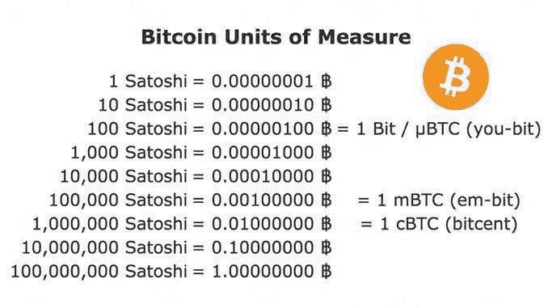

# 什么是 mBTC？

> 原文:[https://www.trality.com/blog/what-is-mbtc/](https://www.trality.com/blog/what-is-mbtc/)

加密货币历史上最著名的人工制品之一是中本聪于 2008 年 10 月 31 日发布的比特币白皮书。根据他的出版物，比特币被设计成一种点对点的电子支付系统，它已经成为当今世界上领先的数字货币。

然而，鉴于 BTC 的物价，没有多少人买得起 1 BTC，这意味着大多数人将购买零头。假设你想购买 500 美元的 BTC。在本文发表时，这相当于 0.000047 BTC。从表面上看，这并不完全是一种弯曲，但显然更多的是一种感知问题。

或者让我们说，你只是想在 BTC 买一杯咖啡。为了做到这一点，你必须将比特币分成分数才能完成这种类型的“ [微交易](https://en.wikipedia.org/wiki/Microtransaction)(有时简称“mtx”)。当你需要早上摄入咖啡因时，你最不想做的事情就是计算 BTC 的分数。

但是，即使在最好的含咖啡因的情况下，大多数人也发现货币的小数位数超过两个位是令人困惑的。那么，如果你不想摆弄计算、小数金额和无数小数，你会怎么做呢？

一些术语以比特币的较小单位出现，部分原因是比特币对美元价格的波动，其中之一是 mBTC。在下面的文章中，我们将更详细地探讨这个单元及其与 BTC 的关系。

## **mBTC 和 BTC**

2011 年 5 月由[民意调查](https://bitcointalk.org/index.php?topic=8282.0)、**推出的毫比特币**通常也被称为**毫比特币**和**毫比特币**。字母“m”指的是  milli-，自然代表一个比特币的千分之一。因此，mBTC 或毫比特币是一个比特币的 0.001 或 1/1000。

2017 年， [BTCC](https://cointelegraph.com/news/major-chinese-exchange-btcc-selects-ethereum-classic-over-eth) 首席执行官[世尘小雪](https://cointelegraph.com/news/bitcoin-trading-with-btc-or-mbtc-not-all-users-are-happy-with-btcc-new-proposal)开始[公开投票](https://cointelegraph.com/news/bitcoin-trading-with-btc-or-mbtc-not-all-users-are-happy-with-btcc-new-proposal)和[在推特](https://twitter.com/bobbyclee/status/822999175411310592)上推动在 mBTC 而不是 BTC 交易的问题。正如 [Cointelegraph 在 2017 年 1 月](https://cointelegraph.com/news/bitcoin-trading-with-btc-or-mbtc-not-all-users-are-happy-with-btcc-new-proposal)报道的那样，这个想法有许多支持者，尤其是因为它将消除投资比特币的心理障碍，通过更小的面额使其更实惠。文章的结论是，采用 mBTC 将在很大程度上取决于 BTC 的价值和它是否会超过 30，000 美元(！).

## **转换 mBTC**

几个比特币转换器可以很容易地将 mBTC 兑换成美元和欧元等其他法定货币。截至发稿时，1 BTC 目前的价格为 [$21，64](https://coinmarketcap.com/currencies/bitcoin/markets/) 。

根据加密货币主页 [Nomics](https://nomics.com/markets/mbtc4-millibitcoin/eur-euro) ，

*   1 mbtc = 21.646 美元
*   1 MB TC = 20.78

您希望看到您的余额是小数还是 mBTC 单位？

Source: block-builders.de

不用计算小数点后的位数，尤其是在处理较小的 BTC 时，将较小的 BTC 单位转换为 mBTC 会更方便。让我们看看 1 BTC 到 mBTC 的距离，好吗？

*   [1 BTC = 1000 mBTC](http://www.em-bit.org/home)

或者

*   1 mBTC = 0.001BTC.

例如，如果 1 BTC 等于 20，000 美元，那么 1 mBTC(BTC 的 1/100)就等于 20 美元。就这么简单。

## 人们为什么使用 mBTC？

比特币的高市值使得大多数商家几乎不可能接受它作为在线支付方式。然而，鉴于比特币不断上涨的价格，大多数加密爱好者已经[提议使用 mBTC 面值](https://bitcointalk.org/index.php?topic=511676.0)作为比特币的标准单位。

随着比特币的价值目前达到数千美元，加密领域的大多数新手都没有意识到以更小的单位获得 BTC 的可能性。这种知识差距给试图进入密码领域的初学者造成了情感障碍。

人们更喜欢使用毫比特币作为计量单位的原因之一是，它让用户更容易理解和交流更小的比特币单位。中本聪明白，比特币的价格迟早会大幅上涨，因此需要更小的单位。

加密支持者认为，用毫比特币单位来描述 BTC 的更小单位将减少心理障碍和认知，并允许更多用户购买更少量的比特币，而不会觉得小数点后六位等同于少量持有。

## **反对使用 mBTC 的理由**

正如我们所看到的，许多密码爱好者认为 mBTC 将减少 BTC 的心理障碍，使其价格低廉，并增加其采用。例如，不是说 1 BTC 值 20，000 美元，而是说 1mBTC 值 20 美元。对大多数人来说，花 20 美元买一个 mBTC 要比花 2 万美元买一个 BTC 容易得多，因为很大一部分公众不知道你可以买一小部分 BTC。此外，使用 mBTC 进行日常交易要比价值数千美元的比特币容易得多。

然而，有人反对使用毫比特币作为比特币的单位。毫无疑问，小数可能会令人困惑，但关于比特币的最小单位应该是什么一直存在争议，因为还有其他选择，如微生物币和 Satoshi。

在对使用 mBTC 的帖子的回应中，一名用户建议将 Satoshi 作为比特币的最小单位。正如 Reddit 上所概述的，CoinCadence 更喜欢采用比特而不是 mBTC，因为小数点后的两个数字模仿其他全球货币的方式，从而确保面值经得起未来考验(考虑到 BTC 的价格波动，这是需要记住的重要一点。

你可能遇到的另一个论点是，mBTC 会导致通货膨胀，但这不是真的。当经济中的货币供应量增加时，通货膨胀就会上升。由于比特币的上限为 2100 万 BTC，这意味着一旦比特币达到上限，就不会有新的比特币被挖掘出来。所以比特币可以说是通货紧缩。

由于对比特币的需求不断增加，购买 BTC 需要一定比例的特定货币。因此，使用全球可接受的单位标准将 BTC 分成更小的单位变得必要和方便。

## **mBTC 和“聪”的区别**

比特币网络支持的最小价值是 Satoshi。根据 Investopedia 的数据，Satoshi 是区块链网络上最小的比特币。它等于一个比特币的百万分之一(1/100，000000BTC)。换句话说，每个比特币可以分解成一亿(100，000，000)个小智。

正如 CoinDesk 的一篇文章所描述的，通过使用闪电网络，甚至可以进行比 satoshis 更小的交易。这种交易使用的单位是毫兆，相当于千分之一兆。不过，需要注意的是，millisathosi 不能在比特币网络上使用。

一篇关于 Bitcoin.com 的文章指出，2010 年标志着“聪”这个概念的诞生。交易员们一直在讨论比特币面值变小的问题，并使用了许多不同的术语来替代 satoshis，包括“Sat”和“bit”。

毫比特币可以被 1000 整除，而 Satoshi 可以被 100，000，000 整除。

*   BTC = 1 Bitcoin
*   毫比特币(mBTC) = 0.001 BTC
*   聪= 0.00000001 BTC
*   Millibitcoin (mBTC) = 10 万 satoshi

## **结论**

最终，这是一个语言、可理解性和便利性的问题。随着 BTC 的价格继续上涨(下跌又上涨)，投资者可能会被较小的面额所吸引，mBTC、satoshi 或其他什么东西是否会完全成为未来的标准还有待观察。