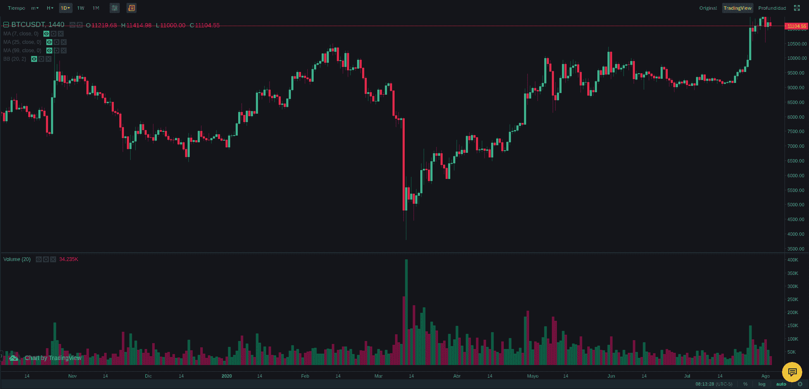
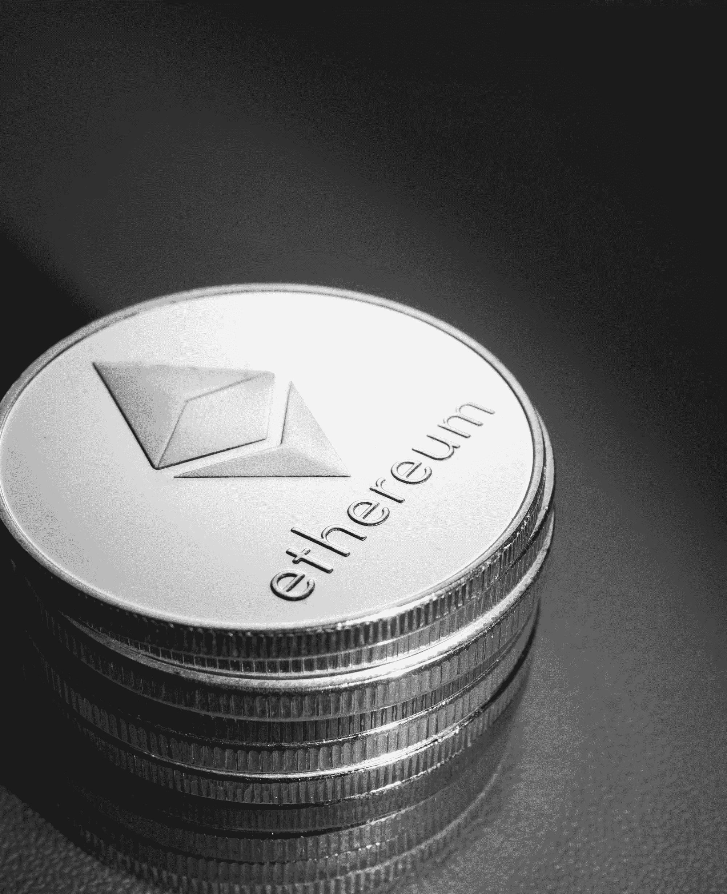

# 什么是加密中的滑移？

> 原文：<https://www.trality.com/blog/what-is-slippage-in-crypto/>

术语“滑点”在加密交易中很常见，根据它发生的方式，它可能是一个不受欢迎的惊喜，也可能是交易者的意外收获。

滑点是指市场订单的预期价格和交易执行价格之间的差异。这种差异不一定是负的或正的，才能被定义为滑点。

在这篇文章中，我们将深入探讨什么是滑动，它是如何工作的，为什么会发生，以及如何减少或避免它。

## 什么是滑点？

最简单的来说， [滑点](https://coinmarketcap.com/alexandria/glossary/slippage)发生在当市场订单的价格与要求的价格不同时。这通常被认为是负面的，但实际上价格差异可以是正面的、负面的或中性的。

滑点并不是加密货币市场的专利。它发生在所有类型的市场，包括外汇、股票、期货、股票和债券。然而，它更有可能发生在[动荡的市场条件下](/blog/staying-disciplined)，这就是为什么它在加密交易中如此普遍。

## 滑点是如何工作的？

当订单被执行时，一项资产在交易所以最有利的价格被买卖[。一种](/blog/best-crypto-exchanges)[加密货币的市场价格](/blog/how-does-cryptocurrency-gain-value)可能会快速变化，这使得在交易开始和完成之间的延迟期间可能会出现滑点。

最终结果可能等于、有利或不如预期执行价格有利。例如，让我们假设[索拉纳的](https://solana.com/)买入价/卖出价在一个加密交易平台上公布为 28.89 美元/28.92 美元。您下了 10，000 个 SOL 代币的市价订单，目的是以 28.92 美元成交。有三种可能的结果:

1.  **中性滑点:**你提交订单，订单以最优惠的价格成交，每张代币 28.92 美元——正是你想要的。
2.  **正滑点**:你提交订单，最佳价格波动，变为 28.89 美元。您的订单以每个代币 28.89 美元的较好价格成交，比您要求的价格低 0.03 美元，为您节省了 300 美元。
3.  **负滑点**:您提交订单，在您的订单被执行之前，最佳可用价格变为 28.97 美元。你的最终执行价格是每枚代币 28.97 美元，每枚代币增加 0.05 美元或负滑点 500 美元。

## **什么导致了滑动？**

每个市场都由买方和卖方组成。要执行完美的订单，必须有足够多的买家和同等数量的卖家。不平衡会导致价格波动，进而导致滑点。

导致滑点的两个最大因素是市场波动和低流动性。市场波动会导致资产买卖价差的突然变化。由于加密货币是不稳定的投资，一项资产的价格会根据交易量和交易活动在一天内波动。

流动性是指资产的可用性，以及在不影响其市场价格的情况下可以多快地进行买卖。[交易量](/blog/what-does-market-cap-mean-in-crypto)通常被用作资产流动性的指标。

当你下了一个大订单，但是在你选择的价格上没有足够的交易量来维持资产当前的买卖差价时，流动性低的影响最明显。流动性低的资产总是有较高的滑点百分比。

## 什么是滑移公差？

滑点允差指的是你执行订单的价格和你愿意接受的实际成交价格之间的差额。容差水平被设置为总交换值的百分比。

许多交易平台让用户选择他们的滑点容忍水平。在你执行市价单之前，它们会显示滑点估计和平均价格。大多数平台上的标准默认利率通常是 0.10%到 2%，可以选择手动调整到您喜欢的任何百分比。

## **如何最小化或避免打滑**

滑点在加密交易中是不可避免的，每个交易者都会发生。虽然没有办法 100%保证您的订单会以您想要的价格执行，但有办法将其影响降至最低。

### **使用有滑点公差控制的交易平台**

许多加密交易平台都有内置的设置，通过防止您的订单价格超出您选择的容忍水平太多来最小化负滑点。

如果价格超出了你的滑点容忍水平，那么订单会被自动拒绝。另一方面，如果价格以对你有利的方式波动，那么交易所将以更好的价格执行订单。

使用滑动公差设置可以根据需要调整的平台。比如去中心化交易所 [Uniswap](https://uniswap.org/) 的[默认滑点容差为 0.10%](https://app.uniswap.org/#/swap?chain=mainnet) 可以手动调整。

### **使用限制滑动的订单类型**

标准市场订单[以最佳市场价格](/blog/closing-trades)购买或出售加密货币，这对大多数交易者来说已经足够好了。然而，有一些订单类型是为那些希望更好地控制自己活动的交易者设计的。这些订单类型旨在控制滑点水平并最小化波动风险:

*   **限价单**:限价单是一种只以你指定的价格或更好的价格买入或卖出资产的订单。如果最好的价格比你选择的限价差，那么订单就不会被执行。这种订单类型是专为限制价格风险而设计的。
*   **限价止损单**:这是一种高级订单类型，有两种价格:限价，即你愿意支付的最高价格或你愿意出售的最低价格，以及止损价，即触发购买或出售的价格。这种订单类型适用于对价格敏感并希望降低波动风险的交易者。

### **仅在活跃时段交易**

与全球股票市场从上午 9:30 到下午 4:00 开放不同，加密市场全天候开放。然而，即使是[加密交易也有其高峰时段](/blog/best-time-buy-crypto)，视地区而定。你可以通过只在特定区域最活跃的时间交易来减少你的滑点百分比。

请记住，由于网络拥塞，区块链交易费在繁忙时间也会上涨。例如，当以太网(ETH)经历高交易量时，以太坊网络的天然气费用也会上涨，以激励在区块链上确认交易的矿工。

最小化滑点，同时为你的交易支付最少的汽油费需要一些技巧。幸运的是，像 ETH Gas Station 这样的众多资源对于[计算潜在的天然气费用](https://ethgasstation.info/)非常有用。

### **避免在重大新闻事件前交易**

重大新闻事件会导致大幅下滑，让你面临超出预期的风险。避免在公司产品发布或政府新规定等重大新闻事件期间执行订单。

查看经济日历，看看是否有任何与加密市场相关的重大新事件或数据发布。CoinMarketCal 是一个关于加密货币相关新闻的[经济日历的好例子。](https://coinmarketcal.com/en/)

## **最终想法**

滑点是交易中不可避免的一部分，在每个市场都很普遍。没有办法完全阻止，但是交易者也不是束手无策。你可以采取措施减少你的暴露。

仅交易具有充足交易量和流动性的资产，并使用有保证限额的订单类型来[减轻波动](/blog/optimizing-crypto-trading-strategies)的影响。许多交易平台也有在你执行市价单之前控制滑点容忍度的设置。

如果可能的话，尽量将交易活动限制在市场高峰时段。然而，要注意更高的交易成本。最后，时刻关注经济日历，看看是否有任何预定的公告会增加你的风险敞口。

把滑点想象成做生意的成本。它可以是积极的，也可以是消极的，但它通常是一个可以接受的成本，尤其是如果你想快速执行交易的话。