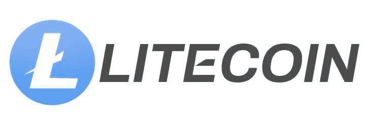
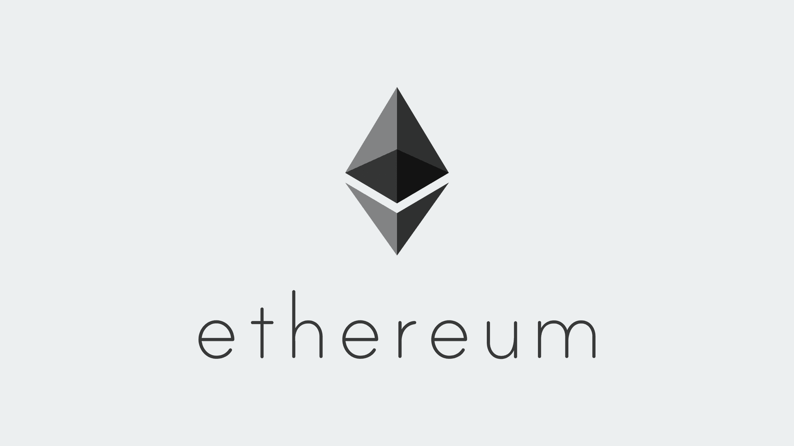

# 莱特币 vs 以太坊:哪个更好？

> 原文:[https://www.trality.com/blog/litecoin-vs-ethereum/](https://www.trality.com/blog/litecoin-vs-ethereum/)

尽管经历了牛市和熊市，甚至偶尔出现加密寒冬带来的深度冻结，加密货币仍然吸引着个人和机构投资者的注意力。但是用 [数以千计的加密货币](/blog/why-so-many-cryptocurrencies)可供选择，决定一种或几种特定的硬币往往会让投资者感到困惑，特别是当[加密货币的未来](/blog/the-future-of-cryptocurrency)可能不明朗的时候。

两种流行的选择，莱特币(LTC)和以太币(ETH)，是在加密货币早期崛起的第一批替代硬币，这可能解释了(至少部分)它们持续的重要性。然而，投资者和密码爱好者经常面临一个具有挑战性的任务，即确定哪种硬币更值得购买，或者两者是否都有可能在未来产生利润。

虽然这两种硬币都改善了比特币的缺点(只是不要让 BTC 的最大化主义者听到你把“缺点”和比特币相提并论)，但莱特币和以太坊已经发展成为有吸引力的投资。

让我们来看看这两种硬币，看看它们之间有什么不同。

## **什么是莱特币？**

有什么比直接找到来源更好的方法来了解莱特币呢？根据其网站的介绍，这是一种点对点加密技术，允许廉价的全球支付，由曾在谷歌工作的查理·李于 2011 年创立。

同年 10 月，Lee [在一个论坛帖子](https://cointelegraph.com/altcoins-for-beginners/what-is-litecoin-a-beginners-guide-to-ltc-and-how-it-works)中写道，希望利用比特币的技术创新创造一种替代品，一种可以被视为 BTC 黄金之外的白银。

由于处理比特币交易需要时间(每秒五次)，创建一个新区块大约需要 10 分钟。显然，有兴趣接受比特币支付的企业发现这种延迟令人沮丧，从开始到结束需要长达 60 分钟的等待。

如上所述，莱特币最初被认为是比特币的黄金，但它的主要差异(和卖点)包括更快的交易(56 tps)、更大的供应量和不同的哈希算法，以确保公平开采。企业发现莱特币的交易速度是比特币长确认时间的解决方案，允许他们接受莱特币，处理支付，因此更快地开展业务。

## **以太坊是什么？**

以太坊由 Vitalik Buterin 和 Gavin Wood 于 2015 年创立，是一个由区块链技术支持的去中心化全球平台。正如他们在网站上描述的那样，“以太坊对每个人开放数字货币和数据友好服务——不管你的背景和位置。这是加密货币以太网(ETH)背后的一项社区构建的技术，以及您今天可以使用的数千种应用程序。”

比特币被认为是区块链 1.0 的第一代区块链，以太坊则是第二代区块链(2.0)。虽然比特币是一种数字货币和价值储存手段，但以太坊的主要用途不仅仅是虚拟货币和价值储存手段。以太坊被认为是世界上最可编程的区块链，是全球支付、游戏和数千种分散应用的市场。

以太坊因其本地货币 Ether 或 ETH 而广为人知，它支持智能合约的有效运行，智能合约是开发去中心化应用程序(dApps)和[去中心化金融(DeFi)](/blog/decentralized-finance) 背后的重要工具。智能合约是以太坊区别于加密领域其他令牌的地方，由于以太坊的安全性、高可伸缩性和安全本质，大多数开发人员和企业都使用它来创建各种技术。

## **莱特币和以太币的关键区别是什么？**

莱特币和以太币是当今世界上最受欢迎的代用币。虽然它们有不同的用例，但是它们有一些共同的创新思想。此外，两者都是为了解决比特币的一些弱点而创建的。

我们来看看莱特币和以太币的关键区别。

### **历史**

莱特币是 2011 年比特币之后，以太坊是 2015 年出现的。虽然莱特币是一种加密货币，但需要注意的是，以太坊是一个区块链平台，其原生硬币是以太。

### **目的**

莱特币的主要设计是在没有外部金融机构干预的情况下，廉价而快速地处理点对点支付。另一方面，以太坊可以处理更复杂的事务，支持各种应用的开发。

### **供给极限**

莱特币的最大供应量约为 8400 万枚硬币，这意味着它和比特币一样是固定的。再也不会有超过这个神奇数字的莱特币了，这个数字大约是 BTC 供应量的四倍。相反，以太坊没有固定的供应限额，使其不那么稀缺。

### **采矿**

目前，ETH 的采矿速度比 LTC 快得多。正如 [Investopedia](https://www.investopedia.com/articles/investing/042015/bitcoin-vs-litecoin-whats-difference.asp) 解释的那样，Litecoin 使用工作证明(PoW ),但与比特币不同，它依赖于对大量内存的访问，而不仅仅是中央处理器(CPU)或图形处理器(GPU)的计算能力。虽然以太坊也使用工作证明协议，允许用户通过验证交易来挖掘奖励，但它正在过渡到利益证明(PoS)协议，使挖掘更容易。

### **交易速度**

交易速度各不相同。以太币比莱特币更容易挖矿，交易速度更快。莱特币交易需要挖掘新的区块，这降低了其交易速度(每秒 54 个，莱特币区块链上的新区块大约每 2.5 分钟创建一个)。与 ETH 的阻塞时间为 15 秒(意味着每分钟可以确认多个交易)相比，我们在这方面有明显的赢家。

### **交易费用**

根据一些估计，每笔 ETH 交易的平均交易费为 0.85 美元，而 LTC 的平均交易费为 0.04 美元。因此，与莱特币相比，以太坊网络上的交易费用更高，而且经常因[高昂的汽油费](https://cointelegraph.com/explained/will-the-ethereum-20-update-reduce-high-gas-fees)而加剧。

## 莱特币和以太币:哪个更好买？

大多数投资加密货币的人显然希望看到他们的投资获得可观的回报。以太坊和莱特币的未来需求将取决于它们的用例采用情况以及它们为投资者和用户提供价值的程度。

这些年来，莱特币和以太坊都表现出了不错的投资回报。考虑到[市值](/blog/what-does-market-cap-mean-in-crypto)，在本文撰写之时，以太坊的市值为【22.62 亿美元，大约是莱特币[45 亿美元](https://coinmarketcap.com/currencies/litecoin/)的五倍。但是如果比较价格的话，那么以太币明显要比莱特币贵很多。

当做出购买决定时，根据某些标准选择硬币很容易，但历史一再向我们表明，在密码领域没有什么是 100%确定的。那么，我们应该扣动 ETH 还是 LTC 的扳机呢？莱特币不是以太坊的主要竞争对手，随着区块链技术获得更广泛的采用，随着人们开始使用越来越多的各种 dApps，对 ETH 的需求只会增加。

让我们给 Jay Blaskey 最后一句话(在前面提到的福布斯文章中)，他认为莱特币可能很适合经验丰富的加密货币投资者的投资组合——特别是那些“想要一种组合价值储存资产和便利交易的附带利益”的人

## 你现在应该投资莱特币和/或以太坊吗？

很难判断[购买加密货币](/blog/best-time-buy-crypto)的正确时机，更不用说判断在加密的冬天，现在是否是投资 LTC 和/或 ETH 的好时机。当然，你可以依靠[以太币价格预测](/blog/ethereum-price-prediction)以及[莱特币价格预测](/blog/litecoin-price-prediction)来给你一个更好的方向。

然而，与比特币和以太坊不同的是，莱特币未能在 2021 年的牛市中创下历史新高。这并不意味着不利于投资。它只是表明莱特币与 ETH 相比具有较低的风险回报比。根据 [Longforecast 预测](https://longforecast.com/litecoin-price-prediction-for-2018-2019-2020-2021-ltc-to-usd#.Wiv1aA9wYxA.twitter)，莱特币有望在 2025 年触及 1216 美元，到 2033 年达到 2300 美元。

## **结论**

鉴于加密技术具有挑战性的市场条件，投资莱特币或以太币应该从长计议。

对一些人来说，这是以最低价格买入的绝佳机会。对其他人来说，在他们考虑再次投资之前，市场需要稳定下来。

像往常一样，通过检查各种信息来源来做自己的研究，从[最佳加密新闻网站](/blog/best-crypto-news-websites)和[最佳加密播客](/blog/best-cryptocurrency-podcasts)到更长的阅读，如[最佳加密书籍](/blog/best-cryptocurrency-books)。

记住:不要冒超出你承受能力的风险。