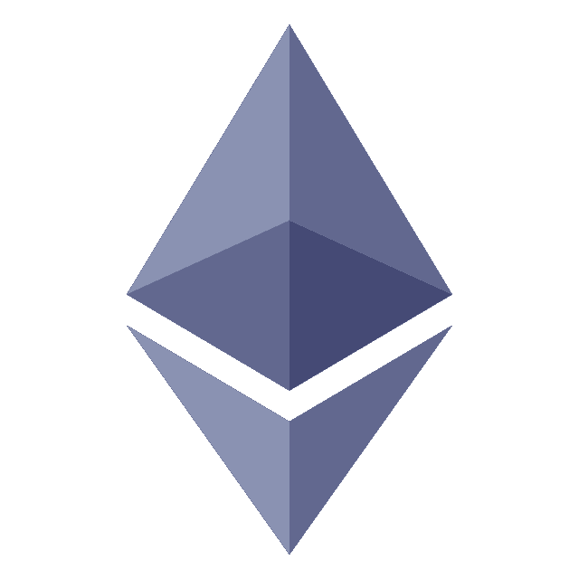
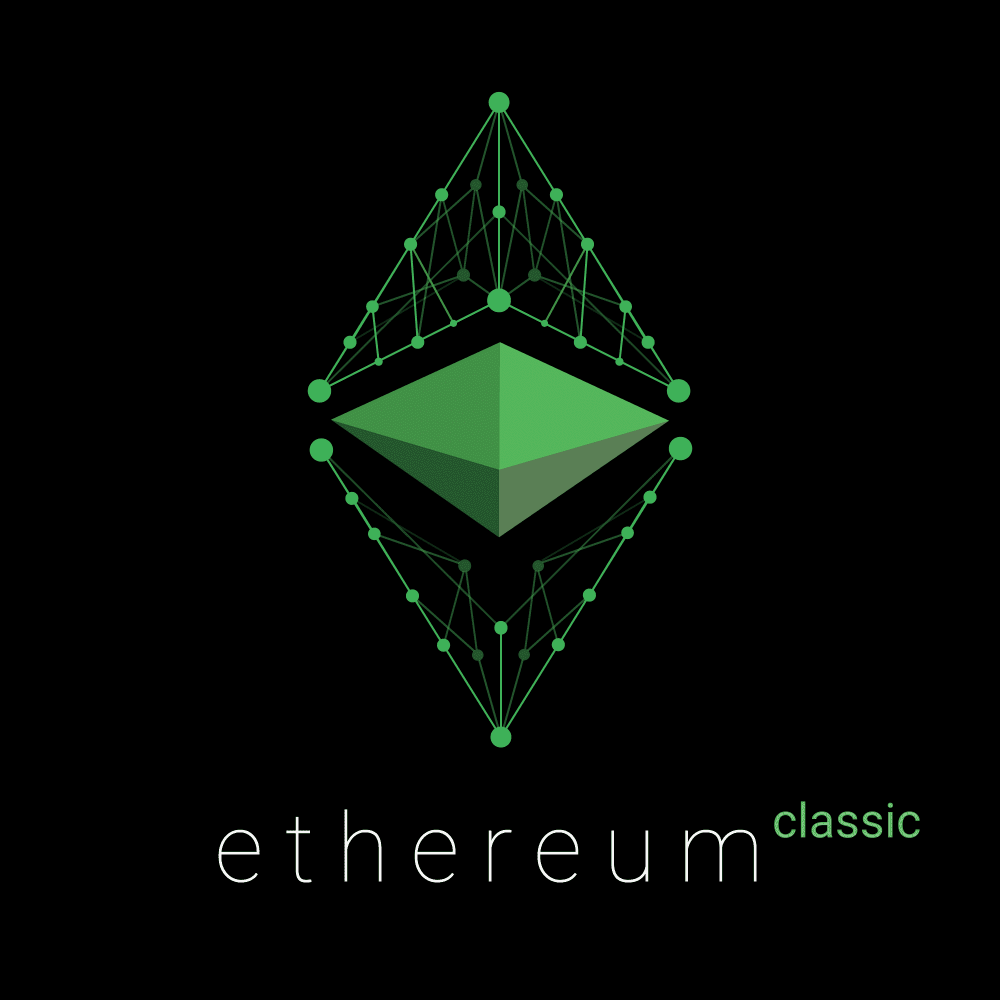

# 以太坊 vs 以太坊经典:哪个更好？

> 原文：<https://www.trality.com/blog/ethereum-vs-ethereum-classic/>

以太坊和以太坊经典在很多方面都很相似，但都有区别于其他的独特品质。在本文中，我们将比较以太坊和以太坊经典版，以帮助您决定哪一个适合您。

## **以太坊是什么？**

 [对投资者来说最好的加密货币](/blog/best-cryptocurrencies-to-invest-in)[以太坊](https://ethereum.org/en/)是一个基于区块链技术的去中心化、开源软件平台。它支持在其上构建智能合约和分布式应用程序。智能合同是区块链网络可以验证的自动执行协议。

作为所谓的 [DeFi 或分散金融](/blog/decentralized-finance)的关键组成部分，它可以用于创建安全的数字应用程序，以及操作任何类型的商业或金融合同。它有自己的原生令牌，[以太(ETH)](https://coinmarketcap.com/currencies/ethereum/) ，可以用来在以太坊网络上进行电力交易和执行智能合约。

2016 年 6 月，以太坊区块链被黑，价值约 6000 万美元的以太坊被盗。执行了一个[硬分叉](https://help.coinbase.com/en/coinbase/getting-started/crypto-education/eth-hard-fork)来重新获得对网络的控制，创造了区块链的两个版本:以太坊和以太坊经典。ETH 和 ETC 都基于相同的项目，但在许多独特的方面彼此不同。

## **什么是以太坊经典？**

以太坊经典是一种流行的加密货币，是一种去中心化的、开源的、提供智能合约功能的货币。这是最初的以太坊区块链，其本土货币被称为等。

以太坊经典起源于 t [he DAO](https://www.gemini.com/cryptopedia/the-dao-hack-makerdao) 被黑(DAO 是使用原区块链的以太坊智能合约)时原以太坊网络的分裂。结果是两个独立的区块链，以太坊经典和新以太坊。现在，ETC 被用于推动以太坊经典网络上的交易和智能合约。

除了保护网络安全之外，hard fork 还确保所有被盗资金归还给其合法所有者。以太坊的支持者最初在采取何种措施来纠正这种情况上存在分歧，因为一些人认为 Dao 的投资者应该承担支持一个妥协项目的责任。

以太坊经典背后的主要思想是“代码就是法律”——软件代码不能被篡改的概念。但是社区的大多数人不同意。

## **以太坊和以太坊经典有哪些关键区别？**

以太坊经典和以太坊都源自以太坊区块链，但它们在几个方面有所不同。ETC 是一种具有固定供应量的投机性数字资产。ETH 只是基于以太坊网络的众多代币之一，但它比 ETC 获得了更多的认可。

### **概念**

类似以太坊，以太坊经典是作为矿工的奖励而发行的。它的最大供应量为 210，700，000 等，而最初的以太坊没有固定供应量。[以太坊计划将](https://time.com/nextadvisor/investing/cryptocurrency/ethereum-merge-what-to-know/)从依赖工作证明(PoW)的系统迁移到使用利益证明(PoS)的系统。与此同时，以太坊经典公司打算保留原有的挖掘算法。

### **人气**

以太坊是两者中更受欢迎的，被广泛认为是标准。2022 年 4 月，它的交易价格约为 3520 美元，而 ETC 的交易价格为 46 美元。ETH 在 2021 年 11 月 10 日的峰值价格在 4800 美元以上，而 ETC 在 2021 年 5 月达到 175 美元的历史高点。

### **投资风险**

以太坊比以太坊经典拥有更大的用户群和流动性。这使得 ETH 整体波动性更小，在交易所更受欢迎，这可能会降低投资风险。以太坊还得到了[企业以太坊联盟](https://entethalliance.org/eea-members/)的支持，这是一个由 200 多名成员组成的团体，包括像微软和摩根大通这样的大公司。

### **用例**

ETH 可以为[去中心化的应用](https://ethereum.org/en/dapps/) (dApps)提供燃料，用户需要使用这些应用来参与平台。用户有时需要使用 ETH 来换取其他必要的令牌。其他时候，dApps 可能需要少量的 ETH 来执行特定的操作。没有 dApps 或任何其他基于以太坊经典的应用程序。

## 以太坊和以太坊经典:哪个更好买？

虽然 ETH 和 ETC 都提供智能合约，但以太坊在受欢迎程度、社区信任度和市场价值方面已经超过了其竞争对手。事实上，ETH 是世界上仅次于比特币的第二大加密链，与它竞争的区块链如 Cardano T1 仍然远远落后。

### **关注以太坊经典**

以太坊经典已经被一个矿工或者一群矿工成功攻击过几次了。它受到了 51%的攻击，这种攻击发生在矿工获得对网络散列率超过 51%的控制，然后用它来双重消费和窃取硬币。这些担忧可能会阻止以太坊经典版智能合约在重大金融交易中的使用。

ETC 的另一个问题是它的扩展潜力。它只能处理 15 tps(每秒交易量)，低于 Visa 等支付网络处理的 1,000 tps。尽管以太坊经典已经经历了几次软件升级，但其支付系统的可扩展性仍然是一个重大挑战。

### **ETH 的电位**

如前所述，以太坊正在从工作证明协议转变为利益证明协议(也称为[以太坊 2.0](https://www.forbes.com/advisor/investing/cryptocurrency/ethereum-2/) )，这将使用户能够验证交易并根据他们持有的以太网创建新的以太网。此次升级增加了以太坊的容量，以支持其不断增长的用户群，从而减少网络拥塞并降低交易费用。

以太坊也在不断被采用，甚至被一些知名企业采用。例如，[高级微设备公司(AMD)宣布在 2020 年与 ConsenSys](https://www.irishtimes.com/business/technology/amd-and-consensys-joint-venture-chooses-dublin-for-its-headquarters-1.4287587) 合作，利用以太坊平台建立数据中心网络。

[微软和 ConsenSys](https://consensys.net/blog/press-release/consensys-expands-blockchain-service-capabilities-on-microsoft-azure/) 从 2015 年开始合作，在微软的 Azure 云平台上开发以太坊区块链即服务(EBaaS)技术。

## **现在应该投资以太坊和/或以太坊经典吗？**

是否应该投资以太坊或以太坊经典取决于你的交易目标和投资组合的策略。不过，在这两者之间做出选择时，你需要记住一些事情。

ETC 的前景似乎不如以太坊，因为以太坊是更广泛使用的网络，特别是考虑到以太坊经典版的安全问题。在以太坊经典得到改进以减轻未来威胁之前，该项目很可能会面临持续的挑战。

作为一种数字资产，ETC 具有一定的投机价值，但 ETH 的交易仍然更加广泛，经常被视为[数字银对比特币的数字金](https://www.forbes.com/sites/martinrivers/2021/09/27/if-bitcoin-is-digital-gold-then-ethereum-is-digital-silver-deutsche-bank/)。观察资本或投资等东西在两种硬币中的投入程度，通常会有助于更好地了解投资者的整体看法。

就[市值](/blog/what-does-market-cap-mean-in-crypto)而言，以太坊的价值高于以太坊经典。有 1.352 亿股 ETC 流通，市值约为 28 亿美元。相反，ETH 有 120 枚流通硬币，市值超过 2168 亿美元。截至 2022 年 6 月 10 日，ETC 的估值为每枚硬币 21 美元，而 ETH 的估值超过 1790 美元。

ETH 也更具流动性。与 ETC 相比，ETH 更容易买卖和交易，因为并非所有交易所都提供 ETC。对于寻求流动性和可广泛获得的投资的投资者来说，ETH 可能是更好的选择。与此同时，对于那些重视不变性和不能干预账目的人来说，ETC 可能是一个更好的选择。

在决定投资成千上万种加密货币中的任何一种之前，花时间考虑一下你自己的需求和投资目标。你应该经常通过咨询一系列信息来源来做自己的研究，这些信息来源可以包括像[价格预测](/blog/ethereum-price-prediction)、[最佳加密书籍](/blog/best-cryptocurrency-books)、最佳加密新闻网站[和最佳加密播客](/blog/best-crypto-news-websites)[等。](/blog/best-cryptocurrency-podcasts)

## **最终想法**

如果你想对投资加密货币代币做出明智的决定，了解以太坊和以太坊经典之间的区别是很重要的。以太坊和以太坊经典都是开源的区块链平台，目标相似。然而，它们在技术能力、社区支持、用例以及市场价值方面有很大的不同，在构建投资组合或使投资组合多样化时，理解这些不同是至关重要的。