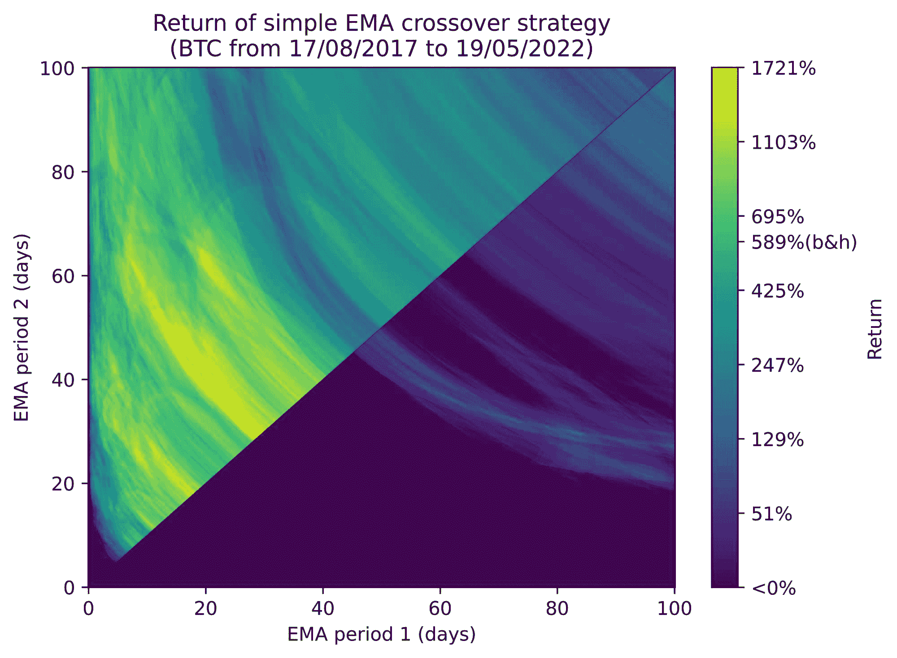
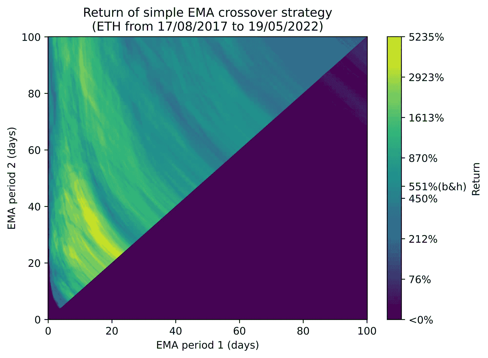
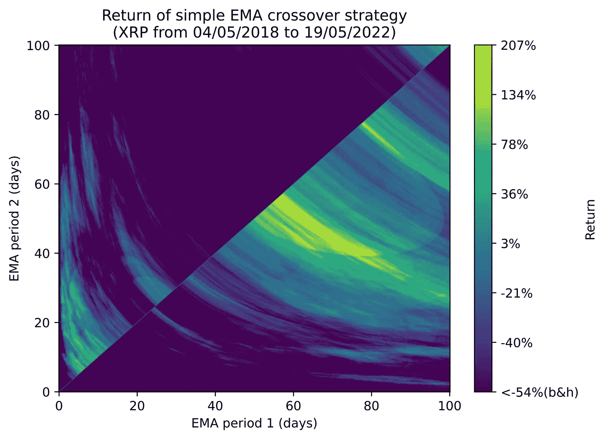
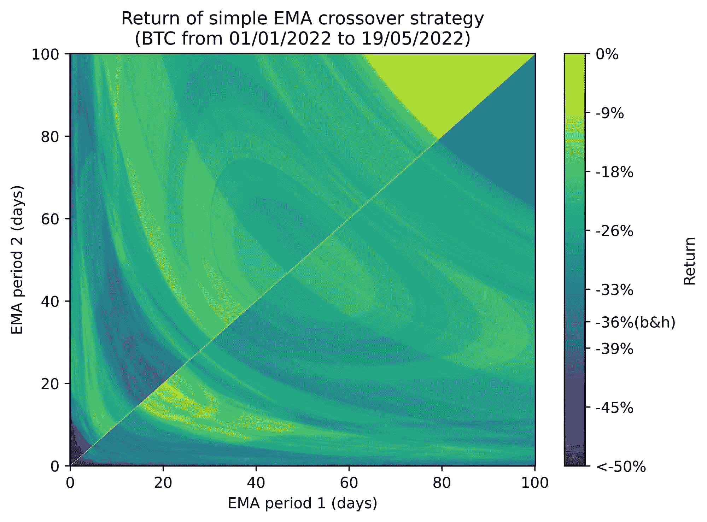
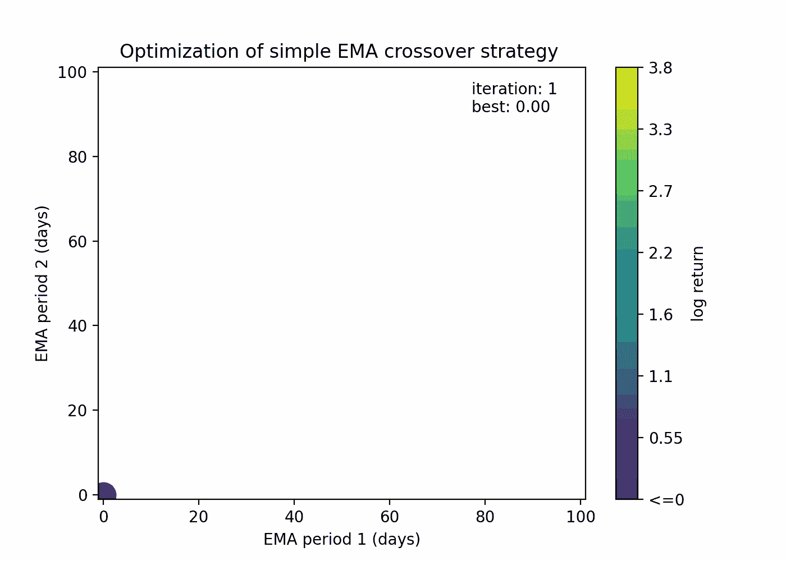
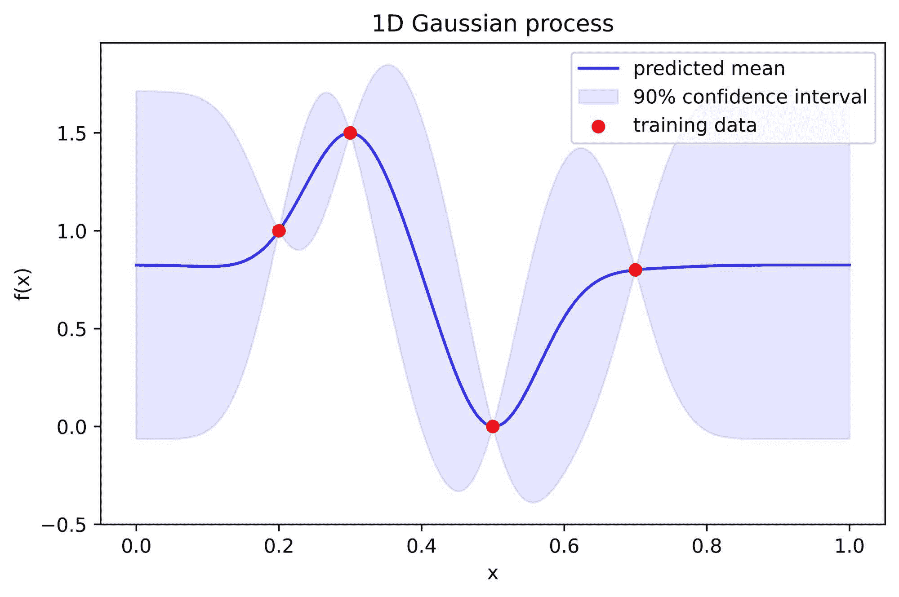
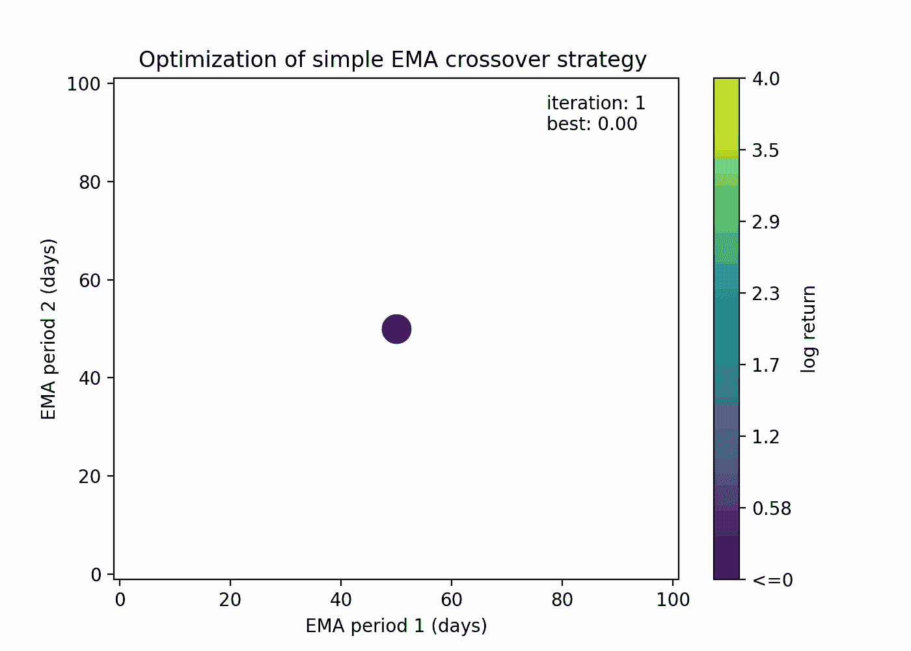

# 寻找最佳策略参数:优化算法导论

> 原文:[https://www . trality . com/blog/an-introduction-to-optimization-algorithms-for-trading-strategies/](https://www.trality.com/blog/an-introduction-to-optimization-algorithms-for-trading-strategies/)

在建立交易策略的整个过程中，你的基本目标是最大化你的机器人的盈利能力。为了实现这一点，您通过反复试验的过程，并在回溯测试结果的指导下，寻找最佳的代码片段。如果你非常确信你的策略背后的总体想法是合理的，那么你可以尝试通过应用小的改变和探索不同的变化来改进它。

您可能已经知道，微调策略非常耗时，尤其是当您想要探索许多替代设置时(并且回溯测试的执行不是即时的)。此外，这些变化通常包括调整一些数值参数。

你所做的就是所谓的**优化**，好消息是，在一些情况下，它可以被自动化！

在这篇文章中，我们将深入研究优化以及如何将它应用到交易策略中。正如我们将看到的，优化将通过允许它利用数据的力量来改进您的机器人。

## **策略优化**

在谈论优化之前，我们必须介绍参数和参数化策略。参数基本上是策略中的变量，其值不是预定义的。例如，战略

*(S1)*“*在 EMA(周期 1 ) > EMA(周期 2 )时买入并持有 100 美元的 BTC，否则平仓*是一个参数策略，取决于两个参数:周期 1 和周期 2。

将此策略应用于历史数据(即回测)将允许我们计算不同的绩效指标(如 PnL 和夏普比率)。

现在的问题是:

*(Q1)给定一个参数策略，哪些参数值会让我的策略盈利？哪些是最好的？*

这就是我们试图回答的，但这是一个困难的问题。先问另一个问题:

*(Q2)给定一个参数策略，在过去的一段时间内，哪些参数的值会产生最佳性能？*

Q2 问题更类似于数学优化试图解决的那种问题。我们有一个函数 f()，我们希望从某个备选项集中找到输入**，使得 f( ***x*** )最大化或最小化。在我们的例子中，f()是在给定时间段内执行的参数策略的性能，作为其参数 ***x*** 的函数。业绩可以是任何描述性指标，例如总回报或夏普比率。**

**回到我们之前的例子，优化问题可以这样表述:**

***“找出周期 1 和周期 2 在 1 小时和 60 天之间的值，使策略 S1 的总回报最大化”***

**下图显示了 S1 策略的总回报与其两个参数的函数关系:**

******

** 

****Performance of strategy S1 trading Bitcoin from 17/08/2017 to 19/05/2022\.** For both BTC and ETH (2017-2022), there are many combinations of the periods in the period2 > period1 region (trend-following strategy) that lead to large returns; these are also better than a buy-and-hold strategy (b&h). Notice how for small periods the strategy fails, since trading fees (here 1%) heavily affect the returns when trading frequently.**

**我们还可以观察不同场景下的性能变化:**

******

** 

****Performance of strategy S1 trading Ethereum from 17/08/2017 to 19/05/2022****

******

** 

****Performance of strategy S1 trading Ripple from 04/05/2018 to 19/05/2022.** The situation is the opposite for XRP, where better parameters combinations are mostly in the period2 < period1 region (mean reversion strategy).**

******

** 

****Performance of strategy S1 trading Bitcoin from 01/01/2022 to 19/05/2022.** The same plot for BTC during the bearish 01/2022 - 05/2022 period shows that it was not possible to take any profit using this strategy, although it was still possible to improve the buy-and-hold strategy.**

**在上面的实验中，我们可以看到，对于 BTC，我们的最优解大约是在周期 1 =17 天和周期 2 =46 天时，我们得到的 log 2 回报率约为 4。**

**为了生成这些图，我们简单地计算了两个参数的大量组合(360，000！)，在大多数情况下是不可行的方法，评估一个点非常耗时，或者参数太多。**

**因此，我们需要以更聪明的方式在参数空间中搜索解。这一挑战由高级优化器解决，高级优化器是试图在有限的时间量或目标函数的评估次数内找到好的解决方案的优化算法。**

## ****优化器****

**已经开发了无数的优化算法，其中许多很受欢迎，可以在 Scipy 这样的科学图书馆中找到。这种蓬勃发展的变化部分是由于优化者擅长于解决特定类别的问题，这些问题可能在一些基本特征上有所不同。**

### ****局部和全局优化****

**存在这样的问题，人们可以满足于找到局部最优，但不能保证它也是全局最优。局部最优值是一个输入值，其目标函数优于紧邻的任何其他点。另一方面，全局最优是目标函数相对于整个输入域具有最佳值的值。**

**局部优化器的一个例子是简单梯度下降，它包括在函数的局部改进方向上执行步骤。**

**全局优化器的一个例子是模拟退火，在这种情况下，不需要进入太多的细节，从当前的解决方案中随机跳转以改进它。**

## ****梯度信息的可用性****

**可以构建一个可微函数 f()，使得给定一个输入 ***x*** 和函数 f( ***x*** )的值，可以提取 f()在 ***x*** 、∇f( ***x*** 处的梯度，而无需对 f()进行任何额外的评估。**

**梯度信息真的很有价值，因为它告诉我们函数将向哪个方向改进，而与参数的数量无关！这是一个游戏改变者，它是神经网络巨大成功的背后(这里梯度的计算被称为反向传播)，其中参数的数量也可以是几十亿。**

**举个例子，假设我们有一个二元函数，f(，),我们想在点( *x 1* =1， *x 2* =3)对它求值。我们得到 f(1，3)=2.5，还有∇f(1，3)=( *x 1* =-2， *x 2* =+1.5)。这意味着如果我们在( *x 1* =-2， *x 2* =+1.5)的方向上从( *x 1* =1， *x 2* =3)执行一小步，函数 f(，)将会增加，例如(*x1***

**利用梯度信息的优化器通常被称为基于梯度的优化器。梯度下降是这类优化器的一个基本例子。**

**梯度信息不可用的设置称为无梯度优化。无梯度优化是一个完全不同的游戏；目标函数更类似于一个黑盒，当处理大量参数时，这些算法通常会遇到困难。模拟退火是无梯度优化的一个例子。**

**可以考虑的另一个特征是目标函数的**平滑度**，即，函数中是否有跳跃。虽然平滑是基于梯度的优化中的一个要求(否则不可能计算梯度)，但它在无梯度优化中不是严格必需的。然而，它值得注意，因为有一些优化器依赖于梯度的经验近似，以便确定最佳方向。对于非光滑函数，这种近似将会失败。**

## ****为交易策略选择合适的优化工具****

**我们已经看到不同的问题需要不同的优化器，但是哪些最适合参数交易策略呢？**

**我们已经可以做出三个假设:**

1.  **我们需要一个全局优化器，因为可能会有许多不令人满意的局部最优解，我们希望优化器能够达到全局最优。然而，局部优化与全局优化结合起来仍然非常有用。**
2.  **我们可以有把握地说，我们正在处理无梯度优化。建立一个参数化的交易策略并不是不可能的，但是这需要特别小心，并且会对策略本身有一些限制。例如，让我们考虑参数策略 S1 的总回报作为目标函数 f(周期 1 ，周期 2 )。这个函数不是由简单的、可微的函数和已知的导数组成的，所以不能计算梯度。这也意味着不能保证它是可微的。**
3.  **策略对其参数的非平滑依赖非常普遍，因此拒绝平滑假设更安全。例如，每当交易由依赖于实值参数的条件触发时，交易要么被执行，要么不被执行；没有中间道路，构成了不顺畅。**

**有几个优化器符合这些条件，一些例子包括网格搜索、贝叶斯优化、模拟退火、粒子群、进化算法和差分进化。在接下来的小节中，我们将讨论几个这样的优化器，它们代表了一个很好的起点。**

## ****网格搜索****

**网格搜索是最基本的全局优化方法。它通过评估多维网格中每个点的函数并最终取最佳结果来工作。它也被称为“强力优化”，因为人们只是尝试每个参数的一些可能值的每种组合。**

**让我们看一个例子:**

**设想一个由函数 f()表示的交易策略，它取决于参数*p1T3】和 *p 2* ，这两个实数都属于[0，24]区间。***

**我们通过为每个参数取 5 个等间距值，然后组合它们来构建点网格:**

***p1T3】∈{ 0，6，12，18，24}***

***p2T3】∈{ 0，6，12，18，24}***

**所以我们在*p1T5】和*p2:*f(*p1*= 0， *p 2* =0)，f( *p 1* =6， *p 2****

**这是网格搜索应用于我们的 EMA 交叉示例时的样子:**

****

****Grid search optimization applied to strategy S1 trading BTC.** In this example points are evaluated with a specific order, while in general there is no need to to this.**

**基本原理是以统一的方式探索参数空间，限制为 n 次猜测。尽管这是一种非常简单的方法，但是当对目标函数没有任何假设时，它仍然是有价值的。**

## ****贝叶斯优化****

**与网格搜索相比，贝叶斯优化是一种非常复杂的方法，但它的逻辑仍然比许多其他优化器更简单。**

**贝叶斯优化可以总结为以下步骤:**

1.  **拟合一个概率模型 ff 的模型():***x***→f(***x***)利用已经评估过的点的集合{(***xI***，f(***xI***)}。模型 f 模型()将每个输入 ***x*** 映射到可能输出值的分布。**
2.  **选择对应于分布 f 模型 ( ***x*** )的点***【x】**猜测*** ，其预期给出超过当前最佳值的最佳改进。**
3.  **求 f( ***x 猜*** )并从 2 开始重复。**

**简而言之，这就是贝叶斯优化，但是让我们深入细节。**

**首先，假设我们要最大化目标函数 f()并且我们已经从一组评估点{( ***x i*** ，f(***xI***)}(我们可以在开始时随机采样几个)。**

**拟合的概率模型通常是高斯过程。高斯过程是将输入空间的每个点 ***x*** 关联成正态分布 N(μ( ***x*** )、σ( ***x*** ))作为 f()的估计的机器学习模型。函数μ()和σ()是由模型拟合的。它的工作原理大致类似于最近邻模型:μ( ***x*** )接近 f()的被评估点靠近 ***x*** ，σ( ***x*** )随着 ***x*** 远离任何其他点而变大。所以基本上高斯过程的假设是你期望一个点 x 的 f( ***x*** )接近接近 ***x*** 的点的 f()，你的不确定性随着 ***x*** 远离其他被评估的点而增加。很合理，对吧？**

******

** 

****Example of Gaussian process model with few training samples****

**现在我们有了一个估算 f()的模型 f 模型(),我们对在哪里选择下一个点进行评估有了更清晰的认识。我们想要选择 ***x*** 使得 f 模型 ( ***x*** )具有大的期望值，因为我们正在进行最大化，但是也具有大的不确定性，因为我们想要潜在的改进大。**

**例如，如果当前最大值为 2，您宁愿选择在 ***a*** 处计算 f( ***a*** ) = N(μ=1.8，σ=5)还是在 ***b*** 处计算 f(***b***)= N(μ= 1.9，σ=0.1)？**

**第一种选择看起来更好。此外，通常的标准是选择 ***x*** ，其在当前最大值上最大化预期改进。选择的标准被称为*采集函数*，它告诉我们评估某一点是多么方便。所以，给定一个获取函数 g()，我们最终会选择的是 ***x 猜测*** 使得 g(f 模型 ( ***x 猜测*** ))最佳。**

**现在，我们结束了一个不同的优化问题，但这要容易得多，因为 g(f model ())的求值速度很快(比 f())快得多)，平滑，并且梯度可用。在这里，我们可以用任何全局优化器来解决这个问题(也包括那些需要执行大量函数求值的优化器)。**

**让我们看看贝叶斯优化在 EMA 交叉示例中的表现:**

****

****Bayesian optimization applied to strategy S1 trading BTC****

**您可以看到，该算法能够猜测接近当前最佳解决方案的点，并探索新的领域。**

**总之，贝叶斯优化的主要优势是:**

*   **相对于函数求值的次数来说，它是很吝啬的。**
*   **它不需要对目标函数做任何假设。**
*   **这很合理，因为它基于逻辑(“概率”逻辑)。**
*   **它是可定制的(概率模型，采集功能)。**

**虽然主要缺点是:**

*   **它可能需要手动调谐。**
*   **高斯过程不适合大的维度(大于~10)。**
*   **高斯过程在观察数量方面没有很好的伸缩性。**
*   **f()的求值不贵的情况下大概没啥用。**

**因此，在处理评估成本高昂的目标函数时，贝叶斯优化是理想的，在这种情况下，参数的数量相对较少，并且您不想对目标函数做任何假设。这些情况在交易策略中经常遇到。**

## ****计算考虑****

**优化一个交易策略有多贵？这取决于回溯测试的速度和优化器的速度。**

**对于大多数优化器来说，计算下一个要评估的点花费了与单个回溯测试无关的时间。所以优化的瓶颈几乎总是回溯测试。然而，如果您的回溯测试器足够快，您可以选择避免像贝叶斯优化这样的吝啬方法，它用计算时间来交换函数求值的次数，以获得下一个求值点。**

## ****结论****

**我们现在已经看到了如何优化策略的参数，以便最大化回溯测试的性能，重点关注两个必须知道的优化器。**

**这回答了我们的第二个问题，这个问题和原来的问题还是有很大区别的。下面这个问题仍然没有答案:一个好的回溯测试是否意味着这个策略在看不见的场景中有好的表现？一般来说，情况并非如此，所以我们必须在几个方面投入大量注意力，才能实现这一点，避免**过度拟合**。**

**过度适应的主题是非常基本的，值得单独写一篇文章，但是我们仍然可以预测一些方法来提高你的策略的重要性:**

*   **数据:在不同的场景下测试你的策略(牛市，熊市，横盘)。**
*   **参数:保持你优化的参数数量少；包含的参数越多，需要的数据就越多。**
*   **验证:在看不见的数据上测试你的策略，只要有可能就进行多次训练测试分割(查看*步行前进优化*)。**

**在 Trality，我们致力于在我们的平台中提供优化工具，帮助用户在回溯测试中获得更好的结果，敬请关注下一次更新！**