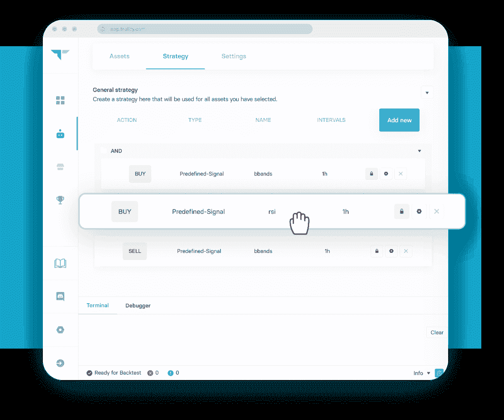
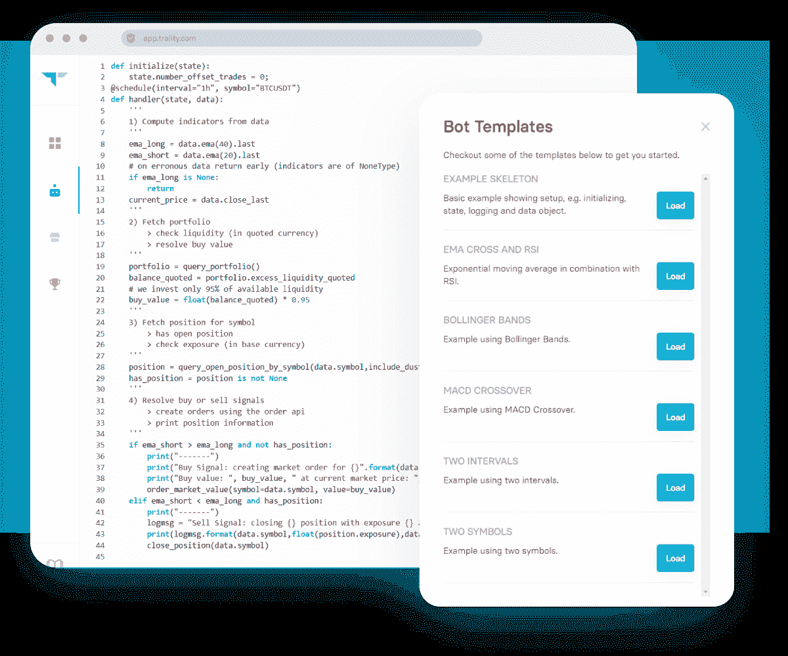
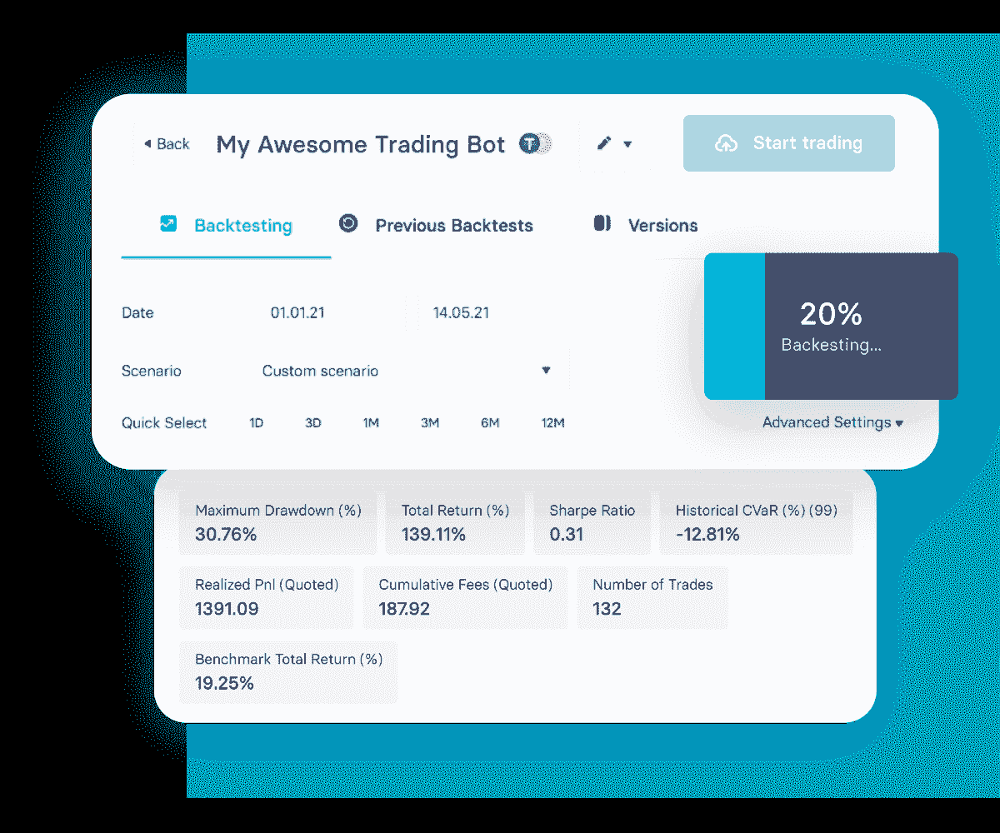
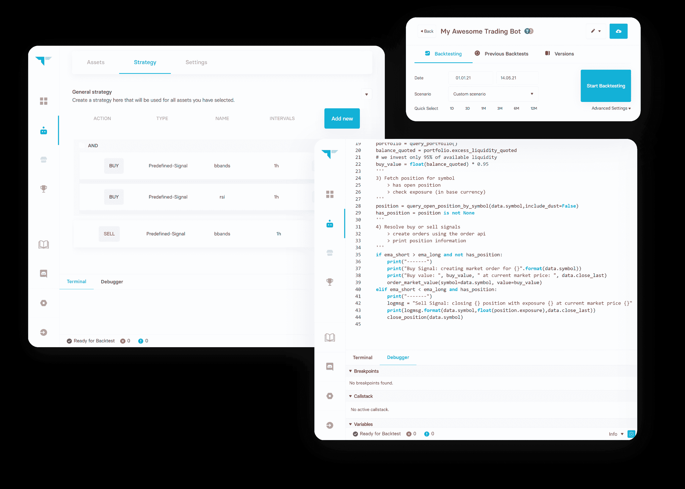

# 加密交易机器人:最终初学者指南

> 原文:[https://www.trality.com/blog/crypto-trading-bots/](https://www.trality.com/blog/crypto-trading-bots/)

时不我待，金融市场也不例外，尤其是在加密货币交易这个不可预测的世界，这就是为什么精心制定的安全可靠的交易策略至关重要。 [与传统的股票市场](/blog/crypto-versus-stocks)不同，加密货币交易从不停止，使得私人交易者几乎不可能跟踪市场波动，分散风险，减少错误，并确保每年 365 天每天 24 小时，每周 7 天的交易纪律。

当然，除非你有一些帮助，这就是**加密交易机器人**发挥作用的地方。

## 用 Trality 创造最好的加密交易机器人

查看 Trality Rule Builder，这是一个最先进的工具，允许您创建自己的自动化加密交易机器人，以最小化风险，限制损失并增加利润！

[https://www.youtube.com/embed/ugtCnc-wW7s](https://www.youtube.com/embed/ugtCnc-wW7s)

<button type="button" class="chakra-button css-1hnfsz">Try it for FREE</button>

## 什么是加密交易机器人？

机器人只是一个在互联网上运行的自动化程序，比人类更有效地执行重复的任务。事实上，一些估计表明，超过一半的互联网流量是由机器人组成的，它们与网页和用户互动，扫描内容，并执行其他任务。

密码交易机器人在相同的基本原则下运作。它们是基于预先设定的参数使用人工智能执行功能的软件程序。不再错过交易或机会。无论你是想买入[最被低估的加密货币](/blog/most-undervalued-crypto)还是简单地将[新的加密货币](/blog/how-to-find-new-crypto-coins)添加到你的投资组合中，你都可以通过使用加密交易机器人，在世界任何地方以及时、高效和自动化的方式日夜自动购买、出售或持有资产。

### **虚假的高回报承诺:如何避免虚假的加密机器人**

关于加密交易机器人如何工作，首先要理解的是，并非所有的机器人都是生来平等的。交易平台上的绝大多数加密交易机器人都是由匿名机器人创建者制作的，他们希望将自己的通用机器人出售给尽可能多的人。通常，用户会被高回报的承诺所诱惑，但没有任何实质性的数据来支持这种说法。事实上，[许多密码交易机器人只是骗局](/blog/cryptocurrency-scams)。通常，你不知道这个机器人实际上是如何工作的，甚至不知道它是否工作，因为你没有关于它或它的创造者的任何数据。这就是机器人不为你工作的原因。

## 加密交易机器人是如何工作的？

为了在加密交易所与加密机器人进行交易，您必须授权交易机器人通过 API 密钥(应用程序接口)访问您的帐户，并且可以随时授予或撤销访问权限。那么，盈利的加密交易机器人的实际机制是怎样的呢？通过与[crypto exchange](/blog/best-crypto-exchanges)直接通信，并根据您自己的预设条件自动下单，Trality 上创建的交易机器人提供了非凡的速度和效率，更少的错误和不带感情的交易，适合您个人的风险承受能力和投资目标。

大致来说，交易机器人在四个基本阶段工作:**数据分析>信号生成>风险分配>执行**。

*   数据为王，这就是为什么**数据分析**对加密交易机器人的成功至关重要。与人类不同，[机器学习](/blog/machine-learning-in-trading)支持的软件可以更快、更智能、更好地识别、收集和分析海量数据。
*   一旦数据分析完成，由机器人产生的信号基本上完成了交易者的工作，根据市场数据和技术分析指标进行预测和识别可能的交易。
*   **风险分配**是机器人根据交易者设定的一组特定参数和规则来分配风险，通常包括交易时如何以及在何种程度上分配资本。
*   **执行**是基于预先配置的交易系统产生的信号，对加密货币进行实际买卖的阶段。在这一阶段，信号将生成买入或卖出指令，通过它们的 API 发送到交易所。

## 加密交易机器人真的有用吗？

一句话:**是的！**

几十年来，金融业通过使用自动化交易策略获得了创纪录的利润。事实上，在过去十年中，算法交易机器人已经超越了整个金融行业，算法现在负责华尔街的大部分交易活动。

因此，问题不是它们是否有效，而是它们的效果如何。它们的有效性很大程度上取决于许多因素，包括您选择的平台和机器人以及您的专业知识和经验水平。

## **加密交易机器人的优势**

你为什么要关心自动交易机器人？两个字:华尔街。许多报告表明，大约 80%的股票市场交易是通过基于算法的自动化程序完成的。金融界的高层已经使用自动化交易几十年了，但由于该技术的极端成本和复杂性，私人投资者被拒之门外。

这就是为什么相对较少的私人交易者使用算法交易。并非每个人都是经验丰富的 Python 程序员或金融专家，但 Trality 正在通过结合最新的[人工智能前沿研究](https://www.ibm.com/topics/blockchain-ai)和机器学习，为用户提供世界上最好的加密交易机器人。

让我们来看看加密交易机器人的一些最重要的优势。

### **没有感情的交易**

你会经常读到超过 80%的私人交易者由于各种因素而亏损。交易波动较大的加密货币是一项情绪工作，情绪会导致判断失误。多达 39%的手工交易受到我们情绪状态的影响，这可能会导致我们做出非理性的决定。这是简单的人类心理。

相反，选择成为那 20%聪明的交易者之一，他们通过利用交易机器人的力量来确保[一种非情绪化的、系统的交易方式](https://www.wsj.com/podcasts/google-news-update/how-to-invest-without-emotions-clouding-your-judgement/b3520e0a-6522-4122-9d1d-6129aa45412d)来赚钱。

### **更高的交易速度**

时间就是金钱。说到速度，机器人更快:跨越不同时区和市场的数百万次计算和数千次交易几乎是瞬间完成的。交易发生在几分之一秒内——远远快于单个交易者所能完成的任何事情。

在你阅读这句话的时间里，一个交易机器人可能已经为你做了多次盈利的交易。

### **回溯测试和票据交易**

飞行员用飞行模拟器学习飞行，出于同样的原因，交易者在学习交易时应该使用市场模拟器。我们边做边学，但是我们不想在这个过程中赔钱(或者撞毁一架昂贵的飞机)。即使有经验的交易者也能从交易模拟器中获益。

通过交易机器人，[回溯测试和纸上交易允许你利用历史数据的力量](https://www.datacamp.com/tutorial/finance-python-trading)来模拟特定交易策略或定价模型的可行性。关键不在于预测未来(毕竟，我们现在都已经很富有了)，而在于根据历史数据确定某个交易策略的表现有多好(或多差)。有了可靠的回溯测试工具和准确的数据集，您可以在准备好投入资金之前探索新策略、增加专业知识并建立信心。

### **风险分散**

如果你正在寻找一个致富计划，那么你最好去拉斯维加斯。

交易机器人是通过不把所有鸡蛋放在一个篮子里来最小化风险。我们都知道加密货币市场可能非常不稳定，这就是为什么谨慎的交易策略应该包括[风险分散](https://money.usnews.com/investing/cryptocurrency/slideshows/ways-to-diversify-your-crypto-portfolio-and-limit-risk)。分散风险的一个方法是运行多个交易机器人。尽管多元化投资组合肯定不是万无一失的，但它可以平衡风险和回报，以减少对任何一种特定资产的敞口。古老的建议，在交易机器人等尖端技术中仍然适用。

### **一致的交易纪律**

学习语言，跑完马拉松，成为禅师。它们都需要一样东西:纪律。交易也不例外。

但是纪律很难(你认识几个禅师？).然而，通过自动化交易过程，机器人确保[一致的交易纪律，即使在动荡的市场](/blog/staying-disciplined)中，当恐惧可能导致你卖出或运气可能导致你买入。由于预先建立的交易规则，机器人优化了长期表现，而没有人类情感干预的短期成本。

## **加密交易机器人的缺点**

然而，加密交易机器人并不是通往成功的捷径。它们是自动化的，但不是自动的。为了[建立一个有利可图的加密交易机器人](/blog/building-algorithmic-trading-bots)，交易者必须明白，创建一个好的机器人需要明确的目标、耐心、知识以及一定程度的信任，这就是为什么避免未知来源的一刀切机器人至关重要。

如果你有兴趣租用一个加密机器人，而不是创造一个，你也需要记住，大多数由一些最受欢迎的平台提供的加密交易机器人产生边际回报。不客气地说，大多数加密交易机器人的设计都很糟糕。为了吸引用户，平台会列出出租的机器人，而不会在不同的市场制度下彻底测试它们。

## **用 Trality 创建你的第一个(或下一个)加密交易机器人**

如果您喜欢创建自己的加密交易机器人，那么 Trality 提供了最全面的用户友好型工具来帮助您实现交易自动化的目标。使用我们易于使用的用户界面/UX，你可以像专业人士一样创建、回测和交易，无论你是临时交易者、python 大师还是完全的初学者。

### **Trality 的规则生成器**

Trality 提供了一个定制机器人创建平台，每个人都可以轻松访问。如果你不确定你的编码技能，只需使用我们方便的[规则生成器](https://www.trality.com/creator/rule-builder)使用布尔逻辑创建灵活的机器人(不需要编码)。

Trality's Rule Builder

它的图形用户界面让你通过简单的拖放指标和策略来构建你的交易机器人的逻辑。您还可以从各种预定义的策略中进行选择，并根据自己的喜好进行定制。如果您需要任何额外的信息或解释，请查看 [Trality Docs](https://docs.trality.com/) ，在那里我们会用简单的英语解释一切。

### **Trality 的代码编辑器**

对于更高级的用户，Trality 自豪地提供[世界上第一个基于浏览器的 Python Bot 代码编辑器](https://www.trality.com/creator/code-editor)，它带有最先进的 Python API、众多的包、调试器和端到端加密。其他好处包括使用我们易于使用的 API 访问财务数据，以及访问全面的技术分析指标。

Trality's Code Editor

一旦你对你的策略和回溯测试结果感到满意，你就可以部署你的机器人在你最喜欢的交易所进行实时交易或纸上交易。

您资金的安全对我们来说至关重要。我们致力于保护您的投资，这就是 Trality 从不直接接触您的资金的原因。机器人只是向你信任的交易所发送交易信号。支持撤销的 API 密钥将总是被拒绝。所有加密机器人和算法都是完全沙盒化的，并且是端到端加密的。由于我们的服务是基于云的，因此永远不需要额外的安装。在一个简化的界面中创建、回溯测试和部署您的加密机器人。

## **如何创建最好的加密交易机器人**

现在你已经熟悉了交易机器人以及如何使用 Trality 创建一个，我们想强调一些创建成功的*加密交易机器人的最佳实践。Stefan Haring，风险&投资组合分析总监，为我们写了一个信息丰富的博客系列，讲述了一个多硬币交易机器人开始到结束的[概念化](/blog/strategy-building-basics-pt-i)、[开发](/blog/strategy-building-basics-pt-ii)和[实现](/blog/strategy-building-basics-pt-iii)。这是一个了解交易机器人各种活动部分的极好资源，下面是一些关键的要点和一些关键的补充。*

## **加密交易机器人和计时**

或许加密交易机器人如何工作的两个最重要的因素是**交易条目**和**交易存在**。在这里，我们将从它们如何运作的基本机制转移到关于利用机器人进行有利可图的交易或最小化交易风险的基本原则的基本讨论。当考虑贸易发起时，一般的想法是价格和价值不是一回事，决定两者之间的差异是机器人的工作。正如[沃伦巴菲特的名言](https://www.forbes.com/sites/forbesfinancecouncil/2018/01/04/the-important-differences-between-price-and-value/)，“价格是你付出的；价值就是你得到的。”

换句话说，位置是对关于任何给定加密资产的预测的置信度的代理，并且这些预测有两种可能的结果。任何给定的预测要么是正确的(止盈)，要么是不正确的(止损)，这就是为什么如何以及何时做出这个决定如此重要。将正确的策略与正确的市场机制相结合也很重要，因为[特定的策略针对特定的市场条件](https://jfin-swufe.springeropen.com/articles/10.1186/s40854-021-00321-6)。例如，某些自动化策略在牛市中会很有效，但在熊市或横盘时就不行(反之亦然)。

### **加密交易机器人的交易条目**

交易记录涉及各种类型的信号或指标，以便为交易记录计时。指示器有各种不同的形状和大小。它们实际上有数百种，交易机器人可以用来输入头寸的组合数量似乎是无限的。如果你有兴趣了解更多关于它们的信息，那么你可以随时查看 Trality 的免费大师课(对所有 Trality 用户开放)，在这里，我们 1)看一下主要的指标类别或组，2)关注每个交易者应该注意的一些核心指标，3)看看如何在 Trality 的平台上使用这些指标。

### **加密交易机器人的交易出口**

正如适时的进场很重要一样，适时的出场也很重要。离开你的位置太早，你可能会错过额外的利润；太晚了，你可能会失去不必要的钱。交易退出的“好案例”被称为“获利”，而坏案例被认为是“止损”。总而言之，加密机器人、其指标和总体战略需要与正确的市场体制保持一致。就像需要螺丝刀时你不会使用锤子一样，你应该根据特定的市场条件匹配正确的加密交易机器人。

### **回溯测试是任何成功交易策略/系统的支柱**

我们再怎么强调这一点也不为过:回溯测试绝对至关重要。你从一个小时的回溯测试中学到的东西可能比一年的现场交易还多。

Trality's Backtester

正如 Stefan Haring 所写的，“在运行回测时，将可用于回测的时间段划分为样本内和样本外数据尤为重要。“我们使用样本内数据来优化我们的策略，一旦我们满意了，我们就使用样本外数据来验证我们的结果，并确保我们不会以一个在实际交易中可能表现不佳的过度拟合的策略告终。”

### **过去的结果不是未来表现的指标**

假设你的机器人在回溯测试中表现非常好。这仍然不能保证它在实际部署后还能继续运行良好。您应该非常密切地监视它的性能，以确保 bot 继续按预期执行。从调整参数设置到微调原始策略，总有改进的空间。

### **多元化是关键**

还记得我们上面说的多样化吗？你应该以平稳航行为目标(至少在加密货币波动的情况下尽可能平稳)，而不是沉浮交易。

根据斯特凡·哈林的说法，“如果我们的宇宙中有 20 种不同的硬币，但它们都产生相同的信号，这是没有用的。在这种情况下，最佳解决方案是只交易一枚硬币。“我们想要的是，我们的单个信号显示出低相关性，为我们提供多样化的回报剖面和更平滑、更一致的[股票曲线](https://www.investopedia.com/terms/e/equity-curve.asp#:~:text=An%20equity%20curve%20is%20a,are%20generating%20a%20negative%20return.)。”

对我们来说很有意义，对你也应该有意义。

## **选择正确的交易策略**

随着越来越多的人开始交易加密，现在有更多的方法来赚(或赔)你的血汗钱，这就是为什么了解不同类型的加密交易机器人很重要(以及作为一个新手应该避免哪些)。无论是套利机器人，硬币借贷机器人，保证金交易或杠杆机器人，还是做市商机器人，交易者都有一系列方法可供他们使用。作为一个新手交易者，这里有一些需要记住的。

### **摇摆交易**

摇摆交易是指试图从短期或中期的价格波动中获利，如几天或几周。鉴于加密货币固有的波动性，对许多交易者来说，使用摇摆交易机器人已被证明是一种有吸引力的策略，尽管很难掌握。

摇摆交易通常包括技术分析(研究涉及价格和交易量的统计趋势)和基本面分析(确定资产是高估还是低估)，以及在考虑何时进入和退出交易时对风险/回报比率的正确理解(即止损和利润目标)。

波段交易者利用技术指标，这些指标要么领先，要么滞后。动量指标的例子包括相对强度指数(RSI)、随机振荡指标和均线成交量(OBV)，而移动平均线收敛发散(MACD)和布林线(BB)分别是趋势指标和成交量指标的好例子。

想了解更多关于摇摆交易的信息，请看我们的深入文章“[摇摆交易的最佳指标](/blog/best-indicators-for-swing-trading)”

### **日交易**

与摇摆交易不同，日内交易包括在同一天买卖资产。这里的关键词是波动性，这可能是一把双刃剑。打好你的牌，你可以通过日内交易赚一大笔钱，但是你很容易因为一些失误而输掉你的所有。

日交易机器人可以减轻你整天坐在电脑前的需求和压力，简化你的交易生活。由于机器人交易是没有感情的，它也可以减轻我们的一些心理障碍，如 FOMO 或害怕错过。

由于日内交易者试图从波动中获利，所以关注的焦点是交易量和流动性，这就是为什么技术分析盛行的原因(例如，确定交易的进场点和出场点)。日内交易者也会利用图表模式和技术指标。为了确定日内交易对你来说是否值得，看看我们的帖子"[日内交易密码值得吗？](/blog/day-trading-crypto)

### **倒票**

虽然日内交易是一种特殊的交易策略，但也有很多子策略，其中之一就是刷单。一种流行的短期交易策略，交易者利用刷单试图从微小的价格波动中获利，这可以产生可观的回报。

与摇摆交易者不同，黄牛党希望利用短期波动，而不是更大的价格波动，这必然需要对市场机制的透彻理解，以及快速的思维，甚至更快的决策技巧。黄牛党通常在更短的时间内交易，日内图表在 1 小时，15 分钟，5 分钟，甚至 1 分钟之间变化。

### **买入并持有**

虽然不被认为是一个真正的策略，“买入并持有”值得一提，因为它可能是许多交易者使用的被动方法。顾名思义，交易者只需购买大量特定资产，并长期持有。

如果你买入并持有，那么你并没有真正受益于算法交易的力量，因为你并没有积极交易。入门价格点、技术指标和时机在很大程度上变得无关紧要。你只是坐拥一项资产，希望它能在一段较长的时间内升值。

## **关于加密交易机器人的最终想法**

在一个以自动化为主导的世界里，私人投资者仍在不灵活的投资选择和人工投资选择之间徘徊。对于前者，他们通常会看到基于指数的投资选择，如交易所交易基金或机器人顾问。虽然本质上并非糟糕的选择，但它们让投资者完全依赖于市场。

Trality 是自动化投资的平台，提供了一个真正的双边市场。我们提供复杂的策略创建工具，并在 Trality Marketplace 上向每个人提供这些策略。

Trality

<button type="button" class="chakra-button css-1hnfsz">Try our tools for free</button>

* * *

*免责声明:以上文章仅是一篇观点文章，不代表任何关于如何投资、如何交易或投资哪些资产的交易建议或提议！在投资之前一定要做好自己的研究。)只投资你赔得起的！*