# 最有趣的密码迷因

> 原文:[https://www.trality.com/blog/funniest-crypto-memes/](https://www.trality.com/blog/funniest-crypto-memes/)

在过去的几十年里，迷因已经成为一种生活方式。除了让人发笑，它们现在还是我们分享信息或观点的重要部分，有些甚至被用于宣传目的。

鉴于固有的 [加密货币的波动](/blog/staying-disciplined)，这可能会导致过早衰老(由于市场暴跌的压力，我们失去了多少年的生命！)，模因为轻浮和释放一点蒸汽提供了空间。让我们来看看一些更幽默的笑话，从广为人知的笑话到这个领域令人痛苦的起伏。你甚至不需要对数字货币感兴趣就能发现它们的有趣之处！

坐下来，放松，把这一切都吸收进去…

### **1。从白皮书到地毯拉手**

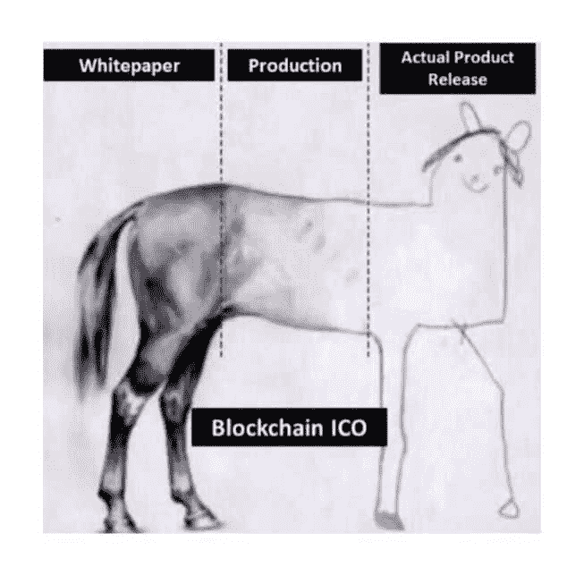

有趣的是，白皮书总是在纸上看起来很好，承诺太阳、月亮和星星。但是新项目是有风险的，而且外表可能具有欺骗性。事情会很快变得非常粗略。当心那些地毯拉手！

### **2。有了密码，谁还需要食物？**

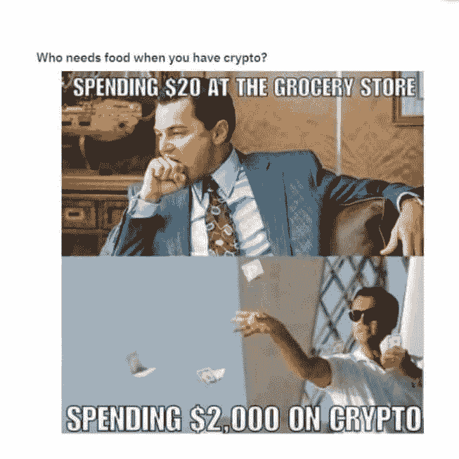

密码爱好者在购买他们选择的资产时近乎鲁莽。食物和基本需求？呃，没那么多。

### **3。你看起来一点也不超过 65 岁**

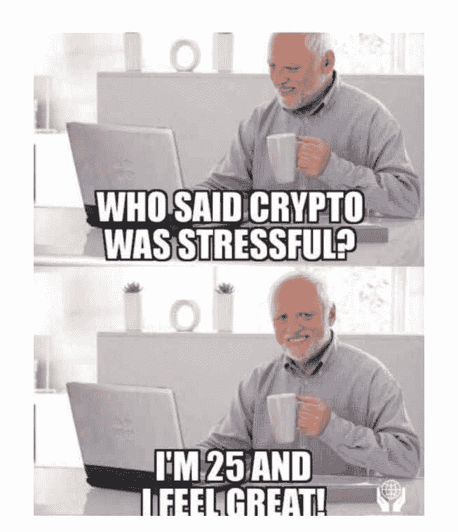

处理加密货币的高潮和低谷相当困难。虽然这是一个小小的极端，但也不算离谱。

### **4。别担心**

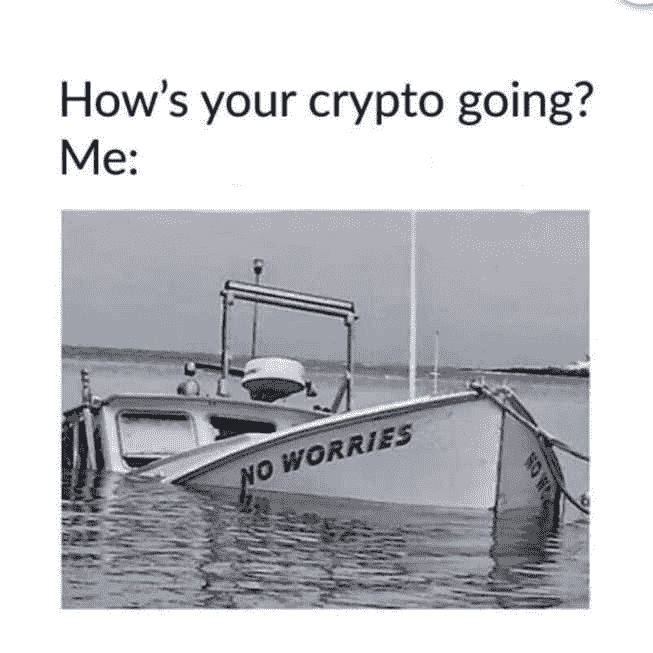

有人知道沉船吗？谢天谢地，数字代币不是船。否则，它们可能会浸得太深，最终永远沉入秘密海洋的底部。

### **5。以太坊黑仔**

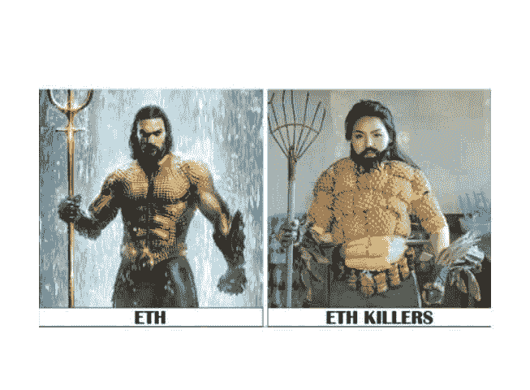

每隔几个月，一个或三个区块链就会成为下一个以太坊杀手只有以太坊依然是山丘之王。

### **6。等待下探**

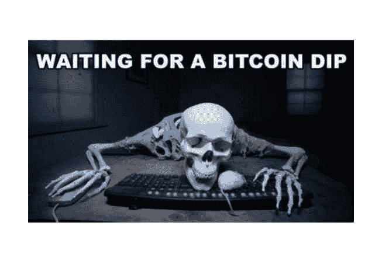

我的朋友，你等着买蘸酱真是太好了，但你已经等了很久了。嘿，嗯，你还在吗？

### **7。燃气费**

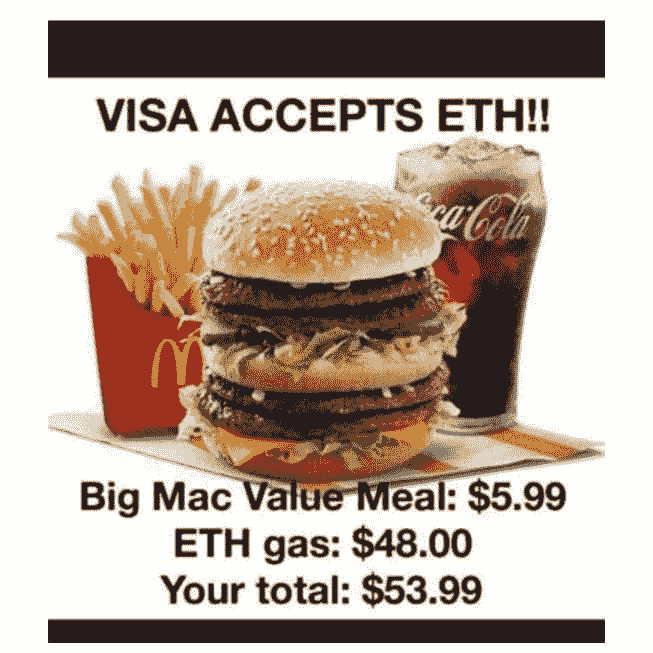

以太坊的汽油费正在形成一场燃料危机，尤其是在混合了 NFT 的情况下。新的升级正在路上，这是一件好事。

### **8。真正的下跌**

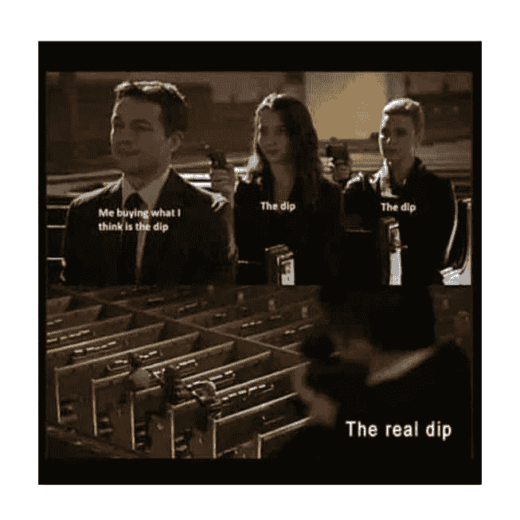

每个人都知道，以为自己买了蘸酱，几天后却眼睁睁看着它再次蘸酱是什么感觉。再一次。再一次…

### **9。放轻松，伙计**

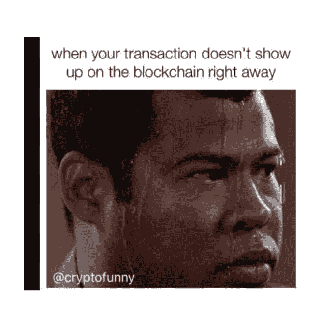

当交易稍有延迟时，你的大脑会出现十几种情况。当然，你仔细检查了两次，但是，凭你的运气，你可能漏掉了一个数字。

### 10。老实说，虽然

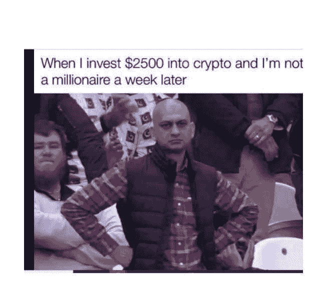

所以我刚刚投资了比特币，我还没有成为百万富翁。那是怎么回事？所有的秘密宣传让你认为在两个星期内你将成为这个街区最富有的孩子(如果这样做的话，那将是非常棒的)。

## **最搞笑的比特币迷因**

### **1。到处都是**

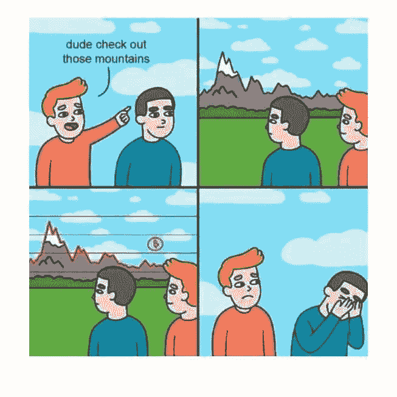

一旦你购买了加密货币，一切都将不再一样。相信我。

### **2。只需要一分钟**

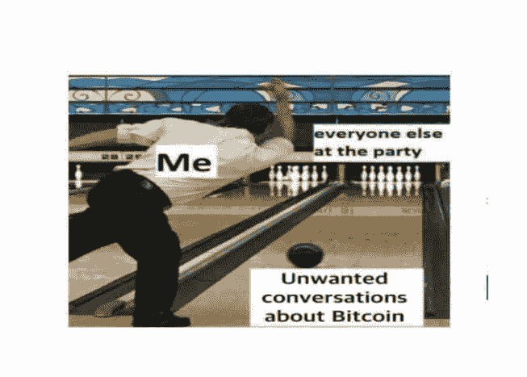

如果有一件事你可以指望交易员去做，那就是谈论比特币:晚宴、足球比赛，无论何时何地。这是无法逃避的。

### **3。我想和经理谈谈**

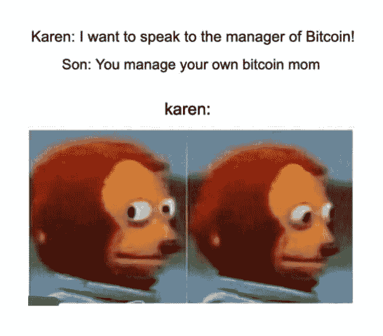

虽然去中心化是加密货币的重要组成部分，但对凯伦来说可能不会太好。不过，她可以去找埃隆。

### **4。当埃隆·马斯克发推文时**

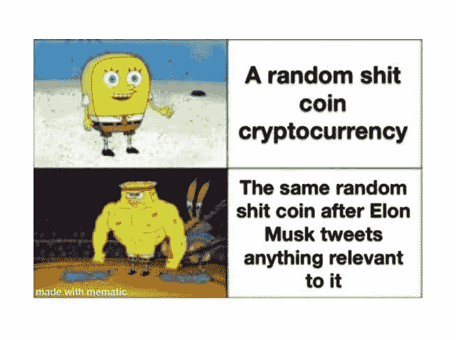

任何人都可以告诉你，马斯克在加密领域的影响力并不总是那么可笑。但当它是，它只是。

### **5。不错的尝试伙计们**

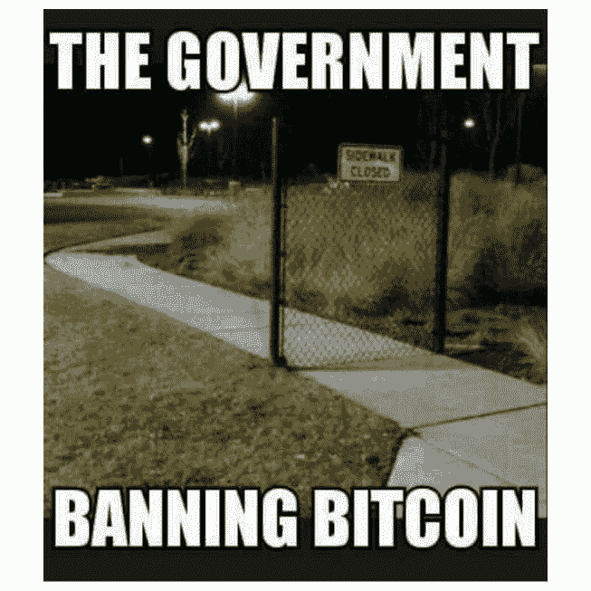

当监管者出现阻止比特币交易时，事情并不总是那么有趣。但是 80%的时候是这样的，这对大多数人来说已经足够了。

### **6。拿定主意**

还是关于监管的话题，这些家伙会让你怀疑你是否是在某种联盟中:“你承担风险，我们帮助获利。”

### **7。回到未来**

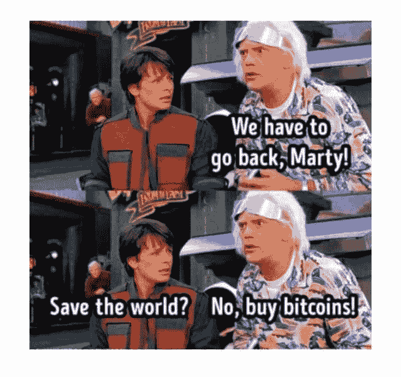

有人说，布朗博士是比特币背后的主谋。中本聪给了世界比特币*然后就消失了*，这听起来是不是有点可疑？

### **8。所有登上比特币快车**

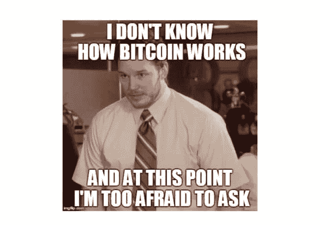

如果这是你，不要太难过。不要担心，只要找到最近的交易者，他不会放过你，直到你全部明白。其实只要提“比特币”这个词，其他的都交给他。

### **9。上面没有我的脸**

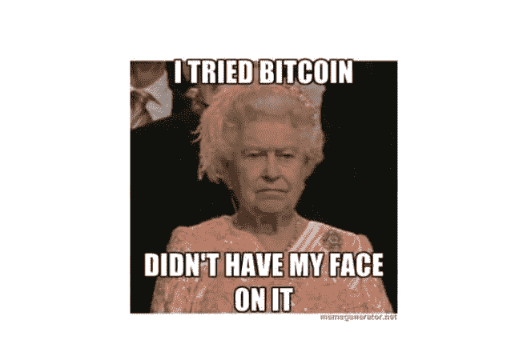

而且理由很充分(烧伤)。虽然女王可能不会说出来，但重点是憎恨者会憎恨。事实，伙计。

### 10。比特币主人会喜欢

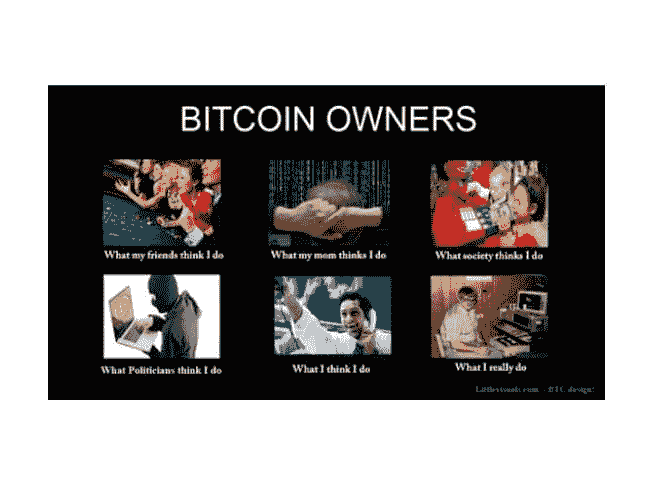

告诉人们你交易比特币会让他们产生各种各样的想法。然而，事实是，它要么真的很无聊，要么绝对令人伤脑筋。

## **Hodl 模因**

### **1。哈朵，哈朵，哈朵**

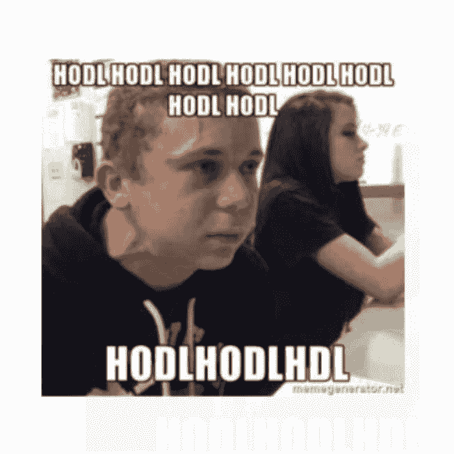

有时候你需要一个简单的咒语来保持对霍德林的关注。霍德尔，霍德尔，霍德尔…虽然也许你不应该这么紧张，兄弟。不过，别担心，你最终会熬过去的。

### **2。我们可以在这里找到**

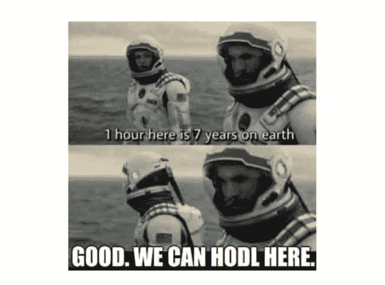

如果你在开车的时候忍不住有点坐立不安，那就去一个时间过得更快的地方。一瞬间就过去了。

### 3.天啊，蝙蝠侠！

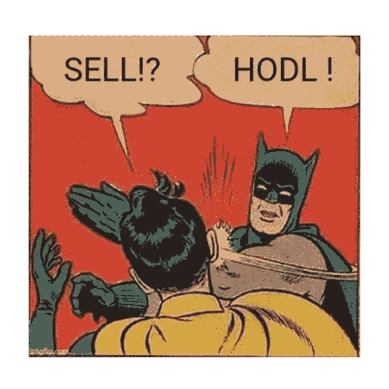

蝙蝠侠的智商是令人瞠目结舌的 192。如果穿斗篷的十字军战士告诉你 hodl，那么你最好相信他知道自己在说什么。

### **4。随波逐流**

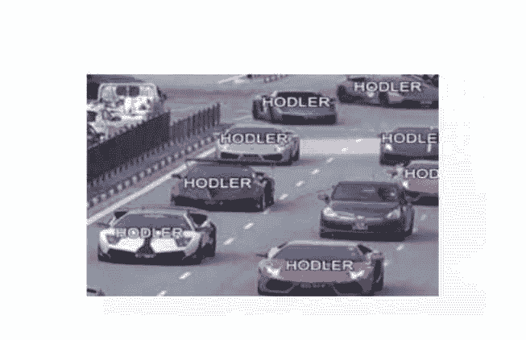

如果你习惯于用自己的方式做事，这可能会感觉违反直觉，但是 hodling 通常是最好的方式。

### **5。它会回来的**

霍德林可能看起来有点可怕，尤其是如果你对加密相对较新，但是，正如他们所说，它会变得更好。坚持住...

### **6。只是时间问题**

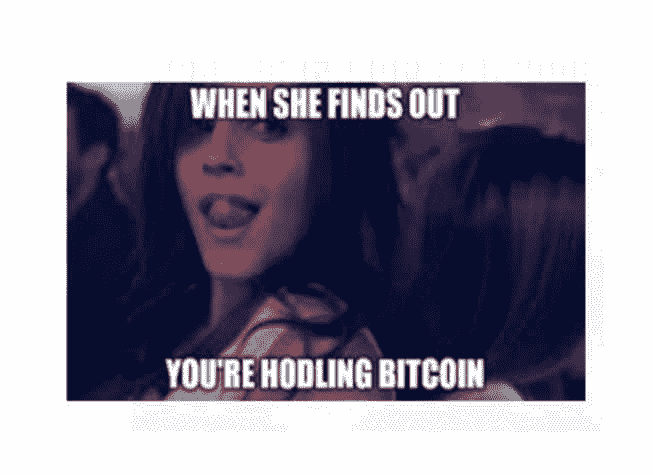

你从一开始就知道会发生这种事，不是吗？干得好，我的朋友。

### **7。就这么办**

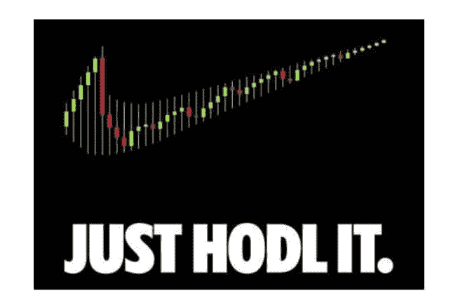

当耐克的标志性口号进入加密空间时，就会发生这种情况。三个简单的词，却蕴含着如此多的智慧:抓住它。

### **8。我可以解释一下**

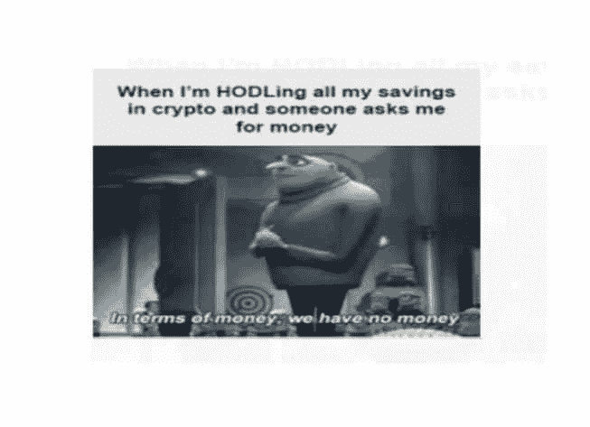

当你结婚的时候，你的财务会变得有点棘手。你有钱吗？你破产了吗？谁知道呢。谁在乎。抓住它。

### **9。HODLOR**

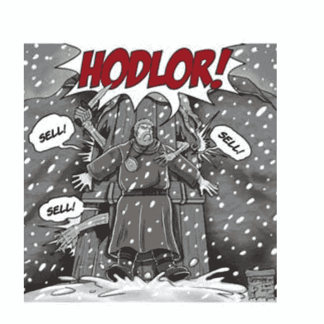

有时候，在 hodling 一段时间后不出售是一场真正的战斗。你已经走了这么远。不要屈服于诱惑。

### 10。哎呀

该死，我的错。任何在秘密空间呆过一段时间的人都有可能经历过这种情况(不是最好的感觉)。

## **迷因令牌的出现**

在密码领域，迷因不仅在团结社区方面扮演着重要角色，而且在推动社区发展方面也扮演着重要角色。虽然这可以被视为一个相当普遍的现象，在一系列部门，加密场景显然更进一步。毕竟，在处理蘸酱、泡沫、郁金香和狗屎硬币时，你必须有健康的幽默感。事实上，为什么不做一个迷因币…

### 什么是模因令牌？

[Meme token](https://en.wikipedia.org/wiki/Meme_coin)是虚拟货币，其工作原理类似于其他加密货币。它们由区块链的一个网络托管。它们可以存放在钱包里，用来购物。然而，让它们与众不同的是，模因令牌是基于流行的模因和网络笑话。

第一个 meme token 是 2013 年的 Dogecoin。开发人员杰克逊·帕尔默和比利·马库斯(Billy Markus)推出了 Doge，以取笑比特币推出后不久涌入行业的比特币复制品(简称 shitcoins)。

为了让他们的恶搞尽可能地荒谬，联合创始人从互联网上最流行的文化基因之一中获得灵感，设计了令牌的视觉效果。没过多久，这种代币就变得非常流行，进而导致了其他几种迷因币的兴起。

### **迷因币如何融入加密空间**

尽管必须与比特币和以太坊等加密货币以及其他许多具有现实世界价值和用例的加密货币擦肩而过，但迷因令牌已经证明了它们可以保持自己的优势。Dogecoin 以超过 800 亿美元的总市值保持榜首。

这些资产受欢迎的主要原因是它们通常由密码领域的知名人士支持。这方面的一个很好的例子是埃隆·马斯克对 Dogecoin 的大力支持，这一再导致令牌的价格上涨。

其他重要因素包括通常围绕这些代币建立的邪教般的社区，以及它们低廉的价格和轻松的性质(它们不像一些密码那样严肃——比特币，我们正在看着你)，所有这些都使它们成为常规加密资产的一个受欢迎的变化。

然而，尽管有这些有趣的组成部分，迷因币往往难以置信地不稳定。虽然这一功能可以用来获利，但它也使 meme 币对 hodl 来说相当危险。此外，令牌没有真正的效用，这就提出了一个关于它们在加密领域的未来的重要问题。

尽管如此，迷因币还是以一种在非功能性加密技术出现之前可能是无与伦比的方式推动了加密产业的发展。虽然不完全是与加密市场长期互动的最佳选择，但它们打开了大门，可以让初学者进入这个空间看起来是一个有趣、简单的选择。

## **最终想法**

所以下次比特币“下跌”85%时，看看最新的迷因吧。

记得呼吸和 HODL 它。