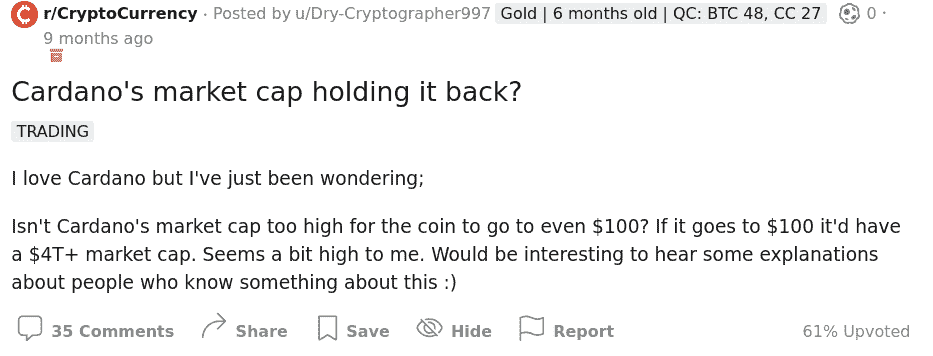

# 市值在 Crypto 中是什么意思？

> 原文:[https://www . trality . com/blog/what-do-market-cap-mean-in-crypto/](https://www.trality.com/blog/what-does-market-cap-mean-in-crypto/)

如果你最近花了一些时间关注新闻，那么你会读到或听说过 11 月的“闪电崩盘”或“黑色星期五”事件。作为 [街报](https://www.thestreet.com/investing/cryptocurrency/crypto-flash-crash-wipes-out-billions-in-the-market)，“全球加密货币市值下降 6.1%，至 2.78 万亿美元[...]根据信封背面的计算，抹去了大约 1695 亿美元。”

路透社最近的一篇文章警告说，“比特币的市值已从 10 月 21 日的 1.25 万亿美元降至约 9310 亿美元。”《福布斯》的一篇文章毫不含糊地宣布了这个坏消息:“在市值最高的四种加密货币中——不包括最大的比特币和与美元挂钩的稳定货币 Tether——以太下跌 9.6%，至 4300 美元左右，币安的 BNB 下跌 8.9%，至 590 美元，索拉纳下跌 7.5%，至 225 美元，卡尔达诺下跌 9%，至 1.90 美元。

俗话说，骄者必败。在崩溃之前，许多媒体都称赞 crypto 破纪录的市值。例如， [Cointelegraph 刊登了标题](https://cointelegraph.com/news/crypto-markets-tag-3t-combined-market-cap-for-first-time)，“加密市场首次标记 3T 美元总市值”，[《财富》杂志(Fortune)对加密的好运大加赞赏](https://fortune.com/2021/11/09/cryptocurrency-market-cap-3-trillion-bitcion-ether-shiba-inu/):“随着比特币和以太网达到创纪录高位，加密货币首次触及 3 万亿美元的市值。”

无论是打破记录，还是似乎在几天甚至几小时内消失在黑洞中，秘密市值都是一个永恒的热门话题，这使得理解它变得绝对重要。

## 什么是市值？

市值的定义都相当标准和统一。Investopedia 将其描述为“一家公司已发行股票的总美元市值”，正如他们所指出的，“计算方法是将一家公司已发行股票的总数乘以每股的当前市场价格。”

计算加密货币的市值基于类似的逻辑，但有一个关键的不同。一枚硬币的市值不是使用已发行股票的数量，而是通过将已开采的硬币总数(流通供应量)乘以任何给定时间的单枚硬币价格来计算。

**市值=流通硬币总数 x 价格**

最广泛使用的获取市值信息的网站是 [CoinMarketCap](https://coinmarketcap.com/) ，它提供了一系列与加密货币相关的指标。

Coinmarketcap.com

咨询 CoinMarketCap 时，请务必记住，所列价格是根据不同交易所所有价格的成交量加权平均值计算的。同样值得注意的是，一些密码观察家将区分流通供应和完全稀释供应。就比特币而言，就其完全稀释的供应量而言，这个神奇的数字是 2100 万，在这个点上，不会再有更多的比特币被开采出来。

## 为什么市值很重要？

交易者在决定任何给定加密资产的相对优势和劣势以及在特定时间段内是否有利可图时，必须考虑许多因素。评估一枚硬币的一种方法是根据它的价格，但许多新手交易者倾向于将价格的高低等同于价值的高低。既然硬币 X 的价格远远跑赢其他硬币的价格，那么它一定是一个很好的投资品，对吗？

问题是价格只是价值拼图的一部分。更有用的是市值，它将让交易者更全面地了解一枚硬币的增长潜力，以及这枚硬币是风险投资还是安全投资。为了便于讨论，假设我们正在比较两个硬币，一个价格较低但市值较高，另一个价格较高但市值较低。从表面上看，价格较高的硬币似乎是更好的投资，但鉴于其较低的市值，其整体价值较低。

一般来说，一枚硬币的市值越高，它在市场中的地位就越重要。像比特币这样市值大的硬币也往往比市值小的硬币更稳定。在这方面，规模确实很重要。低市值的加密项目可能会成为市场波动的牺牲品，使它们的价值陷入致命的噪音跳水，很难(如果不是不可能的话)恢复。当然，另一方面，当交易低市值硬币时，在牛市条件下有更大的巨大收益潜力。

### 市值类别

如上所述，市值有一个等级，通常分为三类:大盘股、中盘股和小盘股。例如，鉴于其作为加密货币的“黄金”和“白银”的地位，比特币和以太坊是大盘股(超过 100 亿美元)，因此被认为是低风险投资，因为它们具有增长和高流动性的历史。中等市值硬币(10 亿美元到 100 亿美元之间)的市值较小，但比大盘股的风险更大。因此，许多人认为他们有更多的潜力和更多的风险。而小盘加密货币(10 亿美元以下)市值最小，风险最高。

尽管如此，高面值硬币仍可能相当不稳定。在 2021 年 9 月期间，比特币的价格在 45，000 美元和 55，000 美元之间波动，这导致了显著的市值变化。如果我们用 1880 万作为它的流通供应量，那么我们就可以清楚地看到波动的程度:

市值=流通硬币总数 x 价格

*   8460 亿美元= 1880 万美元 x 45000 美元

*   9400 亿美元= 1880 万 x 5 万美元

*   1.034 万亿美元= 1880 万 x 55000 美元

## 什么影响加密市值？

镜子，墙上的镜子，哪种硬币的市值最大？

除了[加密新闻网站](/blog/best-crypto-news-websites)，你很有可能已经在各种 Reddit 加密社区中潜伏了一段时间，那里似乎永远不会缺少关于任何给定硬币现在或未来市值的问题。以这个来自 Cardano 社区的为例(无意冒犯 Cardano 爱好者！):

评论者是对的。卡尔达诺 4 万亿美元的市值确实看起来“有点高”如果发生这种情况，那么 Cadano 的市值将是苹果的两倍，苹果是世界上市值最高的公司。问题不一定是卡尔达诺的市值是否会飙升至月球(或另一个星系)，而是究竟是什么影响了市值。

### 令牌组学

我们知道，加密货币的市值包括两个关键部分，流通的硬币总数和硬币的价格。让我们首先考虑一枚硬币的流通供应量。在加密货币领域，这通常被称为“令牌组学”，即加密令牌的质量、分发和生产。由于比特币的供应量被限制在 2100 万，随着其稀缺性的增加，其需求预计也会增加。然而，稀缺性增加的一个后果将是囤积增加，导致发行量或交易量减少。

相反，一个拥有大量硬币的项目，比如 Algorand 和它的 100 亿 ALGO，可能会故意压低其价格，在很长一段时间内向市场滴加硬币，以避免因泵送和倾倒计划而产生的高波动性(例如，鲸鱼购买大量硬币，以推高价格，然后倾倒硬币获利)。在这种情况下，长期稳定的上涨趋势比高风险、高回报、高波动性的方法更可取。

“硬上限”光谱的另一端是 Dogecoin，它被认为是通货膨胀的(与比特币或 ALGO 的通货紧缩相对)。由于 Dogecoin 的数量被设计为以每年 50 亿的绝对速度增长，理论上它的供应量是无限的，尽管实际供应量可能会达到一个实际的极限。其可预测的增长率也意味着其价格应该更容易预测，因此鉴于其预期的稳定性，其作为合法货币的使用价值是明确的。

### 感受燃烧

令牌经济学和市值的另一个方面涉及烧钱。顾名思义，矿工焚烧代币是为了减少供应量，从而提高或稳定代币的价格。然而，在对代币没有相应需求的情况下，减少供应并不一定会导致价格上涨。除了供应和需求之外，焚烧硬币还有其他原因，包括通过“焚烧证明”(PoB)达成更有效的共识，防范攻击(例如 DDOS)，以及展示对项目寿命的承诺。相当多的项目，如[比特币现金、Ripple、币安币、Stellar、USDT、USDC](https://www.oobit.com/blog/what-is-coin-burning/) ，都使用过烧钱。最近，[以太坊网络在 87 天内](https://news.bitcoin.com/ether-inferno-ethereum-network-burned-over-2-4-billion-worth-of-eth-in-87-days/)烧毁了价值超过 24 亿美元的以太坊，总计 702，886 以太坊自伦敦硬分叉以来被烧毁。

### 加密货币和价值

我们的市值等式的另一个组成部分是硬币的价格或价值，有一系列因素要考虑。在任何给定的区块链上建立的服务和硬币本身之间有什么联系？它是治理令牌吗？实用令牌？安全令牌？价格还受到生产成本、交易可用性、治理和监管环境的影响。

除了供给和需求，这些还包括竞争、技术发展、媒体炒作和名人效应。这是一个有趣的话题，你可以在我们的文章“[加密货币如何增值](/blog/how-does-cryptocurrency-gain-value)”中找到更多信息

## (市场)封顶

正如我们所见，加密货币——即使是大额加密货币——也可能极其不稳定，市值只是评估交易选项的众多标准之一。然而，你现在应该对什么是市值、它为什么重要以及什么影响它有了更好的理解。然而，黄金法则仍然适用:做你自己的研究(DYOR ),只投资你能承受的损失。