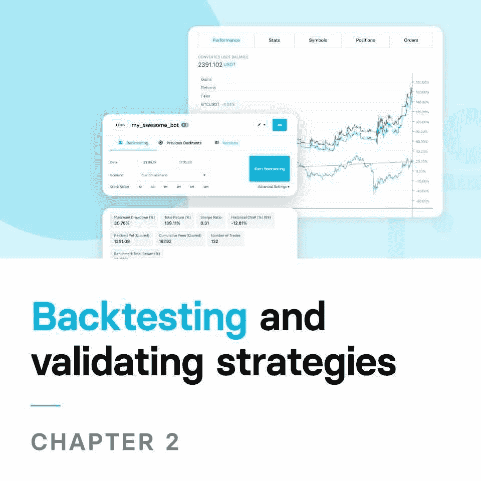

# 构建盈利的算法交易机器人

> 原文:[https://www . trality . com/blog/building-algorithmic-trading-bots/](https://www.trality.com/blog/building-algorithmic-trading-bots/)

让我们先从坏消息开始。构建盈利的算法交易机器人不会一蹴而就。这是一个过程，需要时间、耐心和知识。因为这是一个流动的过程，所以在你开始看到持续盈利的结果之前，它还涉及到相当多的反复试验。

这并不太痛苦，是吗？实际上，这不是一个坏消息的问题，而是一个对算法交易(或任何交易)的现实理解的问题，以及你如何达到熟练程度以实现你的交易目标。

**好消息？**利用 Trality 最先进的技术构建算法交易机器人非常直观和简单。即使你不会编码，你仍然可以用我们独特的规则生成器来构建交易机器人，这是一个独一无二的图形用户界面，允许你通过简单的拖放指标和策略来构建你的交易机器人的逻辑。

↓这是我们最先进的规则生成器的快速浏览↓

[https://www.youtube.com/embed/ugtCnc-wW7s](https://www.youtube.com/embed/ugtCnc-wW7s)

<button type="button" class="chakra-button css-1hnfsz">Try it for free!</button>

通过确保**无情绪交易**和提供**超快的回溯测试速度**、**多样化**和**交易纪律**，算法交易机器人可以给你带来显著的竞争优势。所有这些都是成为成功交易者的关键。

在接下来的章节中，我们将详细介绍开发一致的、标准化的算法交易方法的所有步骤和最佳实践。从产生想法，回测和验证这些想法，到在现场交易中实现最终的算法交易机器人，我们将带你走过每一步，同时帮助你避开一些困扰交易者的常见陷阱。

我们的目标是通过开发一个基础的、基于规则的方法，作为未来产生、测试和实现交易想法的客观基础，来避免临时策略(不是真正的策略)或捷径。

让我们开始吧。

## 第一章:产生交易想法

一切都始于一个想法。

这是使用客观方法的基于规则的交易策略的第一步。虽然灵感可以来自很多地方，可以在任何时候产生，但是产生交易想法不是一个随机的过程。相反，交易者可以基于知识和经验有意识地以系统的方式进行，你可以通过广泛阅读(例如书籍、博客、研究论文，甚至专门建立的在线课程)和学习久经考验的专家的经验来补充。

下面我们将介绍策略开发的主要组成部分，在创建交易系统之前，理解所有这些都是至关重要的。

*   **宇宙选择**
*   **创建交易信号**
*   **时间段选择**
*   **位置尺寸**

在本章的结尾，你会知道什么样的交易理念值得关注，让你离成功的交易系统更近了一步。

然而，一个经验法则是适用的，尤其是对初学者:保持简单。在这里，奥卡姆剃刀可以提供一些有用的见解——应该选择简单的理论，而不是复杂的理论，因为它们更容易测试，因此也更容易管理。

### **投资领域(或市场选择)**

你想交易哪些资产？作为一个新的交易者，这可能是你要做的最重要的决定之一。然而，有超过 4000 种加密货币可供选择，这不一定是一个容易的决定。

***选择加密货币的标准***

假设你对自己的交易目标有一个很好的理解，那么在研究任何数字资产时，一个很好的起点就是研究它的社区、团队和领导、底层技术、白皮书、定价历史和未来愿景。收集的信息可以提供对特定硬币的可信度、生存能力、优势和弱点的洞察——简言之，它的潜在盈利能力。至关重要的是，你要考虑硬币的基本目的或原理:它为什么重要/必要/创新/颠覆性？如果你发现自己无法回答这个问题，那么很有可能这枚硬币不会存在太久，这意味着它不值得你投入时间和金钱。

记住硬币的基本原理或目的后，你会想要考虑一些其他重要的指标，比如它的活跃用户以及交易的规模和频率。

一个好的起点实际上是检查[因为它给用户提供了交易量、市值和许多其他重要信息。](https://coinmarketcap.com/)

Top 5 cryptocurrencies by Market Cap (as of 18.06.2021)

高市值的加密货币为我们提供了一个深度和流动性的市场。当有流动性时，进出交易就更容易了。对于低交易量的加密货币，你会发现很难在你的进入点进入，甚至更糟的是，当你想退出时，你可能会被困在交易中。

**多元化**

**无论你最终选择哪种数字资产，你的世界都应该包含不止一颗星星。简单地说，分散投资是一种风险管理策略，它结合了一系列广泛的资产，以限制你作为交易者对任何单一资产或风险的敞口。鉴于其固有的波动性，加密市场带来了某些挑战，这些挑战可以通过多样化的投资组合来缓解或抵消。**

**虽然你可能已经读过或听过一千遍关于交易的内容，但老话“不要把所有的鸡蛋放在一个篮子里”当然也适用于加密。这种想法认为，平衡投资组合的风险小于所有单个资产的风险之和。对于给定的预期回报，风险最小的投资组合被认为是最有效的。诺贝尔奖获得者哈里·马科维茨(Harry Markowitz)已经指出，“多样化是投资中唯一的免费午餐。”**

**然而，多样性不仅仅是持有多种不同的加密货币。如果你有 10 或 15 枚不同的硬币，但都产生相同的信号，那么多样性就没有意义了，因为你最好只交易一枚硬币。我们追求的是低相关性的单个信号，这样我们就能获得多样化的回报和更平滑的权益曲线。**

### ****创建交易信号****

**就像生活中的许多事情一样，时机就是一切。知道何时进场和出场是至关重要的，因为好的进场可以转化为好的利润，而聪明的出场应该是你风险管理策略的重要组成部分。**

**所有这些都是说，你的算法交易机器人策略的核心将是它的交易信号。顾名思义，信号只是简单地启动或“发出信号”任何给定资产的买卖点，为你的交易算法指示进场和出场位置。**

*****录入规则*****

**对一些人来说，进场规则可能是设计交易系统中最强大的部分之一。想想看:在进入之前的那段时间是你唯一能感觉到完全控制的时间。如果市场不做 x，y，z，那你就不要进入。一旦开始，你就交易进场，之后事情会变得越来越复杂，在一定程度上，一旦交易开始，你就无法控制了。但是你不希望你的进入规则过于复杂。如果在交易开始前你有太多的条件需要满足，那么你可能会发现很难，甚至不可能让你的交易成功。**

**那么，你将如何真正进入一个市场呢？许多人认为下面的黄金法则在创建好的条目时很有帮助:**开始使用单一规则**。如果您想要一个有多个条件的条目，首先只从一个条件开始。然后，只有当新条件显著提高性能时，才慢慢添加新条件。你可能会发现许多你认为重要或必要的进入条件实际上并不重要。**

**在 Trality，您会发现越来越多的指标和预定义的策略可以帮助您轻松、战略性地开始。由于受过教育的交易者是最好的交易者，请查看 Trality Docs 中的“[信号发生器”部分了解更多详情。](https://docs.trality.com/trality-rule-builder/signal-generation)**

*****退出规则*****

**许多交易者忽略了及时和正确的出场的重要性。但是退出会对你的整体盈利能力产生巨大的影响，这就是为什么你应该投入大量的时间和精力来准备适当的退出。就像进场一样，创造好的出场的黄金法则是首先使用单一的规则。**

**退出规则的“工作”是保护你的资本，所以如果卖出信号不能使你的交易系统的损失最小化，那么它应该被丢弃。**

### ****时间段选择****

**你的交易策略的另一个重要部分是你选择的时间框架。再说一遍，没有放之四海而皆准的方法，因为不同的时间框架下，策略的表现会有所不同，这就是为什么最好选择一个符合你目标的时间框架。你想快速进出吗？也许 1 分钟或 5 分钟的图表是最好的。你更喜欢长期摇摆交易吗？如果是这样，也许每天的时间框架是你最好的选择。关键是选择一个符合你兴趣的时间框架。**

**使用短时间框架的交易(“刷单”)试图从短时间间隔内的微小价格变化中获利，但需要严格遵守预先设定的退出策略，以避免重大损失。摆动交易是指你持有一项资产几天到几周，以便利用中短期收益(即根据摆动获利)。头寸交易是在更长的一段时间内保持头寸，通常是几周到几个月。**

**通常，时间越短，交易越多，这是需要记住的一个重要因素。交易频率越高，你就越需要考虑流动性、买卖差价和交易成本(低流动性可能会产生无利可图的策略)。这就是为什么作为新手交易者，最好避免诸如刷单之类的交易系统。即使在这个阶段，应该清楚的是，算法交易机器人涉及相当多的移动部件，这对新手交易者来说可能有点难以承受。因此，一些交易者倾向于忽略他们交易策略的一个方面，使用单一的时间框架来分析趋势和进出信号。相反，交易者应该考虑精通多时间框架分析(MTFA ),以便跟踪资产在不同时间框架内的表现。**

### ****位置尺寸****

**最后，你需要计算出你要交易多少(仓位大小)来完成你的策略。当我们谈到头寸规模时，我们指的是您对单个交易的头寸规模，这取决于您的账户规模、目标和风险容忍度等变量。头寸规模的确定围绕着资本分配的问题，交易者使用各种技术(如固定金额、等百分比、基于风险的头寸规模确定等。).**

**一个小的百分比意味着有较少的机会危及你的帐户，因为你的损失会很小。然而，如果事实上你的策略是盈利的，较小的百分比必然会导致较小的利润，因为你只投资了总余额的一小部分。另一方面，更高的百分比意味着风险增加，风险增加，回报也增加。**

**最后，这完全取决于你想采取什么样的方法。如果你愿意承担更大的风险，你显然会获得(或失去)更多，而长期交易将涉及更保守的方法，以便在更长的时间内交易获利。**

## **第 2 章:回溯测试和验证策略**

******

** 

**没错。你已经选择了你的宇宙；仔细考虑多样化；创造了交易信号；建立你的时间框架；并计算了你的仓位大小。恭喜你，你已经走上了构建一个盈利的算法交易机器人的正确道路。现在是时候回测你的交易策略了。**

**如果我们用赛车来类比，那么可以把回溯测试想象成在赛道上练习跑圈，让车手测试赛车的设置参数，并在比赛前对它们进行事后调整。同样的原则也适用于你的加密交易机器人。**

**回溯测试允许你根据历史市场数据评估你的交易策略，使之成为事后模拟。因为这是一个模拟，它不需要任何实际的资本，允许你测试你的策略没有风险或后果。当你决定开始实时交易时，好的回溯测试结果可能预示着好的结果——尽管不总是这样。**

**使用 Trality Backtester 工具，您可以利用常用的统计数据来评估算法交易策略，以衡量业绩(例如，盈利和亏损；总回报；每笔成功交易的平均利润)、风险/回报(如波动性；夏普比率)和运行(例如最大压降；水下时间)。**

**下面我们将介绍最佳实践、样本外测试，以及要查看哪些指标。**

### **回溯测试-最佳实践**

**总的来说，手工回溯测试可能极其复杂、耗时，甚至令人沮丧。根据我们前面提到的奥卡姆剃刀，当决定优化参数以估计回测所需的数据量时，通常认为最佳实践是选择简单的策略而不是复杂的策略。为了避免回溯测试时的意外偏差，你应该使用盲的或随机的数据点来测试，而不是强化一个假设。**

**总的来说，手工回溯测试可能极其复杂、耗时，甚至令人沮丧。然而，Trality Backtester 工具是一个真正的游戏规则改变者，因为它允许交易者使用我们的规则生成器或代码编辑器进行全面的、可定制的测试——几乎只需几秒钟。在屏幕右侧，只需选择一个预定义的场景或选择一个自定义日期即可开始。对于高级设置，单击下拉箭头以访问附加选项(即费用、初始余额和滑点)。**

**回溯测试不仅仅是一次性的过程，而是你在进行前向测试*和*之前会反复做的事情。当进行回溯测试时，您还需要在实际测试之前预先确定关键的度量标准、指标和结果(下面将详细介绍)。**

**然而，过去的表现并不能保证未来的结果。假设你的回溯测试导致了回报率的健康增长。任何给定时间的最佳参数往往不是向前移动的最佳结果，这是一种被称为均值回归的统计现象。** 

****样品内和样品外测试****

**在对你的加密机器人进行回溯测试时，将回溯测试的可用时间段划分为[样本内和样本外数据](https://alvarezquanttrading.com/blog/in-sample-and-out-of-sample-testing/)非常重要。现在，样本数据非常重要，因为它用于优化您的策略。一旦一切看起来都很好，你就用样本外的数据来验证你的结果，确认你没有产生一个一旦部署在现场交易中就会表现不佳的过度拟合的策略。因为它将数据划分为不同的集合，所以使用交叉验证来避免过度拟合。一组将用于创建您的模型，而其他组将用于验证模型的准确性。**

**这对作为交易者的你意味着什么？假设你有一个想法，你想根据历史数据来检验它。您用来测试和优化您的想法的实际历史数据被称为“样本内数据”(您也可以将此数据称为“训练数据”)。然后，第二个数据集(有时称为“测试集”)用于评估预测性能。交叉验证提供了一种测试交易策略性能的方法，通过对新数据进行测试，尽可能地模拟真实交易。**

****

**分割样本内和样本外数据的一个好的经验法则是使用 2/3 的数据集进行策略优化，剩余的数据进行样本外验证。**

**你应该回溯测试多久？**

**经验丰富的交易者通常用大约一年的时间来进行回溯测试。通过长时间的测试，比如 12 个月，你可以看到这个策略在不同市场条件下的表现。毕竟，如果你在一个趋势市场中测试一个趋势跟踪系统，你认为会发生什么？不用说，你会对你的策略在未来的表现有一个不完整的(因此是不准确的)描述。另一方面，在波动的市场中测试你的系统可以让你更好地了解可能的损失程度。**

**你测试的时间越长，你的数据就越准确，因为它可以弥补短期特定市场条件下有限的洞察力。通过观察它在熊市和牛市中的行为，你可以更全面地了解你的策略的有效性。**

**Trality Backtester 工具有“快速选择”选项，交易者只需点击一下鼠标就可以选择 12 个月的时间框架，使回溯测试变得快速、方便和精确。**

### **满足您的指标**

**Trality 为其用户提供了一整套用于测试其策略的指标，每一项都属于三个类别之一:1)性能，2)风险/回报，3)运行。在我们的 Trality Docs 部分，您可以阅读所有关于您在回溯测试您的交易策略时可以使用的各种工具和数据，这就是为什么我们不会提供每一个的全面分类。**

**相反，让我们来看看最重要的:夏普比率，总回报，和下降。**

*****夏普比*****

**[夏普比率](https://www.investopedia.com/terms/s/sharperatio.asp)(以威廉·夏普命名)于 1966 年首次创立，是交易中最受欢迎的风险/回报指标之一，让投资者更好地了解投资回报与其风险的关系。事实上，这可能是最著名的风险调整措施。**

**夏普比率衡量投资(如资产或投资组合)相对于无风险资产(如美国政府国债和债券)在调整风险后的表现，定义为投资回报和无风险回报之间的差异除以投资的标准差(即其波动性)。**

****

**一般来说，比率越高，回报越好。比率低于 1 的资产或投资组合代表着糟糕的投资，而比率高于 2 的资产或投资组合则表明是很好的投资。**

**< 1:次优或差**

**1:可接受至良好**

**2:非常好**

**3:优秀**

**使用夏普比率可以通过实际回报洞察你的投资组合过去的表现。此外，夏普比率有助于解释投资组合的超额回报是过度风险的结果还是明智投资选择的结果。**

*****总回报*****

**[回报](https://www.investopedia.com/terms/r/return.asp)是一段时间内赚或亏的钱数，或者是给定时间段内投资的绝对回报。名义回报(即以名义条件表示的净利润或亏损)和实际回报(即根据通货膨胀等外部因素进行调整)之间还可以有进一步的区别。**

**我们对总回报感兴趣，总回报是一种性能统计，它以百分比表示给定时间范围内的累计净利润或亏损。其计算方法如下:**

****

**在上面的公式中，投资组合价值(PV)以开始时间(T)和结束时间(T)给出。**

**尽管这一指标在净盈利能力方面提供了有用的信息，但它不应单独使用，而应与其他指标结合使用，特别是因为更长的时间跨度会因复合效应而难以解释。**

*****【MDD】*****

**A [最大损失](https://www.investopedia.com/terms/m/maximum-drawdown-mdd.asp) (MDD)是在达到新的高峰之前，投资组合从高峰到低谷的最大观察损失。因此，MDD 是特定时期内下行风险的指标。MDD 衡量的不是重大亏损的频率，而是最大亏损的规模。**

**数学上，它可以表示为以下公式:**

****

**通过考虑资产或投资组合的波峰和波谷之间的差异，最大提款是一个关键的风险衡量指标，可以提供对潜在最大累积损失以及恢复或复原前所需时间的宝贵见解。首选较低的最大提取额，因为这表明投资损失较小。相反，MDD 越高，损失越大。**

**您的加密交易投资组合将以特定的方式分配，这取决于许多因素，包括您的整体策略以及您的专业知识、经验和风险规避水平。无论您选择哪种配置，都应该通过参考各种指标(例如，衡量风险、衡量回报、衡量风险调整后的回报)来分析和优化您的总体战略，下面我们将重点介绍其中的一些指标。**

## **第三章:现场交易**

******

** 

**至此，你已经具备了创建一个基本的、基于规则的方法的知识和洞察力，这个方法将作为产生、测试和实施交易思想的客观基础。**

**事实上，假设你已经创建并测试了你自己的算法交易机器人。你现在已经准备好把你的交易提升到下一个层次了——实时交易，对吗？无情的交易，24/7，轻松赚钱。**

**不完全是。仅仅因为你已经找到并优化了你的策略，并不意味着你可以设置你的自动算法交易机器人，然后忘记它。**

**比如，你能相信自己会完全按照测试过的策略行事吗？即使在充满挑战的市场条件下，你的情绪可能会浮出水面。当涉及到你的金融资本时，不必要的情感资本支出可能是昂贵的，这就是为什么简单地看一下实时交易时的一些最佳实践将帮助你坚持你的策略，即使当恐惧和怀疑，或一系列亏损的交易在你耳边低语要弃船时。**

*   **是自动的，但不是自动的。一旦你的机器人被部署用于实时交易，定期监控它以确保它像在回溯测试中一样顺利运行是非常重要的。**
*   ****知道什么时候退出**。切入点很容易；真正的困难在于知道何时退出。可能是连续亏损 X 笔，或者是 X 个月后整体盈利的问题。无论你如何定义你的退出点，确保它是可靠的和确定的，并坚持下去。**
*   ****去市场**。趋势市场、横向市场、拉锯市场、波动市场和缓慢移动市场——市场是流动的，会以不可预测的方式变化或移动。(见第一点。)**
*   ****失败是赢家的事**。这个练习的全部目的是开发一个有利可图的策略，但是简单的事实是你会在一些交易中亏损。接受这样一个事实，每个人都经历过失败的交易。一旦你这样做了，对失败的恐惧就会消失，你就可以继续赚钱的交易了。** 

### **用 Trality 创建你自己的算法交易机器人**

**Trality 最先进的平台使交易者能够创建他们的机器人，并通过 API 密钥将它们连接到他们最喜欢的交易所。一旦连接上，你的机器人将 24/7 运行，安全可靠地进行自动交易。**

**想想另一种选择:手工交易，这种交易没有纪律，主观，不可靠，就像一只手绑在背后交易。然而，有了 Trality 的自动加密交易机器人，就不会再有错过的交易或错过的机会了。无论白天黑夜，你都可以在世界任何地方及时、高效、自动化地购买、出售或持有资产。**

******

** 

**临时交易者会爱上我们独特的拖放规则生成器的简单易用(不需要编码！)，而 Python 大师们可以利用我们革命性的代码编辑器，充分利用他们的量化技能，编写复杂的交易算法。我们强大的回溯测试器确保快速全面地评估您想法的可行性，为您提供交易获利所需的信息。**

**最精彩的部分？只需点击几下鼠标，您就可以注册并开始探索我们完全免费的改变游戏规则的技术。你还会收到邀请加入我们的可怕的不和谐社区。**

**准备好开始了吗？没有比现在更好的时机了！**

 **看看 Trality Rule Builder 吧，这是一个最先进的工具，让你不用写任何代码就能创建自己的交易机器人。

[https://www.youtube.com/embed/4K7oPuWkM4c](https://www.youtube.com/embed/4K7oPuWkM4c)

<button type="button" class="chakra-button css-1hnfsz">Try it for free today</button>**