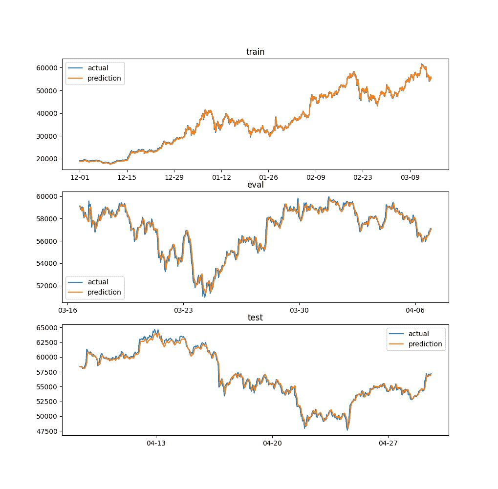
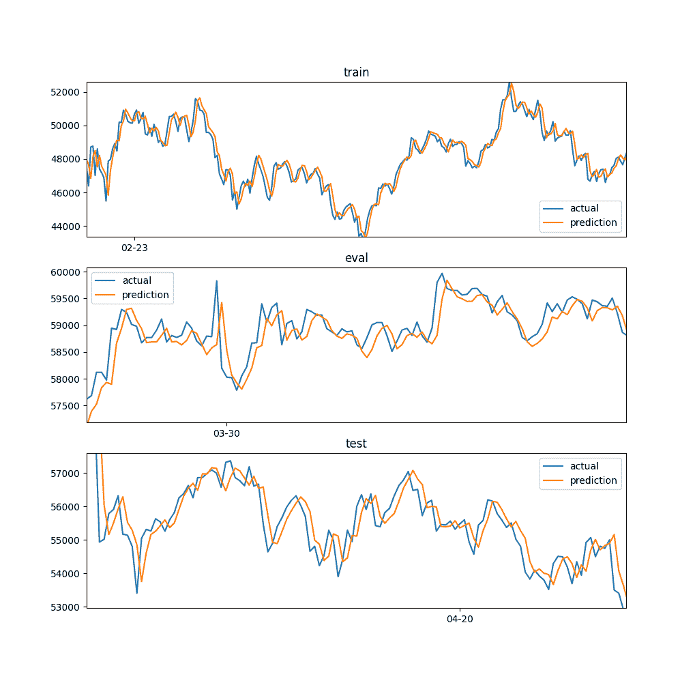
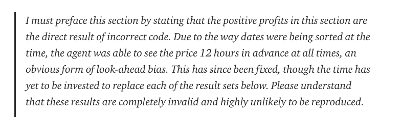
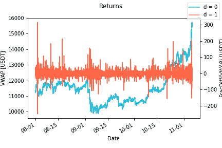
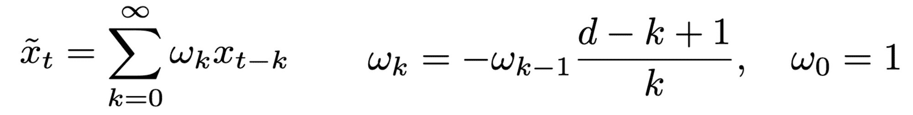
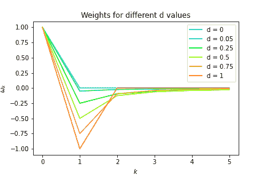
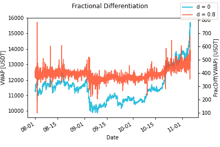

# 避免机器学习策略的常见陷阱

> 原文：<https://www.trality.com/blog/machine-learning-in-trading/>

这是一系列博客文章中的第一篇，深入探讨了 Trality 所做的研究。

大多数算法交易的机器学习研究都是闭门进行的。即使在具体战略的阿尔法消失后，知识和方法仍然是一个秘密。在 Trality，我们想改变这种情况。我们的目标是为各种经验水平的定量分析师创造一个环境，在这个环境中，创造力可以蓬勃发展，并且与去中心化的精神相一致，投资理念和资本在社区内众包。我们提供所需的工具和基础设施，让研究人员、工程师和交易者专注于最重要的事情，创造阿尔法。虽然我们非常清楚 alpha 本身应该是一个受到很好保护的秘密，但我们相信进入公开讨论和分享知识将有利于整个社区，并有助于与大玩家竞争。

这是第一个博客文章系列，将涵盖三个主题，常见的陷阱，金融数据聚合和平稳时间序列。

# 常见陷阱

像在任何其他领域一样，通过获得当前可用研究状态的概述来开始自己的旅程是一个好主意。其中一个重要的方面是了解别人已经犯过的错误并避免它们。这节省了大量的时间，否则会因为走死胡同而浪费掉。

我们将看看一些最常见的陷阱，在开始实施机器学习思想之前，每个人都应该知道这些陷阱。这会给你的研究之旅一个良好的开端。

### 时滞

当考虑用于算法交易的机器学习时，首先想到的是简单地从最近的价格历史预测未来的价格，即在金融时间序列数据上进行预测。然而，预测金融时间序列伴随着一个特别令人讨厌的陷阱，这个陷阱非常具有欺骗性:*时间滞后。*

在获得一些价格数据并使用我们最喜欢的机器学习库实现了一个通用的深度学习模型后，我们渴望看到一些结果。在对模型进行一些时期的训练并看到损失函数(例如 MSE)的改善后，我们绘制预测图，并希望亲眼看到一些结果。

第一眼看上去，我们对模型的成就印象深刻。我们的结果可能如图 1 所示，橙色部分的预测似乎与蓝色部分的真实值相当准确地匹配。

Figure 1 - These are the results of a LSTM predicting 1 hour bitcoin prices. On first sight, the results on the evaluation and test set look rather promising. We will take a closer look in the next Figure.

然而，我们遗漏了一些东西。如果我们放大图 2 中的结果，我们会看到那是什么。

Figure 2 - In this Figure we magnified the results from the previous Figure. We can now see, how the predictions resemble the actual values but are shifted by one day. The model has learned, to minimise the loss by predicting the next value to be the last known value.

放大后的结果显示，预测值与真实值非常相似，但向未来移动了一步。这意味着我们的模型只是使用最近的历史，即最后已知的价格值来预测下一个价格。随着模型学习这种预测，它实际上经常导致度量的改进，并且正如我们所看到的，也愚弄了我们对模型性能的感知。该模型本身并没有做错什么，因为这种预测往往类似于局部最小值。不幸的是，这显然不能帮助我们预测价格的走向。

为了处理时间滞后预测，我们可以引入一些指标来帮助我们快速识别它们。首先，我们引入一个“模型”,它只处理时滞情况下发生的事情，对于任何输入长度，它对 t 处下一步的预测就是 t-1 处的值。我们可以使用这个模型作为基准，并将我们在机器学习模型上计算的损失和指标与这个简单的滞后预测进行比较。如果我们在机器学习模型上取得了更好的结果，我们很可能走上了正确的道路。另一种选择是检查滞后预测和机器学习模型之间的相关性。当它们相关时，我们遇到代表滞后预测的潜在局部最小值的机会很高。

Vegard Flovik 在他的伟大文章: [如何不用机器学习](https://towardsdatascience.com/how-not-to-use-machine-learning-for-time-series-forecasting-avoiding-the-pitfalls-19f9d7adf424)。

### 渗漏

我们在第一个陷阱中已经了解到，如果它看起来好得不像是真的，那么它肯定不是真的。这通常适用于机器学习，但在金融时间序列预测中尤其重要，因为信噪比较低，大多数时候我们都是在大量噪声中搜索非常小的信号。如果我们碰巧发现了那些珍贵的信号之一，我们应该非常准确地排除信息泄露的每一种可能性。一个很好的反例是亚当·金的文章:[深度学习:盈利的比特币交易机器人](https://towardsdatascience.com/using-reinforcement-learning-to-trade-bitcoin-for-massive-profit-b69d0e8f583b)。

Taken from [link](https://towardsdatascience.com/using-reinforcement-learning-to-trade-bitcoin-for-massive-profit-b69d0e8f583b)

信息泄漏可能发生在机器学习项目的许多点上，数据预处理尤其容易泄漏。

泄漏通常很难检测，也没有简单的教科书式解决方案。从中最重要的收获应该是，在进一步研究之前，总是要反复检查对泄漏的良好预测，尤其是如果结果远高于预期。此外，在将模型部署到生产中之前，应该始终对其进行“书面”测试，这对于交易策略尤其重要。

### 不使用静态数据

最后但同样重要的是，一个常见的错误是忽视数据预处理。盲目地将最先进的深度学习模型应用于金融时间序列不会产生令人满意的结果。大多数机器学习模型期望静态数据作为具有大部分恒定统计属性的输入。为了满足这一要求，有必要对数据进行预处理。最简单的方法是使用时间序列的第一个差值。

为此，我们计算每个时间步的收益，收益 r 是当前价格 p(t)和先前价格之间的差额:r(t) = p(t) - p(t-1)。

Figure 3 - In blue we see the original data, the returns are depicted in red. We can see that bei using the returns calculated between neighbouring prices we obtain a completely stationary time series. However we loose the ability to observe the long reaching relationship between the prices. 

通过应用这种简单的平稳化形式，我们丢失了时间序列的历史信息。例如，要知道 t 时的当前价格是高于还是低于过去 t-N 时的价格，N>1 时，我们必须将两者之间的所有价格收益相加。一些模型也许能够重建这些数据，但是对于大多数模型来说，这些信息都丢失了。

为了解决这个问题，存在一种称为分数微分的方法。它不是只计算相邻价格之间的差异(即 t 和 t-1)，而是引入权重(如图 4 所示)，用于形成当前价格与过去 N 个价格之间的加权回报。

Figure 4 - Weights for different d values. d = 1 corresponds to simple returns, calculated between neighbouring prices. As we decrease d, the impact of prices further in the past increases. For d = 0 no differentiation would take place.

在图 5 中，我们展示了一年比特币价格数据的分数微分结果。

Figure 5 - In blue we see the original time series (d = 0) and the line in red are the results from a fractional differentiation with d = 0.8\. As we see the red values are much more stationary while still keeping some history. For example the price crash right after 09-01 can also be observed in the fractional differentiated data.

与图 3 中的转换相比，我们已经恢复了大量的历史信息，同时实现了系列足够好的稳定性。

我们将在另一篇关于平稳时间序列的博客文章中详细讨论这种方法。

## 摘要

我们讨论了金融时间序列机器学习中最常见的三个陷阱。时滞一开始可能会令人困惑，但实际上为我们提供了一个简单的工具来衡量性能。我们学会了始终意识到泄漏的可能性，并且在没有用纸交易测试之前，永远不要部署交易算法。最后但同样重要的是，我们引入了两个选项来为机器学习模型提供静态数据，这是提高预测质量的简单第一步。

我们将在不久的将来继续这个系列，涉及金融数据聚合和平稳时间序列的主题。最常见的金融数据汇总形式是简单的时间蜡烛图，如大多数交易所图表所示。我们已经在这篇文章中略微提到了平稳时间序列这个主题，但是分数阶微分值得我们在另一篇文章中详细讨论。

我们正在努力使机器学习模块和直接预测对我们的用户可用，我们已经朝着这个目标取得了巨大的进展。