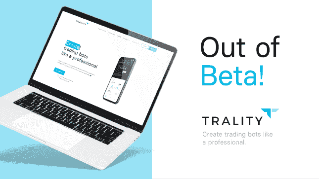
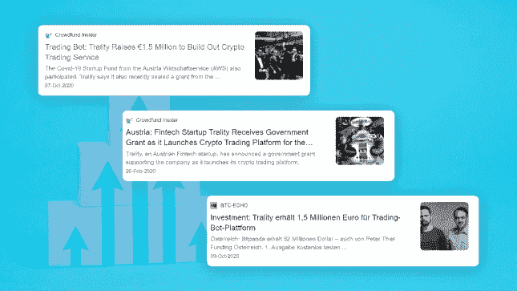
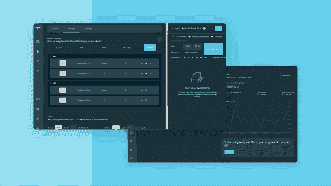
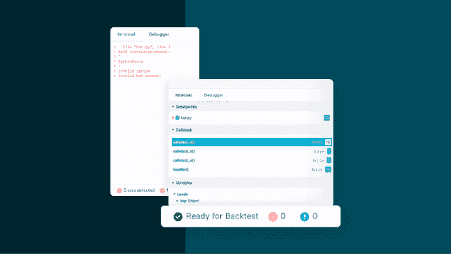
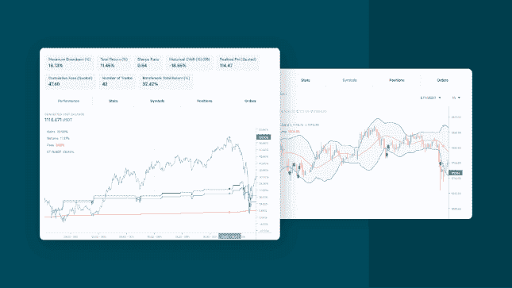
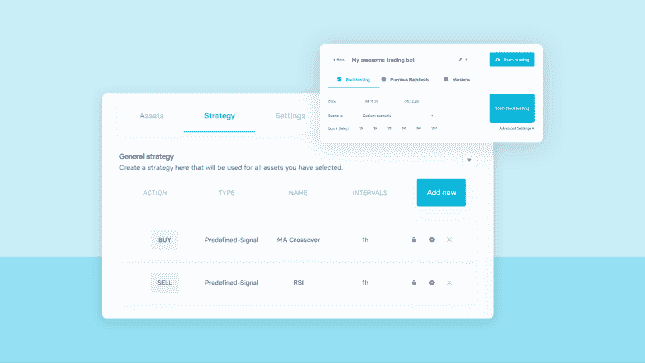
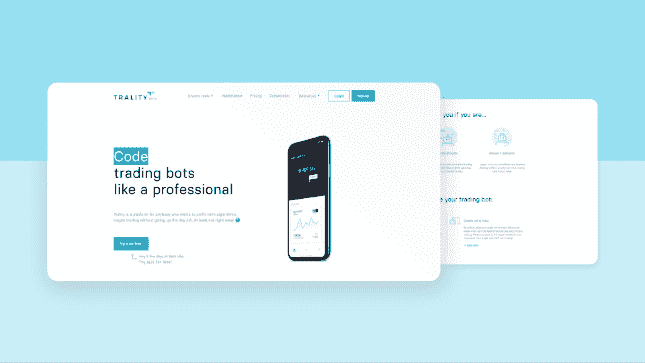
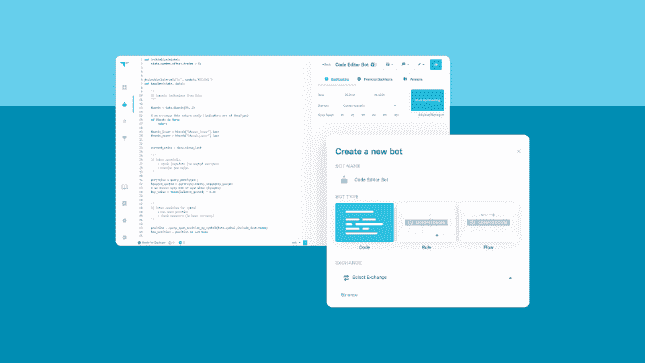
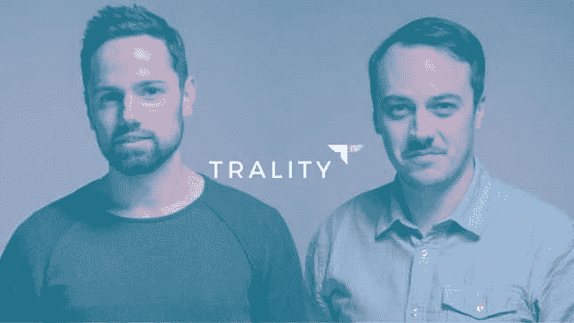

# 现实故事

> 原文:[https://www.trality.com/blog/trality-story/](https://www.trality.com/blog/trality-story/)

自从我们第一次向世界宣布我们的宏伟计划以来，我们已经走过了漫长的道路。在这段时间里，我们在将算法交易的力量和潜力带给每个需要的人的使命上取得了一些重大进展。在本帖中，你会发现从第一天起来自 Trality 总部的最重要的新闻。

## 2021 年 2 月🎉

经过几年与我们的社区在 Trality 的测试版上的密切合作，我们观察到了这样的增长，我们知道是时候推出了。

2 月 1 日，我们完成了测试。这意味着我们为所有用户推出了我们的产品以及灵活的价格计划，包括为那些希望继续免费使用该服务的用户提供免费选项。

## 2020 年 11 月——交易引擎 2.0 上线！

11 月初，我们对交易引擎进行了最大的更新，发布了 2.0 版本。此次更新中推出的一些主要变化包括:

在这个版本中，我们宣布:

*   **新订单**类型，如跟踪止损、限价止损或止损市场(适用于所有交易所)
*   **推介管理工具**让您在需要时能够轻松获取这些信息
*   随着**投资组合管理**的改进，我们可以更容易地随时看到你的平均头寸利润或成功交易的数量。
*   **订单流**允许您将几个不同的订单逻辑连接起来，以正确执行您的策略。这适用于所有订单类型，可用于所有支持的交易所，也可用于所有不同的对。

不用说，这个更新得到了非常积极的回应。

## 2020 年 10 月

在整个团队不知疲倦地努力工作了很长一段时间后，包括营销和 B2B 开发在内的平台的各个方面，我们欣喜若狂地与我们的社区分享，我们获得了 150 万欧元的资金来实现我们的愿景。

天使投资来自澳大利亚和德国的区块链加速器 Blockrocket，以及德国的 fintech VC tokentus。Trality 与来自奥地利经济审计师协会(AWS)的新冠肺炎启动基金相结合，筹集了 80 多万欧元，以实现我们在 2020 年总计 150 万欧元的愿景。

## 2020 年 3 月-增加熊猫、平衡视角和黑暗模式

在获得 FFG 拨款后，我们对平台进行了一些更重要的更新。

*   **Pandas**

    我们将 Pandas 库集成到我们的 Python 交易 API 中，以便您可以更深入地分析您的代码

*   **Balance View**

    我们添加了 Balance view 按钮，让您可以分析投资组合中的每项资产，这样您在与 Trality 进行交易时就不会失去对余额的跟踪。

*   **Dark Mode**

    在这次更新中，我们加入了一个装饰性的有用的功能，包括黑暗模式。社区对此提出了很高的要求。

## 2020 年 2 月下旬——FFG·格兰特

大约在这个时候，我们历史上最重大的事件之一发生了。我们很高兴地宣布，我们从奥地利研究促进机构(FFG)获得了六位数的拨款，这是一个机构的巨大信任票，已经有许多奥地利初创公司起步，并给了我们财务能力来实现过去宣布的许多功能。

## 2020 年 2 月-调试和大幅改进的终端

2020 年初，除了对终端进行全面检查之外，还增加了急需的调试功能。用户可以直接在浏览器中设置断点，并通过代码来更好地分析回溯测试中发生的事情。

在此期间，航站楼也经历了巨大的改善。我们为用户提供了更清晰的关于回溯测试的信息，并启用了复制/粘贴值以供离线分析的选项。

## 2019 年 11 月

在收集了另一轮来自非常有用的测试版用户的反馈后，我们能够对我们的图表可用性进行一些重大改进。最终，我们提高了生活质量，促进了机器人的创建过程。

最显著的增加是:
-许多新的图表类型
-智能指示器绘图
-全屏模式
-改进的缩放行为

在更新的同时，我们推出了对规则构建器的改进，并添加了几个新的策略和指标。

## 2019 年 11 月——规则构建者登场！

这对我们的使命至关重要，因此我们为任何想要利用机器人的力量并自动化其策略的人提供最佳解决方案。这就是为什么我们为那些不知道如何编码的人创造了一个工具。Rule Builder 为那些希望通过直观、轻量级的拖放界面以“简单的方式”自动化其策略的人打开了 Trality。

与此同时，我们对我们的文档进行了大规模的检查，增加了所有 Trality 的功能和设置的完整概述。

## 2019 年 9 月-实时交易开始！

在 7 月和 9 月之间，我们努力听取您的反馈和建议。在那段时间里，我们收到并处理了多达 50 张来自测试版用户的罚单。与此同时，我们正在实施非常重要的实时交易功能。

为了这次发布，我们投入了大量时间。我们日以继夜地研究我们的认证、安全和 bot 部署框架，同时为您的 API 密钥构建安全的加密系统，以便您的资金保持完全安全，我们无法触及。

## 2019 年 7 月-Beta 向所有想参与的人开放

经过大量的测试，调整和摆弄我们的拇指，2019 年 7 月，我们向任何想参与的人开放了我们的测试版。定量分析师、数学家、统计学家和一般喜欢定量解决问题的人被邀请来帮助我们塑造这个平台。

## 2019 年 4 月

2019 年 4 月，我们执行了我们的 MVP(最小可行产品)的私有测试。在发布时，我们确保 Python 编码人员开发和回溯测试算法的所有基本功能都存在。

我们从:
-Python 的代码编辑器
-最初的虚拟交易，因为早期与实物资产交易可能有风险
-用币安金融数据和预定义场景进行回溯测试
-监控所有机器人活动的仪表板

## 2018 年 7 月

从前，两个家伙在大学相遇。他们坐在一起思考金融世界。他们互相询问，为什么交易机器人只对大银行和机构开放。他们知道，75%的像你我这样的私人交易者，当他们试图和在各方面都更好的交易者竞争时，都在赔钱。讨论转向了一个想法，Trality 的开发在 2018 年夏天顺利进行。