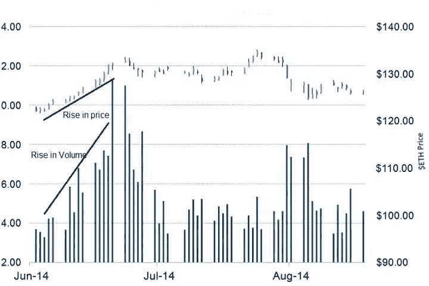
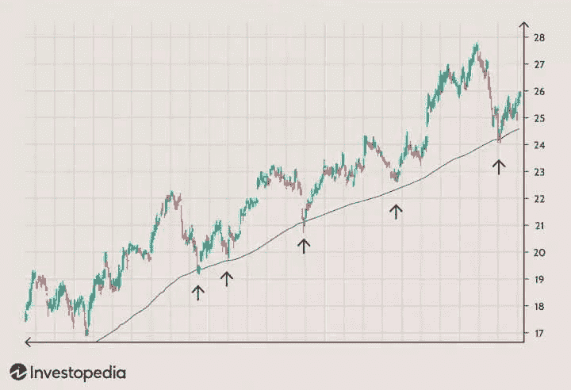
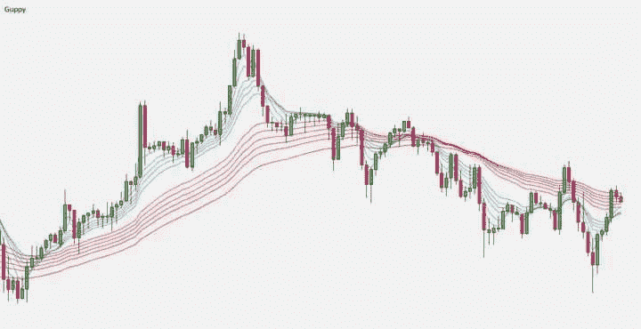
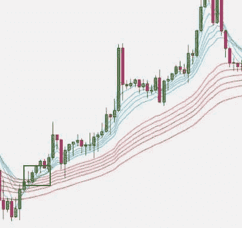
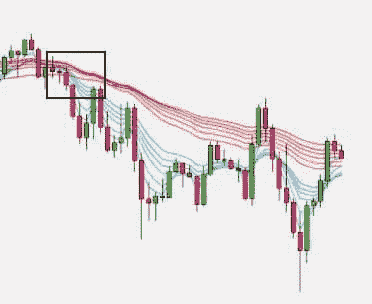
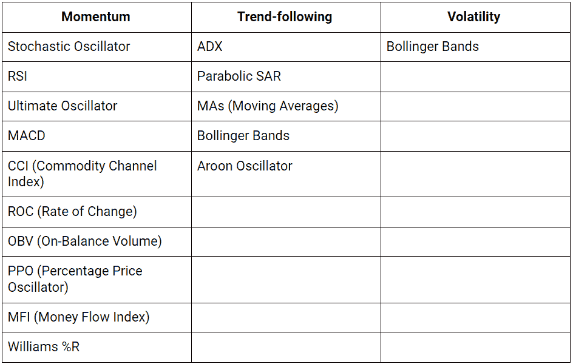

# 交流想法，帮助您开始使用您的机器人

> 原文:[https://www.trality.com/blog/trading-ideas/](https://www.trality.com/blog/trading-ideas/)

你好，创造者！今天，我们将讨论一些交易理念和指标，帮助你离创建第一个机器人更近一步。我们比大多数人更明白，创造一个交易机器人绝不是一件容易的事，我们自己也经历过，所以我们处于一个很好的位置，可以把你推向正确的方向。

## 想用 Python 创建自己的交易算法吗？

查看 Trality 的 Python Bot 代码编辑器——这是一个强大的基于浏览器的工具，专为希望使用算法交易机器人进行构建、回溯测试、优化和实时交易的交易者而设计。我们提供私人交易中最高水平的灵活性和复杂性。事实上，这是我们在 Trality 的核心工作。

[https://www.youtube.com/embed/tOBKjEaufmk](https://www.youtube.com/embed/tOBKjEaufmk)

<button type="button" class="chakra-button css-1hnfsz">Try It for Free</button>

考虑到这一点，让我们从一些你可以马上运用到你的策略中的知识开始。

## **以成交量为指标——OBV(平衡成交量)**

交易量是一个非常重要的因素，你在执行交易时必须牢记在心。不管你是手动交易还是通过交易机器人自动交易，交易量都会影响你交易的成功。交易量只是衡量特定加密货币在任何给定时间内在交易所交易的数量。成交量很重要，因为它可以用来确认趋势方向。我们现在来解释一下可以如何解读。

如果加密货币的价格在上涨，交易量也在上升，这表明有东西在推动价格上涨。通常，像正面消息这样的外部因素会引发这种情况。这也表明有很多**买**的兴趣——基本上这是一个确认的上升趋势。

当一种加密货币的价格上涨但交易量下降时，这向我们表明，交易者尚未决定是否要购买该加密货币。当没有心理或基本面因素影响更广泛的投资者群体时(想想新闻、项目进展或类似 [比特币减半](https://www.investopedia.com/bitcoin-halving-4843769)。这也可能表明趋势发生了变化。

如果价格在下降，交易量在增加，那么我们看到一些因素正在推动趋势下降，这里有明显的**卖出**兴趣，这可能意味着有一个更长的下降趋势。

最后，当价格和交易量都下降时，我们看到交易者对是否出售加密货币犹豫不决。当没有外部因素可以影响更广泛的投资群体，并且趋势变化即将出现时，就会出现这种情况。

**注:**成交量在很大程度上也等于流动性。当有流动性时，进出交易就更容易了。对于低交易量的加密货币，你会发现很难在你的进入点进入，甚至更糟的是，当你想退出时，你可能会被困在交易中。因此，这是考虑体积时需要考虑的另一个重要方面。

### 让我们看看这在图表上是什么样子。

**Ethereum price:** The volume (in millions) is on the left whereas the price is on the right. In this instance we see a rise in price and a rise in volume at the beginning which led to an uptrend for the whole month.

## **充分利用均线——顾比多重均线**

均线是技术交易中最简单和最常用的滞后指标之一。简单移动平均线是通过对一个选定的价格范围取平均值来计算的。

这些通常被用作比较加密货币的实际价格与图表上的阻力或支撑的关系的指标。本质上，当价格下跌或上涨并触及均线时，我们可以假设价格可能会在那一刻停止并有一个回撤。下图很好地展示了这一点:

Notice how whenever the price touches the line, it’s followed by a bounceback.

看着上面的图表，你可能会认为用 MAs 交易很容易，因为上面是一个完美的市场场景。

众所周知，加密货币交易没有“完美”的场景——众所周知，它是不可预测的，尽管 MAs 是不错的工具，但仅靠添加简单的移动平均线是不够的。但这并不是说你完全不能使用均线。

格皮先生出场。

### **顾比多重移动平均线(GMMA)**

著名交易员和财经专栏作家戴若·顾比开发的“顾比多重移动平均线”采用普通的指数移动平均线(EMA)并将其提升至 1000%。

你要做的是使用 12 种不同的 EMA，目的是更清楚地了解市场行为。其中六个 EMA 应该是长期的，六个应该是短期的。

您选择的时间段由您决定，但一个常见的策略如下:

**长期周期:** 3、5、8、10、12 和 15(在下图中用六条红线表示)

**短期:** 30、35、40、45、50 和 60(用六条蓝线表示)

GMMA in action

**与 GMMA 一起产生买入信号**

虽然看起来很吓人，但其实真的没那么复杂。

当所有的短期均线在长期均线上方交叉时，这证实了一个看涨趋势，应该被解读为一个 T2 买入信号。让我们仔细看看这张图表，以确保你理解。

In the box, you will see the exact moment that the short-term lines cross above the long-term lines. As you can see, this would have been a great moment to buy.

如果一个强劲的上涨趋势正在发生，那么短期 EMAs 将会接近，但高于长期 EMAs。如果你观察到这一点，那么它可以被解释为一个非常乐观的趋势。

**与 GMMA 一起产生卖出信号**

相反，当所有短期均线在长期均线下方交叉时，这证实了一个看跌趋势，应该被解读为 T2 卖出信号。让我们再次放大图表来突出那个时刻。

In the box, you will see the moment that the short-term lines cross under the long-term lines and what came next was an obvious bearish trend.

如果一个强烈的下跌趋势正在发生，那么短期的移动平均线将会接近长期的移动平均线，但是不会交叉。然后它们将开始走低，这意味着熊市趋势的延续。

### 为什么 GMMA 如此有用？

GMMA 比其他移动平均线策略占优势有几个原因。

1.  它让交易者更好的理解趋势的力量
2.  它允许对交易活动和趋势环境进行更精确的分析
3.  它帮助你确定和隔离交易
4.  这也有助于发现进出头寸的最佳时机

如果你不知道从哪里开始，孔雀鱼可能是你最好的选择。

## **布林线、平均方向移动指数(ADX)和 RSI 组合**

我们现在已经讨论了一些单一指标，以及它们如何在创建第一个机器人时给你带来优势，但一个好的机器人需要更多的多样性，当你知道自己在做什么时，指标的组合可以带来很高的利润，因此我们将详细说明在组合指标时应该做和不应该做的事情。

你可能已经熟悉以下所有指标，但对于我们这些游戏新手来说，我将快速浏览一下它们是什么。

### **布林线/ADX 组合(不行！)**

**布林线**是一种技术分析(TA)指标，由约翰·布林格创建，他用它来收集市场的波动性，并确定超卖或超买的情况。它本质上告诉你什么时候市场是喧闹的，什么时候是安静的。

**平均方向移动指数(ADX)** 是一个更复杂的指标，交易者使用它来计算上升趋势或下降趋势的强度。我们不会深入研究指标的数学，但它实际上由三个公式组成。这意味着 ADX 通常在图表上显示为三条线，并帮助您的机器人评估是否应该做多或做空交易(或者是否应该进行交易！

起初，将这两者结合起来似乎是个好主意。你可能认为这是检测未来趋势变化的最佳方式，但事实并非如此。

由于以上两者都是趋势跟踪，滞后指标，把它们结合起来不是特别有用，因为你得到的信号本质上是一样的。如果你使用两个趋势指标，你的机器人可能会认为趋势比实际情况更强，让它继续交易，而错过其他重要的信号。这可能对你的战略不利。在其他世界，这个策略变得多余。

### **添加不同类型的指标将有助于获得更好的结果！**

为了纠正你的问题，我们只需要添加另一个不同类型的指标，即不是趋势跟踪指标。在这种情况下，我们将采用普遍喜爱的相对强度指数(RSI)。

**RSI** 是一个动量指标，用于衡量最近价格变化的*幅度*，以确定超买/卖出条件。这也是一个领先指标。

在我们的例子中，将 RSI 添加到策略中是非常有益的，因为它为机器人提供了另一个数据点来做出决策。现在，RSI 将识别明显的动量变化，而 ADX 发现趋势，布林线作为波动趋势指标。

## **进入 MACD(拥有 MACD，SMA***T3】和* **RSI 组合！)**

另一个受欢迎的指标是 MACD(移动平均线趋同背离——我们知道这很拗口)。

**MACD**
这个指标是另一个——被广泛使用的一个。它是一个趋势跟踪动量指标，显示资产价格的两条移动平均线之间的关系。

因此，对于我们的组合策略，我们将创建一个三重奏，如果你喜欢的话，一个神圣的三位一体，由 **MACD** 、 **SMA** 和 **RSI** 组成。这意味着我们有两个滞后指标和一个领先指标。该策略中的 RSI 将识别趋势中的潜在反转点，两个滞后指标将确认信号！

以上是综合指标，当然，还有很多东西需要学习。回到文章开头——创建一个可盈利的加密货币交易机器人并不容易，需要大量的试错。

## **做游***T3】对战* **当前**

如果世界上的每个交易者都采用相同的策略，那么没有人会赚到钱。这是因为算法会因为过度使用而变得多余。虽然观察成功的交易者并听取他们的建议从来都不是坏事(你肯定能从他们身上学到很多东西),但变得有创造力也非常重要，世界上最好的算法是那些做一些不同的事情，并利用其他交易者是可预测的这一事实的算法

## **结束**

在 Trality，我们为用户提供了利用这篇博文中强调的所有指标的机会，此外还有很多我们没有提到的指标。它们都可以用来微调你的理想策略。

查看下表，了解我们直观的规则构建器中的哪些指标以及它们属于哪一类。请注意，这些指标中有许多属于多个类别。

(请注意，使用 Python 代码编辑器，您可以使用*更多的*指示器，您将在我们的[文档](https://docs.trality.com/trality-code-editor/api-documentation/overview-2/indicators_new)中找到这些指示器。)

我们不断扩大 Trality 上可用的指标范围，我们敦促您利用这篇博客文章中的知识，开始尝试不同的组合。如果您需要更多的灵感，那么请记住，伟大的想法结合起来会变得更好，所以为什么不加入我们活跃的 Discord 社区，在那里您可以与志同道合的人聊天、回顾和讨论想法呢？

借助我们强大的回溯测试工具，您可以进行无限的回溯测试，看看您的策略表现如何。此外，在创建 Python 代码机器人时，backtester 的一个新功能是优化器，它允许您自动执行参数优化过程。在编写 bot 代码时，您只需定义相关参数及其各自的范围，您希望对这些参数进行优化以实现最高的 PnL，并让优化器发挥它的魔力。

[https://www.youtube.com/embed/qVvSQ5obtEk?feature=oembed](https://www.youtube.com/embed/qVvSQ5obtEk?feature=oembed)

你完全没有理由不发挥你的想象力，尝试用我们强大的工具想出下一个有利可图的交易点子。

<button type="button" class="chakra-button css-1hnfsz">Get creative</button>