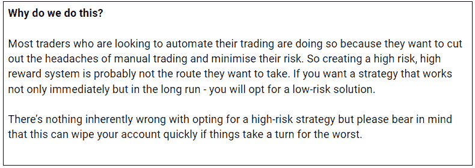
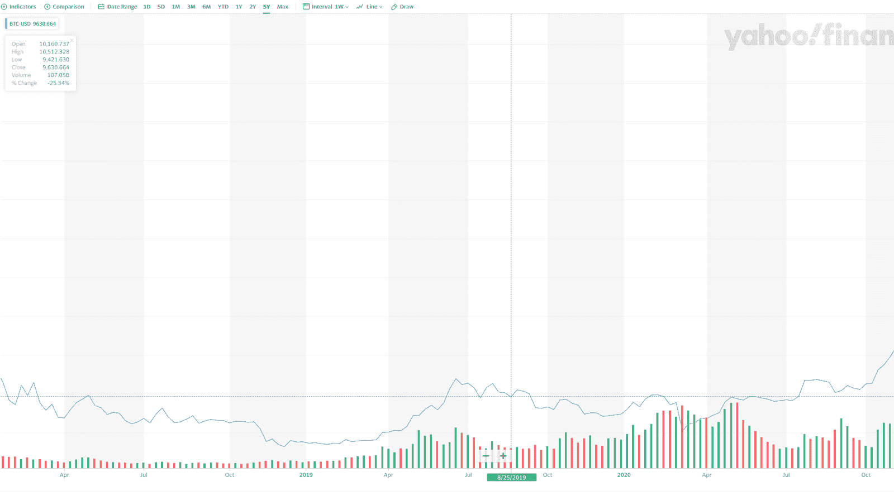
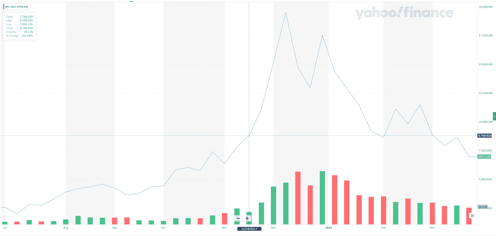

# 来自机器学习专家的回溯测试技巧

> 原文:[https://www.trality.com/blog/backtesting-tips/](https://www.trality.com/blog/backtesting-tips/)

嘿，创造者！欢迎来到 Trality 博客。在这篇文章中，我们将更深入地探讨回溯测试这个主题，以及如何确保你做得正确。

回溯测试是最重要的，也是最不重要的，因为这是一个有利可图的交易系统。如果你正确地执行你的测试，它不仅可以通过指出不一致或异常来帮助优化你的策略，还可以验证你的策略，让你有信心将你的机器人部署到一个真实、活跃的市场。

考虑到这一点，我们向我们的机器学习专家 Constantine dieelkamp 询问了一些关于如何最好地执行回溯测试的简单提示。系好安全带，回溯测试不是在公园散步，有很多东西需要消化。

## **1。分割您的数据**

假设您刚刚执行了 2020 年 1 月 1 日到 2021 年 1 月 1 日的回溯测试。你现在有一大块全年的数据。康斯坦丁建议将这些数据分成三个不同的“块”

**数据块将是:**

1.  训练和优化数据
2.  评估日期
3.  测试数据

当我们继续优化我们的系统时，我们将使用这些块。

第一部分，训练/优化数据，是 1 . 1 . 2020-1 . 6 . 2020(上半年)的数据。在这里，您可以随意调整参数和策略。当你找到一个满足你需求的策略时，你应该采用它并在第二部分评估它的性能，例如 2020 年 6 月 1 日至 2020 年 9 月 1 日。这将是你的评估数据。在这种情况下，评估意味着检查我们在第一个数据段*上测试的参数和策略在第二个数据段*上是否仍然如预期的那样工作。我们没有使用这部分数据来优化我们的策略，所以这是验证你的想法的一个很好的测试。

康斯坦丁建议你重复上述过程，直到你对这个策略感到满意，然后我们可以进入下一部分。

## 2.努力保持结果的一致性

当要创建一个能在各种情况下(上升趋势、下降趋势、牛市和熊市)工作的机器人时，验证、验证、再验证是非常重要的。你的机器人需要能够在动荡的环境下运行，因为加密货币市场是出了名的动荡，这种情况不会很快改变。

为此，您可以将您的评估数据分成三个子部分(每个部分一个月),并在每个月运行测试。您在这里寻求的是一致的结果。如果第一个月实现了+300%，第二个月实现了-70%，然后第三个月实现了+50%，那么一定是出了问题。

## 3.最后，解锁您的测试数据

一旦使用前两个数据块(训练/优化数据和评估数据)执行、测试和优化了系统，就该执行一些最终验证了。您将针对第三个“数据块”(测试数据)运行您的算法。您应该总是对您拥有的最新数据执行最后一次验证。

在这种情况下，测试数据是指 2020 年 9 月 1 日至 2021 年 1 月 1 日这一年最后一个季度的数据。

**注意:**在您完成第一步和第二步并对结果感到满意之前，不要使用“测试数据”对您的策略进行最终验证。

在这个测试数据上运行你的 backest，无论显示什么结果，如果你的机器人上线，这些都是你应该期待的结果。可能是你对结果不满意——如果是这样，是时候重新开始了。

## **更多智慧**

回溯测试是一个艰巨的过程，它是艰巨的，因为创建一个工作的机器人是艰难的，它需要大量的数据分析和修改才能正确。以上是一位对这一过程了如指掌的专业人士的真知灼见。然而，我们有更多的智慧来分享。

**考虑上下文**

您必须始终考虑您正在测试的任何给定时间范围内可能发生的趋势。例如，如果你要在 2017 年 10 月至 2018 年 2 月之间测试你的策略(一场巨大的加密货币挤兑，见图 1)，那么它不太可能在熊市中表现——甚至是横盘市场(见图 2)。这又回到了我们的机器学习专家所说的关于分割数据并分块测试的问题。

Fig. 1 - The first major $BTC bull run

Fig. 2 - After the bull run, Bitcoin entered a sideways trend for quite some time.

**过去的表现并不总是准确的**

回溯测试当然是机器人交易者武器库中最锋利的武器之一，但它不是 100%可靠的工具。回溯测试给你一个很好的指示，告诉你机器人在过去的表现，但是它不能预测未来。如果可能的话，在上线之前对你已经成功回测过的机器人进行一些纸上交易(步行测试),以确保你的策略在当前的市场环境下仍然适用。

测试时间到了！📈

现在，您已经对回溯测试的主题有了更多的了解，并且学到了一些非常可靠的技巧来确保您的系统运行良好。

如果你已经组装好了一个系统，并想试一试——你会很高兴地知道我们强大的回溯测试器可以处理你扔给它的任何东西——而且快如闪电。

(同 [付费选项](https://www.trality.com/pricing)给那些需要一点额外灵活性的人。)

<button type="button" class="chakra-button css-1hnfsz">Start testing now</button>