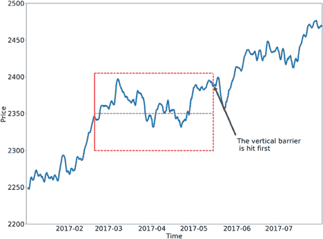

# 如何退出你的交易

> 原文：<https://www.trality.com/blog/closing-trades/>

算法交易的一大重点是为交易找到正确的进场和出场信号。特别是在技术分析领域，买入和卖出信号往往仅仅基于对指标或其组合的评估。当谈到进入和退出信号时，后者在不利的情况下起着更重要的作用。

> 在这篇博客文章中，我们关注的是退出交易，即平仓。我们涵盖了与我们的新产品和 [改进了订单 API](https://docs.trality.com/trality-code-editor/api-documentation/order) 并使用 Trality 代码编辑器将所有东西放在一个简单的交易策略中。所有 Python 代码都以循序渐进的方式进行了解释。

## 为什么要担心退出规则？

制定一个出场的决策规则至少和选择进场点一样重要。一般来说，我们可以区分两大类退出信号:

*   **信号驱动的退出**:平仓纯粹是由某种交易信号驱动的，即评估指标、交叉或其他模型信号。
*   **利润/时间相关退出:**平仓是基于某种(风险调整后的)盈利能力衡量和/或时间相关成分(如 X 天后平仓)。

虽然这两个粗略定义的类别绝不是互斥的，但它们足以让我们在这篇博文中作为一个区分。

纯粹基于信号的退出的主要问题是，交易者可能不愿意接受他们的损益账户的巨大波动，直到他们收到退出信号。因此，大多数算法交易策略包括某种止损和止盈。这些限额通常还与一些风险衡量标准(如波动性)相关联。此外，一些投资策略可能还会引入特定头寸的最大持有期。

考虑到止损限制在算法交易环境中的重要性，我们将使用[新交易订单 API](https://docs.trality.com/trality-code-editor/api-documentation/order) 重点实现**利润/损失和时间相关的止损**。

## 三重势垒法

M. Lopez de Prado 在[Advances in Financial Machine Learning](https://www.researchgate.net/publication/336409053_Book_Review_Marcos_Lopez_de_Prado_Advances_in_Financial_Machine_Learning_Wiley_2018)中介绍的 Tripple-Barrier 方法是一种针对金融时间序列的标记方法。它可以用于受监督的机器学习算法中，以预测第一次触及障碍时的回报符号。

> 请注意，在接下来的章节中，我们不是使用机器学习来估计我们自己的标签，而是使用这种方法作为退出交易的决策规则。

为了更好地理解这种方法，我们可以用图形来形象化它。




Source: [mlfinlab](https://mlfinlab.readthedocs.io/en/latest/labeling/tb_meta_labeling.html)


正如 Tripple-Barrier-Method 的名字所暗示的，我们看到了三个边界:

*   **获利回吐障碍**:最上面的水平虚线
*   **止损屏障**:最底部的水平虚线
*   **时间屏障**:右侧垂直虚线(最大保持时间)

为了了解使用我们的 Python API 实现这一点有多容易，我们一步一步地解开这个退出规则。首先，我们看一下 [**if-touched 市场订单**](https://docs.trality.com/trality-code-editor/api-documentation/order/creation/iftouched-market) ，它将作为障碍法的关键订单类型。其次，我们解释了 **[订单范围](https://docs.trality.com/trality-code-editor/api-documentation/order/overview)** 、中的概念，使我们能够将订单链接在一起。最后但同样重要的是，我们将向您展示如何在一个简化的交易机器人中使用它。

## 发送止损单

在我们新的订单 API 中，我们已经尽可能地为您简化订单创建。您可以发送所有常用的订单类型，如市价订单、限价订单、未触及订单和跟踪订单。此外，大多数订单类型都有 3 种数量配置类型。有关更详细的描述和更多功能，请访问 [Trality 文档](https://docs.trality.com/trality-code-editor/api-documentation/order/creation)。我们现在可以看看关键订单类型来实现我们的退出规则。

### 如果触及市场秩序

如果触及市价订单是有条件订单。如果达到或越过给定的止损价格，就会触发[市价单](https://docs.trality.com/trality-code-editor/api-documentation/order/creation/market)。交叉方向在订单创建时使用当前市场价格解决。

为了简化这一点，想象以下情况:


让我们假设 BTC 目前的市场价格大约是 8840 USDT，我们想在 9000 USDT 卖出 3 BTC。我们可以通过以下方式使用 if-touched 市价单来实现:

```
order_iftouched_market_amount("BTCUSDT",amount=-3,stop_price=9000)
```

这已经很有帮助了，但是在盈亏情况下，用百分比来指定止损似乎更自然。因此，我们为您创建了两个易于使用的包装函数。

**获利回吐**

为给定金额创建一个触及市价卖单，止损价格高于当前市价的止损百分比(止盈)。

```
order_take_profit(symbol="BTCUSDT",amount=3,
				  stop_percent=0.05,subtract_fees=False)
```

**止损**

为给定金额创建一个触及市价卖单，止损价格低于当前市价的止损百分比(止损)。

```
order_stop_loss(symbol="BTCUSDT",amount=3,
				stop_percent=0.05,subtract_fees=False)
```

> 注意，这两个便利函数都有一个参数 **subtract_fees** 。设置为‘真’将自动从金额中扣除兑换费用。

现在我们知道了如何发送订单，一旦触及或突破特定价格，订单将被执行，我们需要一种方法将订单联系在一起。

## 订单范围

通过订单范围的概念，我们为您提供了将订单链接在一起的可能性，从而控制它们的执行。

在 Trality，我们目前为您提供两种不同的订单范围:

*   **顺序:**在此范围内创建的订单被严格地一个接一个地执行。
*   **一个取消另一个:**在此范围内创建的订单在其中一个链接订单完成后立即被取消。

有关可用订单范围的更多信息，请参见我们的文档[此处](https://docs.trality.com/trality-code-editor/api-documentation/order/overview)。

## 设置水平护栏

“一个取消另一个”的订单范围正是我们的 triple-barrier 出口方法所需要的。

目前，我们将忽略垂直障碍，看看如何实现一个合适的函数来处理我们的损益障碍。我们的目标是获得一个简单的函数，为一个给定的符号、数量和上下限创建这个“双重屏障”。让我们看看如何在 Python 中做到这一点:

```
def make_double_barrier(symbol,amount,take_profit,stop_loss,state):

    """make_double_barrier

    This function creates two iftouched market orders with the onecancelsother
    scope. It is used for our tripple-barrier-method

    Args:
        amount (float): units in base currency to sell
        take_profit (float): take-profit percent
        stop_loss (float): stop-loss percent
        state (state object): the state object of the handler function

    Returns:
        TralityOrder:  two order objects

    """

    with OrderScope.one_cancels_others():
        order_upper = order_take_profit(symbol,amount,
        								take_profit,
                                        subtract_fees=True)
        order_lower = order_stop_loss(symbol,amount,
        							  stop_loss,
                                      subtract_fees=True)

    if order_upper.status != OrderStatus.Pending:
        errmsg = "make_double barrier failed with: {}"
        raise ValueError(errmsg.format(order_upper.error))

    # saving orders
    state["order_upper"] = order_upper
    state["order_lower"] = order_lower
    state["created_time"] = order_upper.created_time

    return order_upper, order_lower 
```

正如我们所见，该方法使用给定的输入信息来创建我们的止盈和止损屏障，并将相关信息存储在我们的 bot 的[状态对象](https://docs.trality.com/trality-code-editor/core-concepts/overview-1)中。

我们的订单范围确保如果一个订单完成，另一个订单立即取消。没有必要跟踪单个订单，因为取消是自动发生的。

## 添加最大保持时间

作为一个额外的特征，我们可以包括一个最大的持有期(即垂直障碍)。这种方法只是使用状态信息来检查我们的头寸持有时间是否超过我们的最大持有期。如果是这种情况，我们平仓并取消我们的障碍订单。

```
def check_max_holding_period(timestamp,state):

    """check_max_holding_period

    This function checks the for a first touch in the vertical barrier.
    If the vertical barrier is touched the double barrier orders are canceled.

    Args:
        timestamp (float): milliseconds of current engine time
        state (state object): the state object of the handler function          

    Returns:
        bool value

    """

    if check_state_info(state) is None:
        return True

    time_delta = timestamp - state["created_time"]

    if state["max_period"] is None:
        return True

    # cancel order if vertical barrier reached
    if time_delta >= state["max_period"]:
        print("vertical barrier reached")
        cancel_order(state["order_upper"].id)
        cancel_order(state["order_lower"].id)
        close_position(state["order_lower"].symbol)

    return True 
```

在上面的例子中，我们使用一个简单的函数来检查我们的状态对象中所有需要的信息。

```
def check_state_info(state):

    """check_state_info

    This function checks the state object for relevant order information.
    If the information exists it also refreshes the order_upper from the
    double barrier function

    Args:
        state (state object): the state object of the handler function          

    Returns:
        None or TralityOrder order_upper 

    Raises:

        AssertionError: If invalid order specification.

    """

    if "order_upper" not in state.keys():
        return None
    elif state["order_upper"] is None:
        return None

    order_upper = state["order_upper"]

    errmsg = "No max_period in state. Unable to check max holding period"

    assert "max_period" in state.keys() , errmsg
    # refreshing order from api
    order_upper.refresh()

    if order_upper.status != OrderStatus.Pending:

        # resetting state information
        state["order_upper"] = None
        state["order_lower"] = None
        state["created_time"] = None
        return None

    return order 
```

## 把所有的放在一起

我们现在准备使用我们所开发的，以便在 15 分钟间隔内对 BTCUSDT 交易的简单交易策略中包装一切。首先让我们为我们的机器人定义一个简单的进入规则。

### 我们的参赛规则

我们定义了价格信号和交易量信号。如果两者都是真的，我们就做多。

**1)价格信号**
最近连续五个收盘价向上滴答(我们称之为上涨):

$ $ \ text { upticks } = \ sum _ { t = t-5}^{t}符号(close_t - close_{t-1})$$

因此，如果**上涨== 5** ，我们的价格信号将是真实的。是的，这很容易。我们可以写一个小助手函数:

```
def last_five_up(data):
    prices = data.select("close")
    signs = np.sign(np.diff(prices))[-5:]
    return sum(signs) == 5
```

**2)音量信号**
我们这样定义我们的音量信号:

$$均线(成交量，20)>均线(成交量，40)$$

像往常一样，我们可以直接使用数据对象:

```
ema_short_volume, ema_long_volume = volume.ema(20).last, volume.ema(40).last

    # return early on missing data
    if ema_short_volume is None:
        return False 

    has_high_volume = ema_short_volume[-1] > ema_long_volume[-1]
```

### 退出规则

根据前面的阐述，我们使用三重障碍法，止盈 5%，止损 3%。对于第一次尝试，我们将最大保持期设置为“None”，这将忽略该参数。

### 处理函数

最后，我们准备编码我们的处理函数，并把整个算法放在一起。我们将 95%的资本用于我们的进入信号:

```
 def initialize(state):
    state.max_period = None # exclude vertical

@schedule(interval="15min", symbol=["BTCUSDT"], window_size=200)
def handler(state, data):

    # moving averages on volume
    volume = data.volume
    ema_short_volume, ema_long_volume = volume.ema(20).last, volume.ema(40).last

    # return early on missing data
    if ema_short_volume is None:
        return False 

    has_high_volume = ema_short_volume[-1] > ema_long_volume[-1]

    # at every timestamp check max holding period
    check_max_holding_period(get_timestamp(),state)

    # getting portfolio and position information
    portfolio = query_portfolio()
    buy_value = float(portfolio.excess_liquidity_quoted) * 0.95
    position = query_open_position_by_symbol(data.symbol)
    has_position = position is not None

    if not has_position and last_five_up(data) and has_high_volume:
        price = data.close_last
        buy_amount = buy_value / price
        buy_order = order_market_amount(data.symbol,buy_amount)

        # setup barriers
        make_double_barrier(data.symbol,float(buy_order.quantity),
                            0.05,0.03,state) 
```

### 样本回测

仅仅为了说明，我们将在 2020 年 1 月运行这个机器人一个月来说明这个概念。这绝不是对战略绩效的详尽分析——只是一个简单的例子。


即使这一时期根本不具有代表性，我们可以看到，由于我们的止盈和止损屏障，一些提款是可以避免的。为了看到这一点，我们来看看我们的立场:


> 请注意，我们的回溯测试系统会精确地以各自的止损价格填写 if-touched 订单。这种简化在现场交易中无法保证。

当然这是一种过度简化。如果我们看看我们的入口和出口点，我们已经可以发现改进的空间:


在这种情况下，我们相当幸运。大部分退出后，价格真的下降了。然而，如果我们的止盈障碍被触发，那么我们的进场规则可能会在它之后再次被触发。在最坏的情况下，我们可以在价格暴跌之前进入。

### 摘要

在这篇博文中，我们展示了替代的退出规则，这些规则更具有现实世界的特征，并且与我们对财务损失与收益的自然风险厌恶更密切相关。这里的重点是让您熟悉我们的新订单 API，并向您展示如何使用它。

* * *

***免责声明:*** *本文所发现的内容都不应被视为投资建议。*以上文章仅是一篇观点文章，并不代表任何类型的交易建议或关于如何投资、如何交易*、*投资哪些资产 **或关于 **如何使用交易机器人或交易算法的建议****d！在投资之前一定要做好自己的研究。)只投资你赔得起的！* ***回溯测试不代表未来结果** 。**