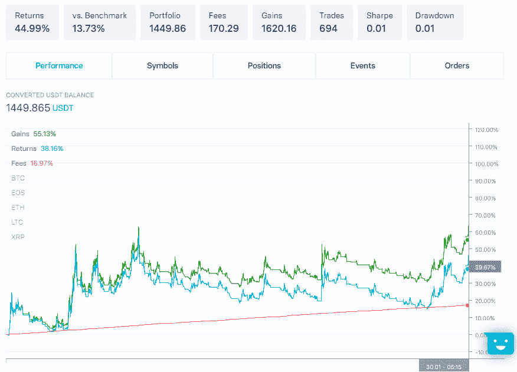

# Bot 的诞生:基础策略-策略构建基础(第二部分)

> 原文:[https://www . trality . com/blog/strategy-building-basics-pt-ii/](https://www.trality.com/blog/strategy-building-basics-pt-ii/)

在 [我们系列的第一篇文章](/blog/strategy-building-basics-pt-i/)我们已经讨论了战略发展的主要构件。现在是时候让我们运用我们所学的知识，为我们的多硬币交易机器人构思基本策略了！我们一步一步地引导您完成决策过程，引导我们找到一个可以根据基准进行回溯测试和比较的策略。

## 投资领域

正如我们所知，第一个重要的组成部分是我们的机器人交易的宇宙。投资领域的选择对 bot 的绩效有很大的影响。例如在[动量策略](https://quantpedia.com/strategies/momentum-factor-effect-in-stocks/)中，将过去的表现跨资产进行比较以形成投资决策，需要考虑像[相关性](https://brilliant.org/wiki/correlation/)、[协整](https://en.wikipedia.org/wiki/Cointegration#:~:text=Cointegration%20is%20a%20statistical%20property,k)%20of%20time%20series%20variables.&text=Formally%2C%20if%20(X%2CY,Y%2C%20and%20Z%20are%20cointegrated.)和其他因素(感兴趣的读者可以参考这篇[文章](https://cssanalytics.wordpress.com/2014/06/04/momentum-strategies-and-universe-selection/))。粗略地说，我们可以认为，当只根据资产过去的相对表现(如动量策略)来选择资产时，拥有一个对不同市场运动做出“不同”反应的投资领域是有利的。

在加密资产的情况下，我们正在处理一个高度相关的市场(关于这一点的更多信息，请查看这篇[文章](/blog/fighting-covid-19/) ) -特别是在交易加密法定货币对(用加密货币对法定货币进行交易的货币对，如美元)时。然而，由于我们的目标是建立一个趋势跟踪机器人，其中进入和退出信号分别取决于每个硬币的技术指标，因此依赖性对我们的策略来说是一个较小的挑战。我们专注于高市值的配对，这为我们提供了一个深度和流动性的市场。检查加密货币市值的一个好地方是 www.coinmarketcap.com 的 T2。

Top 10 Cryptocurrencies by Market Cap (as of 2020-07-04)

上面列出了截至本文撰写时市值最高的 10 种加密货币。对于我们机器人的初始实现，我们选择 5 个硬币来组成我们的基础宇宙。我们挑选了市值最大的 5 种加密货币，不包括比特币叉子(比特币现金和比特币 SV)和 Cardano(由于最近的上涨，其市值增加了近 5 倍)。这使我们剩下比特币(BTC)、以太坊(ETH)、Ripple (XRP)、莱特币(LTC)和 EOS 成为市值最大的五种加密货币。这些硬币构成了我们战略的基础宇宙。此外，它们也是我们比较战略的基准。

## 策略设置

因为我们在整个系列中使用 Trality 规则构建器，所以选择宇宙非常容易！只需在下拉列表中搜索所需的硬币，并将它们添加到您的世界中。您应该得到以下结果:

Universe selection in the Trality Rule Builder

现在我们有了基础宇宙，我们需要选择我们的机器人交易的时间框架(或频率)。作为基本策略，我们使用 1 小时蜡烛线，就像我们的 [BTC 趋势跟踪策略](/blog/developing-simple-trading-bot-with-trality-bot-code-editor)一样。我们需要我们的时间框架足够长，以形成我们的系统可以利用的重要趋势，但也足够短，以能够快速调整趋势逆转，这种趋势逆转在加密资产中的发生速度比传统资产类别快得多。

接下来是指标选择及其参数化。我们选择构建一个趋势跟踪机器人已经为我们指出了某些指标的方向。最常见的趋势跟踪指标有均线交叉、均线收敛/发散(MACD)、相对强弱指标(RSI)和均线成交量(OBV)。您可以在这里查看这些指示器[的 Trality 文档。](https://docs.trality.com/trality-rule-builder/signal-generation)

我们使用与我们的[危机保护帖](/blog/developing-simple-trading-bot-with-trality-bot-code-editor)中相同的指标，一个指数移动平均交叉。这为我们提供了一个趋势跟踪指标，更重视最近的价格变动，理论上，应该提供更准确、更快速的信号。与简单的均线相比，它的潜在缺点是在我们的表现中有可能出现错误信号和拉锯。然而，由于我们关注 1 小时蜡烛线，并考虑到前面提到的加密货币的快速趋势反转，均线交叉是一个很好的起点。

对于交叉的参数化，我们使用与前面提到的 BTC 策略相同的 20 和 40 小时回顾期。在下一篇文章中，我们将更仔细、更系统地研究指标的选择以及参数化，这一实现旨在让我们顺利起步。

在 Trality 的规则生成器中，信号发生器的设置非常简单。在“策略”选项卡下，只需选择“添加新项”并选择“MA-Crossover”作为预定义的策略。打开专家模式并配置买入信号:

Buy signal using the Trality Rule Builder

以类似的方式设置好卖出信号后，我们就可以设置信号发生器了！

Full set of signal generators

对于头寸规模，我们假设只做多策略，我们将 20%的资本分配给 5 个硬币中的每一个，这样我们的投资总是在 0%(如果所有硬币的信号都是负的)和 100%(如果所有信号都是正的)之间。一旦收到卖出信号，我们就平仓一枚硬币。我们在参数选项卡下进行设置。

Setting the position size

## 回溯测试

在对此策略进行第一次回溯测试之前，我们必须做出的最后一个决定是选择样本内和样本外期间。由于我们策略的主要前提是它能在市场动荡时期保护我们，我们希望我们的样本外期从 2020 年 2 月开始，就在新冠肺炎引发金融市场大规模抛售之前不久。由于样本内和样本外数据的一个好的经验法则是使用 2/3 的数据集进行策略优化，剩余的数据进行样本外验证，我们在 2019 年 4 月初开始回测。这给了我们大约 15 个月的总数据集(或者大约 11000 根每小时的蜡烛线)。我们使用 2019-04-01 和 2020-01-31 (10 个月)之间的数据作为我们的样本内数据集，使用 2020-02-01 和 2020-06-30 (5 个月)之间的数据作为样本外数据集。

我们终于可以使用 Trality 回溯测试模块来测试我们的策略了！

Backtest result

对于第一次试运行来说还不错！在回溯测试期间，我们的策略在扣除费用后的回报率为 44.99%，比我们宇宙中买入并持有的基准高出 13.73%！

策略开发系列的第二部分到此结束，我们已经完成了第一个多币交易策略设置和回溯测试。在下一篇文章中，我们将开始更详细地研究我们的一些战略假设，并展示一种更系统化和定量化的方法来选择一些参数。现在进入我们的战略构建基础系列的第三部分[。](/blog/strategy-building-basics-pt-iii)

<button type="button" class="chakra-button css-1hnfsz">Go to Pt. 3</button>

* * *

Stefan 是一名 quant，在金融行业有超过 6 年的工作经验。他目前在一家专门为机构客户提供保险投资的独立投资管理公司担任风险管理&分析总监。7 年来，他一直在业余时间开发和实施跨多种资产类别的算法交易策略。