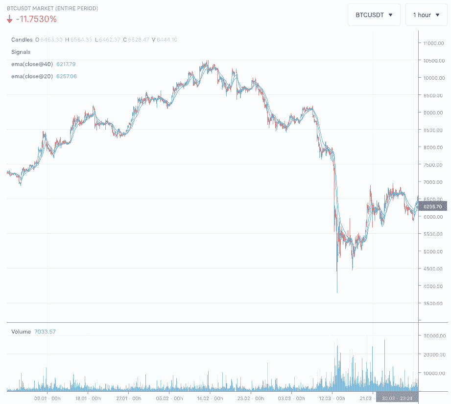
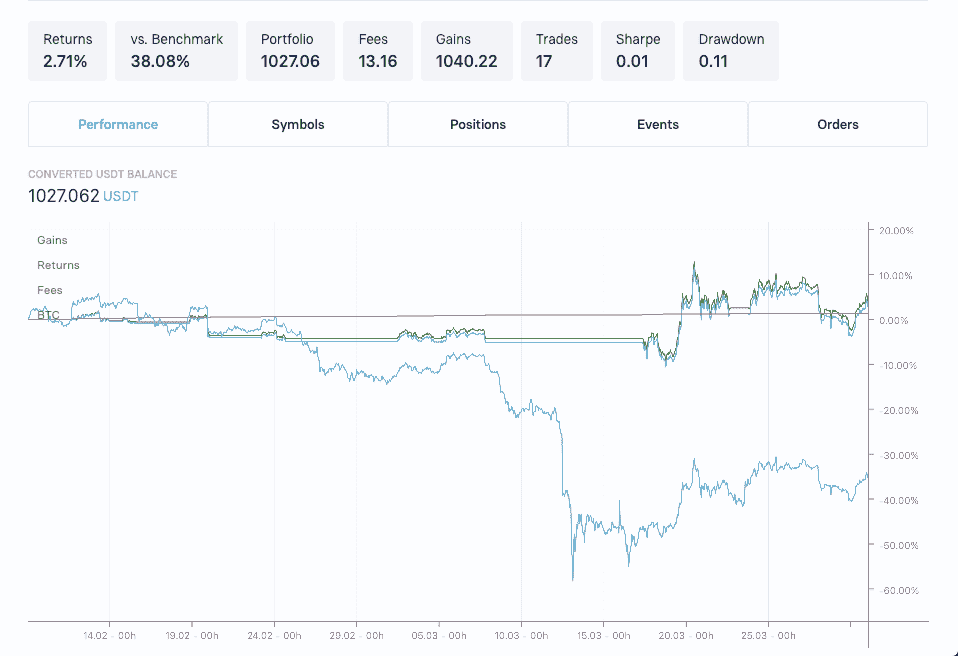
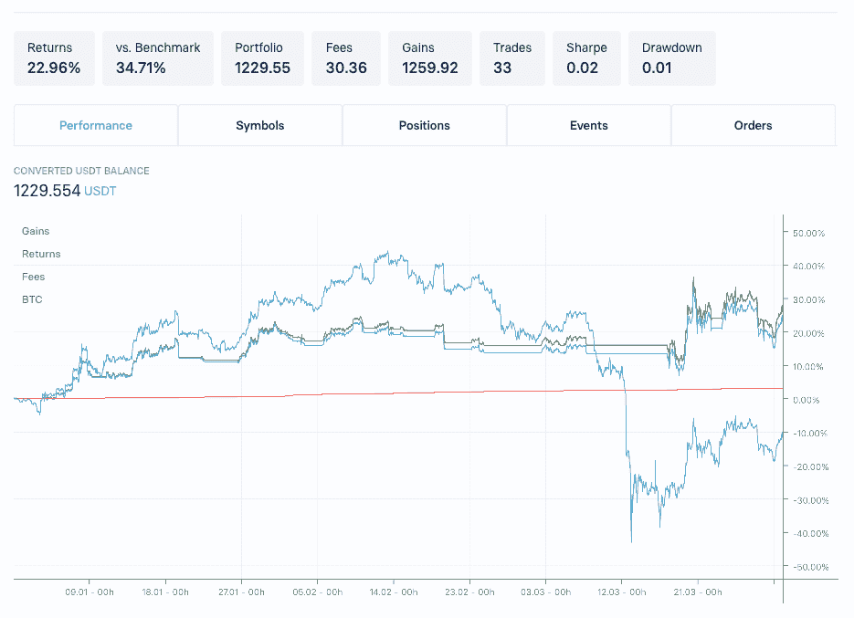

# 用 Trality 的代码编辑器开发一个简单的交易机器人

> 原文：<https://www.trality.com/blog/developing-simple-trading-bot-with-trality-bot-code-editor/>

2020 年对加密投资者来说开局良好，BTC 价格从 7000 美元上涨到 2 月初的 10，000 美元以上。自那以后，新冠肺炎病彻底动摇了市场。令许多人惊讶的是，特别是对那些坚信加密资产独立于传统市场的人来说，比特币在 2 月期间，尤其是在 3 月的前两周，描绘了一个类似于股票的下跌趋势(见图 1)，尤其是在 3 月 13 日星期五，BTC 在一天之内下跌了 30%以上。




*Figure 1: BTCUSDT price developments 01.01.2020 - 31.03.2020*


自然，在这种时候，投资者自问的一个重要问题是，为了不屈服于如此糟糕的市场环境，他们能做些什么。有没有办法避免在一天内损失超过 30%的投资价值？这个问题的简短答案是“是的，有办法”:有办法在这个市场上成功交易，它们依赖于一种叫做T2】算法交易。

听起来很复杂？不需要这样！在 Trality，我们的目标是让私人投资者可以使用专业级算法交易，这样每个人都可以从中获利——不仅仅是专业人士。我们在交易机器人的帮助下做到了这一点！这些是交易算法的技术载体，控制着(在这种情况下:加密)资产的自动买卖。这些算法使用基于资产价格或交易量数据的数学标准来确定某项资产何时应该被买入或卖出。交易机器人将产生的信号以命令的形式转发给密码交易所。交易机器人可以通过利用它们的波动性来帮助用户增加买卖资产的利润。

<button type="button" class="chakra-button css-1hnfsz">Try for yourself for free</button>

## 战略

那么，在一个下行的市场环境中，比如从 2 月中旬开始的市场环境，怎么能使用一个简单的交易算法呢？让我们给你一个初级水平的策略示例，基于技术分析中常用的一个指标:指数移动平均线(EMA)，具体来说就是两个 EMA 的交叉。

> 有关 EMA 交叉策略的详细说明，请参见 [Trality 文档](https://docs.trality.com/trality-rule-builder/signal-generation/ma-crossover)。简而言之:均线是一种移动平均线，比简单移动平均线对最近的价格变化反应更大。交叉策略将两条均线应用于图表:一条较长，一条较短。当短期均线越过长期均线时，它构成了一个[买入信号](https://www.investopedia.com/terms/b/buy-signal.asp)，因为趋势在向上移动。与此同时，当短期均线穿过长期均线下方时，这是一个[卖出信号](https://www.investopedia.com/terms/s/sell-signal.asp)，因为趋势正在向下移动。( [Investopedia](https://www.investopedia.com/articles/active-trading/052014/how-use-moving-average-buy-stocks.asp) )

因此，我们制定了两个 EMA 策略(20 和 40 蜡烛回顾期)。该策略基于 1 小时蜡烛线交易，对中短期价格波动很敏感。此外，它总是将 80%的可用基础货币分配给每笔交易。我们使用 Trality Python Bot 代码编辑器来设计这种算法:

```
 # Define crossovers
def crossed_upwards(short, lng):
    return short[-2] < lng[-2] and short[-1] > lng[-1]

def crossed_downwards(short, lng):
    return short[-2] > lng[-2] and short[-1] < lng[-1]

@schedule(interval="1h", symbol="BTCUSDT")
def handler(state, data):

    # Catch basic indicators
    ema_long = data.ema(40)
    ema_short = data.ema(20)

    # Empty values check, e.g. maintenance windows, etc.
    if any(param is None for param in [ema_long.last, ema_short.last]):
        return

    # Check whether we currently have an open position that's not dust
    has_position = has_open_position(data.symbol, truncated=True)

    # Define EMA conditions
    ema_crossed_upwards = crossed_upwards(ema_short['real'], ema_long['real'])
    ema_crossed_downwards = crossed_downwards(ema_short['real'], ema_long['real'])

    # Compute amount we want to buy (we use 80% of our portfolio here)
    balance_base = float(query_balance_free(data.base))
    balance_quoted = float(query_balance_free(data.quoted))
    buy_amount = balance_quoted * 0.80 / data.close_last

    # Check for buy and sell conditions and allow one open position at a time
    if ema_crossed_upwards and not has_position:
       create_order(symbol=data.symbol,amount=buy_amount)

    elif ema_crossed_downwards and has_position:
       close_position(data.symbol) 
```

> 顺便说一下:如果这看起来对你来说代码太多了，那么你应该试试我们的 Trality 规则生成器，它让你设计简单的[策略而不需要代码！](/blog/building-simple-trading-bot-with-trality-rule-builder/)

## 这个策略失败了

让我们逐行分解上面的 bot

```
def crossed_upwards(short, lng):
    return short[-2] < lng[-2] and short[-1] > lng[-1]

def crossed_downwards(short, lng):
    return short[-2] > lng[-2] and short[-1] < lng[-1] 
```

首先，我们定义每种交叉类型的条件:向上交叉和向下交叉。向上交叉是指在过去的两个蜡烛周期中，长均线的价格位于短均线之上，而在过去的一个蜡烛周期中，这种关系发生了变化，短均线的价格位于长均线之上。相反的关系被定义为向下交叉。

```
@schedule(interval="1h", symbol="BTCUSDT")
```

你第二个看到的是[时间表装饰](https://docs.trality.com/trality-code-editor/core-concepts/overview)。您可以用这个装饰器注释代码中的任何处理函数，使它在特定的时间间隔内运行，并使用一组指定的符号。在本例中，该函数将每隔 **5 分钟**调用一次，处理函数将接收符号或交易对 **BTCUSDT** 的数据——其中 BTC 是基础资产，USDT 是报价资产。

```
def handler(state, data):
```

您注释的指定处理函数将接收两个参数:`state`和`data`。虽然[状态对象](https://docs.trality.com/trality-code-editor/core-concepts/overview-1)可用于存储不同处理程序之间的任何变量，但数据对象包含您请求的关于符号 **BTCUSDT** 的信息。这个对象有许多内置函数，比如 100 多个技术分析指标，可以直接从数据对象中计算出来。

```
 ema_long = data.ema(40)
    ema_short = data.ema(20)
```

正如您所看到的，您可以从数据对象中直接计算财务指标。在这种情况下，我们用两个不同的周期(40 蜡烛线和 20 蜡烛线)计算指数移动平均线，然后选择最后一个值。

```
 if any(param is None for param in [ema_long.last, ema_short.last]):
        return
```

接下来，代码检查是否存在空值，例如由维护窗口等引起的空值，如果存在空值，则继续执行。

```
 has_position = has_open_position(data.symbol, truncated=True)
```

在策略中，我们希望避免为符号 **BTCUSDT** 建立超过 **1** 的未平仓头寸。我们使用众多[实用函数](https://docs.trality.com/trality-code-editor/api-documentation/position/querying)中的一个来检索我们当前是否有未平仓头寸。`truncated`参数确保非常小的位置(如灰尘)不会被视为开放位置。

```
 ema_crossed_upwards = crossed_upwards(ema_short['real'], ema_long['real'])
    ema_crossed_downwards = crossed_downwards(ema_short['real'], ema_long['real'])
```

接下来，我们用上面收到的`ema_short`和`ema_long`数据计算之前定义的交叉。

```
balance_base = float(query_balance_free(data.base))
balance_quoted = float(query_balance_free(data.quoted))
buy_amount = balance_quoted * 0.80 / data.close_last
```

接下来，代码计算策略应该分配给任何购买订单的金额。在这种情况下，报价资产当前余额的 80%被分配。

```
if ema_crossed_upwards and not has_position:
   create_order(symbol=data.symbol,amount=buy_amount)

elif ema_crossed_downwards and has_position:
   close_position(data.symbol)
```

这是交易机器人的基本逻辑。注意，我们正在比较均线和`has_position`标志来决定是买还是卖。如果两个均线向上交叉，先前计算的`buy_amount`的买入指令被发出，但是只有在没有开仓的情况下。在向下交叉和存在打开位置的情况下，该打开位置再次关闭。

create_order 函数向相应的交易所发出请求，以购买所需的数量。另一方面， [close_position](https://docs.trality.com/trality-code-editor/api-documentation/position/adjust#close_position) 函数关闭已经存在的 **BTC** 位置，如果它存在的话。

<button type="button" class="chakra-button css-1hnfsz">Try for yourself for free</button>

## 回溯测试策略

我们随后使用 Trality 回溯测试模块来评估我们策略的回报:




*Figure 2: Performance of Trading Bot (1h) BTCUSDT EMA Crossover (20,40) 10.02.2020-31.03.2020*


图 2 显示了上述算法在 2020 年 2 月 10 日至 3 月 31 日期间的结果。Trality 的回溯测试总是包括交易费用，并且可以被建模以考虑滑点。从结果中可以看出，该策略是在市场明显呈下降趋势且仅在接近尾声时才恢复的时间框架内进行回测的(见深蓝色线)。在此期间，BTC 损失了超过 34%的价值。然而，在同一时期，我们的交易机器人通过交易 14 次，积累了 2.71%的小利润，从而消除了大幅度下跌，否则 BTC 就会受到影响。从结果中扣除总计 1.32%的累积费用，可以看到淡蓝色线。

在这一点上，有理由认为这只是在短时间内完成的一次回溯测试，回溯测试不应该作为未来成功的唯一衡量标准！虽然这是绝对正确的，但上面的例子表明，即使是简单的基于均线交叉策略的交易机器人也可以在低迷时期帮助大幅减少损失——在这个特殊的例子中就是这样。然而，为了便于讨论，让我们来看看更长的一段时间，以及在不断变化的市场环境中，我们的策略可能会有怎样的表现。




*Figure 3: Performance of Trading Bot (1h) BTCUSDT EMA Crossover (20,40) 01.01.2020-31.03.2020*


从图 3 中可以看出，在 3 个月的时间里，BTC 的价格在经历了前面提到的从 2 月中旬到 3 月中旬的下跌，直到最终再次攀升到当前水平之前，开始显著上升。很明显，在所有这些变化的市场环境中，我们简单的均线交叉策略不像上面那样成功:在我们回溯测试的前 1.5 个月，它的表现远远低于市场，因为一个强劲的向上市场没有产生足够的趋势反转，使指数移动平均线交叉，从而产生交易信号。该算法仅在后验测试的后半段释放出其价值，最终以超过市场 34.71%的成绩结束。

> 算法交易不是一种“设置好就忘了”的操作！

这个交易机器人的例子和两个回溯测试向你展示了算法交易不是一种“设置好就忘了”的操作。为了取得长期的成功，战略需要精心制定，经过回顾和前瞻的检验，并能灵活地适应不断变化的市场环境。具体是什么意思？在这一系列客座博文中，我们概述了如何将复杂性添加到交易机器人开发中，以便在不断变化的市场环境中增加灵活性。请记住，以上所有的策略设计都是在事后才完成的，并且完全基于回溯测试。

<button type="button" class="chakra-button css-1hnfsz">Try the Code Editor for free</button>

* * *

*免责声明:回溯测试并不代表未来的结果，上述文章只是一篇观点文章，并不代表任何类型的交易建议或如何使用交易机器人或交易算法的建议。*