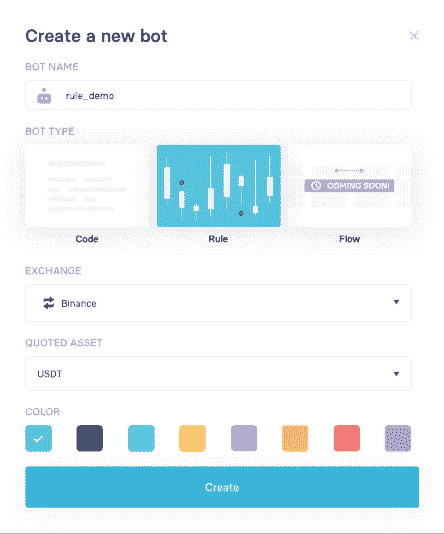

# 用 Trality 规则构建器构建一个简单的交易机器人(没有代码！)

> 原文:[https://www . trality . com/blog/building-simple-trading-bot-with-trality-rule-builder/](https://www.trality.com/blog/building-simple-trading-bot-with-trality-rule-builder/)

Trality 规则生成器帮助您创建自己的 [无需编码的加密交易机器人](/blog/crypto-trading-bots)。我们正在开发这个基于规则的机器人创建编辑器，尽可能简单，尽可能复杂。简单性是通过拖放机制来创建 bot 的逻辑。复杂性是通过不断增加的功能集添加的，为您提供成功交易所需的灵活性。

或许最简单的开始方式是向你展示如何一步一步地创建一个简单的交易机器人。通过这种方式，您可以熟悉规则构建器的基本概念，我们可以向您介绍更高级的配置技术。

出于演示的目的，我们将创建一个简单的单一货币对趋势跟踪策略，即 BTCUSDT。

<button type="button" class="chakra-button css-1hnfsz">Try for yourself for free</button>

## 创建新的机器人

我们开始吧！要使用我们的规则构建器创建一个 bot，我们只需命名我们的 bot 并选择“Rule”作为 bot 类型。然后，我们选择一个交易所进行交易，并为我们的算法选择一个报价资产。目前我们支持币安，但不久之后会有更多的交流。报价资产代表所有交易执行时使用的货币。

Figure 1: Creating a new rule-based trading bot in Trality

## 选择你的资产

现在，我们选择希望我们的机器人运行的基础资产，即哪些硬币应该与我们的报价资产一起买卖。对于我们的示例性交易机器人，我们将简单地选择 BTC，因此我们的机器人将在符号 BTCUSDT 上交易。

Figure 2: Selecting base assets

## 添加您的参数和常规设置

在我们真正开始定义我们的机器人的实际策略之前，我们想定义它的一般设置。有关所有参数和设置的详细描述，请阅读 Trality 文档并查看[规则构建器部分](https://docs.trality.com/quick-start/rule)。

现在，我们只是将“最大购买量”设置为投资组合价值的 95%。这意味着我们将在任何给定时间持有 5%的报价资产。

Figure 3: Defining base settings and parameters for a trading bot

## 定义你的策略

现在有趣的部分来了。每个交易机器人的核心是战略设计。此时，您可以指定实际的交易信号。更准确地说，你的策略由各种预定义的策略组成，这些策略会产生买入或卖出信号。

我们的目标是定义一个简单的趋势跟踪策略，当趋势上升时买入 BTC，当趋势反转时卖出 BTC。这种信号的流行选择是移动平均线的交叉。要获得详细的解释，请查看我们之前的[博客文章](/blog/developing-simple-trading-bot-with-trality-bot-code-editor)，它使用我们的 Python 编辑器和[文档](https://docs.trality.com/trality-rule-builder/signal-generation/ma-crossover)实现了相同的 MA cross 策略，以获得技术解释。

要添加我们的第一个信号，我们转到策略选项卡，然后按添加新的按钮。在弹出菜单中，我们选择 MA-Crossover 并勾选专家框，以调整该预定义策略的详细信息。

Figure 4: Adding a buy signal to a trading bot

在这里，我们可以指定策略类型、信号类型(买入或卖出)、区间和指标参数以及保持信号。有关的详细描述，请参考[文档](https://docs.trality.com/trality-rule-builder/signal-generation/ma-crossover)。为了避免混淆，请注意这里选择的“均线类型”是指数移动平均线(EMA)。

> 重要的是要注意，指定买入或卖出信号将自动解析信号的方向，或者从技术上讲是指标的组合。这意味着当短均线(20)从下方穿过长均线(40)时，均线交叉买入会产生买入单。同样，当多头均线(40)从上方穿过均线(20)时，均线交叉卖出发出卖出指令。

我们选择均线每小时交叉一次，均线是 20，均线是 40，不管是买还是卖。策略概述显示了我们的策略以及它们触发的信号、它们的名称和它们运行的时间间隔。因此，我们获得了以下初步策略:

Figure 5: Building a simple EMA Cross strategy for a trading bot

## 回溯测试您的策略

回溯测试是对你的交易策略的历史模拟。它可以帮助你了解不同市场条件下的业绩和风险。请注意，历史不一定会重演。此外，在回溯测试中有一些常见的错误需要记住。我们应该把回溯测试看作是拒绝坏策略的工具，而不是验证好策略的工具。

出于我们的目的，我们将在不同的时间框架和不同的场景下测试我们的机器人，以发现我们算法的潜在缺陷。作为开始，我们简单地回溯测试我们的机器人过去 12 个月。我们策略的回溯测试结果可以在右边的面板中找到:

Figure 6: Backtesting a trading bot in Trality

看起来趋势被我们的交易机器人识别的很好。它远远胜过简单的买入并持有策略。此外，在过去 1 个月、3 个月和 6 个月运行我们的策略也显示了相对较好的结果(这里没有显示——你为什么不自己检查一下)。同样，通过观察像 ETHUSDT 这样的其他对，这种基本策略似乎优于简单的买入并持有策略。

这似乎好得令人难以置信。所以让我们看看一个更困难的时期。我们考虑 2019 年一季度(01.01.2019 - 01.04.19)。这一时期的特点是 BTCUSDT 价格剧烈波动和大幅上涨。我们运行回溯测试，并在符号选项卡中检查我们的进入和退出信号。

Figure 7: A second backtest with buy and sell signals

正如我们所看到的，当市场上涨约 8%时，我们却下跌了约 5%。我们的战略似乎出现了两个问题。首先，在价格快速波动时，我们的均线信号彼此非常接近，因此我们经常开仓和平仓——累积交易费用和损失。第二，在这些快速的价格波动中，我们的均线交叉卖出信号往往滞后，我们在动能丧失时退出交易。

下一步，我们将完善战略，努力解决上述问题。

## 完善你的策略

### RSI 早期退出

在这一节中，我们试图找到一种方法，如何更早地退出市场，以避免前面提到的缺点。为此，我们可以看看 [RSI 策略](https://docs.trality.com/trality-rule-builder/signal-generation/relative-strength-index)，它将给定时间范围内的平均上涨和平均下跌联系起来。因此，这个信号可以用来衡量上涨对下跌的力度。我们添加 RSI 卖出信号如下:

Figure 8 Adding an RSI sell signal to our trading bot

现在，我们通过简单的鼠标拖动将两个卖出信号和布尔逻辑结合起来。由此产生的策略如下所示。正如我们所看到的，我们可以很容易地使用**任何**或**和**操作来组合信号。

Figure 9: Refining the EMA Cross strategy with an RSI signal

在同样的 12 个月内重新运行我们的优化策略显示性能有所提高。

Figure 10: Another backtest

然而，对 2019 年第一季度的测试显示，RSI 信号完全改变了我们的出场点，表现保持不变。然而，结合趋势方向(均线交叉)和一个额外的出场信号来衡量运动的强度似乎是合理的。为 RSI 选择正确的移动平均线窗口和出场值实际上取决于市场波动。

### 购买订单的冷却期

因此，我们希望找到一种方法来减少连续买入信号的数量。为了做到这一点，我们在策略中增加了一个买入订单的“冷却”期。这有助于避免在横向市场中过于频繁地开仓和平仓。将冷却时间设置为 8 小时，我们可以防止机器人在 8 小时内连续进入多头仓位。

在我们 12 个月的回溯测试时间窗口中，这个限制实际上是以性能为代价的。尽管减少了交易数量并节省了费用，但 bot 似乎无法进入有利可图的交易。

Figure 11: Final backtest for today

然而，冷却期实际上将我们在 2019 年 1 月 1 日至 2019 年 4 月 1 日测试期间的损失降低至-4%。

总之，我们看到在不同的时间框架下进行测试以及选择不同的起点对于理解 bot 性能是至关重要的。改进你的策略有时伴随着需要仔细考虑的权衡。

## 研究、改进并投入使用

上面，我们设计了一个非常简单的例子来说明如何建立一个具有 Trality 的交易机器人，我们意识到这并不构成正确的策略研究。事实上，正如洛佩兹·德·普拉多在他关于金融机器学习的开创性著作中所写的:

> 一个常见的误解是认为回溯测试是一种研究工具。研究和回溯测试就像酒后驾车。不要在回溯测试的影响下进行研究。

尽管如此，我们希望我们的插图已经使你相信，你的投资想法可以很容易地转化为 Trality 上的可交易策略，然后可以以直观的方式进行修改、配置和测试。一旦对你的策略创建有了信心，为实时交易部署一个交易机器人就简单多了。

<button type="button" class="chakra-button css-1hnfsz">Try the Rule Builder for free</button>

* * *

*免责声明:回溯测试并不代表未来的结果，上述文章只是一篇观点文章，并不代表任何类型的交易建议或如何使用交易机器人或交易算法的建议。*