# 最佳加密保证金交易交易所

> 原文：<https://www.trality.com/blog/best-crypto-margin-trading-exchanges/>

到目前为止，我们大多数人都熟悉如何在秘密熊市中损失金钱，但在当前市场低迷时期，有许多方法可以让 T2 获利，其中一个最好的方法就是 T4。CSS-18up 66p { color:# 00b8e 6；字体粗细:正常；光标:指针；左:0px 位置:相对；-webkit-transition:全部 500ms 转场:全部 500ms-webkit-text-decoration:无；文字-装饰:无；} [加密保证金交易](/blog/margin-trading)。

通过使用杠杆的力量，保证金交易允许你买卖比你现有资本允许的更多的密码。为了进行交易，你实际上是从交易所借钱。明显的好处是，如果成功，你的杠杆头寸将产生更大的利润，但也可能出现相反的情况，即重大损失。然而，有许多保护措施到位，如[止损单](/blog/why-is-stop-loss-important)，提供了应对这种增加的风险敞口的安全措施。

## 使用 Trality 强大的自动化交易工具，立即开始保证金交易

凭借 Trality 独特的保证金交易功能和我们完全灵活的 Python 编辑器，创建者可以制定有利可图的市场中立策略。

[https://www.youtube.com/embed/mSx3GB5VRlg](https://www.youtube.com/embed/mSx3GB5VRlg)

<button type="button" class="chakra-button css-1hnfsz">Try It for Free</button>

一旦你理解了[保证金交易与杠杆交易](/blog/margin-trading-vs-leverage-trading)的细微之处，你可能会认为困难的工作已经结束，但下一步必然涉及选择一个加密保证金交易平台进行交易。有这么多选择，还有[最近 FTX](https://cryptoslate.com/research-ftx-implosion-leads-to-aggressive-bitcoin-accumulation-for-investors/) 的内爆(更不用说[和 Crypto.com](https://decrypt.co/114310/crypto-com-accidentally-sent-400m-in-ethereum-to-wrong-address-ceo-calls-concerns-fud)周围的 FUD)，哪一个是最好的，更重要的是，最安全的？

在下面的文章中，我们探索了五大加密保证金交易交易所，并简要介绍了几个没有入选的交易所(但仍然值得一提)。我们的标准？利用金额、费用、声誉、评论和地理可用性(美国交易商将特别感兴趣)。

我们开始吧！

## **币安保证金交易**

币安是所有经验水平交易者的首选，理由很充分。按日交易量计算，它是世界上最大的加密货币交易所，拥有约 3000 万用户。它还拥有市场上最高的流动性，是保证金交易的绝佳选择。

交易员可以利用高达 10 倍的杠杆，这低于一些交易所，但鉴于币安是一个功能如此丰富的交易所，这远远不是一个交易破坏者。如果你对衍生品交易感兴趣，那么你可以使用 125 倍的保证金。交叉保证金和隔离保证金都可用，尽管币安的交叉保证金交易只允许 3 倍杠杆。

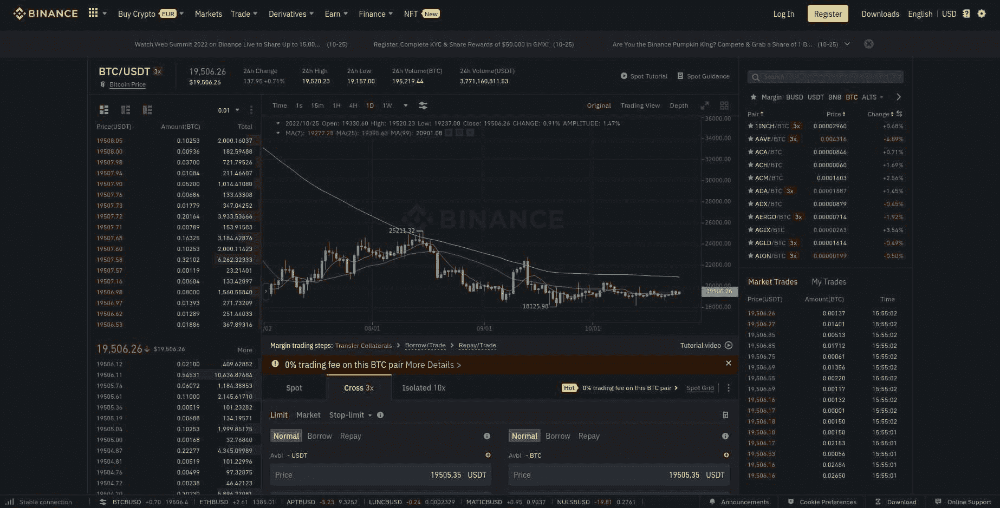

你与币安和保证金交易的第一站应该是他们有用的[币安保证金交易指南](https://academy.binance.com/en/articles/binance-margin-trading-guide)，它有他们所有的交易所特定信息，让你快速轻松地开始，包括[如何开立币安保证金交易账户](https://www.binance.com/en/support/faq/360030486471)，转移和借入资金到保证金水平，并实际进行保证金交易。然后查看他们关于现货和保证金交易的[常见问题](https://www.binance.com/en/support/faq/c-3)，深入了解他们的交易规则和限制，做市商和市场参与者的信息，以及止损([或称为止损](/blog/why-is-stop-loss-important)功能，等等。

### **币安期货保证金交易**

如果你对期货交易感兴趣，那么就去看看[币安期货](https://coincodex.com/exchange/binance-futures/)，这是一个由币安在 2019 年发起的基于衍生品的交易所。顾名思义，期货交易涉及借款，以便对您选择的加密货币的未来价格走势进行预测，这不同于保证金交易(即交易现货资产)。

币安期货的费用根据 30 天的交易量分为几个等级，做市商费用从 0.02%开始，手续费从 0.04%开始。现货交易费用更高(做市商和接受者各 0.1%)，但如果交易者持有并使用 BNB 支付交易费用，币安会提供 25%的折扣。记住这些小数位，借入资金的日利息为 0.004%至 0.04%。

### **币安融资融券交易费用一目了然**

币安的保证金交易费用因多种因素而异。

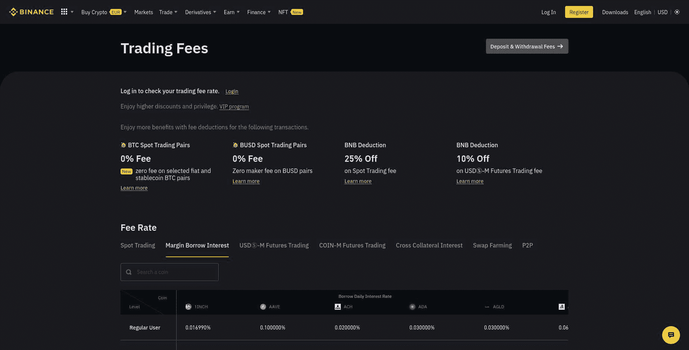

查看他们的[交易费用页面](https://www.binance.com/en/fee/marginFee)了解关于他们的费率的最新信息，如现货交易、融资融券利息和期货交易，以及具体的扣除和他们的 [VIP 计划](https://www.binance.com/en/fee/vip)。

## **北海巨妖保证金交易**

成立于 2011 年的[北海巨妖](https://r.kraken.com/N522O)是一家总部位于美国的加密交易所，是世界上最大、最古老的比特币交易所之一，是全球最受信任的加密交易所之一。由于它在美国市场获得许可，它是为数不多的可以向美国交易商提供保证金交易的交易所之一。

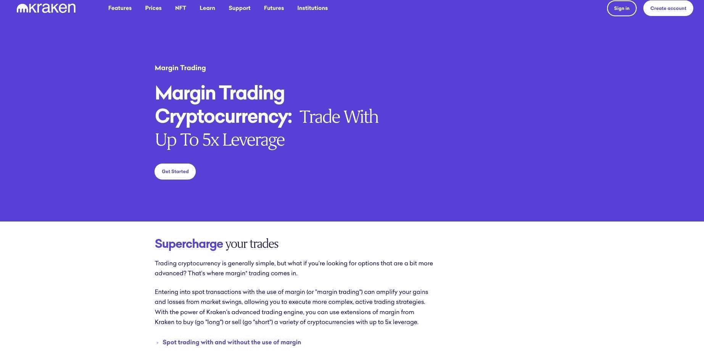

对保证金交易加密感兴趣的交易者可以利用高达 5X 的杠杆在北海巨妖建立多头或空头头寸。北海巨妖还拥有较低的转存费用，其用户从未需要支付超过 0.02%(每 4 小时)的费用，以及较高的保证金限额——符合条件的交易者可以获得高达 50 万美元的资金。

与币安一样，北海巨妖也不遗余力地为其用户提供一系列与保证金交易相关的教育信息，无论是处理[保证金交易术语和概念](https://support.kraken.com/hc/en-us/sections/200560633-Terms-and-concepts-used-in-leveraged-and-margin-trading)和简单的[如何使用保证金交易](https://support.kraken.com/hc/en-us/articles/202967016-How-to-trade-on-leverage-and-margin)还是更高级的功能，如使用和不使用保证金进行现货交易的[差异](https://support.kraken.com/hc/en-us/articles/203325683-Differences-in-spot-trading-with-and-without-the-use-of-margin)。

北海巨妖还提供带杠杆的比特币期货交易，其新的保证金模式功能允许交易者使用隔离保证金来限制每份合约的下跌(或利用交叉保证金来使用所有头寸的所有抵押品)。

### **北海巨妖融资融券交易费用一目了然**

我们鼓励交易者查看他们的网站，了解最新的费用结构，但以下内容可作为基本指南:

> “除保证金费用(开仓和展期)外，通常的[交易费用](https://support.kraken.com/hc/en-us/articles/201893638-Overview-of-trading-fees-on-Kraken)将适用于保证金现货头寸的开仓和[平仓](https://support.kraken.com/hc/en-us/articles/202966956-What-is-closing-a-position-and-how-do-I-do-it-)(但[结算](https://support.kraken.com/hc/en-us/articles/218741078-What-is-settling-a-position-and-how-do-I-do-it-)保证金现货头寸不收费)。保证金费用是根据作为保证金进行融资交易的总金额收取的。[账户中持有的抵押品](https://support.kraken.com/hc/en-us/articles/204585998-Collateral-Currency)不会从该金额中扣除。”

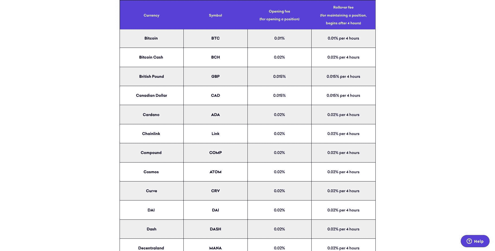

北海巨妖的网站是有关保证金交易各种费用的最佳信息来源，因为这些费用可以定期更新。

## **Phemex 保证金交易**

[Phemex](https://phemex.com/) 由 Jack Tao 于 2019 年在新加坡创立，自称是“最高效的加密交易和投资平台”。陶本人是摩根士丹利(Morgan Stanley)电子交易(MSET)基准执行策略(BXS)的前全球发展副总裁，他的交易所自成立以来取得了重大进展。Phemex 是全球十大交易所之一，日交易量峰值超过 120 亿美元。

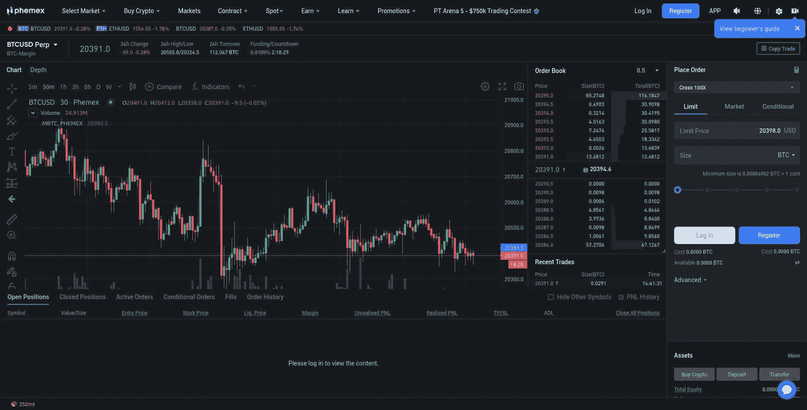

该交易所号称每秒 30 万笔交易，订单响应时间不到 1 毫秒，冷钱包存储和转账需要两级人工审查离线签名。在带杠杆的保证金交易方面，Phemex 提供加密现货市场和杠杆高达 100 倍的衍生品合约。

Phemex 的一个更好的特点是他们的信息丰富的博客文章，涵盖了广泛的加密交易主题，尤其是与交易所的保证金交易密切相关的主题。从保证金交易条款和相关概念，初始和维持保证金，调整保证金的立场，以设定杠杆和风险限额，在许多其他方面，有大量的精心编写的信息供您使用。

### **Phemex 保证金交易费用一览**

正如他们在自己的费用页面上解释的那样，Phemex 对合约收取 0.01%的做市商费和 0.06%的佣金，而他们对现货交易收取 0.1%的做市商费和佣金。与其他交易所一样，他们通过 VIP 计划为两者提供优惠。

和往常一样，最好查阅 Phemex 的网站，了解关于费用和费用计算方式的最新信息。

## **逐位保证金交易**

[Bybit](https://www.bybit.com/en-US/) 可以说是在中国土生土长，于 2018 年 3 月以一家鲜为人知的衍生品交易所起家，但已迅速转型为一家总部位于新加坡的交易巨头。在联合创始人兼首席执行官周本的领导下，该交易所在 2021 年 5 月达到了[540 亿美元的峰值交易量，尽管目前每天的交易量约为 100 亿美元。](https://nomics.com/exchanges/bybit)

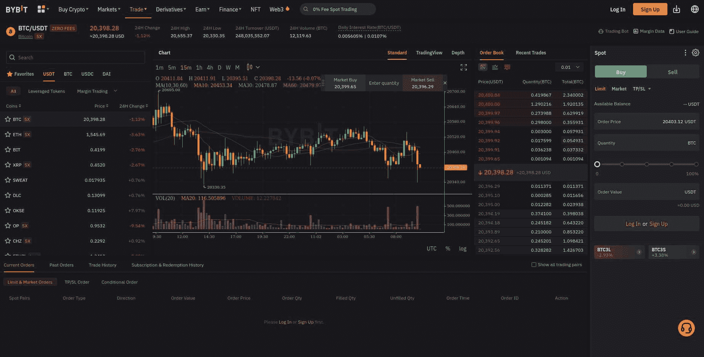

币安选择了监管之路，而周选择了阻力最小的道路:放松监管。Bybit 是没有 KYC 的[最好的加密交易所之一；它的用户不需要提供 ID 来进行交易，这使得它成为密码纯粹主义者的一个有吸引力的选择。](/blog/crypto-exchanges-without-kyc)

对于那些对保证金交易感兴趣的人来说，Bybit 大有可为。如果你喜欢生活在狂野的一面，你可以涉足杠杆高达 100 倍的永久掉期和加密期货(是的，你没看错)。换个角度来看，如果你在 200 美元开仓，那么你可以用 100 倍的杠杆交易 20000 美元。

Bybit 有效地采取了双管齐下的方法进行保证金交易:[交叉保证金和隔离保证金](https://www.bybit.com/en-US/help-center/bybitHC_Article?id=000001053&language=en_US)，交叉保证金是这种交易的默认模式。在这种情况下，交易者的余额用于防止清算；如果权益低于维持，那么交易者的头寸将被平仓。另一方面，隔离保证金，正如它所建议的那样，将一个头寸的初始保证金与交易者的可用余额隔离，这样，如果交易者的头寸被清算，只有初始保证金会损失。

正如 Bybit [在他们的文档](https://learn.bybit.com/en/trading/what-is-margin-trading-definitive-guide-to-trading-on-margin/)中解释的那样，

> “交叉保证金比单独保证金具有更低的清算风险和更低的保证金要求，但与单独保证金不同，它没有可调杠杆的选项。交叉保证金模式下的杠杆由头寸规模和可用保证金决定。然而，在隔离保证金模式下采用较高杠杆的交易员将发现，他们的头寸被平仓的可能性更大。”

寻找多头头寸或加密套利的交易者最有可能对交叉保证金感兴趣，而投机交易者会选择单独的保证金交易。Bybit 甚至推出了所谓的“[自动保证金补充](https://www.bybit.com/en-US/help-center/HelpCenterKnowledge/bybitHC_Article?language=en_US&id=000001062)”(AMR)工具，允许在 USDT 使用隔离保证金的交易员自动增加他们头寸的保证金，从而避免清算。如果你想知道是否可以在未平仓合约的交叉保证金和隔离保证金之间切换，你可以这样做。

### **Bybit 保证金交易费用一目了然**

与往常一样，关于各自交易所交易费用的最重要的真实来源将是交易所本身，因为这些费用是可以更新的。尽管如此，下面还是让我们来看看 Bybit 目前的保证金交易费用。

与许多交易所的惯例一样，Bybit 坚持基于做市商费用的收费模式，根据用户是非 VIP 交易者还是 VIP 交易者收取费用。

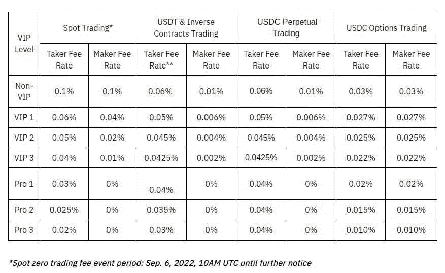

对于衍生品交易，Bybit 的手续费为 0.06%，做市商手续费为 0.01% 。有关他们的费用结构的更多信息，请咨询他们的[交易费用结构](https://www.bybit.com/en-US/help-center/bybitHC_Article?language=en_US&id=000001634)页面。

## **BitMEX 保证金交易**

[BitMEX](https://www.bitmex.com/) 总部位于塞舌尔，成立于 2014 年，自称是“最先进的比特币加密交易平台”。虽然我们在 Trality HQ 经常对最高级保持警惕，但我们可以说的是，Bitmex 是一个点对点保证金交易平台，提供杠杆合约，可以用加密方式买卖。关键的是，交易所**并不**处理菲亚特。

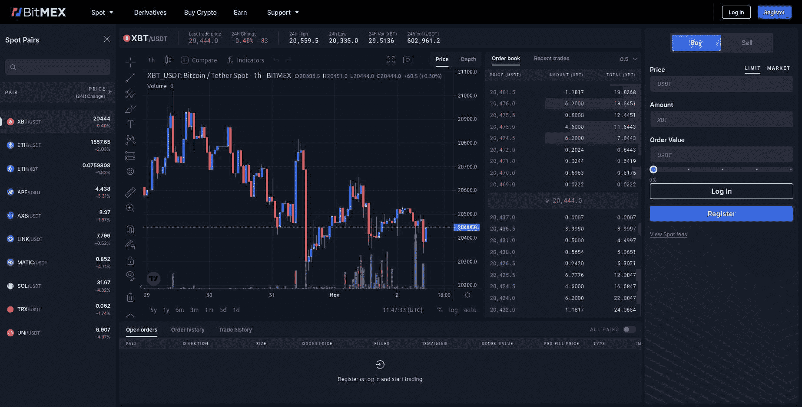

如果你是一个寻求大量杠杆的保证金交易者，那么 Bitmex 可以像 Bybit 一样为你提供 100 倍的杠杆。与币安和 Bybit 等类似，Bitmex 提供交叉保证金和隔离保证金。事实上，在加密保证金交易交易所方面，BitMEX 有点像 OG。你会经常看到它被称为“运行时间最长的杠杆交易交易所”

然而，BitMEX **并没有**向其用户提供投资组合保证金。正如其在[隔离和交叉保证金概述](https://www.bitmex.com/app/isolatedMargin)中所解释的，

> “未实现利润不得用于抵消任何未实现损失，也不得作为开立新头寸的保证金。这对于那些打算交易两个共享相同基础的衍生合约之间的差价的交易者来说尤其重要。你必须通过平仓来实现你的利润，以便用它来抵消另一份合约的损失。”

目前，用户可以用止损单交易 LTC 美元、瑞士联邦理工学院/美元、阿达、BCH、EOS、LTC、TRX 和 XRP 的空头或多头头寸[，以防止清算。潜在用户可能也有兴趣了解更多关于](/blog/why-is-stop-loss-important)[如何在使用 BitMEX 时调整杠杆和增加保证金。](https://www.bitmex.com/app/isolatedMarginExamples)

美国交易商需要特别注意的是:BitMEX 在全球范围内均可交易，不包括美国。

### **BitMEX 保证金交易费用一览**

为了简化他们的费用结构，BitMEX 采用了标准化的方法。

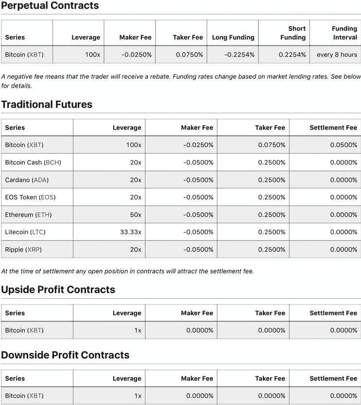

例如，在衍生品上，他们的做市商费用是 0.01%，接受者费用是 0.075%。现货交易费用将根据平均每日交易量(ADV)而有所不同。

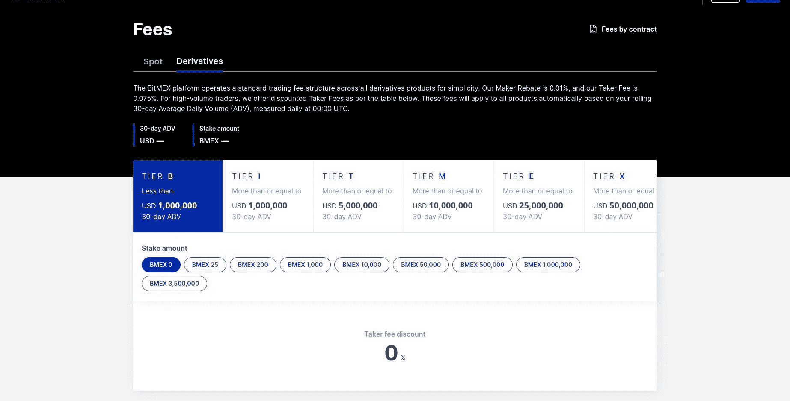

现货交易费用将根据平均每日交易量(ADV)而有所不同。

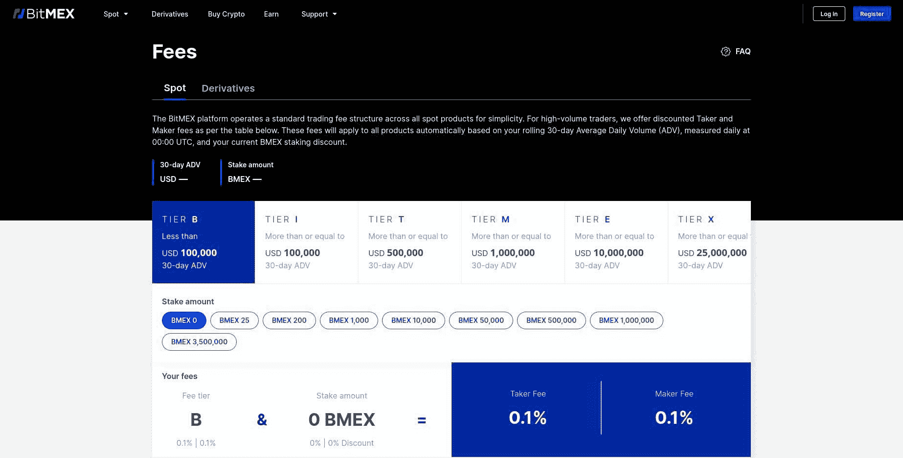

应该指出的是，BitMEX 的存款和取款是免费的，这使得 BitMEX 成为保证金交易者的一个有吸引力的选择，如果不是绝对的最佳选择的话。

## **加密保证金交易交易所:荣誉奖**

上述加密保证金交易交易所是最好的，因为我们已经概述了许多原因，但还有其他值得考虑的。让我们简单地看一下那些没有入选的公司。

### **库币保证金交易**

从许多方面来看，KuCoin 是一个优秀的加密交易所，但它也有一个致命的弱点:不一致的用户评论。据 [Investopedia 报道](https://www.investopedia.com/kucoin-review-5214172)，“KuCoin 的用户评价特别差。审查人员报告了取款、客户服务和市场操纵方面的问题。在我们看来，这发出了危险信号，但它肯定不应该阻止任何人探索 Kucoin 的许多产品。

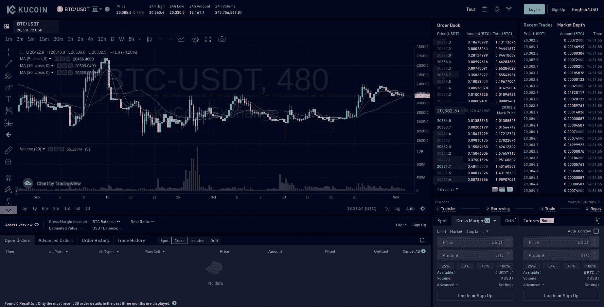

KuCoin 成立于 2017 年，提供广泛的配对选择，可用于保证金交易(超过 220 对)，杠杆高达 10 倍。对于那些对期货感兴趣的人，你可以用高达 100 倍的杠杆交易超过 100 个硬币。他们的[交易费用页面](https://www.investopedia.com/kucoin-review-5214172)包含了关于他们费用结构的全面信息。

### **PrimeXBT 保证金交易**

在 2019 年首次推出后， [PrimeXBT](https://primexbt.com/) 在短短几年内就成为了保证金交易中值得重视的加密交易所。通过其复杂的保证金交易引擎和图表平台，用户可以访问一系列加密保证金交易工具，这些工具具有跨不同时间范围的多个图表和资产视图，这在一次跟踪多项资产时非常方便。

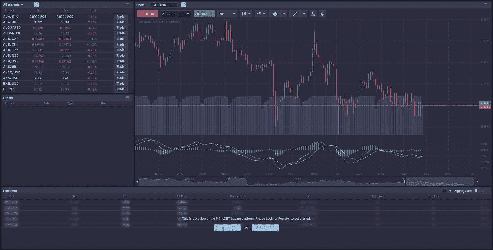

PrimeXBT 的杠杆高达 100 倍，是众多提供大量杠杆的加密交易所之一。PrimeXBT 上买卖订单的保证金费用是每笔交易的 0.5%，对于在同一个交易日没有开仓和平仓的头寸，还有一种叫做“隔夜融资费”的东西。

## **最终想法**

对于绝大多数加密保证金交易者来说，币安提供了最好的世界。

不过，对于美国的交易员来说，可供选择的机会相对较少。北海巨妖确实向美国和加拿大的用户提供保证金交易，尽管该交易所的中级和专业客户必须满足某些资格要求。

对于寻求没有 KYC 的交易所的保证金交易者来说，ByBit 应该是你的首选。

由于没有一份清单是绝对详尽的，所以肯定会有遗漏，比如 [Margex](https://margex.com/) 、 [CEX.io](https://cex.io/) 、 [StormGain](https://stormgain.com/) 、 [Derbit](https://www.deribit.com/) ，可能还有 [Huobi](https://www.huobi.com) 。

## 想用 Python 创建自己的交易算法吗？

查看 Trality 的 Python Bot 代码编辑器——这是一个强大的基于浏览器的工具，专为希望使用算法交易机器人进行构建、回溯测试、优化和实时交易的交易者而设计。我们提供私人交易中最高水平的灵活性和复杂性。事实上，这是我们在 Trality 的核心工作。

[https://www.youtube.com/embed/tOBKjEaufmk](https://www.youtube.com/embed/tOBKjEaufmk)

<button type="button" class="chakra-button css-1hnfsz">Try It for Free</button>

总而言之，当谈到最好的加密保证金交易平台时，保证金交易者被宠坏了。但是，有这么多的选择，你必须做自己的研究，了解每个交易所各自的费用结构，并熟悉关键功能，以便选择正确的一个来实现你的交易目标。