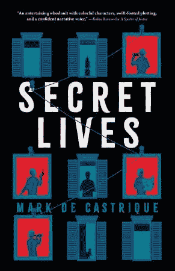
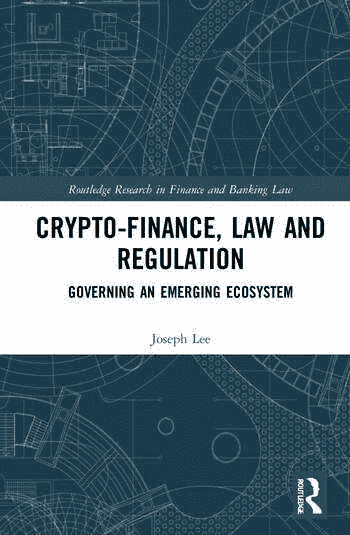

# 2022 年最佳加密货币读物

> 原文：<https://www.trality.com/blog/best-cryptocurrency-books/>

对初学者来说最好的密码书是什么？了解 crypto 的最佳来源是什么？投资加密货币前应该看什么？

鉴于 crypto 越来越受欢迎，更多的交易者正在进入这个领域。如果你像我们其他人一样，那么你会有很多问题，这就是为什么作家们不厌其烦地解释加密货币背后的底层区块链技术，以及算法交易、加密钱包、NFT、加密监管、加密税收甚至分散金融(DeFi)本身的未来等基础知识。

无论你是想在 crypto 上寻找一些好的读物，还是仅仅为了节日礼物，我们挑选的最佳加密货币书籍肯定会对每个人都有帮助。

与你在网上找到的大多数回收清单不同，**我们的清单只包含 2022 年**出版的书籍(不是 2018 年，不是 2016 年，当然也不是 2014 年)。

我们开始吧！

## 《利害关系的证明:以太坊的形成和区块链哲学》维塔利科·布特林著(企鹅出版社，2022 年)

你永远不应该以封面来判断一本书，以太坊的创造者 Vitalik Buterin 也是如此。正如他的博客的普通读者可以证明的那样。CSS-18up 66p { color:# 00b8e 6；字体粗细:正常；光标:指针；左:0px 位置:相对；-webkit-transition:全部 500ms 转场:全部 500ms-webkit-text-decoration:无；文字-装饰:无；} [维塔利克·布特林的网站](https://vitalik.ca/)”)布特林是一个脑子里装了很多有趣事情的人。老实说，如果他只是把他的书命名为*维塔利克·布特林的书*(可能是出版商的一个禁忌)，我们也不会感到惊讶，但是 [*利害关系的证明:以太坊的制作和区块链的哲学*](https://www.penguinrandomhouse.com/books/714151/proof-of-stake-by-vitalik-buterin/) 提供了一个迷人的视角，让我们一窥以太坊这个世界上最重要的区块链之一背后的愿景和想法。

布特林的书分为三个核心部分，由 2014 年至 2022 年间撰写的 23 篇论文组成，带领读者经历了预采矿(指的是在区块链公开之前创造代币)、工作证明(以太坊最初的共识机制)和利益证明(以太坊最近[合并](https://ethereum.org/en/upgrades/merge/)的结果)。

出现了什么(看我们刚刚做了什么？)是一个引人注目的故事，讲述了一个对区块链的力量和潜力有坚定信念的梦想家的故事。如果你对加密感兴趣，那么布特林的书应该是你的首选，特别是因为他的链是建立这么多加密空间的基础(无意冒犯，比特币 maxis)。

最精彩的部分？他的书所献给的人包括“[网络迷因大师](/blog/funniest-crypto-memes)”干得好，上帝。

## 虚拟社会:元宇宙和人类经验的新领域

> “有一天这本书会被一个没有身体的人阅读。这个预言几乎肯定会在 21 世纪末实现，甚至可能在 2040 年实现。想想看:我们已经有把握地知道，大脑是一台处理信息的机器。将它连接到一台能够模拟整个世界的计算机上是一个完全可能的结果，而且我认为这是一个不可避免的结果。”

赫尔曼·纳鲁拉引人入胜的《虚拟社会:元宇宙和人类体验的新前沿 》就这样开始了，这本书读起来更像科幻小说，而不是我们未来集体现实的科学。有些人可能会看到一个反乌托邦的世界，在这个世界中，人类退回到技术驱动的景观中，Narula 采用了一种新颖的方法来处理元宇宙的涌现概念和含义。

当许多评论家关注未来时，纳鲁拉回顾了人类历史，认为元宇宙只不过是数百年来人类创造替代世界的趋势的最新体现，无论这些世界是源于宗教信仰(古埃及人和金字塔)，还是像体育迷一样世俗(沉浸在物理和计算机游戏、统计数据和虚拟社区中)。

从历史和心理学的角度来看，Narula 可能有一定的道理。元宇宙可能会变成人类，太像人类了。

## 《NFT》杂志(Rizzoli，2022)的《秘密艺术》—

如果你让一家备受尊敬的艺术图书出版商加入 50 位杰出的数字艺术家，会发生什么？答案是:第一本名为 [*的“数字”书开始于*](https://www.thenftmag.io/cryptoartbegins/) 。组合词“phygital”指的是这本书将以传统印刷卷的形式发行，进入书店和博物馆商店，以及在元宇宙发行的 NFT。

这项合作是 NFT 杂志的创意，NFT 版本可以在 Nifty Gateway 平台上获得。据出版商称，

> " '**加密艺术–开始**'讲述了加密艺术激动人心的开始和演变，通过世界上最优秀的艺术家**的历史和作品，**这些艺术家通过他们的 NFT 为这场革命的诞生做出了贡献，并且仍然是这场革命的现在和未来的积极组成部分，包括 HACKATAO、Refik Anadol、Kevin Abosch、Osinachi、Federico Clapis、Giant Swan、DADA。艺术等等。”

该书计划于 2022 年 11 月 8 日在意大利发行，并将于 2023 年春季的某个时候在美国上市。不过，根据预告，这本书有成功的可能，特别是因为里佐利以其华丽的插图而闻名，这就是为什么这本书甚至在正式发行前就在我们的名单上赢得了一席之地。

## 里克·埃德尔曼(西蒙&舒斯特出版社，2022 年)撰写的《加密的真相:比特币、区块链、NFT 和其他数字资产的实用、易懂指南》

对初学者来说，投资加密可能是一个复杂、令人生畏的过程。为了揭开这一过程的神秘面纱，《纽约时报》第一畅销书作家里克·埃德尔曼写了一本直截了当的指南，*关于区块链技术和数字资产的真相。鼓励读者跟随里克讲述他最早接触加密的经历，始于 2012 年和 2013 年，当时他第一次听到“比特币”和“加密货币”这两个词。*

***

* 

*他很快意识到了两个关键点:“首先，区块链技术及其带来的数字资产是革命性的。这是自互联网发明以来最深刻的商业创新。其次，很少有人意识到这一点——包括绝大多数金融专业人士。”其结果是一个可访问的，信息丰富的阅读，在普通投资者和推动金融服务未来的高度专业化的技术之间架起了一座桥梁。*

*涵盖的众多主题包括冷钱包硬件设备、数字资产银行、主要基础层协议、金融产品和服务的主要区块链应用、公开交易的比特币采矿公司、数字资产交易所、数字资产托管人、持有数字资产的合格 IRA 托管人、拥有数字资产的公开交易公司、美国比特币期货交易所交易基金、专门投资于从事区块链和数字资产的公司的交易所交易基金、数字资产投资组合跟踪服务、数字资产的税务规划和税务咨询/顾问服务，以及区块链研究和分析公司。*

*强烈推荐！*

## *《密码之书:理解比特币、加密货币和数字资产的完整指南》亨利·阿斯拉尼安著(帕尔格雷夫·麦克米伦出版社，2022 年)*

*Henri Arslanian 在业内是一个受人尊敬的名字。他的前一本书[金融的未来:金融科技、人工智能和加密对金融服务的影响](https://link.springer.com/book/10.1007/978-3-030-14533-0) (2019)被翻译成多种语言，成为亚马逊金融服务全球十大畅销书。它还被图书权威机构评为“有史以来最好的金融科技书籍”之一。因此，你从一开始就知道，他的最新作品[《密码之书:理解比特币、加密货币和数字资产的完整指南](https://link.springer.com/book/10.1007/978-3-030-97951-5)，会给你带来很好的帮助。*

***

* 

*采用扩展的方法，Arslanian 涵盖了大量领域，包括比特币、加密数字资产(如稳定硬币、CBDCs、公用事业令牌、安全令牌和 NFT)的概述，以及对 DeFi、加密采矿、加密法规、加密投资者、加密交易所、Web 3.0、元宇宙、DAOs 甚至量子计算的评论。*

*有这么多的报道，这本书的目标读者到底是谁呢？正如 Arslanian 所写的，*

> *“多年来，我调整了我的内容，包括加密教育内容，以针对两种不同的受众:感兴趣的大众市场受众和忠诚的利基受众。第一类包括对 crypto 感兴趣的人，但不多。他们渴望了解更多信息，但不会花更多时间去深入了解。第二类人可能已经开始接触第一类人，但对这个话题更感兴趣，希望花时间深入研究或进入众所周知的秘密“兔子洞”。*

*在与 Arslanian 一起进入 crypto 的兔子洞之后，您将获得丰富的知识和坚实的基础。*

## *安东尼·斯卡拉穆奇(SALT Books，2022 年出版)的《阿尔格兰德的天才:技术优雅和创新革命》*

*在关于加密货币和区块链技术的书籍世界里，替代硬币没有得到太多的喜爱，这就是为什么一本关于阿尔格兰德(或所有事物)的书有点像独角兽。但是 SkyBridge Capital 的创始人兼联合管理合伙人 Anthony Scaramucci 已经带着他的 [*天才阿尔格兰德*](https://www.amazon.com/Genius-Algorand-Technical-Elegance-Revolution/dp/1637588712) 进入了 altcoin 水域。*

***

* 

*斯卡拉穆奇的书大约有 112 页，是一本薄薄的书，但它充满了对阿尔格朗的见解，这使得它对顽固的“阿尔格朗”和好奇的投资者很有吸引力，他们只是想对阿尔格朗区块链有更深入的了解。这本书的真正优势之一是采访了许多在阿尔格兰德工作的最聪明的人，阿尔格兰德是由麻省理工学院教授希尔维奥·米卡利创立的(他也因在密码学方面的工作获得了 2012 年的图灵奖)。Scaramucci 还涵盖了 algrand 基金会、项目的公司结构、algrand 的采用者以及 Algo 的新兴技术(不完全是 leader⁠—yet).的行业*

> *“最能满足大型机构需求的协议是什么？”*

*你猜对了。如果你是 Scaramucci 或者众多阿尔戈英雄中的一员，那么它绝对是阿尔戈兰德。但是，即使你不是真正的信徒，斯卡拉穆奇的书提供了一个有趣的阅读区块链项目具有明显的潜力。*

## *区块链的未来:比特币、加密货币、区块链技术、去中心化账本、智能合约、加密钱包、NFTS 和 Web 3.0。什么...现在和将来在现实世界中做！罗伯特·b·西摩(2022 年《独立报》)*

*如果你是区块链和 crypto 的新手，那么 Robert B. Seymour 的 [*区块链的未来*](https://www.amazon.com/Blockchain-Future-Cryptocurrency-Technology-centralised/dp/B09MYVXPXZ/ref=sr_1_27_sspa?crid=3KVNT4WIXK1TY&keywords=cryptocurrency&qid=1665569428&qu=eyJxc2MiOiI2LjYzIiwicXNhIjoiNi42OCIsInFzcCI6IjYuNTMifQ%3D%3D&rnid=2941120011&s=books&sprefix=cryptocurrency%2Caps%2C207&sr=1-27-spons&psc=1) 就有些令人耳目一新了。抛开书名的史诗般长度不谈，西摩的书为那些有兴趣了解更多密码的人提供了一个优秀的、没有术语的入门读物。Seymour 不是一个留给想象力的人，他专注于(你猜对了)区块链技术及其当前和未来的用途，从智能合同到最新的 Web3 开发，以任何外行人都能理解的方式。*

***

* 

*然而，读者应该注意到，Seymour 是一个真正的信徒，这可以从他对 crypto 的未来用途的许多热情声明中得到证实，更一般地说，区块链，他看到它在游戏，交易，社交媒体，银行，音乐和艺术中越来越多的立足点。他的报道令人钦佩:涵盖的许多主题是 crypto 和区块链的崛起；为其提供动力的技术；它对金融机构和社交媒体的影响；隐私问题；当前和未来的用例；以及常用术语的概述。*

*给新手一个合理的警告:当你读到西摩的书的结尾时，你很有可能会成为一名加密转换者！*

## **元宇宙投资初学者提前投资元宇宙；加密货币，NFT(不可替代的代币)加密艺术，比特币，虚拟土地，...2022 年&超越*的元宇宙(元宇宙投资图书，2022 年)*

*注意到这里关于密码的书名有点模式化了吗？如果我们决定汇集我们的集体知识并写在纸上，我们 Trality 团队已经有了一个完美的标题:*算法交易机器人:日交易、套利、保证金交易、动量交易的自动化交易策略& Python Trading 使用基本面和技术分析进行 2022 年及以后的下一轮牛市*。立即成为畅销书。*

***

* 

*玩笑归玩笑， [*【元宇宙投资】*](https://www.amazon.com/Metaverse-Investing-Beginners-Cryptocurrency-non-fungible/dp/1915002133/ref=sr_1_26_sspa?crid=3KVNT4WIXK1TY&keywords=cryptocurrency&qid=1665569428&qu=eyJxc2MiOiI2LjYzIiwicXNhIjoiNi42OCIsInFzcCI6IjYuNTMifQ%3D%3D&rnid=2941120011&s=books&sprefix=cryptocurrency%2Caps%2C207&sr=1-26-spons&psc=1) 是一本关于元宇宙的野生世界，有时是怪异世界的好书，涵盖了区块链、元宇宙、Web 3.0、元宇宙科技和健康(尤其有趣的章节)，并展望了未来可能的发展。元宇宙到底是什么？嗯，根据该书作者 Meta-Verse 的说法(没有比这更好的了)，它“被描述为一个多用户实时虚拟领域，来自全球各地的个人可以通过网络连接，共存，社交，并相互交换价值。”支撑这个美丽新世界的是区块链，下面简单介绍一下。*

*然而，这本书的优点之一也是一个缺点(尽管是一个小缺点)。作为入门书，这本书包含了一些吸引人的信息，许多人会发现这些信息很有用，但那些想要更深入分析的人需要去别处看看。然而，对于任何对元宇宙感兴趣的人以及如何投资它的人来说，这都是一本好书。*

## *马克·德·卡斯特里克的秘密生活*

*这本书可能会让许多人感到惊讶，你不太可能在许多复制粘贴的“最佳加密货币读物”列表中看到它，但马克·德·卡斯特里克的 [*秘密生活*](https://www.amazon.com/Secret-Lives-Mark-Castrique/dp/1728258308/ref=sr_1_80?crid=3KVNT4WIXK1TY&keywords=cryptocurrency&qid=1665582282&qu=eyJxc2MiOiI2LjYzIiwicXNhIjoiNi42OCIsInFzcCI6IjYuNTMifQ%3D%3D&rnid=2941120011&s=books&sprefix=cryptocurrency%2Caps%2C207&sr=1-80) 是一本值得你花时间阅读的虚构惊悚小说。德·卡斯特里克的小说只有不到 300 页，开篇风格优雅，将读者带入隐秘阴谋的黑暗世界:“乔纳森·芬奇看到一辆黑色轿车停在他被告知的地方——在弗吉尼亚州阿灵顿克拉伦登社区全食超市附近停车场的顶层。"*

***

* 

*我们不会破坏一个好故事，所以我们不会泄露任何剧透。然而，我们会说，迷宫般的情节涉及一个 75 岁的女房东兼退休的联邦调查局特工，她与政府有着令人印象深刻的关系网，一个神秘的谋杀案，一个装有价值数千英镑密码的钱包，以及政府腐败的恶臭。作家马克·德·卡斯特里克是北卡罗莱纳州西部人，他以前写过政治惊悚小说，而最近对这一类型的尝试非常引人入胜。*

*正如 j·埃德加·胡佛(所有人)在这本书的开篇题词(引用自开篇)“秘密会让人上瘾。”我们完全同意。*

## *加密金融、法律和法规。管理一个新兴的生态系统作者李宗德(Routledge，2022)*

*在我们列出的 2022 年最佳加密货币书籍中，最后一本书(也是最重要的一本书)涵盖了加密领域的一个重要方面:监管。曼彻斯特大学(英国)法学教授李宗德在他的研究 [*加密金融、法律和监管*](https://www.routledge.com/Crypto-Finance-Law-and-Regulation-Governing-an-Emerging-Ecosystem/Lee/p/book/9780367086619) 中，研究了加密金融是否会导致监管模式从集中模式转变为基于分布式共识的模式。*

***

* 

*他写道，*

> *“这本书探索了一个去中心化和非中介化的加密市场的出现，并研究了它可以改变金融市场的方式。它考察了金融市场的三个组成部分——技术、金融和法律——并展示了它们之间的相互关系如何决定了一个加密市场的结构。它侧重于监管机构的执法政策及其对加密金融运营商和参与者的管辖权。"*

*此外，Lee 还研究了加密金融系统如何提供融资渠道，从而促进共享经济的发展，让人们更容易获得司法救助。*

*虽然主要面向对监管、金融和法律感兴趣的学生、学者和从业者，但一般读者将从 Lee 的学术严谨性和由此产生的见解中受益。*

## *最后的话*

*根据出版商目录中即将出版的大量关于加密货币、区块链、元宇宙、NFTs 和 DeFi 的书籍，2023 年将成为加密内容的旗帜年。请务必在明年年初回来查看我们的 2023 年最佳加密货币书籍列表。*

*与此同时，抓住上面提到的几本书，让自己沉浸在金融的未来中。如果你渴望了解更多信息，那么看看我们其他的精选内容列表，包括 2022 年的[最佳加密播客，2022 年](/blog/best-cryptocurrency-podcasts)的[最佳加密新闻网站，以及 2022 年](/blog/best-crypto-news-websites)的[最佳算法交易书籍。](/blog/best-books-on-algorithmic-trading)*