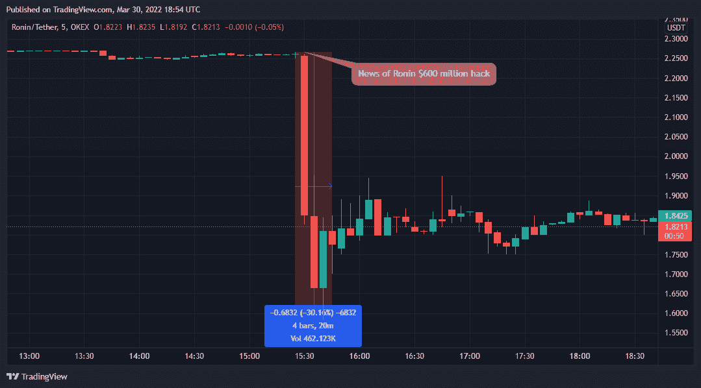
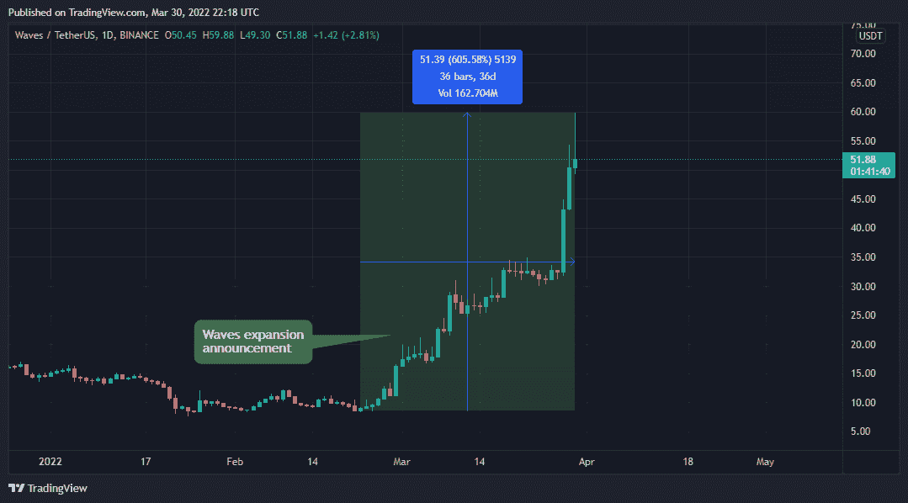
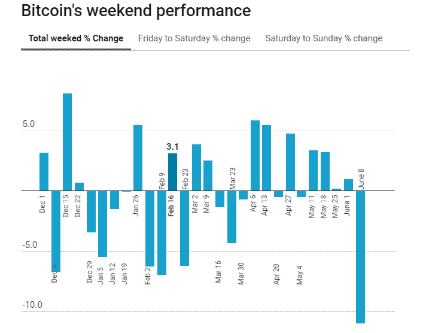

# 一天中购买密码的最佳时间

> 原文：<https://www.trality.com/blog/best-time-buy-crypto/>

密码交易全年无休。事实上，加密市场正在向交易所施加压力，要求其全天候开放，这进一步证明了加密对更广泛的金融行业的影响。如 [《金融时报》](https://www.ft.com/content/7b7ff0cb-b695-485d-b6be-ef0c8c0edde0)，24 日交易所首席执行官德米特里·加利诺夫指出，

> 一旦加密货币交易[成为主流]，人们就变得非常习惯于它的无限可用性，所以我相信他们会期待其他资产的这种 24/7 交易可用性。客户已经在问:为什么我可以在盘后或周末交易比特币，但不能交易特斯拉？

有道理。但这提出了一个显而易见的问题:如果市场一直开放，什么时候才是交易密码或股票的最佳时机？这是加密交易员持续面临的一个问题，但根据你的风险承受能力和投资目标，你可以采取多种方法。下面我们就来看看其中的几个。

## **美元成本平均法(DCA)**

美元成本平均法是一种投资策略，包括定期将一定数量的资金投资于一项资产，而不考虑市场波动。当价格上涨时，你买同样数量的小数量，当价格下跌时，你买同样数量的大数量。

这就是为什么它也被称为“程序化投资”首先，这种交易策略旨在消除与金融市场价格波动相关的风险。有了定期投资，你就可以定期进行长期投资，以避免在“错误的时间”购买一次股票的后果

因为我们的目标是从长期的结构性牛市中获得最大收益，所以对冲加密市场的短期波动是至关重要的。DCA 策略阻止你在市场高峰时购买资产。

所以，当价格长期逐渐上涨时，高点越来越高，低点越来越低。这让你可以充分利用潜在的上升趋势。

相比之下，在历史高点购买加密货币的投资者将不得不等待市场创造新纪录以获得可观的回报，这使得确定购买(以及何时购买)的最佳加密货币变得更加困难。但是一个使用 DCA 投资的人已经平滑了他的购买，并且将会看到他的总投资以市场的速度平均增长。

### **平均成本的好处**

成本平均法有许多已被证实的好处。正如 [Investopedia](https://www.investopedia.com/terms/d/dollarcostaveraging.asp) 所写的，

> 美元成本平均法的关键优势在于，它减少了投资者心理和市场时机对其投资组合的影响。通过采用美元成本平均法，投资者避免了因贪婪或恐惧而做出适得其反的决定的风险，比如在价格上涨时买入更多，或在价格下跌时恐慌性抛售。

让我们更深入地了解一下 DCA 的一些优势。

**适合每一个投资者**

DCA 允许任何人以适度的资本投资加密，并根据他们的财务目标逐步积累资产。它也很容易建立，因为它不涉及复杂的技术或基本面分析。

**降低波动性的影响**

特定于美元成本平均策略的固定金额的定期采购[限制了价格波动的影响](/blog/staying-disciplined)。这使得 DCA 对规避风险的投资者尤其有利。它还允许投资者通过预先确定投资金额和时间，来限制对某项特定资产的过度敞口风险。

**最大化长期收益**

理想情况下，[加密货币](/blog/the-future-of-cryptocurrency)的未来被许多人视为一个增长市场，尽管会有一些极端的波动。通常，投资者会屈服于 FUD 和 FOMO，过早地处置他们的密码以换取短期收益，从而错失长期潜力。然而，DCA 允许你投资于结构看涨的加密，并最大化 [HODLing](/blog/funniest-crypto-memes) 周期。

### **美元成本平均法的缺点**

尽管它有许多优点，但也有一些缺点要考虑。

**不适合卖空者**

DCA 旨在长期积累基础资产，这意味着它只适合看好特定加密的投资者。[短线交易者](/blog/day-trading-crypto)无法通过短线交易利用周期性熊市。

**风险优先于回报**

正如我们提到的，DCA 是风险厌恶型投资者的理想选择。这是因为它消除了波动的影响。然而，尽管波动带来了巨大的风险，但它也提供了获得更高短期收益的机会，特别是在使用杠杆和适当的风险管理措施时。

## **把握市场时机**

在加密市场投资或交易的最流行的方法之一是选择进入市场的最佳时机。这就是技术和基本面分析以及自动算法交易策略发挥作用的地方。

技术分析包括使用内置在交易 platform⁠—to 上的技术 indicators⁠—often 来确定特定密码的趋势和动力。有了这些指标，你可以分析密码图表模式，比如说[以太坊](/blog/ethereum-price-prediction)或[金币](/blog/litecoin-price-prediction)，以及预测价格走势的历史趋势。有数百种趋势、动量和成交量指标，你可以根据自己的交易风格定制，用[来决定最佳的进场和出场](/blog/closing-trades)。

基本面分析试图通过检查定性和定量相关的经济和金融因素来衡量加密货币的内在价值。然而，当谈到市场时机时，我们关心的基本面分析涉及地缘政治发展和关于特定密码的新闻。通常，中短线交易者喜欢这种方法。但这意味着你必须[跟上加密市场的发展](/blog/best-crypto-news-websites)。

这里有一个用基本面分析来把握市场时机的例子。

2022 年 3 月 29 日，有消息称[黑客于 2022 年 3 月 23 日从 Ronin Network](https://www.bloomberg.com/news/articles/2022-03-29/hackers-steal-590-million-from-ronin-in-latest-bridge-attack) 窃取了约 6 亿美元，这是近年来历史上最大的密码盗窃案之一。黑客攻击公开后，罗宁·区块链的母语——罗恩的股价下跌了约 30%。

Source: TradingView.com

这里还有一个。

2022 年 2 月，Waves Tech 宣布将向 Waves 2.0 转型。这种转变将包括一系列升级，比如以太坊虚拟机支持的新共识和 DAO 框架。它还宣布在美国推出 Waves Labs。因此，WAVES token 在五周内飙升了 600%以上。

Source: TradingView.com

### **把握市场时机的好处**

以下是把握市场时机的主要优势:

1.  有了技术指标，你可以利用牛市和熊市。
2.  准确性更高，尤其是在交易新闻的时候。
3.  它适合短期和长期的交易者和投资者。

### **把握市场时机的缺点**

1.  这很费时间，因为人们需要监控市场趋势，并跟上加密领域的最新发展。
2.  大部分技术指标滞后，容易出现假信号。
3.  你需要掌握技术分析，准确把握市场时机，有效排除缺乏必要专业知识和经验的新手交易者。

## **一天中购买密码的最佳时间**

正如我们前面提到的，你可以从币安这样的交易所购买加密软件。但是不同的时区意味着大多数交易者在营业时间操作。通常，[日内交易者](/blog/day-trading-crypto)和黄牛党关心的是一天中购买密码的最佳时间。为什么？因为这里的主要目标是利用增加的波动性。当市场活动加剧时，波动性也很大。

这意味着一天中购买密码的最佳时间是在全球最重要的营业时间重叠期间。这是格林威治时间下午 1 点至 3 点之间，这是欧洲和美国营业时间的重叠，也是格林威治时间晚上 11 点至凌晨 1 点之间，这标志着美国工作日的结束和澳大利亚和亚洲市场时间的开始。

### **需要考虑的因素**

有两个因素影响着一天中购买墓穴的最佳时间:供求关系和资本流动。

**供求**

加密价格主要由供求关系决定。对任何买家来说，目标都是低买高卖。根据供求定律，当需求最低而供给最高时，价格最低。

这对一天中购买密码的最佳时间有何影响？

在格林威治时间下午 1 点至 3 点重叠期间，欧洲日内交易者平仓，这意味着供应增加，因此价格下降。美国工作日即将开始，这意味着需求将会上升，从而推高价格。然而，如果你打算在此期间开仓，让技术和情绪分析来指导你的决定。

**资本的流动**

加密市场的波动性受到加密货币市场内[资本流入和流出的影响。最大的资本流动来自机构和公司交易员，他们在各自时区的营业时间内进行交易。通常，这是在营业时间的开始和结束，这意味着建立头寸的最佳时间是一个营业日结束而另一个营业日开始的时候。](https://ben-lilly.medium.com/capital-flow-in-crypto-markets-c1e22bd5759f)

## **一周中购买密码的最佳时间**

对加密货币的需求通常在周末最低，周日最低，这是购买加密货币的最佳时机。周末期间加密货币需求低的最大原因是交易量。

### **交易量**

诚然，加密市场最大的参与者是 T2 公司和机构投资者，他们中的大多数很少在周末营业。周末期间，现货和期货市场的交易量都大幅下降。

当市场上活跃的交易者减少时，当大量订单开始流入时，市场就变得更容易波动。通常，周末比一周中的任何一天都有更大的波动。

Source: [Datawrapper](https://www.datawrapper.de/_/nFrMX/)

因此，理想的做法是在周末结束时入市，以利用交易者在工作日开始时回流市场的波动性。

## **本月购买密码的最佳时间**

在宏观层面上，市场消息决定了中期加密价格趋势。这意味着确定本月买入密码圈回到基本面分析的最佳时机。一条影响特定密码的重大新闻可能会决定其整个月甚至更长时间的趋势。在这里，市场新闻是你应该留意的一件事。

### **市场新闻**

市场新闻可能会有所不同，既有我们之前提到的特定于加密的新闻，也有计划中的立法等一般新闻，例如，当美国国会就[加密监管展开大辩论时](https://www.forbes.com/sites/jasonbrett/2021/12/27/in-2021-congress-has-introduced-35-bills-focused-on-us-crypto-policy/?sh=4f0b6be5c9e8)。由于市场不知道这些辩论的结果，也不知道正在考虑的监管措施的性质，任何一点积极或消极的消息都必然会影响未来几周的价格走势。

## **结论**

那么，什么时候是购买密码的最佳时间呢？正如我们讨论过的，答案完全取决于你的交易策略。长期交易者和投资者可能更喜欢使用 DCA 策略，而短期杠杆交易者可能更喜欢选择市场时机。

一般来说，从来没有一个简单的方法来完美地选择你进入市场的时间，因为有几个因素会影响密码的价格。然而，当市场上活跃的交易者较少时，加密价格通常较低。这通常使得周末和晚上是购买 crypto 的最佳时间。但是永远记住在你的交易中结合技术、基本面和情绪分析。永远做你自己的研究。