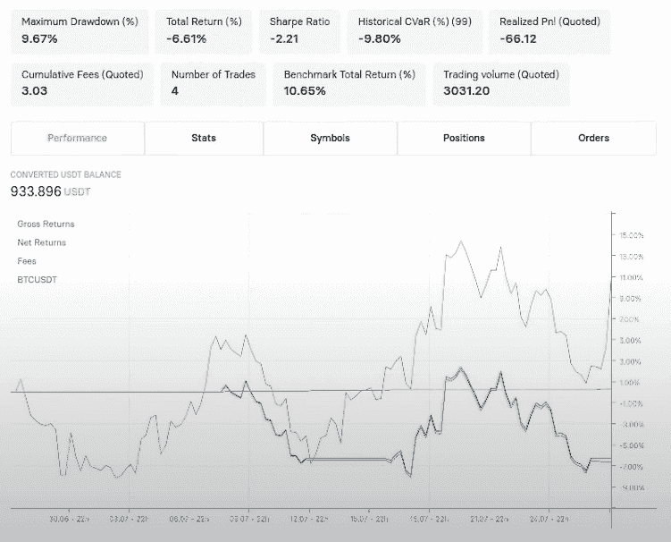
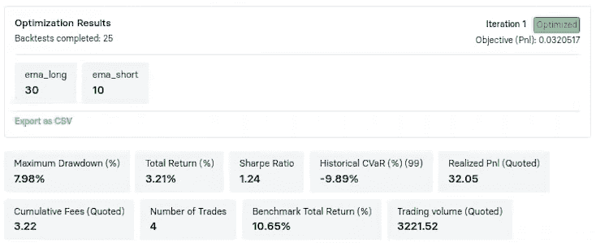

# 如何构建自己的 Python 交易机器人

> 原文：<https://www.trality.com/blog/build-python-trading-bot/>

为了让您开始使用 Trality Bot 代码编辑器和您的第一个 Python 交易 Bot，我们将使用这篇文章来介绍构建简单交易算法的基本方法。它由标准技术分析(TA)组成，但也包括 Trality API 的一些功能，可以帮助您在操作过程中创建更复杂的交易机器人。此外，我们将分析由此产生的回溯测试，该测试根据历史数据测试我们的算法，然后我们将使用优化器来优化我们的策略参数，以获得最大利润。

## 用 Trality 的 Python 代码编辑器创建交易机器人

Trality 最先进的 Python 代码编辑器允许用户以最有效的方式**创建高度创新和复杂的算法**。


[https://www.youtube.com/embed/RbowQQgNppA?feature=oembed](https://www.youtube.com/embed/RbowQQgNppA?feature=oembed)


<button type="button" class="chakra-button css-1hnfsz">Try It for Free</button>

一旦你对你的算法和回溯测试结果感到满意，你就可以在一些最受信任的交易所部署你的机器人进行现场交易或纸上交易，包括**币安**、**币安。美国**、 **Bitpanda** 、**比特币基地 Pro** 、**北海巨妖**。

## 交易机器人是如何工作的？

交易机器人根据信息(如市场内的价格变动)代表交易员做出决策，并根据一套预定义的标准做出反应。他们可以解释价格、交易量、订单和时间等传统市场信号，并将其与机器学习模型等更复杂的信号相结合，并决定这是否是执行交易的好机会。

## 交易机器人的财务数据

来自中央加密货币交易所(CEX)的原始市场数据主要有两种类型。一个是限价订单簿(LOB)中的报价数据，另一个是交易数据。报价是一组未匹配的限价单在给定价格水平的汇总快照。

每当一个订单与 LOB 中的另一个订单相匹配时，就会发生交易。原始市场数据通过 websockets 从交易所流出。当 exchange LOB 发生任何更新时，有关该更改的信息会通过 websocket 实时推送。

在 Trality 引擎中，烛台数据用于表示特定时期内资产的价格。烛台有 5 个主要组成部分:1)开盘价，2)最高价，3)最低价，4)收盘价，5)成交量。

每个烛台都是通过原始 websocket 从原始市场数据中获得的，而不是从交易所收听价格条。交易所建立和发布这些酒吧需要时间；通过生成它们，有可能最小化酒吧关闭和它对机器人可用之间的延迟。如果机器人想要交易，能够更快地做出反应提高了机器人可以实现的执行价格。

市场数据最重要的部分之一是回溯测试与真实环境一致。这确保了机器人的行为将是相同的，无论是在回溯测试还是真实环境中运行。

Trality 通过确保机器人接收的烛台数据在真实、虚拟和回溯测试环境中是相同的来实现这一点。因此，bot 使用市场数据做出的任何决定在所有环境中都是一致的。

烛台数据也需要在多个时间框架内保持一致。每个 1h 烛台应该与组成它的四个 15m 棒一致。每一根 5 米棒线与组成它的 5 根 1 米棒线是一致的。这是在 Trality 上实现的，方法是从我们拥有的最高保真度数据中导出长期棒线，确保蜡烛图不仅准确，而且在所有时间范围内都一致。

## 创建 Python 交易机器人

那么在 2022 年这样一个动荡的年份，我们如何使用一个简单的加密货币交易机器人来保护我们的资产呢？我们将向您展示一个初级的示例策略，它基于一个常用的 TA 指标:一个指数移动平均线(EMA)，准确地说是两个 EMA 的交叉。

参见 [Trality 文档](https://docs.trality.com/trality-rule-builder/signal-generation/ma-crossover)了解 EMA 交叉策略的详细说明。

简而言之:均线是一种移动平均线，它更重视最近的数据点。指数加权移动平均线比简单移动平均线(SMA)对最近的价格变化反应更大。交叉策略将两条均线应用于图表，一条长一条短。

当短期移动平均线越过长期移动平均线时，这是买入信号，因为它表明趋势正在向上移动。同时，当短期移动平均线穿过长期移动平均线时，这是卖出信号，表明趋势正在向下移动。

因此，我们制定了两个 EMA 的策略(20 和 50 蜡烛回顾期)。该策略基于 6 小时蜡烛线交易，对中短期价格波动很敏感。对于这种情况，该策略在建仓时分配 80%的账户余额。

我们使用 Trality 的 Python 代码编辑器来编写这个算法。让我们一步一步地了解每个主要构建模块:

### 步骤 0:定义处理函数

首先，用我们的[调度装饰器](https://docs.trality.com/trality-code-editor/core-concepts/overview)标注的每个函数都在指定的时间间隔运行，并接收符号数据。我们将这些带注释的函数称为处理程序，但是您可以随意命名它们。他们只需要接受两个论点。我们称第一个为[状态](https://docs.trality.com/trality-code-editor/core-concepts/overview-1)，第二个为数据。第二个参数将总是在您指定的时间间隔内接收[符号数据](https://docs.trality.com/trality-code-editor/core-concepts/overview-2)。在这个特定的 bot 中，我们以 6 小时蜡烛线间隔进行交易，并指定了一个交易符号 BTCUSDT。当然，多个符号也是可以交易的！

```
def initialize(state):
    pass

@schedule(interval="6h", symbol="BTCUSDT")
def handler(state, data):
```

### 步骤 1:根据数据计算指标

在我们算法创建的第一步中，我们定义了两个指数移动平均线(EMA)，一个回看周期较短，为 20 蜡烛线，另一个回看周期较长，为 50 蜡烛线。

```
 ema_short = data.ema(20).last
   ema_long = data.ema(50).last
```

### 步骤 2:获取符号的位置

在第二步中，我们通过符号查询任何开放的[位置](https://docs.trality.com/trality-code-editor/api-documentation/position)。通过调用这个函数，我们接收到一个布尔值，该值指示该符号的开放位置是否存在。

```
 position = query_open_position_by_symbol(data.symbol,include_dust=False)
    has_position = position is not None
```

### 步骤 3:获取符号的位置

在第三步中，我们通过符号查询任何开放的[位置](https://docs.trality.com/trality-code-editor/api-documentation/position)。通过调用这个函数，我们接收到一个布尔值，该值指示该符号的开放位置是否存在。

```
 position = query_open_position_by_symbol(data.symbol,include_dust=False)
    has_position = position is not None
```

### 第三步:解决买入或卖出信号

第三步，定义我们算法的核心和灵魂:交易策略。我们使用[订单 API 来创建订单](https://docs.trality.com/trality-code-editor/api-documentation/order)。具体来说，如果 80%的账户余额，短期均线在长期均线上方交叉，该算法就会下单做多。

我们还定义了一个卖出逻辑，如果算法检测到未平仓，并且较短的交叉在较长的均线之下，就平仓。

```
 if ema_short > ema_long and not has_position: 
        order_market_target(symbol=data.symbol, target_percent=0.8)

    elif ema_short < ema_long and has_position:
         close_position(data.symbol)
```

### 将碎片拼在一起

如果我们将所有这些步骤放在一起，我们会得到下面的小代码片段，我们可以随后对其进行第一次回溯测试:

```
def initialize(state):
    pass

@schedule(interval="6h", symbol="BTCUSDT")
def handler(state, data):

    '''
    1) Compute indicators from data and add parameters into strategy
    '''    
    ema_short = data.ema(20).last
    ema_long = data.ema(50).last    

    '''
    2) Fetch position for symbol
    '''
    position = query_open_position_by_symbol(data.symbol,include_dust=False)
    has_position = position is not None

    '''
    4) Resolve buy or sell signals     
    '''
    if ema_short > ema_long and not has_position: 
       order_market_target(symbol=data.symbol, target_percent=0.8)

    elif ema_short < ema_long and has_position:
        close_position(data.symbol) 
```

## 基于历史数据对 Python Bot 进行回溯测试

为了评估我们的初级加密货币交易机器人，我们在 Trality backtester 中运行上述代码，并获得以下结果:




*Performance of Python Trading Bot (1h) BTCUSDT EMA Crossover (20,50) 28.06.2022-28.07.2022*


上图是我们的 Python 交易机器人从 2022 年 6 月 28 日到 2022 年 7 月 28 日的结果。Trality 的回溯测试总是包括交易费用，并且可以被建模以考虑滑点。正如单个头寸和统计数据所证明的，bot 执行了 4 次交易，在指定期间的总回报率为-6.61%，而基准业绩为 10.65%。

下一步也是最后一步是优化阶段。

## 优化策略参数

创建一个有利可图的基于 Python 的机器人可能具有挑战性。即使你有一个满意的算法想法，优化它的参数也是令人沮丧和耗时的。这就是为什么我们的研究团队建立了优化器。

这是 backtester 的一个新特性，在创建 Python 代码机器人时，优化器将允许您自动执行参数优化过程。在编写 bot 代码时，您只需定义相关参数及其各自的范围，您希望对这些参数进行优化以实现最高的 PnL，并让优化器发挥它的魔力。

**Trality 的优化器演练**


[https://www.youtube.com/embed/qVvSQ5obtEk?feature=oembed](https://www.youtube.com/embed/qVvSQ5obtEk?feature=oembed)


我们已经使优化你的机器人的过程变得非常简单。假设我们想找到均线做空和 T2 做多的最佳时期，以获得最高的回报。

从下面的代码中可以看出，我们需要在初始化器上添加新的特性注释 *@parameter* 。一旦完成，为了使用*@参数*注释，我们需要将*参数*对象添加到函数和指示器中。

```
@parameter(name="ema_short", type="float", default=20, min=10, max=25, enabled=True)
@parameter(name="ema_long", type="float", default=50, min=30, max=60, enabled=True)
def initialize(state, params):
    pass

@schedule(interval="6h", symbol="BTCUSDT")
def handler(state, data, params):

    '''
    1) Compute indicators from data
    '''
    ema_short = data.ema(params.ema_short).last
    ema_long = data.ema(params.ema_long).last

    '''
    2) Fetch position for symbol
    '''
    position = query_open_position_by_symbol(data.symbol,include_dust=False)
    has_position = position is not None

    '''
    4) Resolve buy or sell signals
    '''
    if ema_short > ema_long and not has_position:
       order_market_target(symbol=data.symbol, target_percent=0.8)

    elif ema_short < ema_long and has_position:
        close_position(data.symbol)
```

现在它已经准备好进行优化了。不要忘记在高级设置下激活优化器！




*Performance of Optimized Python Trading Bot*


运行优化器，发现 ema_short 的最佳参数是 10，ema_long 的最佳参数是 30。你可以在上图中看到回溯测试的结果。在最优参数下，bot 成功地将总回报率从-6.61%提高到 3.21%。

## 为你的 python 交易机器人带上 always

值得注意的是，这是一个相当简单的交易机器人，这是你分析的起点。Trality 提供了更多的可能性来创建机器人，这将有助于你大大超越市场。为了做到这一点，代码中更细微的元素可能是必要的，例如在多个时间间隔和多个硬币上进行交易，或者对多种订单类型使用复杂的订单管理。最后但同样重要的是，利用 Trality 最先进的优化器自动优化您的策略参数，以找到最佳设置，实现最大利润。

要了解更多关于我们功能的信息，请访问我们的[文档](https://docs.trality.com/)。如果你正在寻找开始，我们建议看看我们的[大师班](https://app.trality.com/masterclass)。

[](https://account.trality.com/signup)[

](https://account.trality.com/signup) 

* * *

******免责声明:****** **本文中的任何内容都不应被视为投资建议。 **以上文章仅为观点篇，不代表任何关于如何投资、如何交易或投资哪些资产的交易建议或建议 ****或关于 ****如何使用交易机器人或交易算法的建议*******d！在投资之前一定要做好自己的研究。)只投资你赔得起的！********回溯测试不代表未来结果**** 。***T43】**