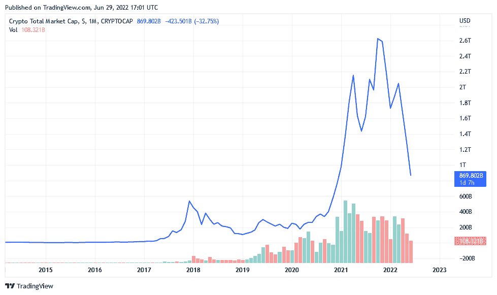
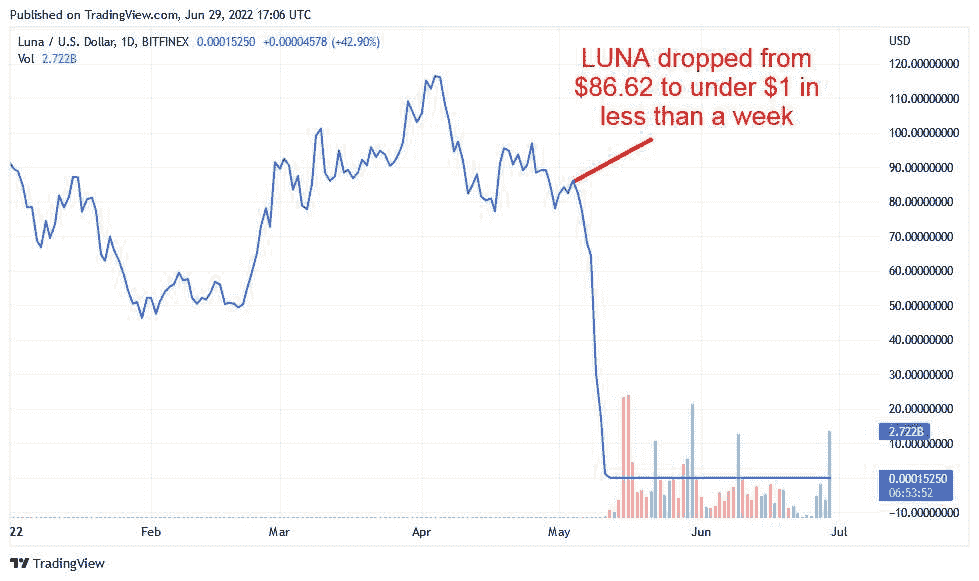
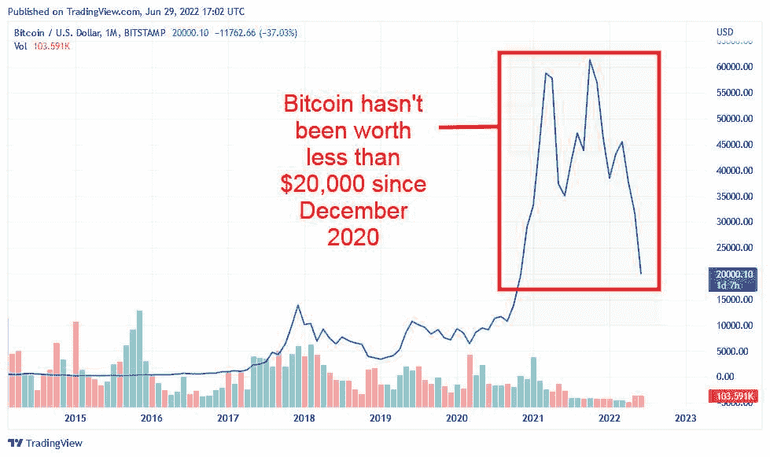

# 加密崩溃:为什么会发生&如何发现下一个

> 原文：<https://www.trality.com/blog/crypto-crash/>

crypto 什么时候会崩溃？crypto 会再次崩溃吗？比特币会崩溃吗？为什么加密会崩溃？

代币价格暴跌，加密公司正在裁员，甚至加密界的黄金标准比特币也贬值了 70%，两年来首次跌破 18000 美元。对于加密货币来说，2022 年是艰难的一年，我们许多人都对市场和 [其长期预后](/blog/the-future-of-cryptocurrency)。

当加密货币市场经历[意外波动](/blog/staying-disciplined)导致数天或数周的大幅下跌时，就会发生加密崩溃。虽然加密市场对起伏并不陌生，但今年所谓的“加密冬天”在规模上是前所未有的。

在本文中，我们将讨论为什么会发生加密崩溃，如何保护自己免受其害，以及如何预测下一次崩溃。

## 什么是加密崩溃？

在传统金融中，市场崩盘指的是指数价值在几天内下跌 10%。然而，崩盘并不等同于修正。市场，不管是加密的还是其他的，都是以周期为特征的:上涨的必然下跌(然后再次上涨)。市场会出现调整和下跌，这完全是正常的，也是意料之中的。

比特币和其他加密货币因其高度不稳定的资产而臭名昭著，随着市场的自然调整，波动只是简单的修正。你可能遇到过[追踪比特币“死亡”次数的网站](https://99bitcoins.com/bitcoin-obituaries/)(459 次，还在继续)。在整个加密市场，资产价值从最近的峰值下跌 10%甚至 20%并不罕见。它们通常是短暂的，而且，如前所述，是市场周期的正常部分。

然而，显著的下滑被认为是崩溃。加密市场崩溃通常是更深远的环境的结果，例如国际法规的突然变化、宏观经济事件或重大公司公告。

由于其规模，2022 年的加密崩溃值得注意。根据来自 [CoinMarketCap](https://coinmarketcap.com/charts/) 的数据，2021 年 1 月 1 日，全球加密货币市场价值 7660 亿美元。2021 年 11 月达到 2.9 万亿美元的峰值，随后通胀、利率上升和俄罗斯入侵乌克兰等因素导致其总价值损失超过 70%(2 万亿美元)。

## **为什么会发生加密崩溃**

*The total market capitalization of crypto over the past decade. It peaked at just over $2.9 trillion before crashing. Image: TradingView*

各种原因都可能导致加密崩溃。值得注意的是，2022 年的崩溃不仅仅影响加密货币。由于俄罗斯入侵乌克兰、通胀担忧和利率上调，全球股市也受到了影响。

2022 年对股指来说是艰难的一年，许多主要股指比 2021 年的涨幅下跌了 20%以上。专家们现在认为，全球经济可能会迎来另一次衰退。

这些因素显然以各种方式影响了加密市场，但还有加密货币特有的其他原因，例如:

*   中国打击加密:2022 年即将到来的第一个预兆是[中国禁止加密交易和开采](https://www.reuters.com/world/china/china-central-bank-vows-crackdown-cryptocurrency-trading-2021-09-24/)。中国政府于 2021 年 9 月彻底禁止了加密采矿业务，并宣布加密交易非法，实际上禁止了比特币和其他加密货币。该公告导致比特币下跌超过 9%。
*   **Celsius Network 冻结**:美国主要的加密贷款公司 Celsius Network 在 2022 年 6 月冻结了取款和转账，[称“极端”条件](https://www.reuters.com/technology/crypto-firm-celsius-pauses-all-transfers-withdrawals-between-accounts-2022-06-13/)。Celsius Network 的公告导致了大规模的暴跌，crypto 的总价值自 2021 年 1 月以来首次跌破 1 万亿美元。
*   **币安提现故障**:2022 年 6 月，[全球最大的密码交易所币安](/blog/the-ultimate-binance-review)短时间暂停比特币提现。该公司[将错误](https://twitter.com/binance/status/1536322033222664194?lang=en)归咎于“卡在链上的交易”,提款已经恢复。然而，这一事件加上最近的 Celsius 网络崩溃导致比特币下跌超过 13%，至 23，000 美元。

总体而言，由于消费者信心受到负面影响，上述所有因素引发了恐慌和进一步抛售。然而，我们不能忽视房间里的大象，即 Terra Luna 崩溃对市场的灾难性影响。

## 2022 年坠毁的密码机

2022 年 5 月 Terra Luna 的倒闭被广泛认为是当前加密市场暴跌的最大导火索。Terra Luna 是分散金融中一个被极度炒作的实验，它是由韩国加密公司 [Terraform Labs](https://www.terra.money/) 于 2019 年开发并推出的，该公司发行了两种代币，**Luna(Luna)**该协议的原生货币，以及 **TerraUSD (UST)** ，一种与美元价值挂钩的稳定货币。Terraform Labs 于 2020 年开始出售 TerraUSD，将其价值与美元挂钩。但与 Tether 等其他稳定资产不同，TerraUSD 没有任何储备资产支持。相反，它使用一种算法，通过将它链接到 Luna 来保持其价值在 1 美元左右。

为了创造(薄荷)UST，等量的月神必须被摧毁(烧毁)。如果 UST 的价值超过 1 美元，那么卢娜将被烧毁，这将铸造更多的 UST，使其价值下降，并帮助它保持稳定。

如果 UST 跌破 1 美元，情况就会相反。UST 持有者被鼓励卖掉或烧掉他们的代币来创造更多的月神，让 UST 的价值回到 1 美元。

这种安排在一段时间内效果很好，LUNA 成为最成功的[去中心化金融(DeFi)](/blog/decentralized-finance) 硬币之一，也是市值排名第七的加密货币。

Terra Luna 的成功在很大程度上是一个利润丰厚的计划，有一个稳定的硬币借贷平台，名为 Anchor Protocol，该平台向投资者承诺，如果他们出借他们在 UST 的股份，年回报率将接近 20%。

Terraform 实验室的算法甚至成功度过了 2022 年第一季度开始的熊市时期。然而，2022 年 5 月，发生了一件事，导致投资者大量抛售 UST。虽然确切的原因尚不清楚，但它促使 UST 放弃了盯住美元的汇率制度，并引发了一系列事件，导致 LUNA 的价值暴跌。

*LUNA tokens became worth less than a cent in a span of a few days. Image: TradingView*

随之而来的大规模恐慌导致更多的 UST 被焚烧，铸造了更多的月神，增加了流通供应量。这一周期产生了连锁效应，让这两个代币在竞争中跌入谷底。

在崩溃之前，月神的流通供应量约为 3.45 亿代币。供应从来没有打算超过 10 亿代币。但是在很短的时间内铸造了如此多的代币，以至于 5 月 12 日的供应量达到了 34.7 亿枚。一天后，供应量达到 6.5 万亿代币。

LUNA 的价值跌至不到 1 美分，与几周前 2022 年 4 月 119.18 美元的历史高点形成鲜明对比。这一事件波及整个生态系统，并导致超过 5000 亿美元的损失，因为它将比特币、[以太坊](/blog/cardano-versus-ethereum)和[许多其他加密货币](/blog/why-so-many-cryptocurrencies)推至新低。

但这并不是 Terra Luna 故事的结尾。Terraform Labs 宣布了一项“复兴计划”[，涉及 Luna 2.0](https://agora.terra.money/) 的发布。这种新代币开始时不稳定，在 24 小时内损失了 75%以上的价值，但它已经设法恢复了一些价值。它是否会成功还有待观察。

## **如何防范加密崩溃**

Terra Luna 的惨败凸显了投资于不受监管的分散金融世界的危险。但投资者并非完全无助，也有办法保护你的投资组合免受未来加密崩溃的影响。其中包括:

*   **玩长线游戏**:像 2022 年这样的波动是加密市场的正常现象。熬过低谷，等待最终的复苏。
*   **不要孤注一掷**:你的投资组合应该平衡，以满足你的目标。这意味着不要将超过 5%或 10%的投资组合分配给像加密这样的高风险投资。
*   **购买 dip 和 HODL** :涉足加密货币时，价格波动是意料之中的。T2 的下跌是低价买入你喜欢的资产的好时机，但是不要投资超过你能承受的损失。
*   不要恐慌抛售:当你看着自己拥有的资产价值暴跌时，想要减少损失并卖掉一切是一种非常自然的反应。然而，在熊市中卖出只意味着你不会从随后的复苏中受益。不要惊慌。相反，[优化你的交易策略](/blog/optimizing-crypto-trading-strategies)，安然度过这波行情。
*   自动化你的交易 : [自动化加密交易机器人](/blog/crypto-trading-bots)比任何人类交易者都更快、更精确、更客观、更安全、更有利可图。

## **如何预测下一次加密崩溃**

加密货币的市场周期有四个阶段，可以用来确定进入或退出头寸的最佳时间。市场周期是指资产的最低点和最高点之间的时期。它有四个阶段:

**积累**:这是资产价值已经触底，似乎有可能复苏的早期阶段。人们开始再次购买，认为最坏的时候已经过去。

**加价**:这个阶段是市场在继续上涨的同时开始保持一定的稳定性。

**分配**:在这个阶段，随着市场达到顶峰，卖家开始占据主导地位。

**降价:**泡沫破裂，价格开始下跌。

所有市场都遵循这个周期。通常平均持续六个月到一年。crypto 的易变性会使正确识别阶段变得更加困难，但这并不是不可能的。例如，比特币的市场周期在 2021 年年中可见，当时其价格从 7 月份的 30，000 美元上涨到 11 月份的 68，000 美元，然后开始下跌，标志着降价阶段的开始。

加密货币尚未从 2022 年的加密冬天中复苏，因为市场仍处于降价阶段。然而，它可能会在 2022 年底或 2023 年初进入积累阶段。

请注意，市场周期的概念并不适用于所有加密资产。墓地里有数以千计的令牌，没有任何恢复的机会。[只投资有可证明活动的项目](/blog/best-cryptocurrencies-to-invest-in)。

## **比特币会崩盘吗？**

*Bitcoin has experienced several crashes over the past decade. The 2022 crash is the most significant to date. Image: TradingView*

多年来，比特币经历了多次“繁荣和萧条”周期，未来很可能会继续经历这种周期。以下是过去十年中记录的一些主要比特币崩溃事件:

*   **2014:**2014 年 2 月，在加密交易所 Mt. Gox 被黑客攻击后，比特币发生了第一次重大崩盘。Mt. Gox 是当时最大的加密交易所，据报道占 BTC 所有交易的 70%以上。黑客攻击以及随后交易所的关闭导致 BTC 的单价下跌了 36%。
*   **2018** :下一次比特币大崩盘发生在 2018 年。比特币在 2017 年经历了受欢迎程度的大幅飙升，从 1 月份的 1000 美元升至 12 月份的近 2 万美元。不幸的是，泡沫在第二年破裂，其价格在 2018 年 12 月暴跌至不到 4000 美元。
*   2020 年:2020 年 3 月，在世界卫生组织(世卫组织)宣布新冠肺炎为全球疫情后，加密价格下跌了 40%，这一事件被称为“黑色星期四”。2020 年 3 月 14 日，比特币价格达到 5200 美元。然而，它设法恢复，并在 2021 年 1 月攀升至近 3 万美元。
*   **2021 年**:2021 年，几个因素影响了加密市场的价值。由于担心新的新冠肺炎变体，以及埃隆·马斯克[宣布特斯拉将不再接受 BTC 支付](https://edition.cnn.com/2021/05/12/tech/elon-musk-tesla-bitcoin/index.html)以及中国的新法规，比特币在 7 月份回落至 3 万美元，随后设法回升，并在 11 月份达到 68，000 美元的历史新高。

上述所有事件有什么共同点？比特币复苏，最终涨幅创新高。虽然很诱人，但是交易者应该尽量不要关注 24 小时甚至 30 天的图表。退一步看更大的图景要好得多。比特币可能在 2022 年大幅下跌，但如果它遵循与过去崩溃相同的趋势，那么它可能会复苏，并可能在 2023 年及以后达到新高。

## **底线**

崩溃是加密市场潮起潮落的正常现象。由于其规模和范围，2022 年的加密崩溃在投资界引起了很大的压力和焦虑，这是可以理解的，但最好避免轻率的决定。

如果这是你的第一次大跌，那么最好的建议是冷静下来，等待价格回升，因为它们进入了市场周期的积累阶段。在你考虑卖出之前，给市场一点喘息的时间。毕竟谁愿意吃亏。

虽然不能保证市场会很快回到以前的高点，但还是有一些积极的迹象。例如，许多区块链系统的开发者活动仍在继续，T2 的风险投资仍在进行，T4 的加密平台也在继续招聘，尽管行业内出现了大量裁员。。

同样重要的是要注意到，每个市场都在 2022 年经历了一次低迷，金融专家预测很快就会出现全球衰退。下降趋势并不是加密市场独有的。

最佳方法？简单地等待它结束。