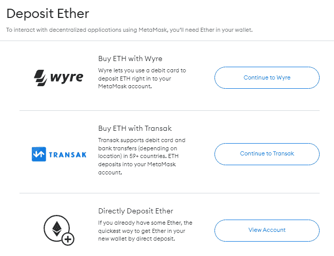
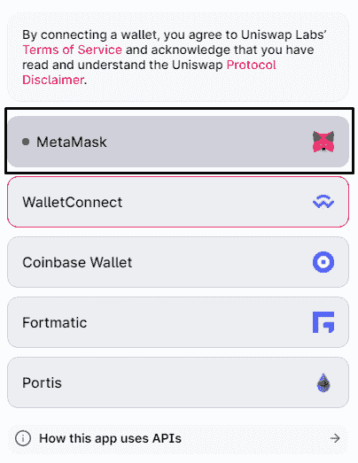
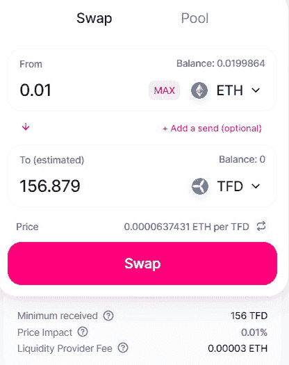

# 没有 KYC 的加密交换(2022)

> 原文：<https://www.trality.com/blog/crypto-exchanges-without-kyc/>

曾经有一段时间，密码市场似乎准备淘汰繁琐的程序。CSS-18up 66p { color:# 00b8e 6；字体粗细:正常；光标:指针；左:0px 位置:相对；-webkit-transition:全部 500ms 转场:全部 500ms-webkit-text-decoration:无；文字-装饰:无；} [KYC 验证](https://www.investopedia.com/terms/k/knowyourclient.asp)流程(还记得当年[币安只要求一个邮箱地址](https://cryptopotato.com/binance-rolls-out-mandatory-kyc-requirements-amid-regulatory-woes/)？).然而现在，对于大多数人来说，加密空间中的 KYC 已经成为不可逃避的现实。如果您曾经在任何领先的加密交易所设立过账户，您可能会被要求完成了解您的客户(KYC)流程，然后才能进行任何交易。

当然，遵守 KYC 有一些非常重要的原因，其中最主要的是它是一种有效的反洗钱(AML)措施。正如比特币专家报道的那样，“采用协调的国际加密 KYC 方法可以解决日益严重的勒索病毒问题，因为攻击者将很容易根据他们的个人信息被跟踪。”事实上，许多人认为 KYC 措施是加密技术长寿的关键之一。然而，还有一些人认为[区块链是低效的 KYC 流程的解决方案。](https://appinventiv.com/blog/use-blockchain-technology-for-kyc/)

然而，如果你对 KYC 有原则性的异议呢？假设您与洗钱或资助恐怖主义完全无关，只是希望保持匿名。没有 KYC，你在密码交换方面有什么选择？

在下面的指南中，我们将 1)简要介绍 KYC 和加密，2)回顾没有 KYC 的顶级加密交易所，3)简要介绍一些与 KYC 的最佳加密交易所，最后，4)概述如何使用 Uniswap 在没有 KYC 的情况下购买加密。

## 什么是 KYC？

KYC 代表“了解你的客户”或“了解你的客户”对 KYC 最简单的解释是，它是金融机构用来验证其账户持有人身份的过程。KYC 流程是一项监管要求，要求集中式金融机构确认开户人的身份，如前所述，该流程旨在防止洗钱、资助恐怖主义和逃税。在大多数情况下，KYC 进程是对反洗钱政策的补充，旨在阻止将非法所得伪装成合法收入。

值得注意的是，权力下放有望消除 KYC 进程带来的瓶颈，使交易变得不可信。因此，有人可能会合理地问:这与密码交换有什么关系？嗯，更简短的版本是[去中心化金融(DeFi)](/blog/decentralized-finance) 不能孤立存在；它必须与中央财政系统协同运作。我们必须从某个地方开始，你不可能在一夜之间彻底检查整个中央金融机构。最起码，让 KYC 加入进来有助于让怀疑者加入进来，因为它提供了一个再熟悉不过的审查和验证过程。

当然，与 KYC 的加密交换通常以不同的方式处理各自的流程，但是在您需要提供的信息方面有一定程度的标准化，包括:

*   身份证明——姓名、出生日期以及身份证、护照或驾照的复印件；
*   物理地址证明；和
*   通过面部识别测试。

## **分散的财政和 KYC**

如果这一切听起来有点侵扰，那么你有什么选择？毕竟，你可能不想像一个比特币传播者一样完全消失，但你也可能不愿意仅仅因为想交易 BTC 而透露这么多个人信息。

dex 可能是一个值得探索的选择。正如 [Cointelegraph 解释](https://cointelegraph.com/defi-101/what-are-decentralized-exchanges-and-how-do-dexs-work)的那样，“分散交易所，也称为 dex，是点对点市场，加密货币交易者直接进行交易，而无需将资金管理交给中介或托管人。这些交易是通过使用自动执行的协议来实现的，这些协议是用叫做[智能合约](https://cointelegraph.com/ethereum-for-beginners/what-are-smart-contracts-guide-for-beginners)的代码编写的

除了较低的交易费用，dex 也越来越受欢迎，因为它们不需要用户提交任何形式的 KYC 验证。因此，用户只需使用他们的加密钱包(通常是类似 MetaMask 的 Web3 钱包) *—* 用他们喜欢的 DEX 创建一个账户，就这么简单！不像币安或比特币基地这样的中央交易所，dex 不会把用户的密码放在[的热钱包](https://www.investopedia.com/terms/h/hot-wallet.asp)里。相反，您直接从自己的加密钱包中交易和交换令牌，这意味着您对您的加密拥有 100%的所有权。俗话说，不是你的钥匙，不是你的密码。

通常，指数可以是订单指数或掉期指数。

Order book DEXs 将所有 cryptos 的所有买卖单汇集在一个平台中。通常，买卖订单之间的价差决定了订单簿的深度，这也影响了不同交易所的密码价格。

另一方面，掉期指数使用流动性池而不是指令簿来维持其加密市场的流动性。部署智能合约是为了确保点对点交易。互换的主要优势在于，它们促进了非本地代币的跨链交换，而没有代币移民或通常的加密到法定交换，这意味着交易者可以将他们 Web3 钱包中的任何代币交换到 DEX 上可用的任何代币。

## **没有 KYC 的最佳加密交易所**

现在是我们当中的隐私顽固分子的大揭秘。这里有一些最好的没有 KYC 的加密交换。

### **dYdX 交换**

就交易量而言，dYdX 是最大的分散式交易所。dYdX 于 2019 年 4 月推出，是一款基于以太坊打造的非托管订单簿 DEX。它依靠经过审计的智能合同运行，保证了透明度、流动性和安全性。它与 StarkWare 合作，为交叉保证金永久资产构建了第 2 层协议，该协议使用 StarkWare 的 StarkEx 可扩展性引擎和 dYdX 的永久智能合约来显著扩展交易。翻译？用户可以以零汽油成本、更低的最小交易规模和更低的交易费用进行交易。通常情况下，交易者会收取 0-0.05%的佣金。

### **Uniswap V3**

Uniswap 可能是最著名的掉期指数。这是一个完全分散的协议，设计于以太坊区块链的顶层。Uniswap V1 于 2018 年上线，但此后演变为 Uniswap V3，于 2021 年 5 月推出。最新版本被改编成包括 DEX 核心及其外围设备的二进制智能合约系统。然而，Uniswap 在所有 dex 中脱颖而出，因为它不仅仅是一个交易平台，还包含一个完整的 DeFi 生态系统，其中有数百个 DeFi 应用程序和协议，允许用户交换、赚取和投票。

### **PancakeSwap**

像 Uniswap 一样， [PancakeSwap](https://pancakeswap.finance/swap) 使用自动做市商(AMM)模式，允许用户针对流动性池进行交易。然而，与 Uniswap 不同，PancakeSwap 仅用于交换 BEP-20 令牌，这意味着其底层区块链是币安智能链。这也意味着 PancakeSwap 的交易费用比其他指数低。

你也可以通过下注平台的本地代币“蛋糕”来赚取糖浆交易池的代币此外，当您下注流动性池(LP)代币时，您可以在协议中提供的各种产量农场中赢取蛋糕。

### **Bisq**

[BISQ](https://bisq.network/) ，原名 Bitsquare，是 2014 年推出的一个点对点平台，在推出的时候是最早的去中心化自治组织([道](https://en.wikipedia.org/wiki/Decentralized_autonomous_organization))之一。作为一个点对点交易网络，Bisq 不是一个网站，不提供任何集中服务。它只是你在电脑或手机上运行的软件，允许你在 BISQ 网络上与其他用户联系和交易。Bisq 的迷人之处在于用户还可以交易法定货币！

Bisq DAO 建立在比特币之上，确保 DEX 的去中心化治理。然而，唯一的缺点是高昂的交易费——0.7%。

### **KyberSwap**

KyberSwap 是一个多链 DEX 聚合器和流动性协议，目前支持六个链:以太坊、多边形、币安智能链、雪崩、Fantom 和 Cronos。它的主要功能是作为一个 DEX 聚合器，这意味着该平台利用专有的动态交易路由算法，允许用户毫不费力地从支持的链中交换令牌。流动性提供者也通过互换费和农场奖励(Rainmaker 是 KyberSwap 的流动性开采/产量农业计划)在 Kyber 上获得丰厚的收入。

由于 Kyber 从各种 dex 中获得流动性，交易商可以从任何代币掉期交易中获得尽可能好的汇率。从这个角度来看，KyberSwap 已经集成了超过 46 个流行的索引，包括 Uniswap、SushiSwap、Curve、Balancer、QuickSwap、PancakeSwap 等。

### **简单交换**

对于那些对非托管即时交易感兴趣的人来说，那么 [SimpleSwap](https://simpleswap.io/) 是一个可以考虑的选择。SimpleSwap 于 2018 年首次出现在加密领域，提供免费注册，并在多年来以积极的评论和可靠的服务证明了自己的安全、简单和值得信赖。事实上，客户无需注册即可兑换加密货币，这使得兑换 600+代币和硬币更加容易。由于直观的设计，整个交换过程非常简单*。用户可以在他们的网站或移动应用程序(苹果、谷歌、APK)之间进行选择，并且可以通过他们的支持团队进行全天候实时聊天。*

## *哪些加密交换需要 KYC？*

*集中式加密交换(cex)需要 KYC。他们通常遵守严格的“了解客户”(KYC)和反洗钱(AML)法规。换句话说，如果你期望绝对的隐私，那么这样的交流对你来说并不理想。*

*顽固的密码交易员不会忘记“集中式”密码交易所的讽刺意味。这里的中心化是指这些交易所作为第三方帮助进行交易，买卖双方不进行互动。在大多数情况下，用户不保存他们的私钥，因为大多数 cex 是保管性交换。*

*以下是需要 KYC 的三大加密交换。*

### ***币安***

*[币安是全球最大的加密交易所](/blog/the-ultimate-binance-review),日均交易量约为 20 亿美元，也是最快的交易所之一，平均每秒约有 140 万笔交易。作为一名全球交易者(美国交易者的选择不同)，你可以在币安投资[超过 500 种加密货币，包括所有最受欢迎的硬币，使用 1，933 对(其中一些你在竞争对手的交易所找不到)。币安可以在网上下载，也有桌面版和手机版。它还支持 46 种法定货币的存款和取款。币安的费用相对较低，这也是它成为全球日交易量最大的加密货币交易所的原因之一。请注意，交易者根据其 30 天的交易量收取 0.02%至 0.1%的佣金。](https://www.binance.com/en/markets)*

*币安也有一家名为[币安德克斯](https://www.binance.com/en/blog/all/binance-launches-dex-testnet-for-the-new-era-of-peertopeer-cryptocurrency-trading-304867000443084800)的子公司，它完全是分散的，建立在币安智能链上。*

### ***北海巨妖***

*北海巨妖将它的使命描述为“建立货币的互联网”，长期以来，它已经涉足加密游戏。事实上，总部位于美国的加密交易所和银行是世界上最古老的比特币交易所之一，早在 2011 年就由杰西·鲍威尔和 Thanh Luu 共同创立。感兴趣的用户可以买卖 185 种以上的加密货币，起始存款低至 10 美元，遵循快速的 KYC 流程和[透明的费用结构](https://www.kraken.com/features/fee-schedule)。*

*北海巨妖为交易者提供了广泛的选择。无论你是在赌注和流动性还是指数和期货。它也是利用杠杆进行保证金交易的最佳加密交易所之一。寻求更多选择和灵活性的高级交易者应该探索[北海巨妖的场外交易柜台](https://www.kraken.com/features/otc-exchange)(柜台，而 NFT 爱好者已经可以报名参加[北海巨妖的 NFT 市场等候名单](https://www.kraken.com/nft)。如果你缺少想法或者在某些方面需要帮助，[北海巨妖的学习部分](https://www.kraken.com/learn)提供了大量的加密指南、视频，甚至播客。*

### ***比特币基地交易所***

*[比特币基地](https://pro.coinbase.com/)是全球最大的交易所之一，也是监管最严格的加密交易所。它成立于 2012 年，是世界上最古老的密码交易所之一。其核心业务是作为加密交易所交易加密货币，但它也向客户提供辅助服务，包括商户解决方案、比特币基地钱包和经纪服务。比特币基地总部位于加利福尼亚州的三藩市，遵守《美国爱国者法案》、《银行保密法》和《资金转移法》。它还在 [FinCEN](https://www.fincen.gov/) 注册为货币服务企业，受英国 FCA 的[电子货币条例](https://www.legislation.gov.uk/uksi/2011/99/contents/made)监管。*

*比特币基地专业版允许用户进行加密货币交易，在这里他们可以获得超过 159 个硬币，474 个可交易对，以及所有交易的庄家收费结构。接受者的费用在 0.04%到 0.5%之间，而制作者的费用在 0%到 0.5%之间。对一些交易员来说，不利的一面是比特币基地没有期货交易平台。*

## ***购买没有 KYC 的密码***

*购买没有 KYC 的加密就像把你的钱包连接到一个分散的交易所，然后换成你想买的加密一样简单。这里有一个分步指南，告诉你如何在 Uniswap 上购买没有 KYC 的加密软件，unis WAP 是最流行的索引之一。*

### ***步骤 1:下载并存入您的元掩码钱包***

*第一步是创建和资助您的元掩码钱包。你需要做的就是[下载 MetaMask](https://metamask.io/) 并设置你的钱包，这可以在几分钟内快速轻松地完成。由于 MetaMask 是一个 Web3 钱包，因此在创建钱包时不涉及 KYC。您可以直接从您的借记卡或信用卡中拨款，或者使用 Wyre 或 Transak 直接通过银行转账。*

***

* 

*Source: metamask.io*

### ***步骤 2:将您的加密钱包连接到 DEX***

*不同的 dex 支持不同的加密钱包。目前，Uniswap 支持 5 种钱包:MetaMask、比特币基地钱包、Portis、WalletConnect 和 Fortmatic。*

***

* 

*Source: https://app.uniswap.org*

### ***第三步:购买没有 KYC 的加密软件***

*一旦你登录了 Uniswap，你就可以把你的 MetaMask 钱包中的 ETH 换成你喜欢的任何加密。在“交换”界面中，输入您想要交换的 ETH 数量，然后单击“选择令牌”按钮，搜索您想要购买的加密。当你选择了你想要购买的加密软件后，Uniswap 将会为你提供最好的价格，并显示“最低价格”、“价格影响”和“流动性提供商费用”*

***

* 

*Source: https://app.uniswap.org*

*交易完成后，您的加密将反映在您更新的元掩码余额中。*

*真的就这么简单！*

## ***结论***

*如果你曾经开过银行账户，那么在你的账户被批准之前，你很有可能已经经历了许多与冗长的 KYC 合规程序相关的官僚程序。大多数加密交换，特别是集中式交换，都执行相同的过程。然而，一些 cex 允许用户在没有 KYC 验证的情况下进行加密交易，但是未验证的账户受到交易限制。您只能通过完成 KYC 验证来取消这些限制。*

*但是，如果你有兴趣购买没有 KYC 的加密，分散的加密交换是你最好的选择。我们已经在本指南中回顾了一些顶级指数，以及购买不含 KYC 的加密货币的分步程序。要获得完整的指数列表，请查看 [CoinMarketCap](https://coinmarketcap.com/rankings/exchanges/dex/) 的有用列表。*

*无论你站在争论的哪一边，都要记住投资的黄金法则:不要冒你愿意失去的风险！*