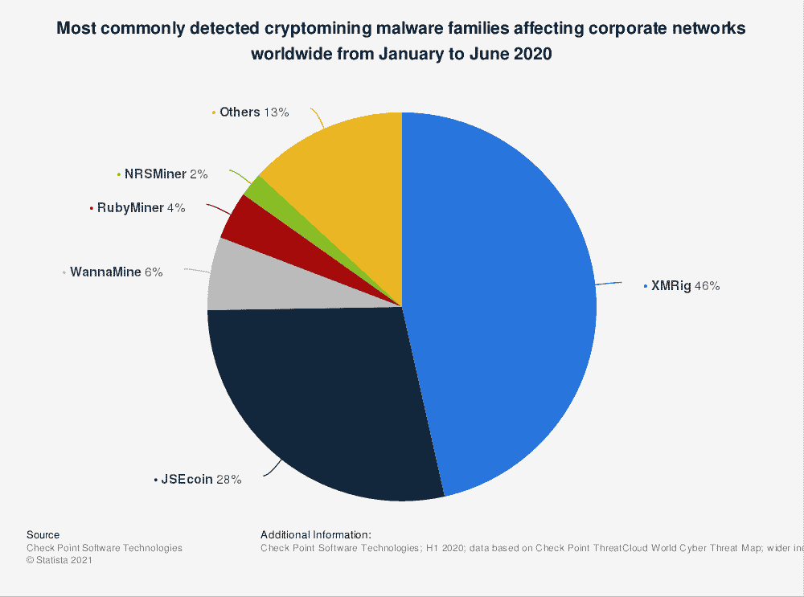
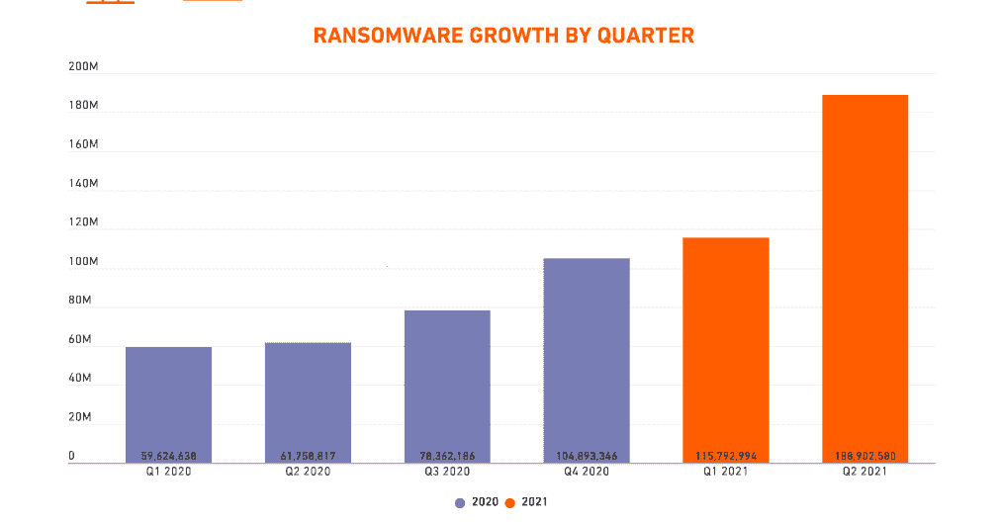

# 加密恶意软件-了解如何保持您的加密安全

> 原文：<https://www.trality.com/blog/crypto-malware-keep-your-crypto-safe/>

你知道，当甚至像《纽约时报》这样的主流媒体宣称“T2”的时候，加密货币已经大受欢迎。CSS-18up 66p { color:# 00b8e 6；字体粗细:正常；光标:指针；左:0px 位置:相对；-webkit-transition:全部 500ms 转场:全部 500ms-webkit-text-decoration:无；文字-装饰:无；} [每个人都有密码 FOMO](https://www.nytimes.com/2022/03/24/your-money/bitcoin-investing-cryptocurrency.html) 但是随着越来越多的新手进入这个领域，特别是现在[密码市场再次激增](https://www.business-standard.com/article/markets/buoyant-bitcoin-helps-crypto-market-surge-past-2-trillion-barrier-122032901594_1.html)，有越来越多的机会让[密码骗子](/blog/cryptocurrency-scams)试图使用各种邪恶的方法窃取人们的密码。正如网站 [SecurityIntelligence](https://securityintelligence.com/articles/crypto-crime-solutions/) 最近询问的那样，“有人对加密犯罪的激增有所行动吗？”

例如，根据 Cognyte 的网络威胁情报研究小组的数据，2021 年遭受勒索软件攻击的组织数量增长了 100%。这种恶意软件需要 CPU 的操作，并逐渐成为一种流行的网络攻击形式。

保护你的密码免受这种和其他形式的恶意软件的第一步是了解它是如何工作的。但是由于加密领域的各种术语，很难区分恶意软件、勒索软件、[加密劫持](https://www.kaspersky.com/resource-center/definitions/what-is-cryptojacking)和[犯罪加密挖掘](https://www.technologyreview.com/2019/03/25/103254/a-multi-million-dollar-criminal-crypto-mining-ecosystem-has-been-uncovered/)，这就是为什么我们整理了这份关于各种形式的加密恶意软件以及如何保护自己免受其害的信息综述。

继续阅读，了解如何保持你的密码安全！

## 什么是加密恶意软件？

根据[卡巴斯基](https://encyclopedia.kaspersky.com/glossary/cryptomalware/)的说法，加密恶意软件被定义为“一种[勒索软件](https://encyclopedia.kaspersky.com/glossary/ransomware/)，它加密用户的文件，并索要赎金。复杂的加密恶意软件使用先进的[加密](https://encyclopedia.kaspersky.com/glossary/encryption/)方法，因此没有唯一的密钥文件无法解密。”

根据部署的加密恶意软件的类型，威胁参与者可能能够使用其他人的服务器或计算机来挖掘加密货币。它也被称为无声威胁，利用其他用户设备的处理能力来获得支付。一旦执行，加密恶意软件可以在受害者的计算机上独立运行，攻击者可以继续从被黑设备中吸取资源，而无需向受害者支付费用。

加密恶意软件的历史真的很有趣。根据[一个站点](https://www.techslang.com/definition/what-is-a-crypto-malware/)，

> 第一个加密恶意软件是在 2014 年发现的，它使用哈佛大学的奥德赛计算机集群从 dog coins 中挖掘出来的。这一发现之后不久，同年发生了类似的攻击，尽管是利用国家科学基金会(NSF)的[超级计算机](https://www.techslang.com/definition/what-is-a-supercomputer/)非法开采比特币。

> 但加密恶意软件实际上从 2017 年起才成为头条新闻，因为网络犯罪分子加倍努力劫持不够安全的计算机、服务器甚至浏览器，以填充他们自己的加密货币钱包。一次特别有趣的攻击涉及前美国美联储雇员 Nicholas Berthaume，他利用雇主的电脑非法挖掘比特币。

根据同一网站的数据，加密恶意软件[从 2017 年的 50 万增长了 4，000%](https://www.forbes.com/sites/donnafuscaldo/2018/12/28/crypto-mining-malware-grew-4000-this-year/?sh=2d8c0197224c) 到 2018 年的 400 万。仅在 2020 年上半年，影响企业网络的五个最常见的加密挖掘恶意软件家族是 XMRig、JSEcoin、WannaMine、RubyMiner 和 NRSMiner。

Source: [Statista](https://www.statista.com/statistics/325252/cryptomining-malware-global/#:~:text=XMRig%20was%20the%20most%20commonly,without%20a%20user's%20explicit%20approval.)

### **加密恶意软件与勒索软件**

加密恶意软件和勒索软件攻击可能非常相似。它们都是为攻击者创造收入而设计的，但它们的运作方式却大相径庭。

如上所述，勒索软件攻击包括加密受害者的文件并索要赎金。如果受害者未能付款，勒索软件攻击者可以将信息出售给暗网。

另一方面，加密恶意软件可以在不被察觉的情况下在系统上运行，只要恶意代码未被检测到，攻击者就会从中受益。例如，最近的一份报告发现，Verblecon 恶意软件加载程序正被用于秘密的加密挖掘攻击。根据报告的调查结果[，“该恶意软件是基于 Java 的，其多态特性使其能够溜进受损系统，在许多情况下未被发现。”](https://www.bleepingcomputer.com/news/security/verblecon-malware-loader-used-in-stealthy-crypto-mining-attacks/)

Source: [SonicWall Cyber Threat Report - 2021 Mid-Year Update](https://www.sonicwall.com/medialibrary/en/white-paper/mid-year-2021-cyber-threat-report.pdf)

勒索软件要求直接支付，它正在成为当今增长最快的网络犯罪类型。可以想象，勒索软件的影响是巨大的。2020 年，[全球勒索软件成本](https://cybersecurityventures.com/global-ransomware-damage-costs-predicted-to-reach-20-billion-usd-by-2021/)约为 2000 万美元，这一数字只会继续增加。

## **密码劫持和非法密码挖掘**

如果你听说过劫车，那么你应该能够弄清楚什么是密码劫持。密码窃贼不是偷别人的车，而是有效地偷别人的电脑(或者更准确地说，是计算能力)来挖掘密码。

根据 Investopedia 的说法，“加密劫持是一种网络攻击，黑客利用目标的计算能力代表黑客非法开采加密货币。密码劫持可以针对个人消费者、大规模机构，甚至工业控制系统。”

大多数加密区块链允许任何人通过采矿过程铸造新硬币。您甚至会看到诸如“[如何通过 5 个步骤](https://moralis.io/how-to-create-a-solana-token-in-5-steps/)创建 Solana 令牌”的指南这一过程并不特别困难，而且对任何人都开放，因此非常容易理解。不幸的是，这导致了加密挖掘恶意软件在计算机化设备上的传播，这些恶意软件在执行时可以铸造新的硬币，从而导致犯罪加密挖掘活动的增加。

Digital Shadows 的网络威胁情报分析师丹尼尔·阿尔门德罗斯(Daniel Almendros )解释说:“你在劫持别人的机器、他们的处理能力、电池寿命和他们的内存来开采加密货币。”。这些新硬币被存入攻击者的钱包，而受害者承担所有采矿费用，如电费以及计算机的磨损。

SonicWall 最近的一份报告显示，由于对加密货币的需求不断增长，加密劫持呈上升趋势。犯罪加密挖掘的激增是一个经济问题，随着加密货币获得大规模采用，它可能会继续增加。

因此，有必要知道如何保护你的密码免受恶意软件的攻击。不过，首先让我们看看各种类型的加密恶意软件。

## **加密恶意软件的类型**

加密恶意软件可以采取各种形式，这里是最常见的类型。

### **加密勒索软件**

我们已经讨论过这个问题，但是加密勒索软件是最流行的恶意软件形式之一。在极端情况下，[俄罗斯黑客利用它向美国公司](https://www.forbes.com/sites/roberthart/2021/07/05/ransomware-hackers-demand-70-million-in-bitcoin-claim-massive-us-attack-as-biden-investigates-possible-russian-involvement/)索要 7000 万美元的比特币。这种勒索软件对计算机化设备上的文件进行加密，使这些文件无法访问。作为解密密钥的交换，攻击者向受害者索要赎金。如今，加密勒索软件非常普遍，恶意文件可以通过电子邮件、广告和下载等各种方式传播。

### **储物柜勒索软件**

顾名思义，locker 勒索软件会锁定计算机，阻止访问计算机上的文件和应用程序。此外，锁定屏幕可能会显示要求赎金在规定的时间内解锁屏幕。

最近的一个例子是“Ragnar Locker 勒索软件”。正如 [The Register 报道的](https://www.theregister.com/2022/03/09/fbi_says_ragnar_locker_ransomware/)，“Ragnar Locker 勒索软件团伙迄今为止已经感染了美国至少 52 个关键基础设施组织，涉及制造业、能源、金融服务、政府和信息技术等领域。”

### **双重勒索勒索软件**

在这种情况下，攻击者加密文件并创建这些文件的副本来勒索受害者。如果受害者没有满足他们的要求，攻击者可以威胁将被黑的数据公之于众。

值得注意的是，支付这样的赎金并不能保证数据在某个时候不会被公开，因为攻击者仍然拥有被盗的数据。正如一家网站报道的那样，在 2017 年臭名昭著的 [WannaCry](https://www.cybersecuritydive.com/news/wannacry-ransomware-eternalblue-patching/600084/) 和 NotPetya 勒索软件活动之后，恶意行为者现在已经改变了他们的策略。

> 现在，不仅仅是加密文件，双重勒索勒索软件首先过滤数据。这意味着，如果该公司拒绝支付，信息可能会被泄露到网上或卖给出价最高的人。突然间，所有这些备份和数据恢复计划变得毫无价值。

### **RaaS(勒索软件即服务)**

这包括由专业黑客匿名托管恶意软件，然后提供租赁访问。专业人员处理黑客攻击过程的所有方面，包括收取赎金以换取一些改变。

正如 [CrowdStrike 解释](https://www.crowdstrike.com/cybersecurity-101/ransomware/ransomware-as-a-service-raas/)的那样，“勒索软件即服务(RaaS)是勒索软件运营商和分支机构之间的一种商业模式，其中分支机构支付费用以发起运营商开发的勒索软件攻击。把勒索软件作为一种服务看作是软件作为一种服务(SaaS)商业模式的变种。”RaaS 的一些常见示例包括 DarkSide、REvil、Dharma 和 Lockbit。

## 加密恶意软件是如何工作的？

密码黑客恶意挖掘密码的方式有三种:

### **基于文件的密码劫持**

基于文件的密码劫持是密码劫持中最常见的方法之一。在这种情况下，攻击者向受害者发送看似真实的电子邮件或文件。

当受害者下载并执行文件时，恶意挖掘脚本在用户不知情的情况下开始在计算机后台运行。事实上，这是如此普遍，甚至学术界也写了关于它的研究论文(“[揭露基于文件的加密劫持](https://link.springer.com/chapter/10.1007/978-981-15-5285-4_13)”)。

### **基于浏览器的密码劫持**

黑客可以在各种 web 浏览器上创建恶意的加密挖掘脚本，同时使用 IT 基础设施来挖掘加密货币。这些脚本可以是吸引人的广告或过时的插件，下载到电脑后可以在后台运行。

然而，根据 ZDNet 上的一篇文章[，尽管基于浏览器的密码劫持在 2020 年激增，但预计不会卷土重来。正如他们报道的那样，](https://www.zdnet.com/article/browser-based-cryptojacking-sees-sudden-spike-in-activity-in-q2-2020/)

> 过去尝试过加密劫持操作的大多数网络犯罪集团通常在几周后就放弃了，因为他们还发现，基于浏览器的加密货币挖掘既浪费时间，又过于嘈杂，导致人们更多地关注各自的操作，而不是利润。

### **云密码破解**

云密码劫持涉及搜索组织的云文件，以编码其 API 密钥并访问其服务。一旦这些文件可以访问，黑客就可以吸走 CPU 资源来非法开采加密货币。

谷歌最近上了新闻[，因为谷歌云开发了一种加密劫持解决方案来检测虚拟机上的挖掘恶意软件。据网站 Gadgets360 报道，](https://gadgets360.com/cryptocurrency/news/google-cloud-cryptojacking-virtual-machine-threat-detection-vmtd-solution-detect-mining-malware-2756225)

> 为了保护加密矿工免受安全漏洞的影响，谷歌云开发了一种新的解决方案，称为虚拟机威胁检测(VMTD)。该工具将检测潜在的加密挖掘恶意软件攻击，也称为密码劫持。谷歌云的这项服务还将屏蔽配置不佳的账户，这些账户被黑客攻破并用于挖掘加密货币。

## **加密恶意软件的影响**

可以想象，加密恶意软件的影响对个人和企业来说都是极其昂贵的。一篇名为“[关于加密勒索软件攻击的经济影响](https://link.springer.com/article/10.1007/s41125-019-00039-8):企业系统的最新技术”的学术文章描述了这个问题的严重程度:

> 根据网络安全风险投资公司 2017 年的研究，每 40 秒钟就有一家企业遭受勒索软件攻击，预计到 2019 年这一比例将升至 14 秒。商业组织不得不在一次攻击中向网络犯罪分子支付高达 100 万美元的费用，而其他组织则遭受了数亿美元的损失。

除了支付赎金和增加受影响机器的磨损之外，加密恶意软件还可能带来更广泛的后果，因为它们可能威胁网络或系统的可用性、完整性和安全性，从而可能导致企业的关键任务运营中断。

正如网站[趋势科技警告](https://www.trendmicro.com/vinfo/de/security/news/cybercrime-and-digital-threats/security-101-the-impact-of-cryptocurrency-mining-malware)的那样，“加密货币挖掘恶意软件可能会损害系统性能，并使最终用户和企业面临信息窃取、劫持和大量其他恶意软件的风险。通过将这些机器变成僵尸，加密货币恶意软件甚至可以无意中使其受害者成为问题的一部分。”

## **防范加密恶意软件**

那么，你能做些什么来保护自己免受加密恶意软件的攻击呢？虽然不可能防范所有威胁，但有一些最佳实践可以大大降低您的风险。其中包括:

*   定期更新所有设备和软件，确保您运行的是最新的补丁程序，以防止后门攻击。
*   更改和/或加强您设备的凭据并启用多因素身份认证(MFA ),以防止未经授权的访问。
*   如果可能，在路由器等设备上启用防火墙保护。
*   点击链接、从可疑网站下载附件或文件、未知的第三方软件/应用程序以及未经请求的电子邮件时，要格外小心。
*   执行应用程序白名单并定期监控网络流量。

也许最重要的是，你应该做自己的研究。加密恶意软件在不断发展，网上有大量关于最新威胁的信息。如果你知道外面有什么，那么你可以采取适当的措施来保护自己。

## **最终想法**

开采加密货币并不违法。然而，在未经他人同意的情况下使用他们的设备这样做是恶意的。随着对加密货币需求的增加，黑客正在寻找通过传播恶意文件从挖掘中获利的机会，每个人都需要保持警惕，以保护他们的设备、网络、信息和资产。

我们将向趋势科技(Trend Micro)做出最后的决定:“然而，最终，互联网连接设备针对加密货币挖掘恶意软件的安全性不仅仅是用户的负担。原创设计和设备制造商在保护他们所处的生态系统方面也扮演着[至关重要的角色](https://blog.trendmicro.com/trendlabs-security-intelligence/internet-things-ecosystem-broken-fix/)

打击加密恶意软件是一个集体问题，它需要集体的解决方案。