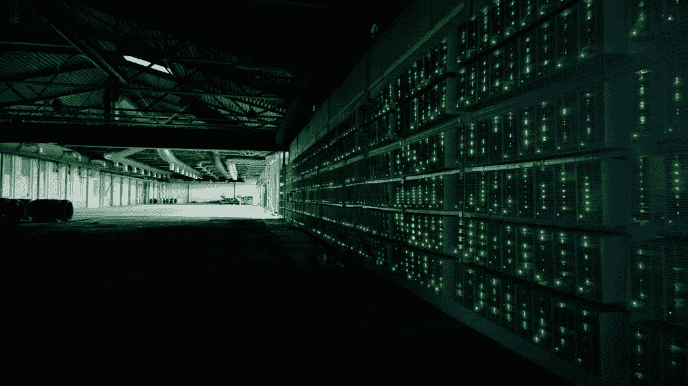
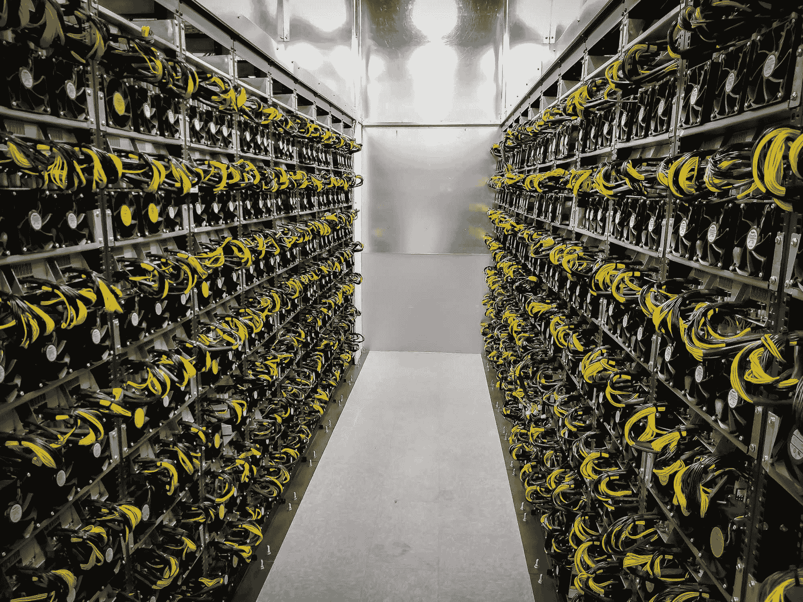

# 加密采矿与加密交易:哪个更有利可图？

> 原文：<https://www.trality.com/blog/crypto-mining-vs-crypto-trading/>

每个人都知道交易密码可以获利。但是鉴于 [crypto 的波动性](/blog/staying-disciplined)，交易者经常寻找其他方式来利用他们在这个领域的参与，其中一种方式就是通过挖掘。事实上，矿工对加密生态系统至关重要。

想想比特币就知道了。在早期，比特币矿工只需要一台电脑和一个互联网连接，瞧:数百个，如果不是数千个，可以在矿工家中舒适地开采，不需要任何特殊设备。但是那些日子已经过去很久了。如今，比特币矿工需要昂贵的采矿设备和图形处理器(GPU)、低成本电源、采矿软件，甚至是采矿池会员资格。

然而，挖掘 BTC 并不是镇上唯一的游戏，随着这些年来挖掘越来越受欢迎，有些人甚至使用手机来进行[挖掘加密。无论你是想探索加密采矿作为一种投资的可行性，以及它如何与交易加密相提并论，或者你只是对采矿过程本身感到好奇，请继续阅读，因为我们会仔细看看，甚至解开一些误解。](/blog/mining-crypto-on-a-phone)

## 什么是加密挖掘？

采矿发生在区块链，这一过程创造了新的虚拟代币单位，然后进入市场流通。加密挖掘还描述了如何在网络上确认交易，并且是区块链操作中的一个关键要素。

为了更好地理解挖掘的概念，让我们回顾一下区块链，一个共享的、不变的事务记录。区块链由分散的计算机网络组成，由世界各地的个人(矿工)运营。它的名字来源于它的描述，即一系列链接的块，每次发生事务时，相关数据都存储在一个块上。如前所述，矿工负责验证基于区块链的操作，并使用特殊的硬件来完成这项工作。

矿工们竞相首先完成由网络生成的复杂的计算数学难题。谁“赢得”这场竞赛，谁就成功批准了一笔交易，就 BTC 矿业而言，他们将获得比特币奖励。请注意，这些是新铸造的 BTC 代币。

## 秘密采矿仍然有利可图吗？

简短的回答是:是的，采矿是有利可图的，也可以是有利可图的，但这取决于许多因素。

### **高效设备**

几乎任何人都可以在比特币诞生后不久挖掘它。一台好的家用电脑在当时已经足够好了。然而，自那以后，市场扩大了。现在竞争更加激烈，你的装备质量在决定采矿是否对你有利方面发挥着巨大作用。

数千名矿工同时争夺相同的收入，低效的硬件使个人处于不利地位。挖掘过程需要大量的计算能力，并且有专门的(翻译:昂贵的)硬件来处理这些计算。

### **能源成本**

除了速度，设备的另一个重要考虑因素是它是否节能。采矿过程消耗大量的能源，帮助你减少用电量的设备是必不可少的。如果你打算建立一个有利可图的采矿平台，高质量的硬件是不容讨价还价的。

此外，在电力免费或便宜的地区采矿有助于提高你的利润率。这一点的重要性在矿工的地理分布中得到了突出的体现，美国在全球散列率方面排名第一，这是因为在某些管辖区有充足的电力。采矿是有激励的，但收益必须覆盖过程的成本，电费就是其中之一。

### **方块奖励和挖掘难度**

区块奖励和采矿难度是两个额外的特征，它们在采矿利润中起着核心作用。哈希率是加密货币挖掘难度的一个衡量指标:哈希率越高，意味着需要更大的计算能力才能获得相同数量的令牌。这反过来意味着，一家单独的矿商将更难盈利。与此同时，大多数数字货币的集体奖励以固定的频率一分为二，直到项目达到最大硬币供应量。

### **令牌选择**

采矿收入也因你选择采矿的硬币而异。虽然比特币是一个受欢迎的选择，但它不是唯一的选择。可供选择的替代币种类繁多，包括[Monero](https://www.getmonero.org/)(XMR)[lite coin](https://litecoin.org/)(LTC)[以太坊经典](https://ethereumclassic.org/)(ETC)[Zcash](https://z.cash/)(ZEC)[比特币黄金](https://bitcoingold.org/)(BTG)[Dash](https://www.dash.org/)(Dash)等等。

您可以使用加密货币盈利能力计算器来估计大多数代币的潜在采矿收入。一个很好的例子是。该网站列出了几个代币，例如，每天提供 0.50 美元到 1.00 美元的收入。虽然这些金额不一定马上就能带来可观的利润，但随着时间的推移，它们会越积越多。

## 投资密码挖掘值得吗？

对于一个孤独的矿工来说，这可能不是一个划算的选择，至少除非你在这个过程中投入大量资金(即使这样也不能保证利润)。风险收益比相当不平衡(下文更多)，但有一个关键点需要考虑。

虽然拥有采矿设备的个人不太可能获得太多利润，但专业团体或公司就不一样了。如今，大多数采矿活动都落到了专业操作的地步，如矿池开采。挖掘池是一组个人，他们为挖掘过程“汇集”他们的计算资源。

在一个矿池中，找到一个区块的概率要高得多，而且，如果过程成功，利润会在成员之间分配。尽管不同集团的支出不同，但利润低于一个单独的矿商(如果他们成功的话)。这种安排是一个很好的选择，因为它减轻了所有参与者的负担，增加了成功的机会。

## 加密采矿有什么缺点吗？

正如你读到这里所料，答案是肯定的。

### **采矿贵**

也许加密采矿最大的缺点是涉及的高成本。作为一个意图盈利的矿工，如果你拥有一个采矿场，你将不得不为设备、电费和维护费支付资金。你需要很长的时间和很大的耐心来积累收益，以扩大你的资本。此外，你需要的不仅仅是昂贵的硬件来开采，你还需要知道如何操作和维护所有这些昂贵的技术，这本身就需要时间和金钱成本。

### **高能耗**

一个经常讨论的缺点是采矿过程需要多少能量。这再次增加了费用，因为投资者将不得不支付电费和上网费用。这种高能量摄入并不完全环保，而且可能会让对采矿感兴趣(因此投资于)最节能的加密货币的交易者感到不快。

## **采矿池**

不可否认，采矿可能是一项有利可图的事业，但并不是所有的采矿努力都能保证成功。如果你打算进入这个行业，你需要对这个过程有一个透彻的理解，并且有足够的资金来做一个相当大的开端。

从采矿中获利的一个很好的方法是加入采矿池。然而，你需要开始做一些基本的事情。

### 一个加密钱包

加密钱包可能是最容易获得的，你需要它来存储你从采矿中获得的加密货币。有各种各样的数字钱包，保管型和非保管型，甚至还有诸如 Ledger 和 Trezor 提供的冷藏钱包，它们离线存储虚拟代币。

### **采矿软件**

采矿软件是你运营的重要组成部分；它与您的设备配合使用，帮助您监控设备的运行情况，确保采矿顺利进行。各种操作系统都有大量的免费软件(或者其他售价高达 250 美元的软件)。正如《福布斯》一篇关于最佳采矿软件的文章所解释的，新用户最好选择基于云的软件，特别是如果它的提款要求低(这是比特币采矿的一个重要考虑因素)。另一端是拥有高级软件的高级用户，他们可以根据自己的需求定制软件。

### **采矿硬件**

正如 [Cryptopedia](https://www.gemini.com/cryptopedia/crypto-mining-rig-bitcoin-mining-calculator-asic-miner) 指出的，有一系列不同的钻机可供选择，这取决于你的需求(ASIC、GPU、CPU、FPGA 和云采矿)，这些需求根据采矿奖励和拥有的权力而变化。硬件可能非常昂贵，通常高得令人望而却步，这使得采矿难以盈利。然而，与大多数事情一样，这取决于您的需求和资源的可用性。

例如，像云挖掘这样的东西可能是一个有吸引力的选择。同一篇 Cryptopedia 文章指出，任何对采矿感兴趣的人都可以通过与采矿承包商签订合同来限制成本。这样，你可以参与采矿，但不需要购买和维护任何昂贵的设备。

### **加入矿池的提示**

然而，让我们说，你有你的设备和获得低成本的电力。现在你在寻找一个矿池。以下是一些需要记住的事情。

*   资金池的大小:更大的资金池意味着更小但更频繁的支出、更强的散列能力和更多的块。参与者较少的池不会找到同样多的块，并且可能会有更长的等待时间。然而，收益将在一个小团体之间分配，因此你将获得比大团体更大的利润。
*   费用:有些矿池有会员费；业主从支出中扣除费用，通常在 4%左右或以下。
*   安全:尽量加入一个信誉好的老牌矿池。这有助于降低会员资金被盗的风险。

## 加密开采比加密交易更有利可图吗？

现在，你们一直在等待的问题是:开采加密货币还是交易加密货币更好？不幸的是，没有明确的答案，因为不同的设置可以适应不同的期望。

加密交易容易得多，是新手开始的好地方。只需在手机上轻点几下，你就可以轻松进入密码交易的世界。虽然加密交易可能是一项不稳定的业务，但有一些东西可以帮助交易者减轻风险，如自动加密交易。如果你想不顾风险从数字代币中快速获利，这可能是一条可行的道路，特别是如果你开始用较少的资金来习惯加密交易。

另一方面，加密挖掘确实需要从一开始就做出重大承诺(尽管它可以有自己的长期回报)。它还需要昂贵的硬件和价格适中的软件，以及更高水平的专业知识和耐力。简单地说，它远没有加密交易灵活

## **结论**

最后，重要的是你的目标和你拥有的资源。加密交易和加密挖掘都是加密生态系统的重要组成部分。无论你的倾向是什么，对个人交易者来说，这两种方式都是可行的，有利可图的选择，但是在考虑这两种方式时，有一些重要的考虑要记住。

像往常一样，做你自己的研究，不要冒超出你承受能力的风险。