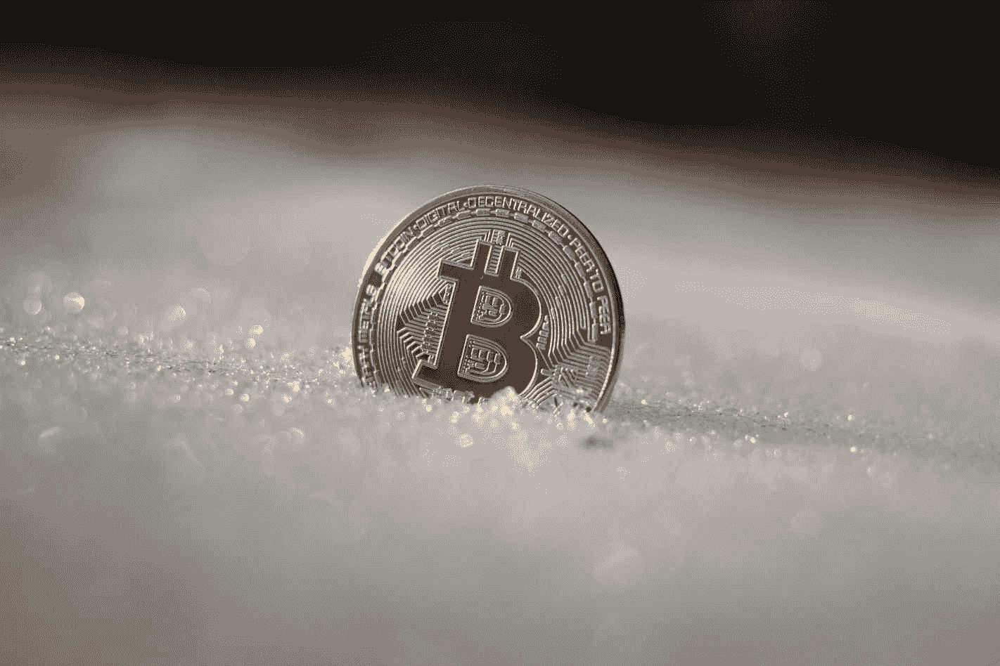
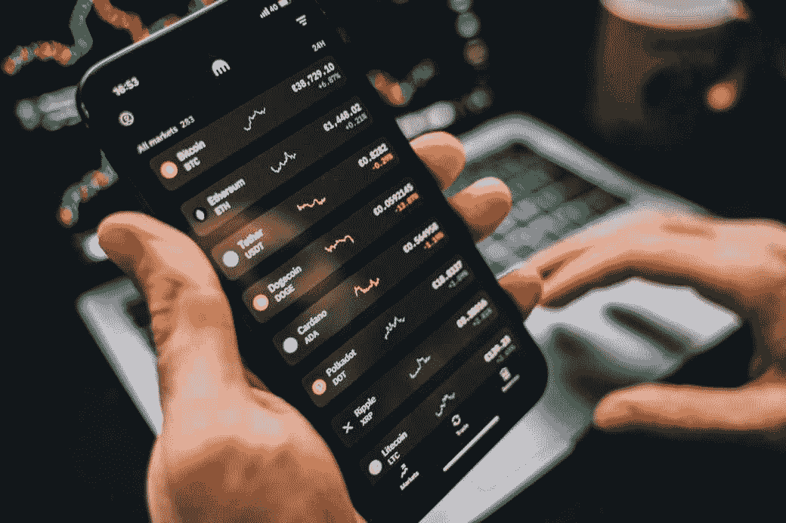

# 密码冬天:买方市场？

> 原文：<https://www.trality.com/blog/crypto-winter-a-buyers-market/>

如果你是 HBO 热门剧集《权力的游戏》的粉丝，那么你可能对“冬天来了”这个短语很熟悉，这意味着坏事即将来临。

但是在隐球层，冬天已经来了！事实上，你不可能长时间浏览你的新闻提要而不看到任何一篇关于新的加密冬天的文章。事实上，从标题来看，这是世界末日:“‘秘密的冬天’随着投资者的狂热变得冷酷无情而降临”。CSS-18up 66p { color:# 00b8e 6；字体粗细:正常；光标:指针；左:0px 位置:相对；-webkit-transition:全部 500ms 转场:全部 500ms-webkit-text-decoration:无；文字-装饰:无；}*)；”“恐惧如此之多”:交易者迎来了秘密的冬天”([彭博](https://www.bloomberg.com/news/articles/2022-06-17/crypto-winter-is-here-there-s-so-much-fear-as-bitcoin-plunges))；”“有如此多的恐惧”:一个隐秘的冬天已经来临”( [*《悉尼先驱晨报》*](https://www.smh.com.au/business/markets/there-s-so-much-fear-a-crypto-winter-has-arrived-20220620-p5auy9.html))；”Crypto winter 冻结了数字资产公司的体育赞助随着严酷的“冬天”降临，秘密投资者的热潮结束了”( [*洛杉矶时报*](https://www.latimes.com/business/story/2022-06-20/crypto-investors-hot-streak-ends-as-harsh-winter-descends) )。*

*根据 crypto bros [Tyler 和 Gemini 首席执行官兼总裁卡梅隆·文克莱沃斯](https://www.gemini.com/blog/a-message-from-cameron-and-tyler)的博客文章，加密领域正在进入一个漫长的收缩或低迷期，被称为加密冬天。*

***

* 

*FUD，有人吗？*

*天塌下来了吗？或者这是一个识别和投资新硬币的机会，并从长远来看获得一些利润？在当前的加密熊市中，无数投资者正面临着这些问题。尽管没人能准确预测未来，但历史价格走势和数据显示，T2 的牛市行情是在一个隐秘的冬天之后。*

*带上你的皮大衣、帽子、围巾和手套，让我们看看投资者如何利用最近的加密冬天。*

## *什么是隐秘的冬天？*

*DBX 数字生态系统首席执行官伊戈尔·扎哈罗夫表示，美国的高通胀率和对乌克兰战争导致的经济不确定性的日益担忧，启动了加密冬天的车轮。*

*加密货币臭名昭著的波动性已经被极高的价格和随后的大幅下跌所揭示。因此，加密冬天的一个非常基本的定义是，加密价格下跌并长时间保持在低位。*

## ***过去的加密冬天***

*第一个官方加密冬天始于 2017 年，当时加密货币开始获得主流采用。虽然有些人对其未来前景仍有疑虑，但其他投资者却看好它，在一年的时间内，比特币的价格从 900 美元飙升至 2 万美元，许多替代币也经历了大幅涨价。*

*在此期间出现了许多秘密百万富翁，但秘密的冬天即将来临。当早期的密码投资者做空时，密码的价格大幅下跌。然而，在 2017 年末至 2018 年 2 月期间，比特币暴跌了约 80%，从 20，000 美元的历史高点跌至约 3，236 美元。那些后来抱着很高期望加入的人很快成为受害者，因为价格暴跌，抹去了提前退休的梦想。*

*许多唱反调者和加密悲观主义者宣称加密已经死亡，这加剧了价格长期下跌过程中的恐慌。但是市场证明他们错了！比特币已经死了多少次，只是像一只不可阻挡的加密凤凰一样从灰烬中重生(我们甚至不是比特币的最大主义者)。*

***

* 

*到 2020 年，在经历了一个非常漫长的熊市后，比特币的价格越来越高。12 月，[其价值为 28768 美元，](https://www.statista.com/statistics/326707/bitcoin-price-index/)打破了之前的历史新高。一年后，比特币创下 68670 美元的历史新高。*

*对许多投资者来说，2018 年的加密冬天是他们一生中最糟糕的时期。但对其他利用那段时间买进的人来说，这是塞翁失马，焉知非福，因为他们在熊市买入的愚蠢决定获得了令人难以置信的投资回报。*

## *【2022 年冬季加密*

*凭借后知之明，我们可以回顾过去，说历史今天可能会重演。正如主流媒体喜欢提醒我们的那样，加密货币已经陷入了寒冬。大多数硬币继续以红色交易。我们甚至不会讨论[卢娜最近的死亡螺旋](https://www.nytimes.com/2022/05/18/technology/terra-luna-cryptocurrency-do-kwon.html)和壮观的崩溃。*

*当然，看着自己的投资组合缩水很痛苦，尤其是对那些在 2021 年 11 月高点时进入市场的人来说。如果以历史为鉴，那么这个隐秘的冬天可能需要几个月，甚至几年才能解冻。市值最大的两种加密货币比特币和以太坊(Ethereum)今年从开盘价下跌了 30%以上。还有，卡尔达诺等各大 altcoins 也有自己的烦恼。*

*就连比特币基地和双子星等交易所也遭受了冻伤。双子座已经裁掉了大约 10%的员工。创始人将裁员归因于“动荡的市场环境可能会持续一段时间。”[比特币基地已经解雇了 18%的员工。Crypto.com 已经解雇了 5%的公司员工。](https://www.wsj.com/articles/crypto-exchange-coinbase-to-lay-off-18-of-staff-11655211069)*

*在加密领域，没有什么是 100%确定的。没有人能准确地说出当前的加密冬天将如何结束。但是如果你长期投资加密，那么现在看起来是买入的好时机。*

## *如何从隐秘的冬天中获利？*

*今天的熊市对于那些以前觉得自己被价格挤出加密市场的人来说是一个绝佳的时机。当每枚硬币价值 20，000 美元时，你将获得比 2021 年 11 月 BTC 价值 70，000 美元时多得多的 BTC。*

*虽然许多投资者担心熊市的漫长冰冻期，但这可能是一些其他投资者扩大投资组合和赚取投资回报的机会。那些错过了之前的牛市，又因为价格高而无法加入的人，可以在下一轮牛市到来之前买入。如果有什么不同的话，[目前许多加密货币被低估得令人难以置信。](/blog/most-undervalued-crypto)*

*如果你想利用正在进行的加密冬天为你的投资组合带来好处，那么记住以下几点是很重要的。*

### ***将不超过 5%的投资组合分配给 crypto***

*尽管历史告诉我们，熊市之后总是会出现反弹，但没有适当的风险管理策略进行投资在财务上是不明智的，这包括自动化交易，以提高效率、规律性和客观性。*

*此外，投资 5%的投资组合(最多)是一个很好的方式来保护自己免受重大损失，如果市场发生意想不到的恶化。*

*这样做可以保护你免受因冬天持续而看着你的资产贬值而带来的情感创伤。*

*永远记住:永远不要拿你输不起的东西去冒险。*

### ***评估长期的成功***

*在抛售市场中买入，只需要精神上的坚韧和情绪上的稳定。它还需要仔细评估[的长期成功](/blog/the-future-of-cryptocurrency)。*

*你购买的资产价值可能会在短期内下降，并导致未实现的损失。但是如果你决定清算，这只是一个损失。坚持住。HODL。[比特币已经死了 499 次](https://99bitcoins.com/bitcoin-obituaries/)。比特币(和加密)万岁。*

*市场将会复苏。T2 的严冬将(最终)解冻。*

### ***美元成本平均法***

*投资时，平均成本是一种管理风险的策略。作为一次性购买任何给定资产的替代方案，使用美元成本平均法允许您将投资分成更小的部分或区间，即，您定期购买加密，而不是试图为市场计时，这是一个愚蠢的游戏。*

*简单来说，假设你决定投资 5%的投资组合。用一元成本策略，你不是一次性投资 5%，而是每隔一段时间投资 1%。这种策略在下跌趋势的市场中最有利可图，比如当前的加密冬天。*

## ***保持冷静，继续前进***

*最后，如果你决定 HODL 你的令牌，冬眠直到加密的冬天结束，那么你应该明智地使用你的时间。查看诸如  、[最佳加密书籍](/blog/best-cryptocurrency-books)、[最佳加密新闻网站](/blog/best-crypto-news-websites)和[最佳加密播客](/blog/best-cryptocurrency-podcasts)等内容。*

*对许多投资者来说，2018 年的加密冬天是他们一生中最糟糕的时期。但对于其他利用那段时间买进的人来说，这是一个黄金机会，他们可以利用这个机会获得难以置信的投资回报率，并为他们在抛售市场中做出的看似愚蠢的买入决定买单。*

*如果历史是我们的向导(也应该是),那么“加密冬天”只不过是市场价格的一次修正。下跌的会再次上涨。冬天总是让位于春天，最终让位于夏天。*

*随着一些顶级加密货币的价格跌至谷底，对于那些有钢铁般意志和一些现金或硬币的人来说，现在是投资的好时机。*