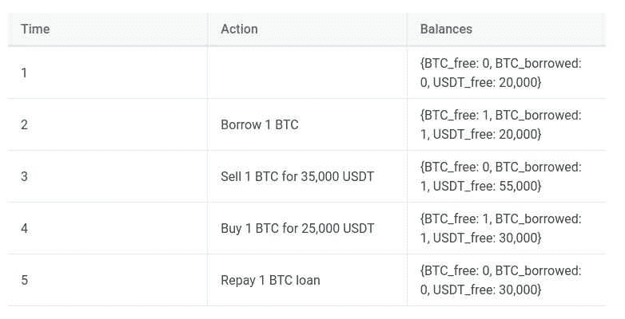
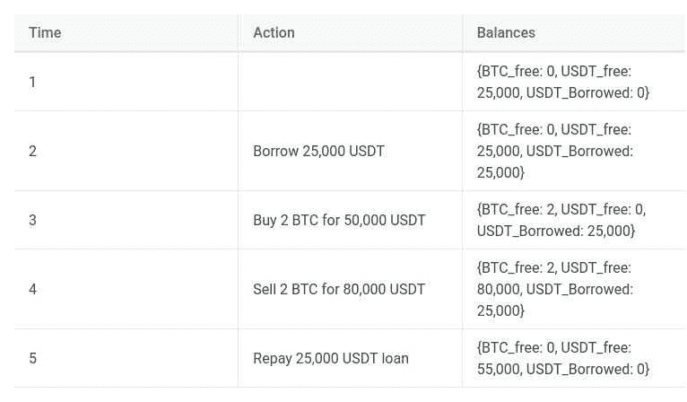
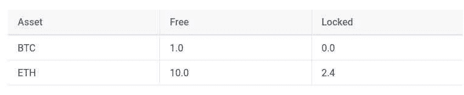
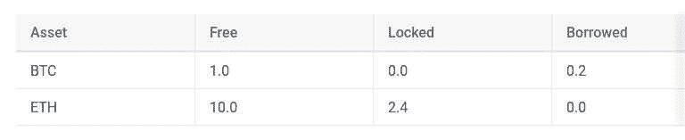

# 加密保证金交易机器人:开始使用 Python

> 原文：<https://www.trality.com/blog/margin-trading-bots/>

保证金交易与现货交易非常相似。在这两种情况下，交易只是一种货币对另一种货币的转换。

与保证金交易的主要区别在于，它为交易者引入了借入货币的能力。在借入货币的同时，还要支付贷款利息。借贷让交易者能够卖空市场，同时承担更多风险。在卖空的情况下，一项资产可以被借入并立即卖出，希望日后价格会更低。当偿还贷款时，利润是借入资产的销售价格和偿还贷款时的价格。

## 使用 Trality 强大的自动化交易工具，立即开始保证金交易

凭借 Trality 独特的保证金交易功能和我们完全灵活的 Python 编辑器，创建者可以制定有利可图的市场中立策略。

[https://www.youtube.com/embed/mSx3GB5VRlg](https://www.youtube.com/embed/mSx3GB5VRlg)

<button type="button" class="chakra-button css-1hnfsz">Try It for Free</button>

我们举个例子。如果交易者坚信 BTC 价格正在上涨，那么他们可以借入 USDT 来购买 BTC。这就是所谓的 [杠杆交易](/blog/leverage-trading-crypto)因为在 BTC 建立比不借贷更大的头寸是可能的。这个杠杆将利润和损失乘以交易者账户余额的百分比，这就是为什么它有风险。

在接下来的文章中，我们将探讨如何通过使用 Python 开始使用加密保证金交易机器人，涵盖的主题包括保证金交易利息和费用、卖空和杠杆交易的示例、保证金比率限制以及清算问题，最后是一些 Python 代码示例(如 OCO、多空 QQE 策略和计算日利息等)。

## **保证金交易机器人用例**

从本质上讲，保证金交易机器人有三个主要的使用案例。

*   卖空:利用资产价格下跌获利的头寸。
*   **杠杆买入**:仅做多策略，但能够承担比不借款时更大的风险。
*   **多头/空头策略**:这些是相对价值策略使用的，即买入一项资产，卖出另一项资产，从相对表现中赚钱。

## **融资融券**

保证金交易可能看起来很复杂，但将保证金交易视为类似于现货交易，并分别理解借贷和偿还加密贷款的过程要简单得多。例如，如果交易者想购买 BNB 的 ETH，但目前没有 BNB，那么他们可以出售另一项资产来购买 BNB，或者借入所需的 BNB。

借入交易者不拥有的加密货币的能力使得卖空成为可能。为了在现货市场上卖出 BTC，交易者需要已经拥有一些。然而，通过保证金交易，BTC 可以被借入，然后在不拥有它的情况下卖出。当 BTC 在日后被回购时，BTC 的贷款和利息可以得到偿还。

## **融资融券交易利息和费用**

借入的货币以同样的货币计息。如果借的是 BTC，利息在 BTC 支付。利息是由交易所计算的，如果你运行的是[币安保证金交易机器人](/blog/create-binance-trading-bot)，利息每小时复利为日利率的 1/24 倍。这些利率可以在[币安保证金利率](https://www.binance.com/en/margin-fee)中找到。

在币安上借入货币的最短时间是 1 小时。同样重要的是要注意，当在保证金下限价单时，货币是在下单时借入的，而不是在成交时借入的。因此，如果订单没有完成，交易的利息仍将被拖欠。

## **卖空的例子**

通过观察卖空过程中的现金流，可以更好地理解利用借贷进行的卖空。




最终，USDT 余额从 2 万 USDT 增长到 3 万 USDT，与 BTC 从 3.5 万 USDT 到 2.5 万 USDT 的价格变化是同一个量级。

## **杠杆交易的例子**

交易员还可以用高达 3 倍的币安交叉保证金杠杆进行交易，这允许交易员购买更多的资产。




最终余额为 55，000 USDT，或从 25，000 USDT 的起始余额中获利 30，000 USDT。在交易过程中，BTC 的价格从 25，000 美元变为 40，000 美元，因此使用 2 倍杠杆可以使利润翻倍。

## **保证金账户余额**

保证金余额类似于即期余额，只是增加了借入金额和所欠利息金额。借入金额是资产借入的总金额，利息是应计利息总额。

### **现货余额示例**




### **保证金余额示例**




### **自由金额**

这是拥有的总额，可用于偿还贷款或购买资产，或分配给限价单。

### **锁定金额**

这是为限价单或止损单保留的自有资产总额，不能用于交易或偿还贷款。当发出限价单时，金额将从自由转为锁定。只能锁定自由资产。

### **借款金额**

这是一项资产的所有贷款总额，只能用自由资产偿还。

### **利息金额**

这是该资产所有贷款的总利息。利息先于贷款本金支付。

## **保证金比率**

利润率的计算方法是资产价值/总负债。总负债是借入的本金和所有欠下的利息。交易所保证这个比例大于 1.1。如果不是这样，那么交易者拥有的资产将被强制出售，负债将被偿还。交易者必须尽一切可能避免平仓。

### **保证金比例限额**

*   **融资融券交易限额**:这是最低的保证金比例，在该比例下不允许再进行借贷。
*   **保证金追缴限额**:这是一个保证金比率，如果贷款没有偿还或增加了更多的抵押品，交易者将被通知其账户面临清算风险。
*   **平仓限额**:低于该保证金比例，账户内的资产将被自动卖出，并支付利息和借款金额。

## **清算**

如果保证金比率降至 1.1 以下，就会进行清算。这是一个由交易所完成的自动过程，在该过程中，出售资产以增加保证金比率。贷款从销售收入中偿还，交易所也收取费用。在币安，清算费用是出售资产价值的 2%。需要注意的是，与交易无关的资产可能会被出售以偿还借入的货币。如果交易者拥有 BTC，并且对月神有 3 倍的杠杆多头，那么如果月神归零，一些 BTC 就会被卖出。

## **与保证金交易相关的风险**

了解[与保证金交易](/blog/margin-trading)相关的风险很重要，其中主要有两种类型:**做空风险**和**杠杆风险**。

### **保证金交易和做空风险**

做空的风险在于，资产价格会不停地上涨。在购买资产的情况下，价格只能到 0。如果价格上涨，没有限制。当损失超过账户中抵押品的价值时，卖空交易将被平仓。结果，头寸将被清算，卖空资产的贷款将得到偿还。

### **保证金交易和杠杆风险**

如果交易者已经借款购买资产，那么保证金账户可能在资产价格达到零之前被清算。在杠杆为 2 倍的情况下，如果资产价值下跌约 50%，那么账户将被清算。币安交叉保证金的最大杠杆是 3 倍。如果一个头寸的杠杆比率是 3 倍，那么这个账户只需要下跌 33%就可以被平仓。

## **贷款和还款刷新**

贷款发放后，不会立即执行。它们类似于订单，因为它们是可能失败的请求，例如，如果所请求的贷款或还款违反了保证金比率或可用余额。保证金借入偿还逻辑返回一个贷款或偿还对象，该对象可以存储在状态中并在以后被刷新和查询。

```py
state.loan = margin_borrow("BTC", 0.01)

if state.loan is not None:
   state.loan.refresh()
   print(state.loan)
```

```py
state.repayment = margin_repay("BTC", 0.01)

if state.repayment is not None:
   state.repayment.refresh()
   print(state.repayment)
```

在创建贷款或还款后的下一次执行时，状态将从“待定”变为“已确认”或“失败”。

## **您的保证金交易机器人的 Python 代码示例**

现在让我们来看看几个具体的编码示例，您可以将它们用于您的 margin bot。

### **一个取消另一个(OCO)**

```py
from enum import Enum

class Mode(Enum):
    Buy = 1
    Sell = 2

@enable_margin_trading()
def initialize(state):
    state.order = None
    state.tp_order = None
    state.sl_order = None

    state.mode = Mode.Buy

def has_position(data):
    free = query_balance_free(data.base)
    locked = query_balance_locked(data.base)
    borrowed = query_balance_borrowed(data.base)
    interest = query_balance_interest(data.base)

    # calculate risk exposure
    exposure = free+locked-borrowed-interest

    price = Decimal(f"{data.close[-1]}")
    limit = symbol_limits(data.symbol)
    has_exposure = abs(exposure) * price > Decimal(limit.costMin)
    has_liabilities = (borrowed+interest) * price > Decimal(limit.costMin)

    return has_exposure or has_liabilities

@schedule(interval="1h", symbol="BTCBUSD")
def handler(state, data):

    has_pos = has_position(data)
    if not has_pos:

        free = query_balance_free(data.base)
        borrowed = query_balance_borrowed(data.base)
        interest = query_balance_interest(data.base)
        if (borrowed + interest) > 0 and free > (borrowed + interest):
            # clean up any residual borrowed amount by repaying loans
            print(f"repaying {data.base} borrowed {borrowed} interest: {interest}")
            margin_repay(data.base, borrowed + interest)
        elif state.mode == Mode.Buy:
            state.mode = Mode.Sell
            # buy margin order with borrowing
            value = float(query_portfolio_value()) * 1.1
            state.order = margin_order_market_value(symbol = data.symbol, value = value, side_effect = OrderMarginSideEffect.AutoDetermine)

            with OrderScope.one_cancels_others():
                # adjust for fees since purchase amount will be smaller
                order_qty = subtract_order_fees(state.order.quantity)
                tp_price = data.close[-1] * 1.01
                sl_price = data.close[-1] / 1.01

                # exit orders should repay.
                print("long stops", state.order.quantity, order_qty)
                state.tp_order = margin_order_iftouched_market_amount(symbol = data.symbol, amount = -order_qty, stop_price=tp_price,
                                                    side_effect = OrderMarginSideEffect.Repay)
                state.sl_order = margin_order_iftouched_market_amount(symbol = data.symbol, amount = -order_qty, stop_price=sl_price,
                                                    side_effect = OrderMarginSideEffect.Repay)

        elif state.mode == Mode.Sell:
            state.mode = Mode.Buy
            # sell short with borrowing
            value = float(query_portfolio_value()) * -0.5
            state.order = margin_order_market_value(symbol = data.symbol, value = value, side_effect = OrderMarginSideEffect.AutoDetermine)

            with OrderScope.one_cancels_others():
                # fees of sale are paid in quoted so no adjustment for fees is needed
                order_qty = state.order.quantity
                tp_price = data.close[-1] / 1.01   # take profit is below price
                sl_price = data.close[-1] * 1.01   # stop loss is above current price

                # exit orders should repay.
                # exit orders should be buys to close
                # note: this will leave dust when the position is closed due to accumulated interest
                print("short stops", state.order.quantity, order_qty)
                state.tp_order = margin_order_iftouched_market_amount(symbol = data.symbol, amount = order_qty, stop_price=tp_price,
                                                    side_effect = OrderMarginSideEffect.Repay)
                state.sl_order = margin_order_iftouched_market_amount(symbol = data.symbol, amount = order_qty, stop_price=sl_price,
                                                    side_effect = OrderMarginSideEffect.Repay)
```

### **卖空**

```py
@enable_margin_trading()
def initialize(state):
    pass

@schedule(interval="1d", symbol="BTCUSDT")
def handler(state, data):
    print(query_balances())
    pos = query_open_position_by_symbol(data.symbol, include_dust=False)

    macd = data.macd(12,26, 9)

    if pos is None :
        if macd["macd_histogram"][-1] < 0:
            # short btc
            # since the btc free balance is 0 the btc will be borrowed first and then sold
            margin_order_market_amount(symbol = data.symbol, amount = -0.01,  side_effect = OrderMarginSideEffect.AutoDetermine)
    else:
        # close position by repaying loan
        if macd["macd_histogram"][-1] > 0:
            amount = float(query_balance_borrowed(data.base) + query_balance_interest(data.base))
            amount *= 1.01  # adjust for order fees

            margin_order_market_amount(symbol = data.symbol, amount = amount,  side_effect = OrderMarginSideEffect.AutoDetermine)
```

### **利用杠杆买入**

```py
@enable_margin_trading()
def initialize(state):
    pass

@schedule(interval="1d", symbol="BTCUSDT")
def handler(state, data):
    print(query_balances())
    pos = query_open_position_by_symbol(data.symbol, include_dust=False)

    macd = data.macd(12,26, 9)

    if pos is None :
        if macd["macd_histogram"][-1] > 0:
            amount = 2.0 * float(query_balance_free("USDT")) /data.close[-1]
            # leverage long btc
            # since the usdt free balance is not enoug the extra usdt will be borrowed first
            buy_order = margin_order_market_amount(symbol = data.symbol, amount = amount,  side_effect = OrderMarginSideEffect.AutoDetermine)
            print("buy order side effect", buy_order.margin_side_effect)
    else:
        # close position by repaying loan
        if macd["macd_histogram"][-1] < 0:
            amount = -float(query_balance_free(data.base))

            sell_order = margin_order_market_amount(symbol = data.symbol, amount = amount,  side_effect = OrderMarginSideEffect.AutoDetermine)
            print("sell order side effect", sell_order.margin_side_effect)
```

### **多空 QQE 策略**

```py
TRADE_SIZE = 500
MIN_TRADE_SIZE = 50

@enable_margin_trading()
def initialize(state):
    state.buy_order = None
    state.sell_order = None

@schedule(interval="1d", symbol="BTCUSDT", window_size=200)
def handler(state, data):
    portfolio = query_portfolio()
    pos = query_open_position_by_symbol(data.symbol)

    # use qqe indicator as the trend
    trend = -1 if data.qqe(21, 5, 4.2)["trend"][-1]  < 0 else +1

    exposure = 0.0 if pos is None else float(pos.exposure)

    # plot data
    plot_line("leverage", query_position_weight(data.symbol), data.symbol)
    plot_line("exposure", exposure, data.symbol)
    plot_line("value", portfolio.portfolio_value, data.symbol)

    if trend > 0:
        target_pos = TRADE_SIZE / data.close[-1]
        trade_size = target_pos - exposure

        # check trade size is large enough to be accepted by the exchange
        if trade_size * data.close[-1] > +MIN_TRADE_SIZE :
            print(f"buying {trade_size:.5f} {data.base}")
            state.buy_order = margin_order_market_amount(symbol = "BTCUSDT", amount = trade_size,
                                                    side_effect = OrderMarginSideEffect.AutoDetermine)

    if trend < 0:
        target_pos = -TRADE_SIZE / data.close[-1]
        trade_size = target_pos - exposure

        # check trade is size is large enough to be accepted by the exchange
        if trade_size * data.close[-1] < -MIN_TRADE_SIZE :
            print(f"selling {trade_size:.5f} {data.base}")
            state.sell_order = margin_order_market_amount(symbol = "BTCUSDT", amount = trade_size,
                                                    side_effect = OrderMarginSideEffect.AutoDetermine)
```

### **计算每日利息成本**

```py
@enable_margin_trading()
def initialize(state):
    state.run = 0

@schedule(interval="1d", symbol="BTCUSDT")
def handler(state, data):
    if state.run == 0:
        margin_borrow("BTC", 500/data.close[-1])
        margin_borrow("USDT", 500)

    print(f"margin_level {query_margin_ratio():.3f}")

    btc_debt = query_balance_borrowed(data.base) + query_balance_interest(data.base)
    base_borrow_cost = btc_debt * query_margin_daily_interest_rate(data.base) * Decimal(f"{data.close[-1]}")
    print(f"{data.base} {btc_debt} debt daily borrow cost is {base_borrow_cost:.2f} {data.quoted}")

    usdt_debt = query_balance_borrowed(data.quoted) + query_balance_interest(data.quoted)
    quoted_borrow_cost = usdt_debt * query_margin_daily_interest_rate(data.quoted)
    print(f"{data.quoted} {usdt_debt} debt daily borrow cost  {quoted_borrow_cost:.2f} {data.quoted}")

    state.run += 1
```

## **关于融资融券机器人的最终想法**

显然，在这个问题上还有很多要说的，但上面的指南是为了通过使用 Python 作为保证金交易机器人入门的信息介绍。

## 想用 Python 创建自己的交易算法吗？

查看 Trality 的 Python Bot 代码编辑器——这是一个强大的基于浏览器的工具，专为希望使用算法交易机器人进行构建、回溯测试、优化和实时交易的交易者而设计。我们提供私人交易中最高水平的灵活性和复杂性。事实上，这是我们在 Trality 的核心工作。

[https://www.youtube.com/embed/tOBKjEaufmk](https://www.youtube.com/embed/tOBKjEaufmk)

<button type="button" class="chakra-button css-1hnfsz">Try It for Free</button>

一旦你对你的保证金机器人满意了，下一步就是把它和最好的加密保证金交易平台联系起来。就集中交易所的交易而言，[币安交易机器人](/blog/create-binance-trading-bot)可能会为更广泛的交易者提供最好的好处，但如果你决定走这条路，也有很好的分散交易所可供选择。

在 Trality 总部，我们不断改进和优化我们的平台工具，以满足我们用户的需求。如果您希望看到任何特定的代码实例，请务必联系我们！