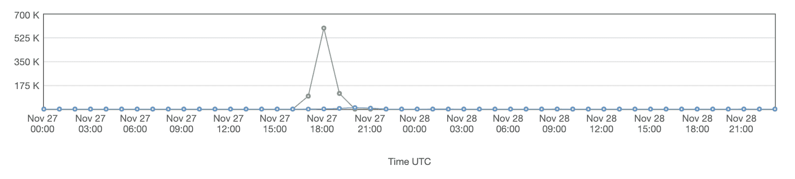

# 2020 年 11 月 27 日城市停电

> 原文：<https://www.trality.com/blog/outage-27-11-20/>

2020 年 11 月 27 日，我们的平台被一个 bot 网络攻击，导致在很短的时间内发送了超过 70 万个请求。

所有请求都指向我们的 OAuth 2.0 身份验证服务的`/auth/token`端点，攻击者试图使用我们认为是从密码泄露中收集的用户名和密码进行登录。我们的团队设法非常快速地做出响应，并将身份验证端点离线作为安全预防措施，以便我们有更多的时间来深入分析传入流量的模式。因此，在我们控制住攻击之前，用户有大约 5 个小时无法访问我们的平台，但是用户数据没有受到影响或泄露。我们写这篇博文是因为透明度和与我们社区的清晰沟通是 Trality 的核心价值观，我们希望我们的用户知道我们如何不断改进我们的系统，以便我们在未来能够更高效、更快速地处理此类事件。

## 详细的时间表

所有时间都是 GMT+1。

*   2020-11-27 17:00 -我们看到对我们平台的请求数量出现了强劲的峰值
*   第一响应小组分析交通状况并开始调查
*   2020-11-27 17:30 -作为一项安全预防措施，身份验证服务离线，因为请求仅指向该端点
*   2020-11-27 18:30 -  [Cloudfront](https://aws.amazon.com/cloudfront/) 和 [WAF](https://aws.amazon.com/waf) 配置得到改进，以更好地了解流量模式。正在尝试阻塞(例如，速率限制大幅降低)
*   2020-11-27 19:30 -瑞典作为一个国家被阻止，因为所有的请求都来自那里，这只是一个临时的解决方案，因为攻击者可以很快地切换到不同的国家

Number of requests to our system during the attack, Green are requests from Sweden

*   更严格的规则应用于我们根据请求看到的特定模式，我们现在设法阻止了大多数请求
*   WAF 规则现在可以成功阻止攻击者的所有请求
*   2020-11-27 23:30 -第一波攻击停止，身份认证端点上线，团队正在测试常规流量是否受到影响
*   服务重新上线
*   2020-11-28 01:00 -秒攻击波开始， [WAF](https://aws.amazon.com/waf) 规则仍在，阻挡攻击者的所有请求
*   2020-11-28 01:15 秒攻击波停止

### 内部影响

由于我们的登录系统，我们的内部系统受到了攻击的短暂影响。

考虑到大量的请求，我们的集中式日志记录系统达到了 100%的 CPU 利用率，这反过来导致一些试图报告指标和日志的服务超时。即使在我们禁止公众访问我们的平台之后，该团队也不得不发布了许多补丁来让内部系统再次运行。

### 外部影响

在攻击期间，我们的服务大约有 5 个小时无法到达。**用户数据没有受到影响，因为我们只存储哈希密码，而且 exchange 凭据的存储方式是，一旦存储，无论是用户本人还是我们管理员都无法访问。**我们建议用户使用 https://haveibeenpwned.com/的[来检查他们的电子邮件地址是否是另一个系统漏洞的一部分，如果他们发现自己的电子邮件有漏洞，就修改密码。](https://haveibeenpwned.com/)

## 做出的改进

我们从这次事件中最大的收获是，我们没有足够严格地配置我们的公共端点。我们有非常大的速率限制，我们的用户永远不会达到，因此使攻击者能够利用这个角度发送大量的请求，我们看到从一个大的 IP 池。我们也在直接与 AWS 沟通，以制定更强、更好的规则，更好地缓解未来的类似问题。另一个重要的教训是，我们需要改进我们内部服务的隔离，例如，我们的整个 bot 系统，这样公共端点就不会对我们运行的内部关键服务产生间接影响。我们目前正在努力将这两个子系统完全分开。我们还计划很快使用 MFA 等改进身份验证措施。

## 结论

我们仍然是我们公司的一个小团队，我们以前从未经历过这样的攻击。尽管我们的团队反应迅速，但攻击期间的时间对所有相关人员来说都是痛苦的，因为我们知道我们的客户受到了影响。我们很抱歉在攻击发生时给我们的客户造成了干扰。

我们正在改进我们的系统，以便能够以更好的方式处理这样的攻击，我们正在制定一个关于如何处理这些事情的公司内部协议，并改善与客户的沟通，因为我们真的希望我们系统的每个方面都完全透明。