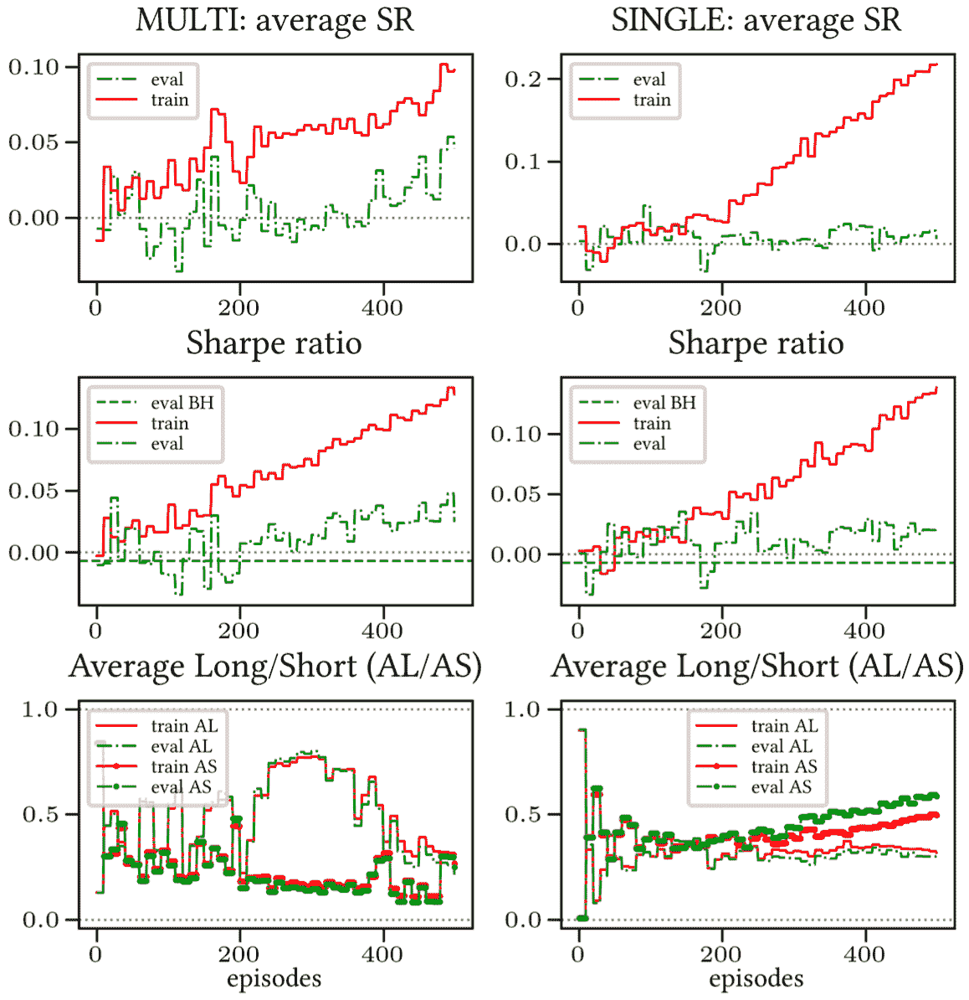
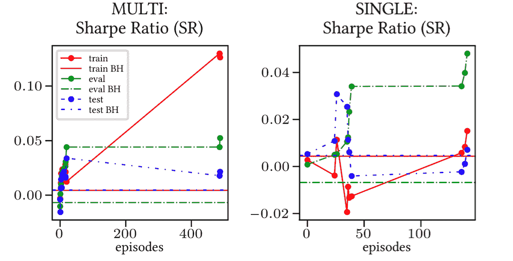
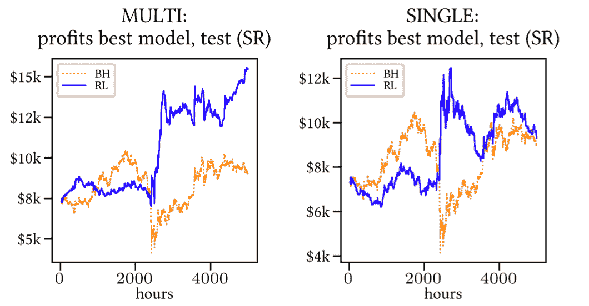

# 关于“火”:Trality 的新金融强化学习资源库

> 原文：<https://www.trality.com/blog/reinforcement-learning/>

### **上一集…**

在我们的 [初始篇](/blog/reinforcement-learning-a-dynamic-way-of-thinking)关于这个主题，我们阐述了所谓的 *[强化学习](https://web.stanford.edu/class/psych209/Readings/SuttonBartoIPRLBook2ndEd.pdf)* (RL)范式的基础知识，并且我们暗示了拥抱这样一个范式可能对我们的金融科技公司产生的影响。我们提出的要点(以模拟面试的形式列出)总结如下。

1.  *RL*是什么？RL 是机器学习的一个子集，它致力于研究动态、多步骤决策过程中固有的问题。目标是让机器学会基于当前环境状态采取适当的行动，以便最大化累积收益(根据预先指定的奖励机制来衡量)。
2.  ***RL 只是一个东西吗？*** 完全不是。根据具体情况，人们可以在从彻底的环境探索技术(即 [*评论家*为基础的方法](https://gtagency.github.io/2016/critic-only-rl))到直接决策训练方案(即 [*代理*为基础的方法](https://ieeexplore.ieee.org/abstract/document/618952))的广泛范围内挑选最合适的 RL 下降(通常称为 *RL 代理*)。
3.  *你能想到的 RL 最简单的应用有哪些*？多步游戏，如 [Atari 2600](https://www.cs.toronto.edu/~vmnih/docs/dqn.pdf) ，是理想的候选者，因为它们在设计上符合 RL 框架。但是，对我们来说至关重要的是，金融应用也是很好的候选对象(见下一点)。
4.  **Trality 和 RL 怎么了？** 根据定义，交易机器人(trading bot)是一种自动规则，它会考虑金融市场在给定时间的状态，并(代表投资者)采取行动，以便最大化给定的回报机制。因此，机器人的概念化完全可以在 RL 框架中完成！由于我们的核心任务是将我们的用户置于能够创建、部署和分享成功的交易机器人的最佳位置，我们相信提供全面的 RL 工具将对我们的用户有利，因为这将——打个比喻——在他们的袖子上添加一些更有用的技巧。

## **引火**

根据上文第 4 点中总结的愿景，我们一直在开发自己的开源存储库，致力于包括现有的(并构建新的)股票和加密货币交易的强化学习工具。和...这是:

> [https://github.com/trality/fire](https://github.com/trality/fire)

我们承诺的核心特性是可解释性、极其直观的 UI、模块化的代码结构和可访问的可再现性。

目前，我们的知识库中可用的工具与一个[仅限评论家的深度 Q 学习 RL 代理相关联，该代理具有针对单奖励和](https://towardsdatascience.com/deep-q-learning-tutorial-mindqn-2a4c855abffc#:~:text=Critically%2C%20Deep%20Q%2DLearning%20replaces,process%20uses%202%20neural%20networks.)[多奖励学习的事后经验回放](https://arxiv.org/abs/1809.06364)和泛化(现在不需要掌握一切；下面有更多关于这个的内容)。

我们的计划是不断扩展 [FiRe](https://github.com/trality/fire) 库(通过 Trality 以及更广泛的社区)。从长远来看，我们希望 [FiRe](https://github.com/trality/fire) 将成为一个可靠的参考，一个机器人创建者可以用来舒适可靠地构建他们的机器人的参考。

### **这首曲子是关于什么的**

很简单:

> 我们提供了导航我们的 [FiRe](https://github.com/trality/fire) 库的结构以及使用其中的现有工具所需的最少的必要上下文。

### **关于当前实施的 RL 代理的“速成班”**

我们当前的 RL 智能体是一个[仅限评论家的深度 Q 学习智能体，具有后见之明的经验回放](https://towardsdatascience.com/deep-q-learning-tutorial-mindqn-2a4c855abffc#:~:text=Critically%2C%20Deep%20Q%2DLearning%20replaces,process%20uses%202%20neural%20networks.)，用于单奖励和[多奖励学习以及泛化](https://arxiv.org/abs/1809.06364)。尽管完整的代理描述超出了本文的范围，但我们还是将基本组件放在了一起。

1.  *代理后是什么？*代理人寻求最大化其在探索给定的单一资产金融环境中可以收集的累积报酬。
2.  *单一奖励与多重奖励。*代理可以接受一种或多种奖励机制的培训。一般来说，代理被馈送一个权重向量，通过该权重向量来计算个人奖励。
3.  代理是由什么制成的？在其他事情中，我们的代理包括一个神经网络，该网络将环境的当前状态映射到算法可以通过以下方式实现的所有“估计”累积回报:I)将*任何*给定的可接受的行动作为下一步行动，以及 ii)此后以最佳可能的方式操作。第一点是术语“仅限批评家*”*所指的。
4.  *代理是如何培训的？*代理在所谓的后见之明体验重放中不断存储“过去的事件”。每当训练发生时，代理的神经网络就通过[贝尔曼方程](https://towardsdatascience.com/the-bellman-equation-59258a0d3fa7)进行更新，进而对来自事后经验回放的随机抽样批次进行操作。这里没有给出关于[贝尔曼方程](https://towardsdatascience.com/the-bellman-equation-59258a0d3fa7)更新的具体细节，因为这不是讨论的要点。
5.  *代理的培训持续多长时间？*代理在环境中运行几次，或者几集(以一种类似于耗尽几轮视频游戏的方式)。
6.  *后见之明体验回放具体是由什么构成的？代理以元组的形式记忆所有过去的经历*

```py
tuple = [
		starting environment state,
		action taken,
       		next environment state visited,
      	 	weights for the reward vector,
      	 	scalar reward obtained by weighting the reward vector]
```

## **用火入门**

*克隆。*通过运行以下命令，可以从 GitHub 克隆出 [FiRe](https://github.com/trality/fire) 库

```py
$ git clone https://github.com/trality/fire.git
```

*切换到[火灾](https://github.com/trality/fire)目录*。简单地跑

```py
$ cd fire
```

检查您的 python 版本。你需要 python 3.8.10。您可以通过输入以下命令来检查您当前的 python 版本

```py
$ python3 --version
```

*激活虚拟环境。一旦我们克隆了[之火](https://github.com/trality/fire)，我们建议建立一个虚拟环境。这可以通过运行*

```py
$ python3 -m venv .venv
$ source .venv/bin/activate
```

在存储库的主文件夹中。

*完成设置。*您可以安装所有相关的软件包，并下载我们在一些模拟中使用的完全相同的 BTCUSD-hour 数据集，方法是运行

```py
$ make 
```

## **从开始到结束:带你完成一个实验**

建立一个实验。现在我们已经安装了存储库，并且简单地了解了 RL 代理的工作，我们可以通过一个完整的虚拟实验来验证代码的更多具体方面。

在指定所选择的数据集、代理神经网络的超参数、所选择的奖励以及所有相关的深度 Q 学习参数之后，创建一个实验。这些信息是在一个. json 文件中指定的，该文件类似于

```py
{
    "dataset": {
        "path": "datasets/crypto_datasets/btc_h.csv",
        # ...
        # addition fields
        # ...
    },

    "model": {
        "epochs_for_Q_Learning_fit": "auto",
        "batch_size_for_learning": 2048,
        # ...
        # additional fields
        # ...
    },

    "rewards": ["LR", "SR", "ALR", "POWC"],

    "window_size": 24,
    "frequency_q_learning": 1000,
    "Q_learning_iterations": 500,
    "discount_factor_Q_learning": 0.9,
    # ...
    # additional fields
    # ...
}
```

中的所有字段。json 在 [FiRe](https://github.com/trality/fire) 资源库中有详尽的解释。仅举几个:“路径”表示选择的数据集；“Q_learning_iterations”是集数；“奖励”包含所有考虑的奖励。到目前为止，我们使用的方法(都出现在上面)有

1.  “LR”(last return):不言自明！
2.  “SR”(sharpe ratio):在固定长度的回看上计算。
3.  “ALR”(AverageLastReturn):相同回看中 LR 的平均值。
4.  “POWC”(ProfitOnlyWhenClosingPosition):仅在多头/空头头寸平仓时给出反馈。

*运行实验。*一旦 example.json 文件准备就绪，只需运行

```py
$ python3 main.py example.json 
```

开始实验。

实验的输出。除了保存整个执行过程中所有智能体的特征(特别是智能体的神经网络)，产生总结智能体表现的相关图。

第一种类型的图显示了随着情节的进展，代理在训练/评估集上获得的给定累积奖励，见图 1。




Figure 1\. Cumulative Sharpe-Ratio (SR) reward and percentage of occupancy of Long and Short positions for both multi- and single-reward simulations (on train and evaluation sets). The Buy-and-Hold performance is included for comparison purposes


第二种类型的图显示，对于任何给定的情节，基于对该情节设置的评估的最佳执行模型的夏普比率。这些图在多奖励和单奖励模拟的比较中被用作具有统计意义的指标。参见图 2。




Figure 2: SR performance for train/evaluation/test set based on most recent, best performing model on the evaluation set. Again, the Buy-and-Hold performance is included for comparison purposes


第三种类型的图显示了与上述评估集上的最佳表现模型相关联的总利润(在测试集上)。参见图 3。




Figure 3\. Overall profits for both the RL agent and the Buy-and-Hold strategy


## **回答您的问题**

如果您对我们的知识库(或 RL)不熟悉，我们理解您可能会有很多问题！为了提供尽可能清晰的说明，我们设身处地为您着想，提出了最重要的问题(在我们看来)，如下所列。如果您的一些问题没有列出，请随时通过 [Discord](https://discord.com/login?redirect_to=%2Fchannels%2F811696600661098507) 与我们联系。

1.  未来会包括多资产 RL 交易吗？是的，肯定的。
2.  基于演员和演员/评论家的代理在未来会被包括进来吗？是的，肯定的。*T3】*
3.  我可以用我自己的单一资产数据集来测试你的 RL 代码吗？当然，您需要将数据集加载为. csv 文件。
4.  我能积极地为存储库做贡献吗？是的！我们期待您的 PRs！
5.  你对代码效率采取了什么措施？我们依赖于几项措施，包括:I)对模型神经网络中每个可能代理的行为进行矢量化评估(这是可能的，因为状态和行为空间很小),以及 ii)使用训练集的随机抽样部分。

## **接下来的里程碑**

Trality 的所有人都致力于建立一个知识库的基础，我们希望看到它成长并最终成为一个强大而统一的 RL 库，以造福于我们的 bot 创作者。

与此同时，我们还认为，允许对该知识库的开放访问对于让金融和数据科学社区的成员有机会工作、改进和丰富其中的 RL 工具至关重要。我们迫不及待地想看看社区对这一事业有什么贡献！

在这一长期努力中，我们相信我们最接近的里程碑(将在未来 6 个月内合理实现)如下:

*   整合多资产交易的 RL 工具；
*   包括基于演员和混合演员/评论家的 RL 代理。

* * *

*确认来源。* *我们代码中一些精选的特性从两个开源库获得灵感:一个是 [gym-anytrading stocks 环境](https://github.com/AminHP/gym-anytrading)，另一个是 [minimal Deep Q-Learning 实现](https://github.com/mswang12/minDQN)。*

* * *

*我们希望你喜欢阅读这篇文章，我们也希望你能参与对[火灾](https://github.com/trality/fire)回购的开源贡献。我们期待着回答您可能有的问题。*

请继续关注我们的下一篇 RL 博客！