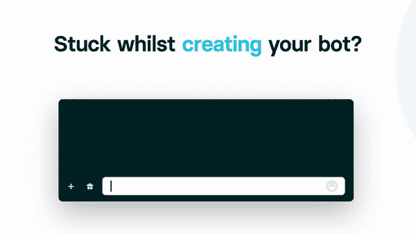

# 什么是 Trality 的社区大使计划？

> 原文：<https://www.trality.com/blog/what-is-tralitys-community-ambassador-program/>

每个伟大的产品背后都有一个伟大的社区。社区的存在是为了确保产品的健康发展，并确保使用该产品的人得到他们所需要的帮助来充分利用它。

 [旅游社区](http://discord.gg/trality)也不例外。或许是吧。🤔

你看，我们不仅理解一个参与和快乐的社区的价值。我们知道，我们的社区是我们产品的生命线，没有所有聪明的创作者与我们合作，就没有 Trality。

但是，拥有一个由全球数千名最热情、最积极的自动交易者组成的社区，并确保一切都井然有序，才是...至少可以说是困难的。为此，我们启动了 CAP(社区大使计划)。

## 为什么我们需要社区大使计划？

每个人都需要帮助，一般人很难接触到自动交易的世界。这是一项很难掌握的技术，至少可以说技术壁垒令人生畏。

我们明白，为了完成将这一强大技术带给每一个人的使命，我们必须提供一个积极、有益和友好的环境，在教育第一的环境中耐心地接纳新用户。这就是我们启动旅游大使计划的原因。

## 怎样才能成为一名城市大使？

> “Trality 大使是一名活跃且乐于助人的社区成员，他们帮助我们为新用户创造一个友好的教育环境，并帮助我们为每个喜欢该产品的人做出正确的决定。”

城市大使计划奖励最积极、最乐于助人的社区成员，给他们一份津贴清单，以回报他们的帮助。一些日常活动包括:

*   收集最有价值的反馈并传递给我们，这样我们就能真正知道社区下一步需要什么来创造最好的机器人
*   尽你所能帮助他人:如果你认为你能帮助经验较少的人，那就请帮助他们，我们的产品有很高的技术壁垒，但人们想尝试一下，所以如果你能让它不那么令人生畏，那就去做吧！
*   管理社区，这仅仅意味着提防违规者，确保人们在正确的渠道发帖或禁止捣乱者
*   留意潜在的新大使，越多越好！

## 大使们得到了什么回报？

作为回报，我们将为您提供一系列福利，包括:

*   只要你是✅大使，你就可以选择免费旅游套餐
*   大使身份(主持人权利)和访问 Trality 大使不和谐频道，在那里您可以直接与其他大使和 Trality 团队聊天👨‍💼
*   最高优先级的支持，因为我们知道如果您的问题得到快速解决，那么您将能够在未来的🧙中更好地帮助其他用户
*   你自己的 Trality merch👕

## 如何联系我们的大使？

联系我们的大使是如此简单！只需[加入 Trality 社区](https://discord.com/invite/trality)并在相关频道的@ambassadors 消息中标记他们。

## 我想成为一名城市社区大使！

…这太棒了！我们感谢大家的热情，但是目前我们有足够的大使。在我们的市场推出后，我们将需要更多，因此，我们将在 2022 年初开放更多大使的申请！注意这个空间。