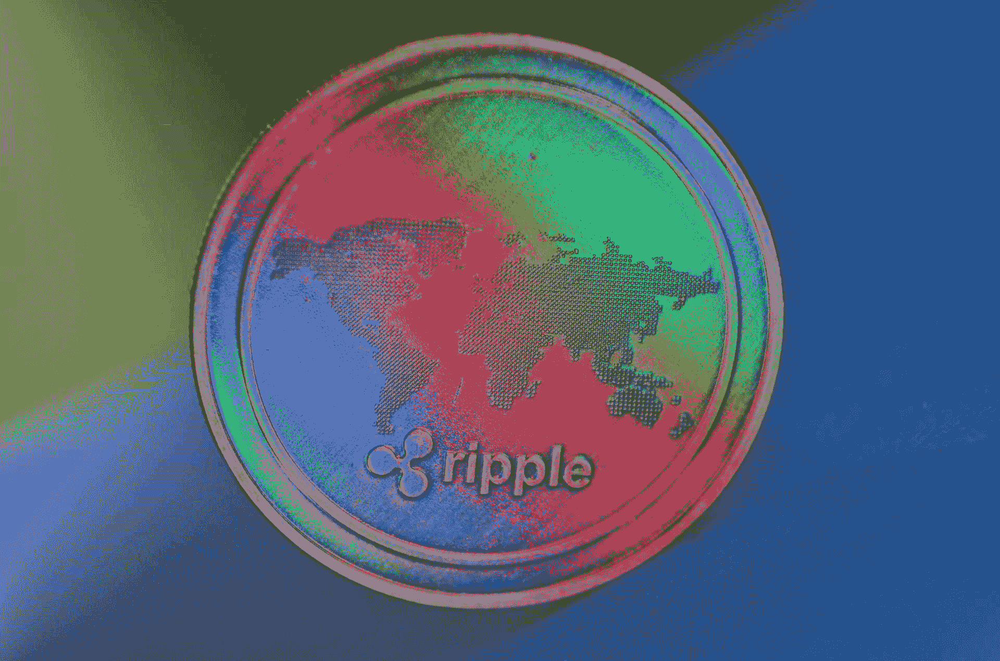

# 2022-2025 年 XRP 价格预测

> 原文：<https://www.trality.com/blog/xrp-price-prediction/>

XRP 仍然是世界上最被低估的加密资产之一。

虽然 XRP 在加密领域一直位居第三，仅次于以太坊(stablecoins 除外)，但随着市场在过去两年中的复苏，它一直未能利用投资者对加密的兴趣。

## 想在 XRP 投资吗？

查看 Trality Rule Builder，这是一个最先进的工具，允许你创建自己的加密交易机器人，而无需编写任何代码。

[https://www.youtube.com/embed/ugtCnc-wW7s](https://www.youtube.com/embed/ugtCnc-wW7s)

<button type="button" class="chakra-button css-1hnfsz">Try the Rule Builder for free!</button>

虽然 XRP 提供的功能在加密市场上是独一无二的，但在 0.30 美元以上似乎有很大的抛售压力。很难解释这一点，但是 Ripple 使用了一种非传统的平台模型，这可能对许多现有的加密投资者没有吸引力。

An accurate XRP price predication requires a 360-degree analysis.

## 简而言之 XRP

XRP 是一种支付令牌，由 Ripple Labs 开发，用于其分散支付系统。虽然该公司一开始使用的是区块链的系统，但 XRP 使用的是一个验证节点网络，而不是区块链。

Ripple 网络不仅仅可以用于发送 XRP，尽管令牌的供应有限，但它并不像比特币或以太坊那样被挖掘。就速度和成本而言，这是一个优势，但它可能不会吸引比特币纯粹主义者。

## XRP 的价格在过去表现如何？

不管它们的市值如何，XRP 的价格一直落后于许多代币的表现。在 XRP 于 2018 年初首次向公众推出后不久，股价上涨至 3.40 美元，但它未能参与比特币和以太坊在加密市场复苏时享受的价格上涨。

虽然 XRP 的价格已经从 0.15 美元以下的熊市低点反弹，但随着其他令牌收复更多失地，该令牌一直难以在有意义的基础上超越 0.30 美元的水平。尽管 Ripple 的平台确实允许一些 DeFi 应用，但 XRP 作为 DeFi 的象征已被完全忽略，在 2020 年大幅升值的物质方面提供的东西要少得多。

XRP 的价格似乎确实与加密市场的其他价格一致，当比特币波动时，以周或月为基础衡量，XRP 似乎也在朝同一方向波动。这种代币对加密市场没有什么预测价值，XRP 的价格行为似乎受到整体市场流动性和方向的驱动。

XRP 市场存在的“屋顶”很难从根本上解释。从技术角度来看，很容易看到这种市场动态，但鉴于 Ripple 在过去一年中取得的进展，这种销售水平显然是一种技术考虑。

## 什么因素影响 XRP 的价格

新闻流量和公司业绩对 XRP 股价的影响似乎非常有限。对 XRP 价格影响最大的似乎是整体加密市场情绪以及金融市场流动性状况。

这方面的一个例子是 Ripple 决定引入一个 [商业 XRP 贷款](https://ripple.com/insights/fund-instant-cross-border-payments-with-a-line-of-credit-from-ripplenet/)计划，帮助使用该平台的公司通过 XRP 贷款扩大贸易融资业务。市场上很少有其他类似的报价，但这一消息并没有显著影响 XRPs 的价格。

事实上，很难在 XRP 的新闻流量和价格之间找到任何关联，不管这些新闻是正面还是负面的。

涟漪交易者似乎对加密市场的整体方向更感兴趣。**比特币**价格引领 XRP 走势，尽管 XRP 似乎面临长期抛售压力，因为一年多来，除了少数例外，比特币一直在 0.30 美元以下交易。

## 2022-2025 年 XRP 价格预测

鉴于 Ripple 已经建立了全球业务，并且银行已经与该平台合作多年，XRP 进一步发展的前景是好的。持续的 Ripple/XRP 支持可能导致的价格变动是一个更加微妙的问题。

很有可能，至少在 2025 年之前，加密市场情绪将保持积极，这显然有助于 XRP 价格。进入加密领域的新用户可能不在乎 XRP 不像比特币那样分散，用户也可能喜欢 XRP 的交易速度极快。

尽管处于早期阶段，Ripple 创建的商业融资平台也可能是一个巨大的价格驱动因素，因为全球跨境现金流非常庞大。该公司专门为这个融资平台提供了 XRP 代币，这为良性循环创造了潜力，从而导致价格进一步升值。

从技术角度来看，0.30 美元的水平仍然非常重要，因为任何有意义的突破都可能导致价格快速上涨。鉴于 XRP 价格在过去 18 个月里已经多次探底，没有什么证据支持熊市。

不难看出，XRP 价格已经在长期图表上创造了三重底部，最低点在 2020 年 3 月，创造了教科书般的反向头肩底模式。

突破 0.30 美元将确认这一超级牛市模式，这将表明 XRP 的长期牛市。由于该模式的规模，它可能预示着未来许多年的 XRP 牛市，但迄今为止，XRP 价格仍低于 0.30 美元的关键水平。

如果商业贷款活动导致 XRP 价格上涨，从法定利率的角度来看，Ripple 将有更多资金用于放贷。这些较高的代币价格可能会鼓励借款人或其他投资者购买或持有代币，这进一步有助于 XRP 价格，因为它们不会在资本需求得到满足后立即出售。

XRP 也可以被下注，这可能会吸引商业利益，当他们不使用 XRP 进行贸易结算时，可以分割他们的并从中赚取利息，这在目前的法定货币中是不可能的。这将导致对 XRP 的需求增加，因为它将被视为一种既能产生收益又能在全球范围内结算交易的方式。

有理由推测，XRP 可能在未来四年内达到 1.00 美元的水平，如果该行业将其作为清算和储蓄的象征，价格可能会高得多。

## 可能影响 XRP 未来的其他因素

Ripple 准备克服的一个主要障碍是美国监管的缺失和 XRP 法律地位的持续问题。根据 Ripple 首席执行官 Brad Garlinghouse 在 2020 年 10 月接受《财富》采访时的说法，由于加密行业缺乏统一的法规，Ripple 可能会离开美国。

Ripple 非 XRP 产品的主要市场是亚洲，尤其是日本。

如果 Ripple 选择将业务转移到亚洲，它可能会发现 Ripple products 和 XRP 都会得到更多支持。日本和新加坡都被认为是 Ripple 新总部的可能地点，这两个国家都有可能帮助 Ripple 扩大业务范围。

多年来，Ripple 一直通过其子公司 SBI Ripple Asia 活跃于日本金融服务业。它首先在 2016 年与 15 家日本银行组成的财团创建了一个国内支付平台，最近，其共同拥有的 [MoneyTap](http://www.sbigroup.co.jp/news/2019/0328_11491.html) 应用程序得到了扩展，在日本支付应用程序市场发挥了更大的作用。

目前，这些系统实际上不使用 XRP，但日本人可以自由购买和使用 XRP，如果他们喜欢的话。Ripple 在全球最发达的经济体之一建立了积极的形象，这在未来可能非常积极。

显然，任何对 XRP 的净买入都会对价格产生积极影响。如果亚洲的银行、企业和消费者开始将 XRP 作为跨境金融、结算和国内支付的解决方案，XRP 价格的上涨可能会非常剧烈。

XRP 也通过比特币进入了赌博热潮。在撰写本文时，staking marketplace 为 staked XRP 提供了 5%以上的年收益率，这可能对目前无法对主要法定货币产生任何兴趣的商业客户具有吸引力。

随着更多的商业和机构投资者进入加密领域，这些利率比菲亚特世界提供的利率高几个数量级，可能有助于 XRP 克服目前阻碍它的任何因素。

老牌投资者不太可能关心 XRP 使用的那种验证系统，他们更倾向于使用背后有公司支持、以支付利息的形式提供良好回报、交易价格最低的代币。

## 一句话:XRP 是 2022 年的一个好投资吗？

毫无疑问，XRP 在参与未来的加密市场方面处于有利地位，但这是否会导致价格立即上涨还远不确定。如上所述，XRP 价格没有像其他受欢迎的令牌一样从加密熊市中恢复，这种情况可能会继续。

XRP is in the right position to follow Bitcoin's rising trend.

这是否意味着 XRP 现在值得买入？这完全取决于你的投资目标是什么。

对于那些希望分散比特币和以太坊以外的加密资产的投资者来说，XRP 提供的独特功能可能在未来一年对加密买家更具吸引力。对 XRP 价格近期可能的走势抱有合理的预期，而不要指望价格在短期内大幅上涨，这将是一个好主意。

XRP 的长期前景可能会更加乐观。Ripple 已经能够在全球范围内扩展其业务，并创造创新的新产品，即使加密市场因投资者缺乏兴趣而遭受损失。

最大的问题之一是，投资者是否会在未来几年将 XRP 视为 DeFi 令牌，因为该平台提供了许多与 DeFi 创业令牌相同的优势，而且它有一个既定的跟踪记录可供借鉴。XRP 也可以参与其中，这在未来几年可能会变得更加重要。

各国央行的利率停留在零水平，更高的利率不太可能很快进入菲亚特市场。作为一个可以下注的象征，XRP 既提供了法定条件下的高收益率，也提供了由一家已经证明自己完全可靠的公司管理的安全感。

虽然 XRP 币没有像许多其他币一样以同样的速度反弹，但上涨惊喜的可能性仍然存在。Ripple 因其决定成为一家美国公司而陷入困境，转移到美国以外可能会增加其发展选择，并消除任何与证券相关的诉讼风险。

XRP 可能更好地被认为是对加密技术采用的长期投资，而不是创造两位数交易利润的短期交易。XRP 背后的公司在为加密和菲亚特用户建立可行的系统方面取得了稳步进展，并在许多亚洲国家享有盛誉。

展望未来，Ripple 缓慢而稳定的方式可能不仅会给公司带来积极的结果，也会给 XRP 持有者带来积极的结果。点击此处，在本文[中找到更多我们挑选的最佳加密货币投资。](/blog/best-cryptocurrencies-to-invest-in)

如果你想通过交易 XRP 获利，那么你应该考虑自动化你的策略。加密货币市场是全天候的，你不能总是对突然的变化或波动做出反应。交易机器人从不睡觉，它们能够预测波动，或者至少不带感情地乘风破浪，比人类做得好得多。Trality 的工具允许任何人从自动化加密货币交易中受益，不管你是否知道如何编码。

### Trality 规则生成器(无需编码知识！)

规则生成器是一个拖放界面，允许交易者轻松创建和回溯测试交易策略。它非常容易使用，它带有预定义的交易策略，一旦你决定使用哪种策略，只需点击一下就可以开始实时交易。

**特性:**

*   基于精心策划、预先定义的交易策略
*   从 100 多个技术指标中选择
*   使用布尔逻辑排列策略部分
*   用历史数据回溯测试你的策略

[https://www.youtube.com/embed/ugtCnc-wW7s?feature=oembed](https://www.youtube.com/embed/ugtCnc-wW7s?feature=oembed)

<button type="button" class="chakra-button css-1hnfsz">Try the Rule Builder for free!</button>

### Trality 代码编辑器(需要 Python 编码知识)

Trality Code Editor 是世界上第一个基于浏览器的 Python Bot 代码编辑器，它带有最先进的 Python API、端到端加密等功能。如果你正在寻找用 Python 构建一个有利可图的交易算法，代码编辑器就是其中之一。

**特性:**

*   使用智能自动完成功能在浏览器中编辑
*   直接在浏览器中进行回溯测试
*   受益于清晰的版本控制和回溯测试历史
*   使用浏览器内调试
*   使用自动重新平衡

[https://www.youtube.com/embed/IO6lM4AxwEk?feature=oembed](https://www.youtube.com/embed/IO6lM4AxwEk?feature=oembed)

<button type="button" class="chakra-button css-1hnfsz">Try the Code Editor for free!</button>

* * *

***免责声明:*** *本文所发现的内容都不应被视为投资建议。上述分析大多基于已经发布的消息、预期的未来发展和纯粹的猜测。虽然我们可以分析我们过去所看到的，但我们无法预测未来。这篇文章也可能在某些时候变得过时，不能反映当前的，更新的价格和信息。在投资之前一定要做好自己的研究。)只投资你赔得起的！*